# Crisis Management MAS - Architecture Diagrams

**Comprehensive Mermaid diagrams for system architecture and data flow**

---

## 1. Overall System Architecture

The system consists of six layers. Below is the complete architecture followed by individual layer diagrams for thesis integration.

### 1.1 Complete Architecture Overview

```mermaid
graph TB
    subgraph UI["User Interface Layer"]
        CLI[Command Line Interface]
        JSON_IN[JSON Input Files]
        JSON_OUT[JSON Output Results]
        VIZ[Visualization Generator]
    end

    subgraph Coord["Coordination Layer"]
        COORD[CoordinatorAgent]
        ORCH[Orchestration Logic]
        CONS_BUILD[Consensus Builder]
    end

    subgraph Agents["Agent Layer - 13 Expert Roles"]
        BA[BaseAgent]
        subgraph Tactical["Tactical Level - 6 Agents"]
            T1[Police On-Scene]
            T2[Fire On-Scene]
            T3[Coast Guard On-Scene]
            T4[Medical Expert]
            T5[Meteorologist]
            T6[Logistics Coordinator]
        end
        subgraph Strategic["Strategic Level - 7 Agents"]
            S1[Police Regional]
            S2[Fire Regional]
            S3[Coast Guard National]
            S4[Civil Protection Director]
            S5[Environmental Scientist]
            S6[Medical Infrastructure]
            S7[PSAP Commander]
        end
        RT[ReliabilityTracker]
        PROFILES[Agent Profiles JSON<br/>13 Expert Profiles]
    end

    subgraph DF["Decision Framework Layer"]
        ER[Evidential Reasoning]
        GAT[GAT Aggregator<br/>9D Features]
        MCDA[MCDA Engine<br/>TOPSIS]
        CONSENSUS[Consensus Model<br/>Cosine Similarity]
    end

    subgraph LLM["LLM Integration Layer"]
        LLM_INT[LLM Interface]
        CLAUDE[Claude Client]
        OPENAI[OpenAI Client]
        LMSTUDIO[LM Studio Client]
        PROMPTS[Prompt Templates]
    end

    subgraph Eval["Evaluation & Utilities Layer"]
        METRICS[Metrics Calculator]
        VIS[Visualizations]
        VALID[Validation]
        CONFIG[Configuration]
    end

    CLI --> COORD
    JSON_IN --> COORD
    COORD --> ORCH
    ORCH --> T1 & T2 & T3 & T4 & T5 & T6
    ORCH --> S1 & S2 & S3 & S4 & S5 & S6 & S7
    T1 & T2 & T3 & T4 & T5 & T6 -.inherits.-> BA
    S1 & S2 & S3 & S4 & S5 & S6 & S7 -.inherits.-> BA
    BA --> RT
    BA --> PROFILES

    ORCH --> ER & GAT
    ER --> CONSENSUS
    GAT --> CONSENSUS
    CONSENSUS --> CONS_BUILD
    CONS_BUILD --> MCDA

    T1 & T2 & T3 & T4 & T5 & T6 --> LLM_INT
    S1 & S2 & S3 & S4 & S5 & S6 & S7 --> LLM_INT
    LLM_INT --> CLAUDE & OPENAI & LMSTUDIO
    LLM_INT --> PROMPTS

    MCDA --> METRICS
    METRICS --> VIS
    VIS --> VIZ
    VIZ --> JSON_OUT

    VALID -.validates.-> JSON_IN
    CONFIG -.configures.-> COORD & LLM_INT

    %% Layer background colors (soft pastels)
    style UI fill:#e3f2fd,stroke:#1565c0,stroke-width:2px
    style Coord fill:#fff3e0,stroke:#ef6c00,stroke-width:2px
    style Agents fill:#f3e5f5,stroke:#7b1fa2,stroke-width:2px
    style Tactical fill:#e1f5fe,stroke:#0288d1,stroke-width:1px
    style Strategic fill:#e8f5e9,stroke:#388e3c,stroke-width:1px
    style DF fill:#e8f5e9,stroke:#2e7d32,stroke-width:2px
    style LLM fill:#fce4ec,stroke:#c2185b,stroke-width:2px
    style Eval fill:#fffde7,stroke:#f9a825,stroke-width:2px
```

---

### 1.2 Layer 1: User Interface Layer

**Purpose:** Entry point for user interaction, scenario loading, and result visualization.

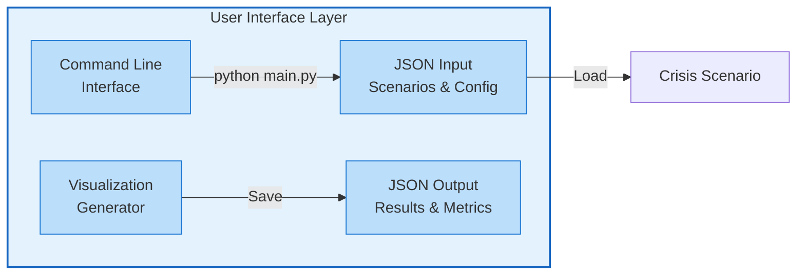
```mermaid
graph LR
    subgraph UI["User Interface Layer"]
        CLI[Command Line<br/>Interface]
        JSON_IN[JSON Input<br/>Scenarios & Config]
        JSON_OUT[JSON Output<br/>Results & Metrics]
        VIZ[Visualization<br/>Generator]
    end

    CLI -->|"python main.py"| JSON_IN
    JSON_IN -->|Load| SCENARIO[Crisis Scenario]
    VIZ -->|Save| JSON_OUT

    style UI fill:#e3f2fd,stroke:#1565c0,stroke-width:2px
    style CLI fill:#bbdefb,stroke:#1976d2
    style JSON_IN fill:#bbdefb,stroke:#1976d2
    style JSON_OUT fill:#bbdefb,stroke:#1976d2
    style VIZ fill:#bbdefb,stroke:#1976d2
```

**Components:**
- `main.py` - CLI entry point with argument parsing
- `scenarios/*.json` - Crisis scenario definitions
- `output/` - Generated visualizations and results

---

### 1.3 Layer 2: Coordination Layer

**Purpose:** Orchestrates multi-agent deliberation, manages consensus building, and coordinates decision-making.

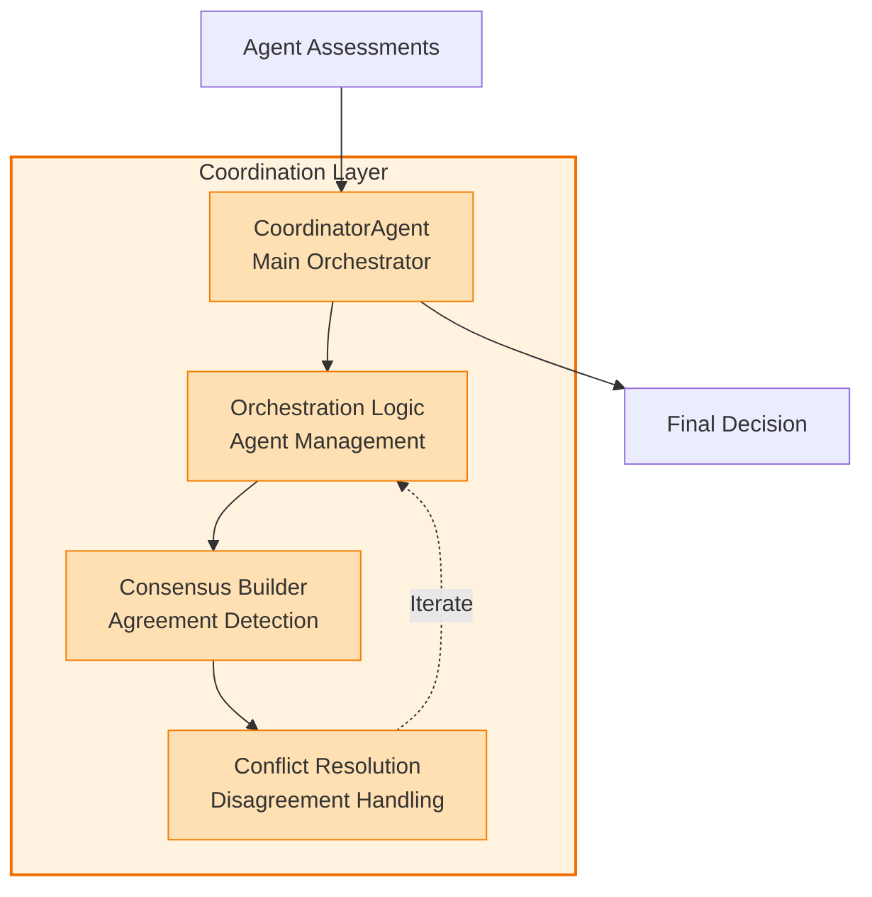
```mermaid
graph TB
    subgraph Coord["Coordination Layer"]
        COORD[CoordinatorAgent<br/>Main Orchestrator]
        ORCH[Orchestration Logic<br/>Agent Management]
        CONS_BUILD[Consensus Builder<br/>Agreement Detection]
        CONFLICT[Conflict Resolution<br/>Disagreement Handling]
    end

    COORD --> ORCH
    ORCH --> CONS_BUILD
    CONS_BUILD --> CONFLICT
    CONFLICT -.->|Iterate| ORCH

    IN[Agent Assessments] --> COORD
    COORD --> OUT[Final Decision]

    style Coord fill:#fff3e0,stroke:#ef6c00,stroke-width:2px
    style COORD fill:#ffe0b2,stroke:#f57c00
    style ORCH fill:#ffe0b2,stroke:#f57c00
    style CONS_BUILD fill:#ffe0b2,stroke:#f57c00
    style CONFLICT fill:#ffe0b2,stroke:#f57c00
```

**Components:**
- `CoordinatorAgent` - Main orchestration class
- `ConsensusModel` - Cosine similarity-based consensus detection
- Iterative refinement loop (max 5 iterations)

---

### 1.4 Layer 3: Agent Layer - 13 Expert Roles

**Purpose:** Domain experts organized in Tactical/Strategic hierarchy providing LLM-enhanced assessments.

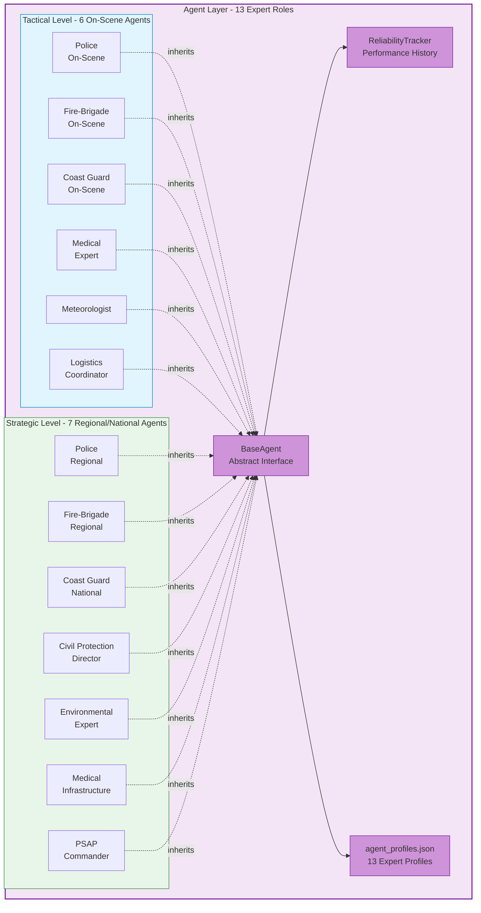
```mermaid
graph TB
    subgraph Agents["Agent Layer - 13 Expert Roles"]
        BA[BaseAgent<br/>Abstract Interface]

        subgraph Tactical["Tactical Level - 6 On-Scene Agents"]
            T1[Police<br/>On-Scene]
            T2[Fire-Brigade<br/>On-Scene]
            T3[Coast Guard<br/>On-Scene]
            T4[Medical<br/>Expert]
            T5[Meteorologist]
            T6[Logistics<br/>Coordinator]
        end

        subgraph Strategic["Strategic Level - 7 Regional/National Agents"]
            S1[Police<br/>Regional]
            S2[Fire-Brigade<br/>Regional]
            S3[Coast Guard<br/>National]
            S4[Civil Protection<br/>Director]
            S5[Environmental<br/>Expert]
            S6[Medical<br/>Infrastructure]
            S7[PSAP<br/>Commander]
        end

        RT[ReliabilityTracker<br/>Performance History]
        PROFILES[agent_profiles.json<br/>13 Expert Profiles]
    end

    T1 & T2 & T3 & T4 & T5 & T6 -.->|inherits| BA
    S1 & S2 & S3 & S4 & S5 & S6 & S7 -.->|inherits| BA
    BA --> RT
    BA --> PROFILES

    style Agents fill:#f3e5f5,stroke:#7b1fa2,stroke-width:2px
    style Tactical fill:#e1f5fe,stroke:#0288d1,stroke-width:1px
    style Strategic fill:#e8f5e9,stroke:#388e3c,stroke-width:1px
    style BA fill:#ce93d8,stroke:#7b1fa2
    style RT fill:#ce93d8,stroke:#7b1fa2
    style PROFILES fill:#ce93d8,stroke:#7b1fa2
```

**Tactical Level (Field Operations):**
| Agent | Role | Focus |
|-------|------|-------|
| Police On-Scene | Tactical Commander | Crowd control, security |
| Fire On-Scene | Tactical Commander | Fire suppression, rescue |
| Coast Guard On-Scene | Tactical Commander | Maritime rescue, SAR |
| Medical Expert | Medical Assessment | Triage, health impacts |
| Meteorologist | Environmental Analysis | Weather forecasting |
| Logistics Coordinator | Supply Chain | Resource allocation |

**Strategic Level (Regional/National):**
| Agent | Role | Focus |
|-------|------|-------|
| Police Regional | Strategic Commander | Multi-jurisdictional coordination |
| Fire Regional | Strategic Commander | Regional fire operations |
| Coast Guard National | National Director | Maritime policy, port security |
| Civil Protection Director | National Coordinator | Inter-agency coordination |
| Environmental Scientist | Environmental Impact | Long-term environmental effects |
| Medical Infrastructure | Hospital Capacity | Healthcare system coordination |
| PSAP Commander | 112 Communications | Emergency dispatch coordination |

---

### 1.5 Layer 4: Decision Framework Layer

**Purpose:** Belief aggregation using Evidential Reasoning and Graph Attention Networks, multi-criteria decision analysis.

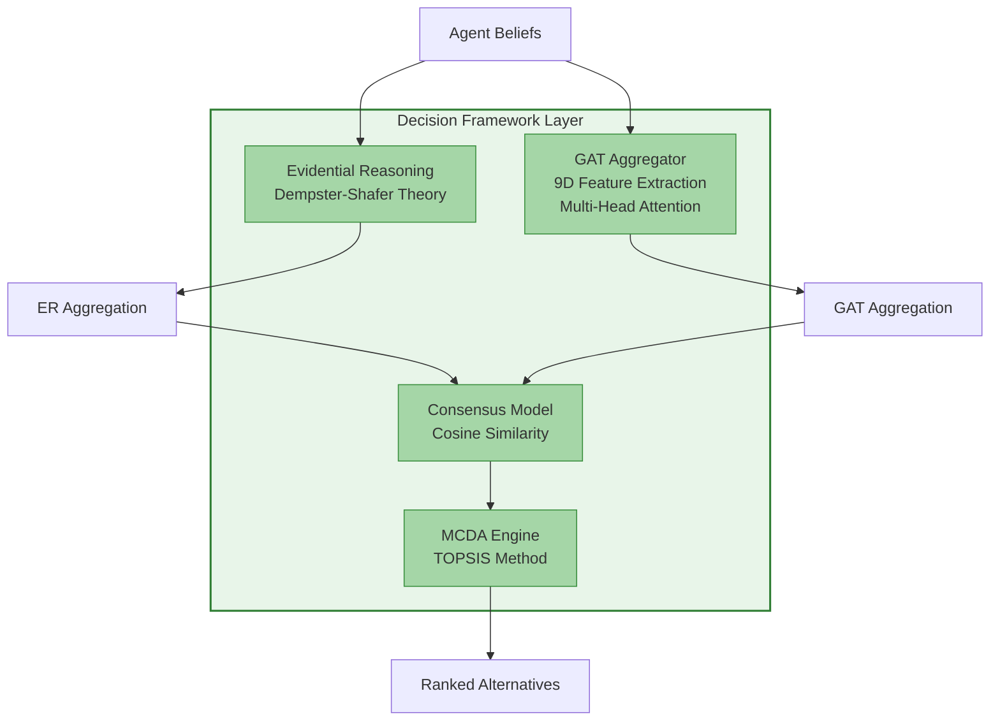
```mermaid
graph TB
    subgraph DF["Decision Framework Layer"]
        ER[Evidential Reasoning<br/>Dempster-Shafer Theory]
        GAT[GAT Aggregator<br/>9D Feature Extraction<br/>Multi-Head Attention]
        MCDA[MCDA Engine<br/>TOPSIS Method]
        CONSENSUS[Consensus Model<br/>Cosine Similarity]
    end

    BELIEFS[Agent Beliefs] --> ER
    BELIEFS --> GAT

    ER --> AGG_ER[ER Aggregation]
    GAT --> AGG_GAT[GAT Aggregation]

    AGG_ER --> CONSENSUS
    AGG_GAT --> CONSENSUS

    CONSENSUS --> MCDA
    MCDA --> RANKED[Ranked Alternatives]

    style DF fill:#e8f5e9,stroke:#2e7d32,stroke-width:2px
    style ER fill:#a5d6a7,stroke:#388e3c
    style GAT fill:#a5d6a7,stroke:#388e3c
    style MCDA fill:#a5d6a7,stroke:#388e3c
    style CONSENSUS fill:#a5d6a7,stroke:#388e3c
```

**Components:**
- **Evidential Reasoning (ER):** Classical Dempster-Shafer belief aggregation
- **GAT Aggregator:** Neural attention-based aggregation with 9D features:
  1. Confidence Score
  2. Belief Certainty (inverse entropy)
  3. Expertise Relevance
  4. Risk Tolerance
  5. Severity Awareness
  6. Top Choice Strength
  7. Thoroughness
  8. Reasoning Quality
  9. Historical Reliability
- **MCDA Engine:** TOPSIS multi-criteria ranking
- **Consensus Model:** Cosine similarity threshold (default: 0.75)

---

### 1.6 Layer 5: LLM Integration Layer

**Purpose:** Multi-provider LLM support for agent reasoning with structured prompt templates.

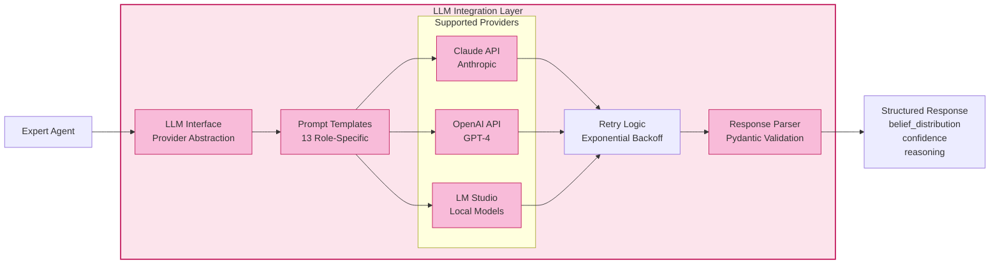
```mermaid
graph LR
    subgraph LLM["LLM Integration Layer"]
        LLM_INT[LLM Interface<br/>Provider Abstraction]

        subgraph Providers["Supported Providers"]
            CLAUDE[Claude API<br/>Anthropic]
            OPENAI[OpenAI API<br/>GPT-4]
            LMSTUDIO[LM Studio<br/>Local Models]
        end

        PROMPTS[Prompt Templates<br/>13 Role-Specific]
        PARSER[Response Parser<br/>Pydantic Validation]
        RETRY[Retry Logic<br/>Exponential Backoff]
    end

    AGENT[Expert Agent] --> LLM_INT
    LLM_INT --> PROMPTS
    PROMPTS --> CLAUDE & OPENAI & LMSTUDIO
    CLAUDE & OPENAI & LMSTUDIO --> RETRY
    RETRY --> PARSER
    PARSER --> RESPONSE[Structured Response<br/>belief_distribution<br/>confidence<br/>reasoning]

    style LLM fill:#fce4ec,stroke:#c2185b,stroke-width:2px
    style CLAUDE fill:#f8bbd9,stroke:#c2185b
    style OPENAI fill:#f8bbd9,stroke:#c2185b
    style LMSTUDIO fill:#f8bbd9,stroke:#c2185b
    style LLM_INT fill:#f8bbd9,stroke:#c2185b
    style PROMPTS fill:#f8bbd9,stroke:#c2185b
    style PARSER fill:#f8bbd9,stroke:#c2185b
```

**Components:**
- `LLMInterface` - Provider abstraction layer
- `ClaudeClient`, `OpenAIClient`, `LMStudioClient` - Provider implementations
- `prompt_templates.py` - 13 role-specific prompt templates
- Pydantic-validated `LLMResponse` model

---

### 1.7 Layer 6: Evaluation & Utilities Layer

**Purpose:** Metrics calculation, baseline comparison, visualization generation, and configuration management.

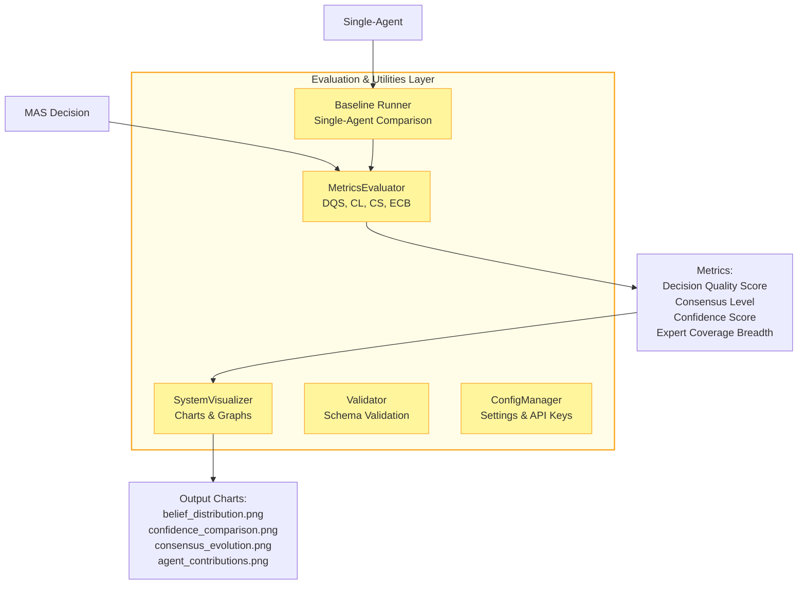
```mermaid
graph TB
    subgraph Eval["Evaluation & Utilities Layer"]
        ME[MetricsEvaluator<br/>DQS, CL, CS, ECB]
        VIS[SystemVisualizer<br/>Charts & Graphs]
        BL[Baseline Runner<br/>Single-Agent Comparison]
        VAL[Validator<br/>Schema Validation]
        CFG[ConfigManager<br/>Settings & API Keys]
    end

    DECISION[MAS Decision] --> ME
    BASELINE[Single-Agent] --> BL
    BL --> ME

    ME --> METRICS[Metrics:<br/>Decision Quality Score<br/>Consensus Level<br/>Confidence Score<br/>Expert Coverage Breadth]

    METRICS --> VIS
    VIS --> CHARTS[Output Charts:<br/>belief_distribution.png<br/>confidence_comparison.png<br/>consensus_evolution.png<br/>agent_contributions.png]

    style Eval fill:#fffde7,stroke:#f9a825,stroke-width:2px
    style ME fill:#fff59d,stroke:#f9a825
    style VIS fill:#fff59d,stroke:#f9a825
    style BL fill:#fff59d,stroke:#f9a825
    style VAL fill:#fff59d,stroke:#f9a825
    style CFG fill:#fff59d,stroke:#f9a825
```

**Metrics:**
| Metric | Description | Range |
|--------|-------------|-------|
| **DQS** | Decision Quality Score | 0.0 - 1.0 |
| **CL** | Consensus Level | 0.0 - 1.0 |
| **CS** | Confidence Score | 0.0 - 1.0 |
| **ECB** | Expert Coverage Breadth | 0.0 - 1.0 |

**Generated Visualizations:**
- `belief_distribution.png` - Stacked bar chart of beliefs per alternative
- `confidence_comparison.png` - Agent confidence levels
- `consensus_evolution.png` - Consensus building over iterations
- `agent_contributions.png` - GAT attention weights

---

### 1.8 Layer Interconnections Summary

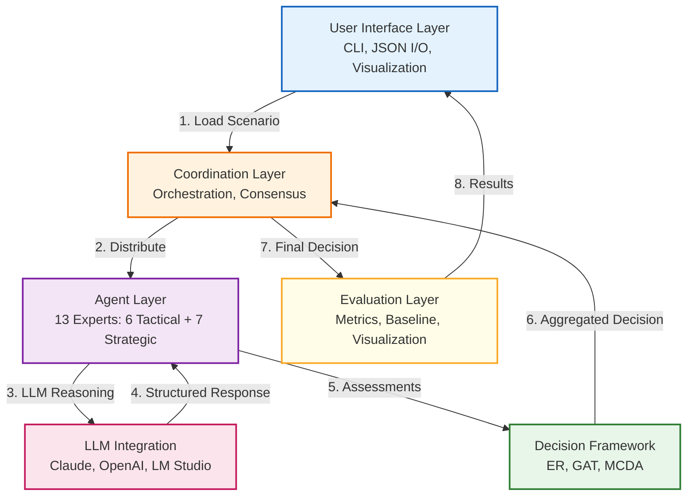
```mermaid
graph TB
    UI[User Interface Layer<br/>CLI, JSON I/O, Visualization]
    COORD[Coordination Layer<br/>Orchestration, Consensus]
    AGENTS[Agent Layer<br/>13 Experts: 6 Tactical + 7 Strategic]
    DF[Decision Framework<br/>ER, GAT, MCDA]
    LLM[LLM Integration<br/>Claude, OpenAI, LM Studio]
    EVAL[Evaluation Layer<br/>Metrics, Baseline, Visualization]

    UI -->|1. Load Scenario| COORD
    COORD -->|2. Distribute| AGENTS
    AGENTS -->|3. LLM Reasoning| LLM
    LLM -->|4. Structured Response| AGENTS
    AGENTS -->|5. Assessments| DF
    DF -->|6. Aggregated Decision| COORD
    COORD -->|7. Final Decision| EVAL
    EVAL -->|8. Results| UI

    style UI fill:#e3f2fd,stroke:#1565c0,stroke-width:2px
    style COORD fill:#fff3e0,stroke:#ef6c00,stroke-width:2px
    style AGENTS fill:#f3e5f5,stroke:#7b1fa2,stroke-width:2px
    style DF fill:#e8f5e9,stroke:#2e7d32,stroke-width:2px
    style LLM fill:#fce4ec,stroke:#c2185b,stroke-width:2px
    style EVAL fill:#fffde7,stroke:#f9a825,stroke-width:2px
```

---

## 2. Multi-Agent Decision Flow

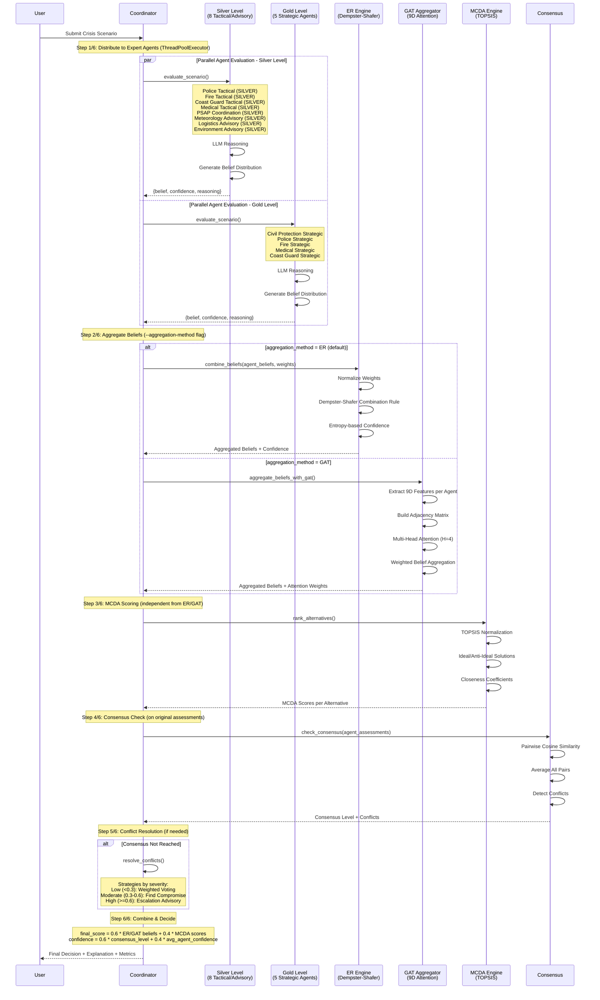
```mermaid
sequenceDiagram
    participant User
    participant Coordinator
    participant Silver as Silver Level<br/>(8 Tactical/Advisory)
    participant Gold as Gold Level<br/>(5 Strategic Agents)
    participant ER as ER Engine<br/>(Dempster-Shafer)
    participant GAT as GAT Aggregator<br/>(9D Attention)
    participant MCDA as MCDA Engine<br/>(TOPSIS)
    participant Consensus

    User->>Coordinator: Submit Crisis Scenario

    Note over Coordinator: Step 1/6: Distribute to Expert Agents (ThreadPoolExecutor)

    par Parallel Agent Evaluation - Silver Level
        Coordinator->>Silver: evaluate_scenario()
        Note over Silver: Police Tactical (SILVER)<br/>Fire Tactical (SILVER)<br/>Coast Guard Tactical (SILVER)<br/>Medical Tactical (SILVER)<br/>PSAP Coordination (SILVER)<br/>Meteorology Advisory (SILVER)<br/>Logistics Advisory (SILVER)<br/>Environment Advisory (SILVER)
        Silver->>Silver: LLM Reasoning
        Silver->>Silver: Generate Belief Distribution
        Silver-->>Coordinator: {belief, confidence, reasoning}
    and Parallel Agent Evaluation - Gold Level
        Coordinator->>Gold: evaluate_scenario()
        Note over Gold: Civil Protection Strategic<br/>Police Strategic<br/>Fire Strategic<br/>Medical Strategic<br/>Coast Guard Strategic
        Gold->>Gold: LLM Reasoning
        Gold->>Gold: Generate Belief Distribution
        Gold-->>Coordinator: {belief, confidence, reasoning}
    end

    Note over Coordinator: Step 2/6: Aggregate Beliefs (--aggregation-method flag)

    alt aggregation_method = ER (default)
        Coordinator->>ER: combine_beliefs(agent_beliefs, weights)
        ER->>ER: Normalize Weights
        ER->>ER: Dempster-Shafer Combination Rule
        ER->>ER: Entropy-based Confidence
        ER-->>Coordinator: Aggregated Beliefs + Confidence
    else aggregation_method = GAT
        Coordinator->>GAT: aggregate_beliefs_with_gat()
        GAT->>GAT: Extract 9D Features per Agent
        GAT->>GAT: Build Adjacency Matrix
        GAT->>GAT: Multi-Head Attention (H=4)
        GAT->>GAT: Weighted Belief Aggregation
        GAT-->>Coordinator: Aggregated Beliefs + Attention Weights
    end

    Note over Coordinator: Step 3/6: MCDA Scoring (independent from ER/GAT)

    Coordinator->>MCDA: rank_alternatives()
    MCDA->>MCDA: TOPSIS Normalization
    MCDA->>MCDA: Ideal/Anti-Ideal Solutions
    MCDA->>MCDA: Closeness Coefficients
    MCDA-->>Coordinator: MCDA Scores per Alternative

    Note over Coordinator: Step 4/6: Consensus Check (on original assessments)

    Coordinator->>Consensus: check_consensus(agent_assessments)
    Consensus->>Consensus: Pairwise Cosine Similarity
    Consensus->>Consensus: Average All Pairs
    Consensus->>Consensus: Detect Conflicts
    Consensus-->>Coordinator: Consensus Level + Conflicts

    Note over Coordinator: Step 5/6: Conflict Resolution (if needed)

    alt Consensus Not Reached
        Coordinator->>Coordinator: resolve_conflicts()
        Note over Coordinator: Strategies by severity:<br/>Low (<0.3): Weighted Voting<br/>Moderate (0.3-0.6): Find Compromise<br/>High (>=0.6): Escalation Advisory
    end

    Note over Coordinator: Step 6/6: Combine & Decide

    Note over Coordinator: final_score = 0.6 * ER/GAT beliefs + 0.4 * MCDA scores<br/>confidence = 0.6 * consensus_level + 0.4 * avg_agent_confidence
    Coordinator-->>User: Final Decision + Explanation + Metrics
```

> **Note:** ER and GAT are **mutually exclusive** aggregation methods selected via the
> `--aggregation-method` CLI flag (default: `er`). Use `--compare-methods` to run both
> independently and produce a side-by-side comparison. MCDA scoring is **independent**
> from belief aggregation -- both contribute to the final decision with a 60/40 weighting.

---

## 2b. Greek Crisis Scenarios - Decision Flow

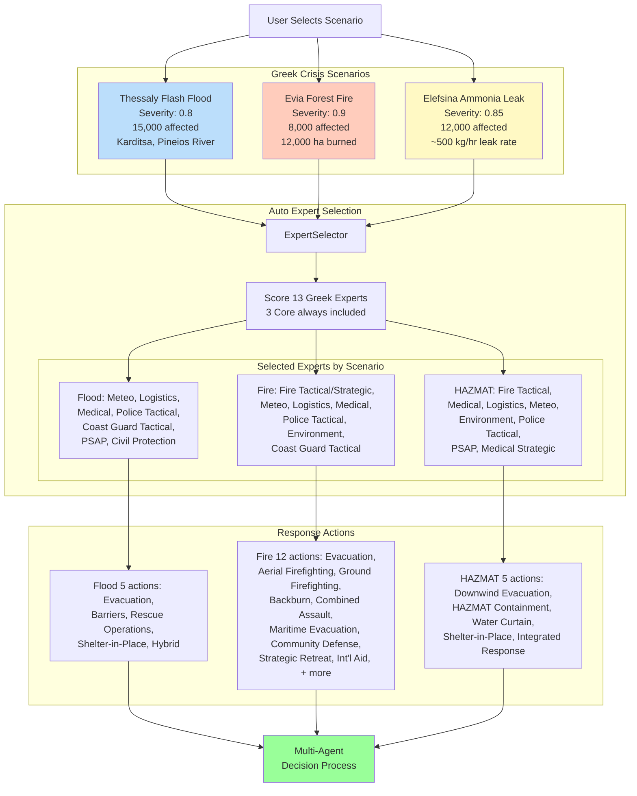
```mermaid
graph TB
    USER[User Selects Scenario]

    subgraph "Greek Crisis Scenarios"
        THESSALY[Thessaly Flash Flood<br/>Severity: 0.8<br/>15,000 affected<br/>Karditsa, Pineios River]
        EVIA[Evia Forest Fire<br/>Severity: 0.9<br/>8,000 affected<br/>12,000 ha burned]
        ELEFSINA[Elefsina Ammonia Leak<br/>Severity: 0.85<br/>12,000 affected<br/>~500 kg/hr leak rate]
    end

    subgraph "Auto Expert Selection"
        SELECTOR[ExpertSelector]
        SCORE[Score 13 Greek Experts<br/>3 Core always included]

        subgraph "Selected Experts by Scenario"
            FLOOD_EXPERTS[Flood: Meteo, Logistics,<br/>Medical, Police Tactical,<br/>Coast Guard Tactical,<br/>PSAP, Civil Protection]
            FIRE_EXPERTS[Fire: Fire Tactical/Strategic,<br/>Meteo, Logistics, Medical,<br/>Police Tactical, Environment,<br/>Coast Guard Tactical]
            HAZMAT_EXPERTS[HAZMAT: Fire Tactical,<br/>Medical, Logistics, Meteo,<br/>Environment, Police Tactical,<br/>PSAP, Medical Strategic]
        end
    end

    subgraph "Response Actions"
        FLOOD_ACTIONS[Flood 5 actions: Evacuation,<br/>Barriers, Rescue Operations,<br/>Shelter-in-Place, Hybrid]
        FIRE_ACTIONS[Fire 12 actions: Evacuation,<br/>Aerial Firefighting, Ground Firefighting,<br/>Backburn, Combined Assault,<br/>Maritime Evacuation, Community Defense,<br/>Strategic Retreat, Int'l Aid, + more]
        HAZMAT_ACTIONS[HAZMAT 5 actions: Downwind Evacuation,<br/>HAZMAT Containment, Water Curtain,<br/>Shelter-in-Place, Integrated Response]
    end

    USER --> THESSALY
    USER --> EVIA
    USER --> ELEFSINA

    THESSALY --> SELECTOR
    EVIA --> SELECTOR
    ELEFSINA --> SELECTOR

    SELECTOR --> SCORE

    SCORE --> FLOOD_EXPERTS
    SCORE --> FIRE_EXPERTS
    SCORE --> HAZMAT_EXPERTS

    FLOOD_EXPERTS --> FLOOD_ACTIONS
    FIRE_EXPERTS --> FIRE_ACTIONS
    HAZMAT_EXPERTS --> HAZMAT_ACTIONS

    FLOOD_ACTIONS --> DECISION[Multi-Agent<br/>Decision Process]
    FIRE_ACTIONS --> DECISION
    HAZMAT_ACTIONS --> DECISION

    style THESSALY fill:#bbdefb
    style EVIA fill:#ffccbc
    style ELEFSINA fill:#fff9c4
    style DECISION fill:#99ff99
```

---

## 3. GAT Feature Extraction and Aggregation

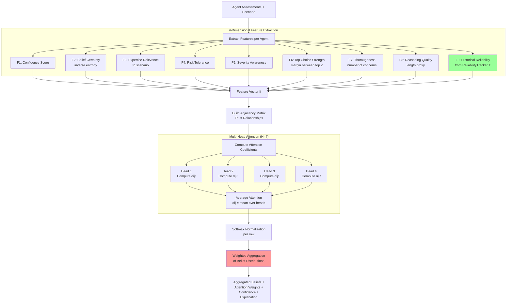
```mermaid
flowchart TB
    START[Agent Assessments + Scenario] --> EXTRACT[Extract Features per Agent]

    subgraph "9-Dimensional Feature Extraction"
        EXTRACT --> F1[F1: Confidence Score]
        EXTRACT --> F2[F2: Belief Certainty<br/>inverse entropy]
        EXTRACT --> F3[F3: Expertise Relevance<br/>to scenario]
        EXTRACT --> F4[F4: Risk Tolerance]
        EXTRACT --> F5[F5: Severity Awareness]
        EXTRACT --> F6[F6: Top Choice Strength<br/>margin between top 2]
        EXTRACT --> F7[F7: Thoroughness<br/>number of concerns]
        EXTRACT --> F8[F8: Reasoning Quality<br/>length proxy]
        EXTRACT --> F9[F9: Historical Reliability<br/>from ReliabilityTracker ⭐]
    end

    F1 & F2 & F3 & F4 & F5 & F6 & F7 & F8 & F9 --> VECTOR[Feature Vector fi]

    VECTOR --> BUILD_ADJ[Build Adjacency Matrix<br/>Trust Relationships]

    BUILD_ADJ --> ATTENTION[Compute Attention Coefficients]

    subgraph "Multi-Head Attention (H=4)"
        ATTENTION --> HEAD1[Head 1<br/>Compute αij¹]
        ATTENTION --> HEAD2[Head 2<br/>Compute αij²]
        ATTENTION --> HEAD3[Head 3<br/>Compute αij³]
        ATTENTION --> HEAD4[Head 4<br/>Compute αij⁴]

        HEAD1 & HEAD2 & HEAD3 & HEAD4 --> AVG[Average Attention<br/>αij = mean over heads]
    end

    AVG --> SOFTMAX[Softmax Normalization<br/>per row]

    SOFTMAX --> AGGREGATE[Weighted Aggregation<br/>of Belief Distributions]

    AGGREGATE --> OUTPUT[Aggregated Beliefs +<br/>Attention Weights +<br/>Confidence +<br/>Explanation]

    style F9 fill:#99ff99
    style AGGREGATE fill:#ff9999
```

---

## 4. ReliabilityTracker - Full Lifecycle

### 4.1 Runtime Integration Flow

Shows how the ReliabilityTracker is wired into the live decision pipeline across all four integration files.

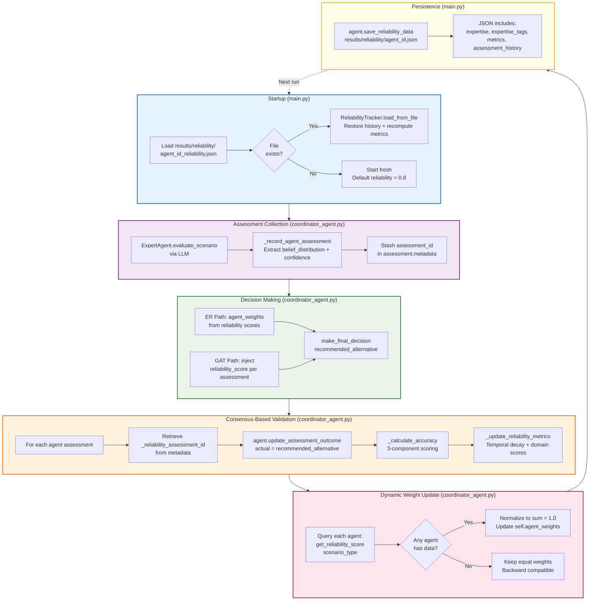
```mermaid
flowchart TB
    subgraph INIT["Startup (main.py)"]
        LOAD_JSON[Load results/reliability/<br/>agent_id_reliability.json]
        CHECK{File<br/>exists?}
        RESTORE[ReliabilityTracker.load_from_file<br/>Restore history + recompute metrics]
        FRESH[Start fresh<br/>Default reliability = 0.8]

        LOAD_JSON --> CHECK
        CHECK -->|Yes| RESTORE
        CHECK -->|No| FRESH
    end

    subgraph COLLECT["Assessment Collection (coordinator_agent.py)"]
        EVAL[ExpertAgent.evaluate_scenario<br/>via LLM]
        RECORD[_record_agent_assessment<br/>Extract belief_distribution + confidence]
        STASH[Stash assessment_id<br/>in assessment.metadata]

        EVAL --> RECORD
        RECORD --> STASH
    end

    subgraph DECIDE["Decision Making (coordinator_agent.py)"]
        AGG_ER[ER Path: agent_weights<br/>from reliability scores]
        AGG_GAT[GAT Path: inject<br/>reliability_score per assessment]
        FINAL[make_final_decision<br/>recommended_alternative]

        AGG_ER --> FINAL
        AGG_GAT --> FINAL
    end

    subgraph VALIDATE["Consensus-Based Validation (coordinator_agent.py)"]
        LOOP[For each agent assessment]
        LOOKUP[Retrieve _reliability_assessment_id<br/>from metadata]
        UPDATE[agent.update_assessment_outcome<br/>actual = recommended_alternative]
        CALC[_calculate_accuracy<br/>3-component scoring]
        METRICS_UPD[_update_reliability_metrics<br/>Temporal decay + domain scores]

        LOOP --> LOOKUP --> UPDATE --> CALC --> METRICS_UPD
    end

    subgraph WEIGHTS["Dynamic Weight Update (coordinator_agent.py)"]
        QUERY[Query each agent:<br/>get_reliability_score<br/>scenario_type]
        HAS_DATA{Any agent<br/>has data?}
        NORMALIZE[Normalize to sum = 1.0<br/>Update self.agent_weights]
        KEEP[Keep equal weights<br/>Backward compatible]

        QUERY --> HAS_DATA
        HAS_DATA -->|Yes| NORMALIZE
        HAS_DATA -->|No| KEEP
    end

    subgraph PERSIST["Persistence (main.py)"]
        SAVE[agent.save_reliability_data<br/>results/reliability/agent_id.json]
        JSON_OUT[JSON includes:<br/>expertise, expertise_tags,<br/>metrics, assessment_history]

        SAVE --> JSON_OUT
    end

    INIT --> COLLECT
    COLLECT --> DECIDE
    DECIDE --> VALIDATE
    VALIDATE --> WEIGHTS
    WEIGHTS --> PERSIST
    PERSIST -.->|Next run| INIT

    style INIT fill:#e3f2fd,stroke:#1565c0,stroke-width:2px
    style COLLECT fill:#f3e5f5,stroke:#7b1fa2,stroke-width:2px
    style DECIDE fill:#e8f5e9,stroke:#2e7d32,stroke-width:2px
    style VALIDATE fill:#fff3e0,stroke:#ef6c00,stroke-width:2px
    style WEIGHTS fill:#fce4ec,stroke:#c2185b,stroke-width:2px
    style PERSIST fill:#fffde7,stroke:#f9a825,stroke-width:2px
```

### 4.2 Accuracy Calculation Detail

Each agent's prediction is scored against the consensus decision using a three-component formula.

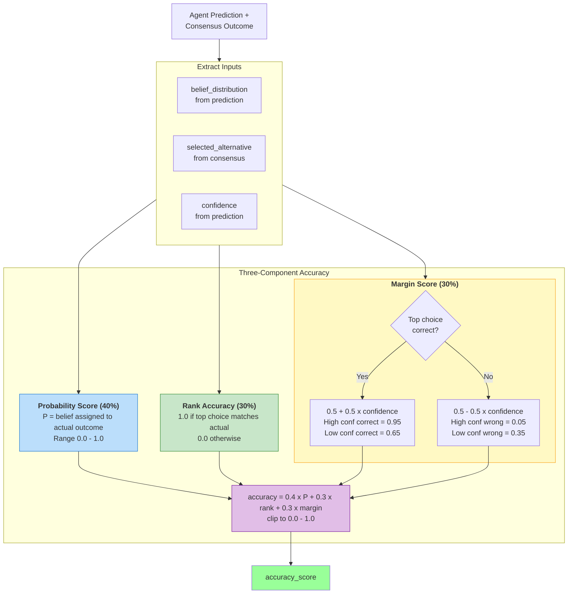
```mermaid
flowchart TB
    INPUT[Agent Prediction +<br/>Consensus Outcome] --> EXTRACT

    subgraph EXTRACT["Extract Inputs"]
        E1[belief_distribution<br/>from prediction]
        E2[selected_alternative<br/>from consensus]
        E3[confidence<br/>from prediction]
    end

    EXTRACT --> PROB
    EXTRACT --> RANK
    EXTRACT --> MARGIN

    subgraph SCORING["Three-Component Accuracy"]
        PROB["<b>Probability Score (40%)</b><br/>P = belief assigned to actual outcome<br/>Range 0.0 - 1.0"]
        RANK["<b>Rank Accuracy (30%)</b><br/>1.0 if top choice matches actual<br/>0.0 otherwise"]

        subgraph MARGIN["<b>Margin Score (30%)</b>"]
            direction TB
            M_CHECK{Top choice<br/>correct?}
            M_YES["0.5 + 0.5 x confidence<br/>High conf correct = 0.95<br/>Low conf correct = 0.65"]
            M_NO["0.5 - 0.5 x confidence<br/>High conf wrong = 0.05<br/>Low conf wrong = 0.35"]
            M_CHECK -->|Yes| M_YES
            M_CHECK -->|No| M_NO
        end

        PROB --> COMBINE
        RANK --> COMBINE
        M_YES --> COMBINE
        M_NO --> COMBINE
    end

    COMBINE["accuracy = 0.4 x P + 0.3 x rank + 0.3 x margin<br/>clip to 0.0 - 1.0"] --> OUTPUT[accuracy_score]

    style PROB fill:#bbdefb,stroke:#1976d2
    style RANK fill:#c8e6c9,stroke:#388e3c
    style MARGIN fill:#fff9c4,stroke:#f9a825
    style COMBINE fill:#e1bee7,stroke:#7b1fa2
    style OUTPUT fill:#99ff99
```

### 4.3 Dual-Path Weight Injection

Reliability scores feed into **both** aggregation paths through different mechanisms.

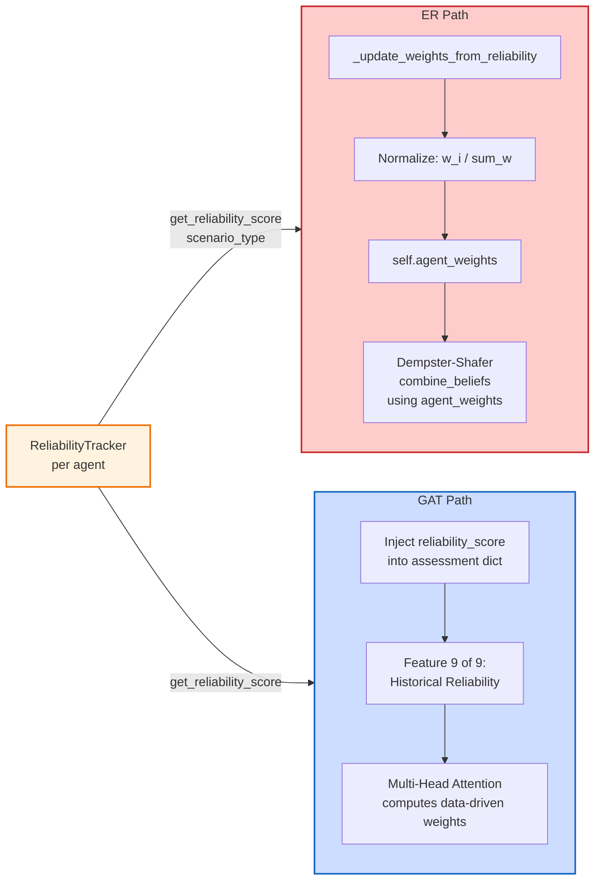
```mermaid
flowchart LR
    RT[ReliabilityTracker<br/>per agent]

    subgraph ER_PATH["ER Path"]
        direction TB
        WEIGHTS[_update_weights_from_reliability]
        NORM[Normalize: w_i / sum_w]
        AW[self.agent_weights]
        DS[Dempster-Shafer<br/>combine_beliefs<br/>using agent_weights]

        WEIGHTS --> NORM --> AW --> DS
    end

    subgraph GAT_PATH["GAT Path"]
        direction TB
        INJECT[Inject reliability_score<br/>into assessment dict]
        F9[Feature 9 of 9:<br/>Historical Reliability]
        ATT[Multi-Head Attention<br/>computes data-driven weights]

        INJECT --> F9 --> ATT
    end

    RT -->|get_reliability_score<br/>scenario_type| ER_PATH
    RT -->|get_reliability_score| GAT_PATH

    style ER_PATH fill:#ffcccc,stroke:#c62828,stroke-width:2px
    style GAT_PATH fill:#ccddff,stroke:#1565c0,stroke-width:2px
    style RT fill:#fff3e0,stroke:#ef6c00,stroke-width:2px
```

### 4.4 Persistence Schema

Each agent's reliability data is stored as a self-contained JSON file in `results/reliability/`.

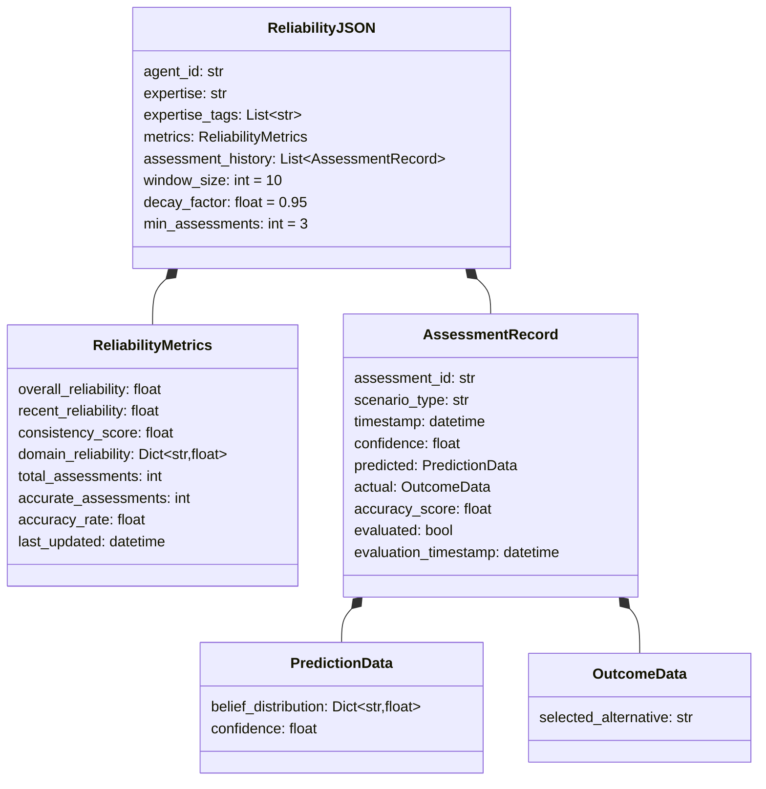
```mermaid
classDiagram
    class ReliabilityJSON {
        agent_id: str
        expertise: str
        expertise_tags: List~str~
        metrics: ReliabilityMetrics
        assessment_history: List~AssessmentRecord~
        window_size: int = 10
        decay_factor: float = 0.95
        min_assessments: int = 3
    }

    class ReliabilityMetrics {
        overall_reliability: float
        recent_reliability: float
        consistency_score: float
        domain_reliability: Dict~str,float~
        total_assessments: int
        accurate_assessments: int
        accuracy_rate: float
        last_updated: datetime
    }

    class AssessmentRecord {
        assessment_id: str
        scenario_type: str
        timestamp: datetime
        confidence: float
        predicted: PredictionData
        actual: OutcomeData
        accuracy_score: float
        evaluated: bool
        evaluation_timestamp: datetime
    }

    class PredictionData {
        belief_distribution: Dict~str,float~
        confidence: float
    }

    class OutcomeData {
        selected_alternative: str
    }

    ReliabilityJSON *-- ReliabilityMetrics
    ReliabilityJSON *-- AssessmentRecord
    AssessmentRecord *-- PredictionData
    AssessmentRecord *-- OutcomeData
```

---

## 5. LLM Integration Architecture

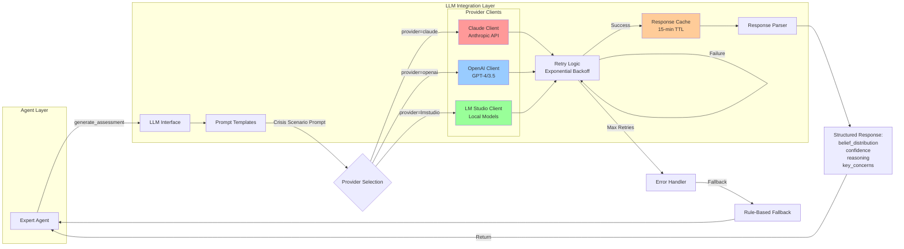
```mermaid
graph LR
    subgraph "Agent Layer"
        EA[Expert Agent]
    end

    subgraph "LLM Integration Layer"
        INT[LLM Interface]
        PT[Prompt Templates]

        subgraph "Provider Clients"
            CLAUDE[Claude Client<br/>Anthropic API]
            OPENAI[OpenAI Client<br/>GPT-4/3.5]
            LMS[LM Studio Client<br/>Local Models]
        end

        RETRY[Retry Logic<br/>Exponential Backoff]
        PARSE[Response Parser]
        CACHE[Response Cache<br/>15-min TTL]
    end

    EA -->|generate_assessment| INT
    INT --> PT
    PT -->|Crisis Scenario Prompt| PROVIDER{Provider Selection}

    PROVIDER -->|provider=claude| CLAUDE
    PROVIDER -->|provider=openai| OPENAI
    PROVIDER -->|provider=lmstudio| LMS

    CLAUDE --> RETRY
    OPENAI --> RETRY
    LMS --> RETRY

    RETRY -->|Success| CACHE
    RETRY -->|Failure| RETRY
    RETRY -->|Max Retries| ERROR[Error Handler]

    CACHE --> PARSE
    PARSE --> STRUCTURE[Structured Response:<br/>belief_distribution<br/>confidence<br/>reasoning<br/>key_concerns]

    STRUCTURE -->|Return| EA
    ERROR -->|Fallback| RULE[Rule-Based Fallback]
    RULE --> EA

    style CLAUDE fill:#ff9999
    style OPENAI fill:#99ccff
    style LMS fill:#99ff99
    style CACHE fill:#ffcc99
```

---

## 6. Decision Framework Component Interactions

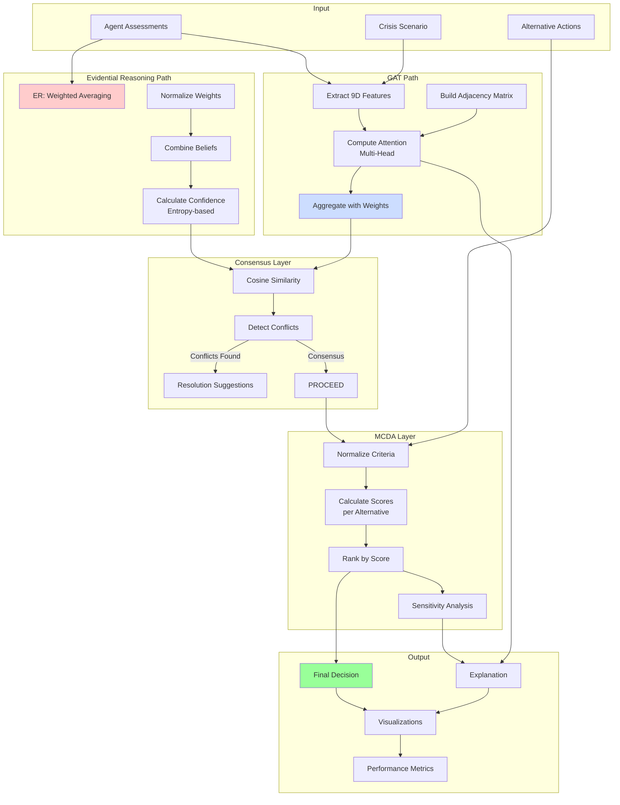
```mermaid
graph TB
    subgraph "Input"
        SCENARIO[Crisis Scenario]
        ALTERNATIVES[Alternative Actions]
        AGENT_ASSESS[Agent Assessments]
    end

    subgraph "Evidential Reasoning Path"
        ER_AGG[ER: Weighted Averaging]
        ER_NORM[Normalize Weights]
        ER_COMBINE[Combine Beliefs]
        ER_CONF[Calculate Confidence<br/>Entropy-based]

        ER_NORM --> ER_COMBINE
        ER_COMBINE --> ER_CONF
    end

    subgraph "GAT Path"
        GAT_FEAT[Extract 9D Features]
        GAT_ADJ[Build Adjacency Matrix]
        GAT_ATT[Compute Attention<br/>Multi-Head]
        GAT_AGG[Aggregate with Weights]

        GAT_FEAT --> GAT_ATT
        GAT_ADJ --> GAT_ATT
        GAT_ATT --> GAT_AGG
    end

    subgraph "Consensus Layer"
        COSINE[Cosine Similarity]
        DETECT[Detect Conflicts]
        RESOLVE[Resolution Suggestions]

        COSINE --> DETECT
        DETECT -->|Conflicts Found| RESOLVE
        DETECT -->|Consensus| PROCEED
    end

    subgraph "MCDA Layer"
        NORM[Normalize Criteria]
        SCORE[Calculate Scores<br/>per Alternative]
        RANK[Rank by Score]
        SENS[Sensitivity Analysis]

        NORM --> SCORE
        SCORE --> RANK
        RANK --> SENS
    end

    subgraph "Output"
        DECISION[Final Decision]
        EXPLAIN[Explanation]
        VIS[Visualizations]
        METRICS[Performance Metrics]
    end

    AGENT_ASSESS --> ER_AGG
    AGENT_ASSESS --> GAT_FEAT
    SCENARIO --> GAT_FEAT

    ER_CONF --> COSINE
    GAT_AGG --> COSINE

    PROCEED --> NORM
    ALTERNATIVES --> NORM

    RANK --> DECISION
    SENS --> EXPLAIN
    GAT_ATT --> EXPLAIN

    DECISION --> VIS
    EXPLAIN --> VIS

    VIS --> METRICS

    style ER_AGG fill:#ffcccc
    style GAT_AGG fill:#ccddff
    style DECISION fill:#99ff99
```

---

## 7. Reliability Score Calculation Flow (Domain-Aware)

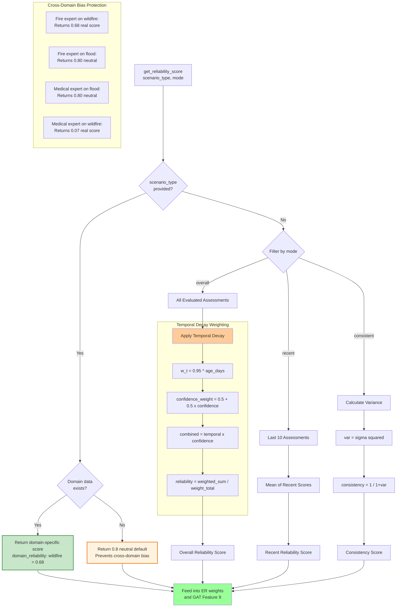
```mermaid
flowchart TB
    START[get_reliability_score<br/>scenario_type, mode] --> HAS_TYPE{scenario_type<br/>provided?}

    HAS_TYPE -->|Yes| DOMAIN_CHECK{Domain data<br/>exists?}
    HAS_TYPE -->|No| MODE_FILTER{Filter by mode}

    DOMAIN_CHECK -->|Yes| DOMAIN_SCORE[Return domain-specific score<br/>domain_reliability: wildfire = 0.68]
    DOMAIN_CHECK -->|No| NEUTRAL[Return 0.8 neutral default<br/>Prevents cross-domain bias]

    MODE_FILTER -->|overall| ALL[All Evaluated Assessments]
    MODE_FILTER -->|recent| WINDOW[Last 10 Assessments]
    MODE_FILTER -->|consistent| VARIANCE[Calculate Variance]

    ALL --> TEMPORAL[Apply Temporal Decay]

    subgraph "Temporal Decay Weighting"
        TEMPORAL --> CALC_DECAY[w_t = 0.95 ^ age_days]
        CALC_DECAY --> CONF_W[confidence_weight = 0.5 + 0.5 x confidence]
        CONF_W --> COMBINED[combined = temporal x confidence]
        COMBINED --> DIVIDE[reliability = weighted_sum / weight_total]
    end

    WINDOW --> MEAN[Mean of Recent Scores]

    VARIANCE --> CALC_VAR[var = sigma squared]
    CALC_VAR --> CONSISTENCY[consistency = 1 / 1+var]

    DIVIDE --> OUTPUT[Overall Reliability Score]
    MEAN --> OUTPUT2[Recent Reliability Score]
    CONSISTENCY --> OUTPUT3[Consistency Score]

    subgraph "Cross-Domain Bias Protection"
        direction LR
        EX1[Fire expert on wildfire:<br/>Returns 0.68 real score]
        EX2[Fire expert on flood:<br/>Returns 0.80 neutral]
        EX3[Medical expert on flood:<br/>Returns 0.80 neutral]
        EX4[Medical expert on wildfire:<br/>Returns 0.07 real score]
    end

    DOMAIN_SCORE --> USE[Feed into ER weights<br/>and GAT Feature 9]
    NEUTRAL --> USE
    OUTPUT --> USE
    OUTPUT2 --> USE
    OUTPUT3 --> USE

    style NEUTRAL fill:#fff3e0,stroke:#ef6c00,stroke-width:2px
    style DOMAIN_SCORE fill:#c8e6c9,stroke:#388e3c,stroke-width:2px
    style TEMPORAL fill:#ffcc99
    style USE fill:#99ff99
```

> **Cross-domain bias protection:** When a scenario type is requested but no domain data
> exists for that agent, the system returns 0.8 (neutral) instead of falling back to
> `overall_reliability`. This prevents wildfire performance from unfairly penalizing
> medical experts in a flood scenario. As domain-specific data accumulates across
> scenario types, each agent builds independent reliability scores per domain.

---

## 8. Consensus Building Process

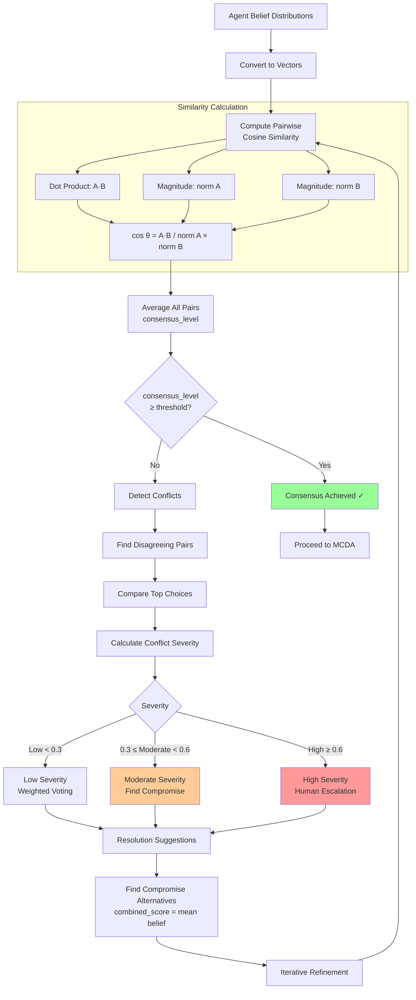
```mermaid
flowchart TB
    START[Agent Belief Distributions] --> VECTORIZE[Convert to Vectors]

    VECTORIZE --> PAIRWISE[Compute Pairwise<br/>Cosine Similarity]

    subgraph "Similarity Calculation"
        PAIRWISE --> DOT[Dot Product: A·B]
        PAIRWISE --> NORM_A[Magnitude: norm A]
        PAIRWISE --> NORM_B[Magnitude: norm B]

        DOT --> COSINE_CALC[cos θ = A·B / norm A × norm B]
        NORM_A --> COSINE_CALC
        NORM_B --> COSINE_CALC
    end

    COSINE_CALC --> AVG_SIM[Average All Pairs<br/>consensus_level]

    AVG_SIM --> THRESHOLD{consensus_level<br/>≥ threshold?}

    THRESHOLD -->|Yes| CONSENSUS_OK[Consensus Achieved ✓]
    THRESHOLD -->|No| DETECT_CONFLICTS[Detect Conflicts]

    DETECT_CONFLICTS --> FIND_PAIRS[Find Disagreeing Pairs]
    FIND_PAIRS --> TOP_CHOICES[Compare Top Choices]
    TOP_CHOICES --> CONFLICT_SCORE[Calculate Conflict Severity]

    CONFLICT_SCORE --> CLASSIFY{Severity}

    CLASSIFY -->|Low < 0.3| LOW[Low Severity<br/>Weighted Voting]
    CLASSIFY -->|0.3 ≤ Moderate < 0.6| MED[Moderate Severity<br/>Find Compromise]
    CLASSIFY -->|High ≥ 0.6| HIGH[High Severity<br/>Human Escalation]

    LOW --> SUGGEST[Resolution Suggestions]
    MED --> SUGGEST
    HIGH --> SUGGEST

    SUGGEST --> COMPROMISE[Find Compromise Alternatives<br/>combined_score = mean belief]

    CONSENSUS_OK --> PROCEED[Proceed to MCDA]
    COMPROMISE --> ITERATE[Iterative Refinement]
    ITERATE --> PAIRWISE

    style CONSENSUS_OK fill:#99ff99
    style HIGH fill:#ff9999
    style MED fill:#ffcc99
```

---

## 9. Complete System Data Flow (End-to-End)

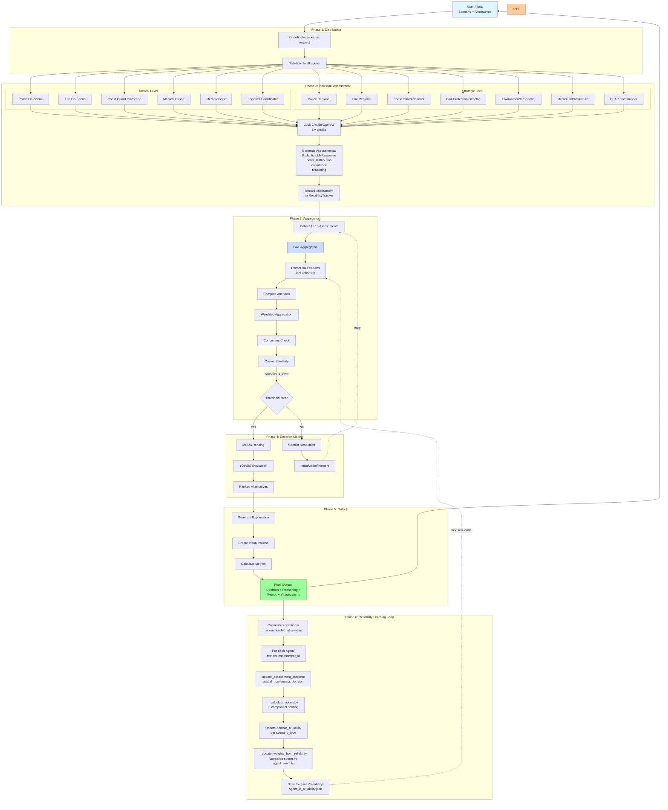
```mermaid
graph TB
    USER[User Input:<br/>Scenario + Alternatives]

    subgraph "Phase 1: Distribution"
        COORD1[Coordinator receives request]
        DIST[Distribute to all agents]
    end

    subgraph "Phase 2: Individual Assessment"
        subgraph "Tactical Level"
            T1[Police On-Scene]
            T2[Fire On-Scene]
            T3[Coast Guard On-Scene]
            T4[Medical Expert]
            T5[Meteorologist]
            T6[Logistics Coordinator]
        end
        subgraph "Strategic Level"
            S1[Police Regional]
            S2[Fire Regional]
            S3[Coast Guard National]
            S4[Civil Protection Director]
            S5[Environmental Scientist]
            S6[Medical Infrastructure]
            S7[PSAP Commander]
        end

        LLM1[LLM: Claude/OpenAI/<br/>LM Studio]

        T1 & T2 & T3 & T4 & T5 & T6 --> LLM1
        S1 & S2 & S3 & S4 & S5 & S6 & S7 --> LLM1
        LLM1 --> ASSESS[Generate Assessments:<br/>Pydantic LLMResponse<br/>belief_distribution<br/>confidence<br/>reasoning]

        ASSESS --> RT1[Record Assessment<br/>in ReliabilityTracker]
    end

    subgraph "Phase 3: Aggregation"
        RT1 --> COLLECT[Collect All 13 Assessments]

        COLLECT --> GAT1[GAT Aggregation]
        GAT1 --> FEAT[Extract 9D Features<br/>incl. reliability]
        FEAT --> ATT[Compute Attention]
        ATT --> AGG[Weighted Aggregation]

        AGG --> CONS1[Consensus Check]
        CONS1 --> COS[Cosine Similarity]
        COS -->|consensus_level| DECISION{Threshold Met?}
    end

    subgraph "Phase 4: Decision Making"
        DECISION -->|Yes| MCDA1[MCDA Ranking]
        DECISION -->|No| CONFLICT[Conflict Resolution]

        CONFLICT --> REFINE[Iterative Refinement]
        REFINE -.retry.-> COLLECT

        MCDA1 --> TOPSIS[TOPSIS Evaluation]
        TOPSIS --> RANK[Ranked Alternatives]
    end

    subgraph "Phase 5: Output"
        RANK --> EXPLAIN[Generate Explanation]
        EXPLAIN --> VIS1[Create Visualizations]
        VIS1 --> METRICS1[Calculate Metrics]
        METRICS1 --> OUTPUT[Final Output:<br/>Decision + Reasoning +<br/>Metrics + Visualizations]
    end

    subgraph "Phase 6: Reliability Learning Loop"
        OUTPUT --> CONSENSUS_OUT[Consensus decision =<br/>recommended_alternative]
        CONSENSUS_OUT --> LOOP_AGENTS[For each agent:<br/>retrieve assessment_id]
        LOOP_AGENTS --> UPDATE[update_assessment_outcome<br/>actual = consensus decision]
        UPDATE --> ACCURACY[_calculate_accuracy<br/>3-component scoring]
        ACCURACY --> DOMAIN_UPD[Update domain_reliability<br/>per scenario_type]
        DOMAIN_UPD --> DYN_W[_update_weights_from_reliability<br/>Normalize scores to agent_weights]
        DYN_W --> SAVE_JSON[Save to results/reliability/<br/>agent_id_reliability.json]
        SAVE_JSON -.next run loads.-> FEAT
    end

    USER --> COORD1
    COORD1 --> DIST
    DIST --> T1 & T2 & T3 & T4 & T5 & T6
    DIST --> S1 & S2 & S3 & S4 & S5 & S6 & S7
    OUTPUT --> USER

    style USER fill:#e1f5ff
    style OUTPUT fill:#99ff99
    style RT2 fill:#ffcc99
    style GAT1 fill:#ccddff
```

---

## 10. Class Diagram (Core Components)

```mermaid
classDiagram
    class BaseAgent {
        <<abstract>>
        +agent_id: str
        +name: str
        +expertise: str
        +expertise_tags: List~str~
        +confidence_level: float
        +reliability_tracker: ReliabilityTracker
        +evaluate_scenario()
        +propose_action()
        +get_reliability_score(scenario_type, mode)
        +record_assessment(id, type, prediction, confidence)
        +update_assessment_outcome(id, outcome, accuracy)
        +load_reliability_data(directory) bool
        +save_reliability_data(directory) str
        +get_performance_summary()
    }

    class ExpertAgent {
        +llm_client: LLMClient
        +profile: Dict
        +evaluate_scenario()
        +propose_action()
        -_generate_llm_assessment()
    }

    class CoordinatorAgent {
        +expert_agents: List~ExpertAgent~
        +agent_weights: Dict~str,float~
        +aggregation_method: str
        +er_engine: EvidentialReasoning
        +gat_aggregator: GATAggregator
        +consensus_model: ConsensusModel
        +make_final_decision()
        +collect_assessments()
        +aggregate_beliefs()
        +check_consensus()
        +resolve_conflicts()
        -_record_agent_assessment(agent, assessment, scenario)
        -_update_weights_from_reliability(scenario_type)
        -_aggregate_with_er()
        -_aggregate_with_gat()
    }

    class ReliabilityTracker {
        +agent_id: str
        +expertise: str
        +expertise_tags: List~str~
        +assessment_history: List~AssessmentRecord~
        +recent_assessments: deque
        +metrics: ReliabilityMetrics
        +record_assessment(id, type, prediction, confidence)
        +update_assessment_outcome(id, outcome, accuracy)
        +get_reliability_score(scenario_type, mode) float
        +get_expertise_domain_summary() Dict
        +get_performance_summary() Dict
        +save_to_file(filepath)
        +load_from_file(filepath)$ ReliabilityTracker
        +export_history() List
        -_calculate_accuracy(prediction, actual) float
        -_update_reliability_metrics()
        -_get_domain_breakdown() Dict
    }

    class ReliabilityMetrics {
        +overall_reliability: float
        +recent_reliability: float
        +consistency_score: float
        +domain_reliability: Dict~str,float~
        +total_assessments: int
        +accurate_assessments: int
        +last_updated: datetime
        +to_dict() Dict
    }

    class GATAggregator {
        +num_heads: int
        +attention_layers: List
        +extract_agent_features()
        +compute_attention_coefficients()
        +aggregate_beliefs_with_gat()
    }

    class GraphAttentionLayer {
        +feature_dim: int = 9
        +attention_heads: int
        +extract_agent_features()
        +compute_attention_coefficients()
    }

    class EvidentialReasoning {
        +combine_beliefs()
        +normalize_distribution()
        +calculate_confidence()
    }

    class MCDAEngine {
        +criteria_config: Dict
        +rank_alternatives()
        +normalize_score()
        +calculate_weighted_score()
        +sensitivity_analysis()
    }

    class ConsensusModel {
        +consensus_threshold: float
        +calculate_consensus_level()
        +detect_conflicts()
        +suggest_resolution()
    }

    class LLMClient {
        <<interface>>
        +generate_assessment()
        +generate_with_retry()
    }

    class ClaudeClient {
        +client: Anthropic
        +generate_assessment()
    }

    class OpenAIClient {
        +client: OpenAI
        +generate_assessment()
    }

    class LMStudioClient {
        +base_url: str
        +generate_assessment()
    }

    BaseAgent <|-- ExpertAgent
    BaseAgent <|-- CoordinatorAgent
    BaseAgent *-- ReliabilityTracker
    ReliabilityTracker *-- ReliabilityMetrics

    CoordinatorAgent o-- ExpertAgent
    CoordinatorAgent *-- GATAggregator
    CoordinatorAgent *-- ConsensusModel
    CoordinatorAgent *-- MCDAEngine
    CoordinatorAgent *-- EvidentialReasoning

    GATAggregator *-- GraphAttentionLayer

    ExpertAgent o-- LLMClient
    LLMClient <|-- ClaudeClient
    LLMClient <|-- OpenAIClient
    LLMClient <|-- LMStudioClient
```

---

## 11. Expert Selection System - 13 Expert Roles

```mermaid
flowchart TB
    START([User: Load Scenario]) --> CLI_PARSE[Parse CLI Arguments]

    CLI_PARSE --> MODE_CHECK{--expert-selection<br/>argument?}

    MODE_CHECK -->|Not specified<br/>default: manual| MANUAL[Manual Mode]
    MODE_CHECK -->|auto| AUTO[Auto-Selection Mode]

    MANUAL --> AGENT_ARG{--agents<br/>specified?}

    AGENT_ARG -->|No| DEFAULT_3[Use Default 3 Core Experts:<br/>Meteorologist, Logistics,<br/>Medical Expert]
    AGENT_ARG -->|Yes: all| ALL_13[Select All 13 Experts]
    AGENT_ARG -->|Yes: specific IDs| CUSTOM[Use Specified Agent IDs]

    AUTO --> LOAD_SCENARIO[Load Scenario JSON]
    LOAD_SCENARIO --> CHECK_META{expert_selection<br/>metadata exists?}

    CHECK_META -->|No| FALLBACK[Fallback to 3 Core Experts<br/>+ Warning Log]
    CHECK_META -->|Yes| EXTRACT_META[Extract Metadata:<br/>crisis_type, severity,<br/>domains, scope, etc.]

    FALLBACK --> INIT_AGENTS[Initialize Expert Agents]

    EXTRACT_META --> CREATE_SELECTOR[Create ExpertSelector Instance]

    CREATE_SELECTOR --> EVAL_LOOP[Iterate Through 13 Expert Rules]

    subgraph TacticalExperts["Tactical Level - 6 Experts"]
        TE1[Police On-Scene]
        TE2[Fire On-Scene]
        TE3[Coast Guard On-Scene]
        TE4[Medical Expert]
        TE5[Meteorologist]
        TE6[Logistics Coordinator]
    end

    subgraph StrategicExperts["Strategic Level - 7 Experts"]
        SE1[Police Regional]
        SE2[Fire Regional]
        SE3[Coast Guard National]
        SE4[Civil Protection Director]
        SE5[Environmental Scientist]
        SE6[Medical Infrastructure]
        SE7[PSAP Commander]
    end

    subgraph EvalLoop["Expert Evaluation Loop"]
        EVAL_LOOP --> EVAL_EXPERT[Evaluate Expert Against Rules]

        EVAL_EXPERT --> SCORE_CALC[Calculate Match Score]

        subgraph Criteria["Scoring Criteria - Points"]
            SCORE_CALC --> SC1[Crisis Type: +3]
            SCORE_CALC --> SC2[Subtype: +2]
            SCORE_CALC --> SC3[Domain: +2]
            SCORE_CALC --> SC4[Severity: +1]
            SCORE_CALC --> SC5[Scope: +2]
            SCORE_CALC --> SC6[Location: +2]
            SCORE_CALC --> SC7[Command: +2]
            SCORE_CALC --> SC8[Multi-jurisd: +1]
            SCORE_CALC --> SC9[Infrastructure: +2]
            SCORE_CALC --> SC10[Population: +1]
            SCORE_CALC --> SC11[Duration: +1]
        end

        SC1 & SC2 & SC3 & SC4 & SC5 & SC6 & SC7 & SC8 & SC9 & SC10 & SC11 --> TOTAL_SCORE[Sum Total Score]

        TOTAL_SCORE --> CHECK_INCLUDE{Score > 0<br/>OR Core Expert?}

        CHECK_INCLUDE -->|Yes| ADD_SELECTED[Add to Selected Set]
        CHECK_INCLUDE -->|No| SKIP[Skip Expert]

        ADD_SELECTED --> NEXT_EXPERT{More Experts?}
        SKIP --> NEXT_EXPERT

        NEXT_EXPERT -->|Yes| EVAL_EXPERT
        NEXT_EXPERT -->|No| VALIDATE_COUNT
    end

    VALIDATE_COUNT[Validate Selected Count]
    VALIDATE_COUNT --> MIN_CHECK{Selected >= 3?}

    MIN_CHECK -->|No| ADD_CORE[Add Core Experts]
    MIN_CHECK -->|Yes| MAX_CHECK{Selected <= 13?}

    ADD_CORE --> MAX_CHECK

    MAX_CHECK -->|No| TRIM_TOP[Keep Top 13 by Score]
    MAX_CHECK -->|Yes| FINAL_LIST[Final Agent ID List]

    TRIM_TOP --> FINAL_LIST

    DEFAULT_3 --> INIT_AGENTS
    ALL_13 --> INIT_AGENTS
    CUSTOM --> INIT_AGENTS
    FINAL_LIST --> LOG_SELECTION{Verbose Mode?}

    LOG_SELECTION -->|Yes| DETAILED_LOG[Log Selection Details:<br/>Agent Roles, Scores,<br/>Selection Reasons]
    LOG_SELECTION -->|No| BASIC_LOG[Log: Selected N experts]

    DETAILED_LOG --> INIT_AGENTS
    BASIC_LOG --> INIT_AGENTS

    INIT_AGENTS --> LOAD_PROFILES[Load Agent Profiles from<br/>agent_profiles.json]

    LOAD_PROFILES --> CREATE_AGENTS[Create ExpertAgent Instances<br/>with LLM Clients]

    CREATE_AGENTS --> READY([Experts Ready for<br/>Crisis Assessment])

    %% Styling
    classDef inputClass fill:#e1f5ff,stroke:#01579b,stroke-width:2px
    classDef processClass fill:#bbdefb,stroke:#1976d2,stroke-width:2px
    classDef decisionClass fill:#fff9c4,stroke:#f57f17,stroke-width:2px
    classDef autoClass fill:#c8e6c9,stroke:#388e3c,stroke-width:2px
    classDef manualClass fill:#ffccbc,stroke:#e64a19,stroke-width:2px
    classDef criteriaClass fill:#f3e5f5,stroke:#7b1fa2,stroke-width:1px
    classDef outputClass fill:#99ff99,stroke:#1b5e20,stroke-width:2px
    classDef tacticalClass fill:#e1f5fe,stroke:#0288d1,stroke-width:1px
    classDef strategicClass fill:#e8f5e9,stroke:#388e3c,stroke-width:1px

    class START,CLI_PARSE inputClass
    class LOAD_SCENARIO,EXTRACT_META,CREATE_SELECTOR,EVAL_EXPERT,SCORE_CALC,TOTAL_SCORE,VALIDATE_COUNT,FINAL_LIST,LOG_SELECTION,LOAD_PROFILES,CREATE_AGENTS processClass
    class MODE_CHECK,CHECK_META,AGENT_ARG,CHECK_INCLUDE,NEXT_EXPERT,MIN_CHECK,MAX_CHECK decisionClass
    class AUTO,EVAL_LOOP,ADD_SELECTED,ADD_CORE,TRIM_TOP,DETAILED_LOG,BASIC_LOG autoClass
    class MANUAL,DEFAULT_3,ALL_13,CUSTOM,FALLBACK manualClass
    class SC1,SC2,SC3,SC4,SC5,SC6,SC7,SC8,SC9,SC10,SC11 criteriaClass
    class INIT_AGENTS,READY outputClass
    class TacticalExperts tacticalClass
    class StrategicExperts strategicClass
```

**Key Features:**
- **13 Expert Roles** organized in Tactical (6) and Strategic (7) hierarchy
- **Crisis Scenarios:** Karditsa Flood, Evia Fire, Elefsina HAZMAT
- **Backward Compatible:** Manual mode with 3 core experts remains default
- **Automatic Selection:** Rule-based scoring system evaluates all 13 experts
- **Pydantic Validation:** All responses validated with Pydantic models
- **Intelligent Scoring:** 11 different criteria with weighted point values
- **Fallback Protection:** Missing metadata falls back to core 3 experts
- **Validation:** Ensures minimum 3, maximum 13 experts selected
- **Transparency:** Verbose mode shows expert scoring rationale

---

## Diagram Legend

| Symbol | Meaning |
|--------|---------|
| `-->` | Data flow / dependency |
| `-.->` | Dashed: Optional / fallback flow |
| `==>` | Thick: Primary flow path |
| `o--` | Composition |
| `*--` | Aggregation |
| `<|--` | Inheritance |
| Colored boxes | Different system layers |

## Usage in Documentation

These diagrams can be embedded in:
- **README.md** - Main documentation
- **Thesis document** - System architecture chapter
- **Presentations** - Defense slides
- **Academic papers** - System description sections

All diagrams are in Mermaid format and will render automatically on GitHub, GitLab, and most Markdown viewers.

---

**Generated:** 2026-01-20 | **Updated:** 2026-02-05
**System:** Crisis Management Multi-Agent System
**Version:** 1.0
**Scenarios:** Karditsa Flood | Evia Forest Fire | Elefsina Ammonia Leak
**Expert Agents:** 13 roles organized in Tactical (6) and Strategic (7) hierarchy
**Reliability Tracking:** Domain-aware, consensus-validated, persisted across runs
