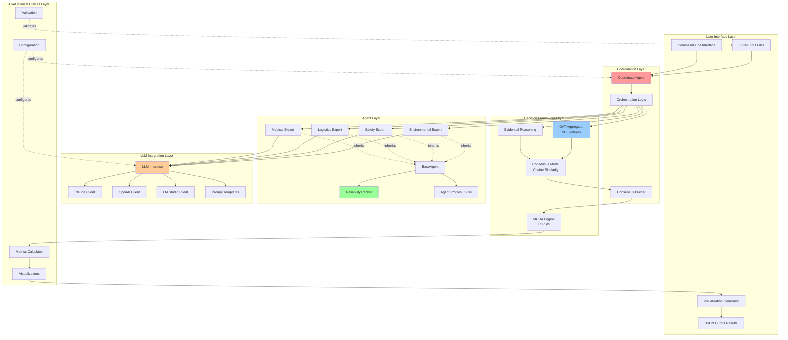
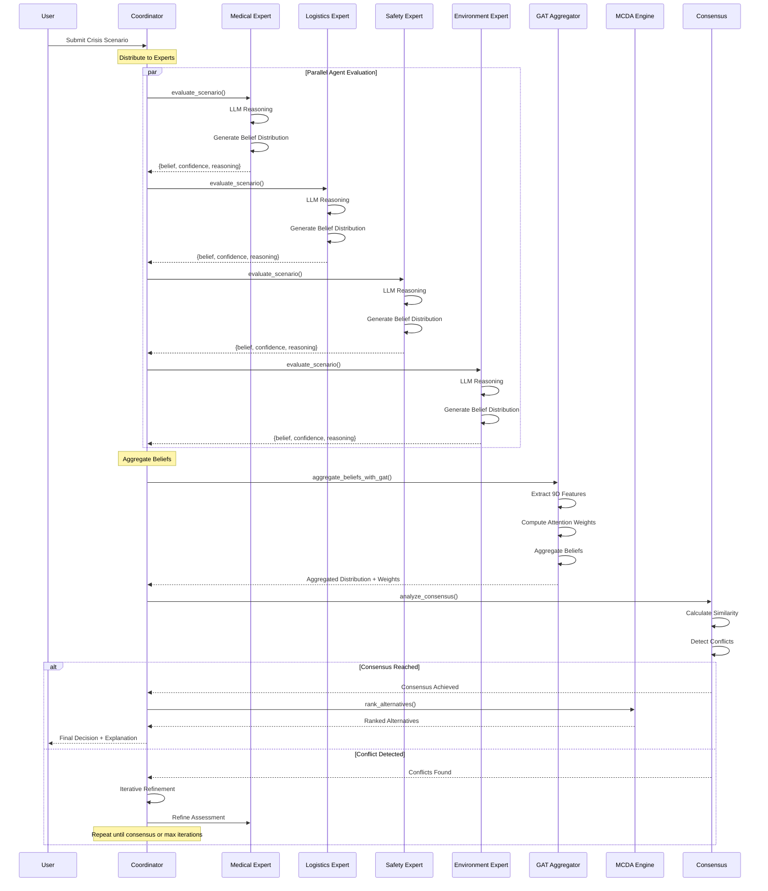
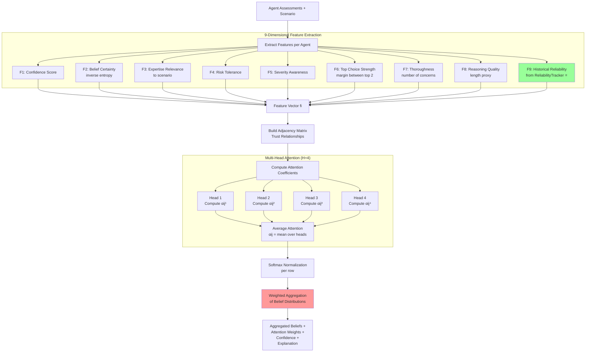
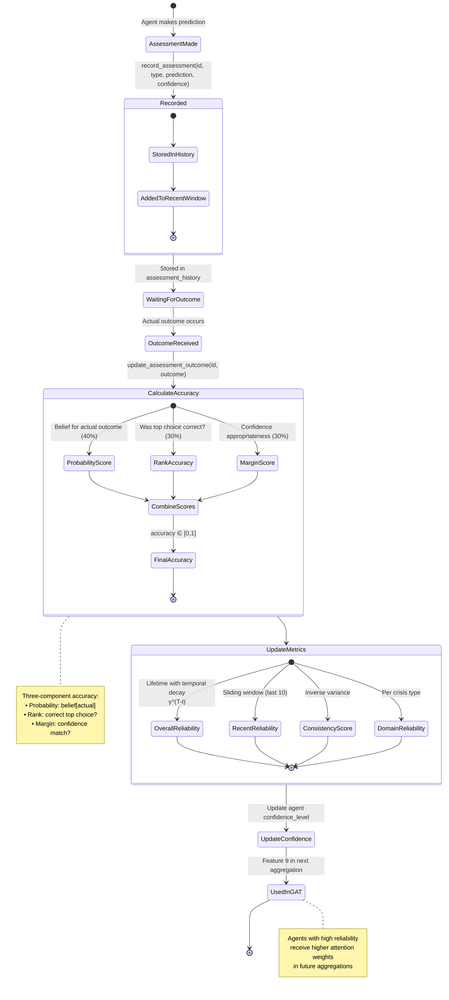
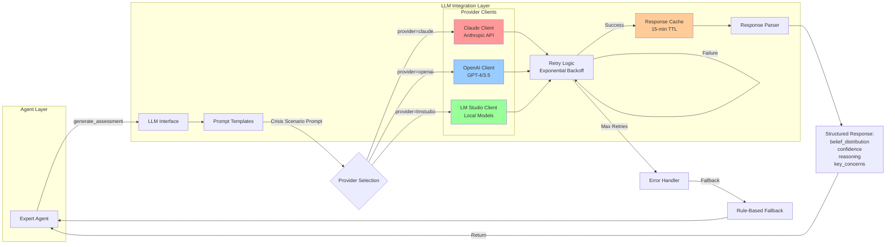
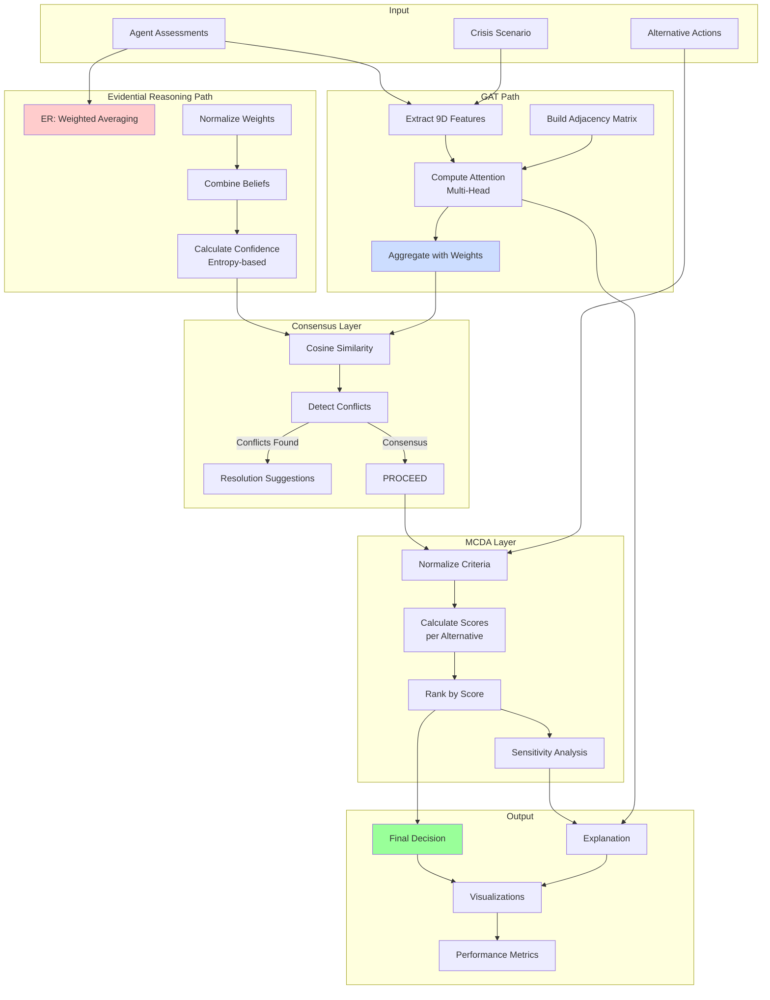
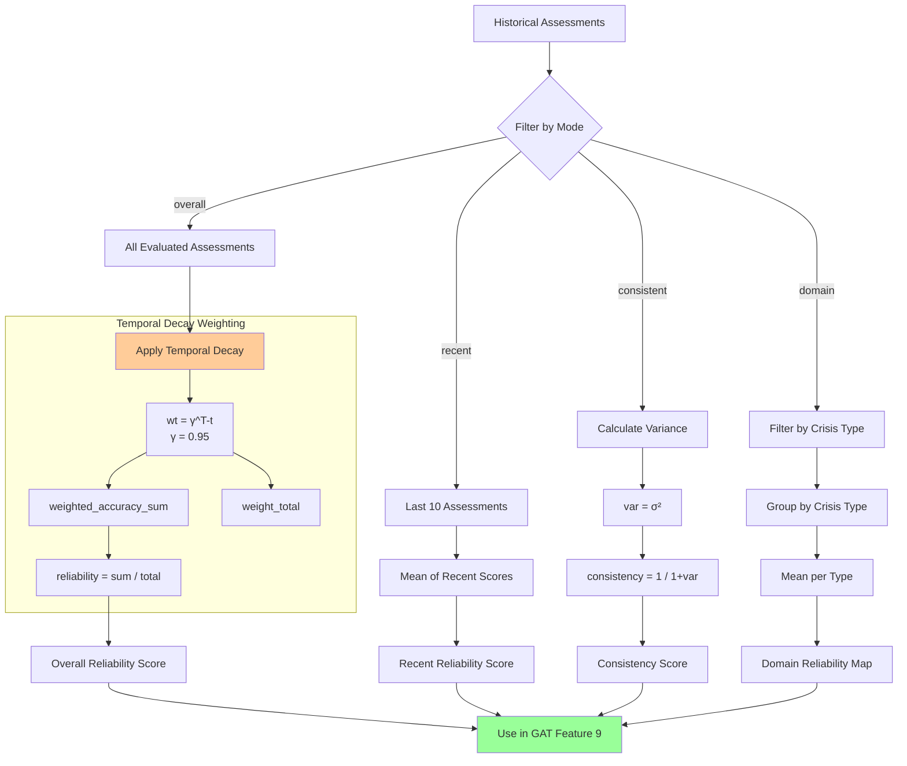
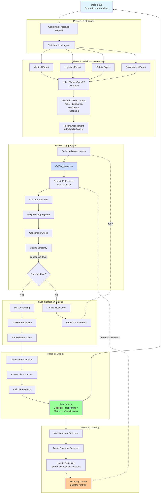
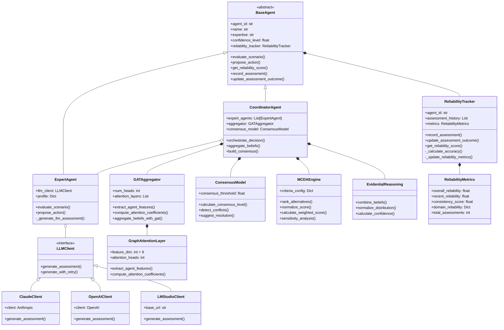

# Crisis Management MAS - Architecture Diagrams

**Comprehensive Mermaid diagrams for system architecture and data flow**

---

## 1. Overall System Architecture



---

## 2. Multi-Agent Decision Flow



---

## 3. GAT Feature Extraction and Aggregation



---

## 4. Historical Reliability Tracking Workflow



---

## 5. LLM Integration Architecture



---

## 6. Decision Framework Component Interactions



---

## 7. Reliability Score Calculation Flow



---

## 8. Consensus Building Process

```mermaid
flowchart TB
    START[Agent Belief Distributions] --> VECTORIZE[Convert to Vectors]

    VECTORIZE --> PAIRWISE[Compute Pairwise<br/>Cosine Similarity]

    subgraph "Similarity Calculation"
        PAIRWISE --> DOT[Dot Product: A·B]
        PAIRWISE --> NORM_A[Magnitude: ||A||]
        PAIRWISE --> NORM_B[Magnitude: ||B||]

        DOT --> COSINE_CALC[cos θ = A·B / ||A||×||B||]
        NORM_A --> COSINE_CALC
        NORM_B --> COSINE_CALC
    end

    COSINE_CALC --> AVG_SIM[Average All Pairs<br/>consensus_level]

    AVG_SIM --> THRESHOLD{consensus_level<br/>≥ threshold?}

    THRESHOLD -->|Yes| CONSENSUS_OK[Consensus Achieved ✓]
    THRESHOLD -->|No| DETECT_CONFLICTS[Detect Conflicts]

    DETECT_CONFLICTS --> FIND_PAIRS[Find Disagreeing Pairs]
    FIND_PAIRS --> TOP_CHOICES[Compare Top Choices]
    TOP_CHOICES --> CONFLICT_SCORE[Calculate Conflict Severity]

    CONFLICT_SCORE --> CLASSIFY{Severity}

    CLASSIFY -->|Low < 0.3| LOW[Low Severity<br/>Weighted Voting]
    CLASSIFY -->|0.3 ≤ Moderate < 0.6| MED[Moderate Severity<br/>Find Compromise]
    CLASSIFY -->|High ≥ 0.6| HIGH[High Severity<br/>Human Escalation]

    LOW --> SUGGEST[Resolution Suggestions]
    MED --> SUGGEST
    HIGH --> SUGGEST

    SUGGEST --> COMPROMISE[Find Compromise Alternatives<br/>combined_score = mean belief]

    CONSENSUS_OK --> PROCEED[Proceed to MCDA]
    COMPROMISE --> ITERATE[Iterative Refinement]
    ITERATE --> PAIRWISE

    style CONSENSUS_OK fill:#99ff99
    style HIGH fill:#ff9999
    style MED fill:#ffcc99
```

---

## 9. Complete System Data Flow (End-to-End)



---

## 10. Class Diagram (Core Components)



---

## Diagram Legend

| Symbol | Meaning |
|--------|---------|
| `-->` | Data flow / dependency |
| `-.->` | Dashed: Optional / fallback flow |
| `==>` | Thick: Primary flow path |
| `o--` | Composition |
| `*--` | Aggregation |
| `<|--` | Inheritance |
| Colored boxes | Different system layers |

## Usage in Documentation

These diagrams can be embedded in:
- **README.md** - Main documentation
- **Thesis document** - System architecture chapter
- **Presentations** - Defense slides
- **Academic papers** - System description sections

All diagrams are in Mermaid format and will render automatically on GitHub, GitLab, and most Markdown viewers.

---

**Generated:** 2025-11-07
**System:** Crisis Management Multi-Agent System
**Version:** 1.0
