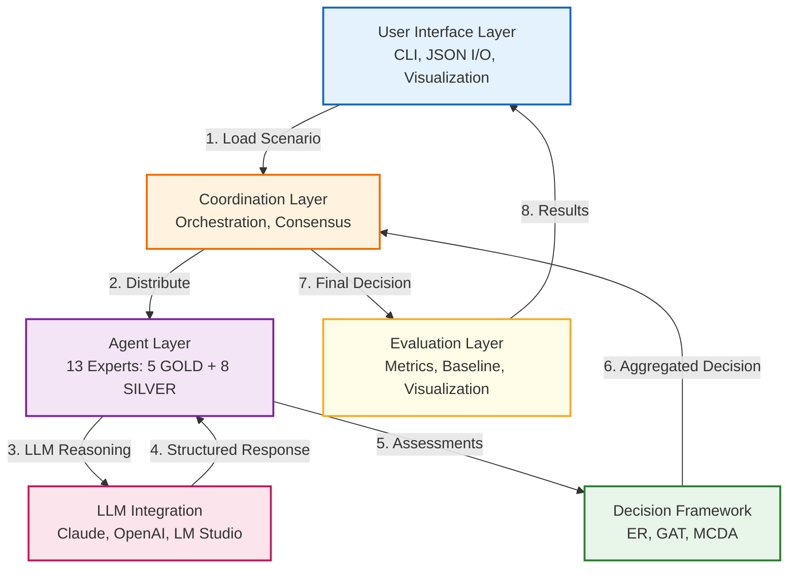
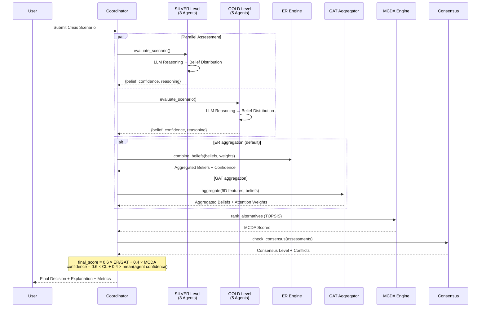
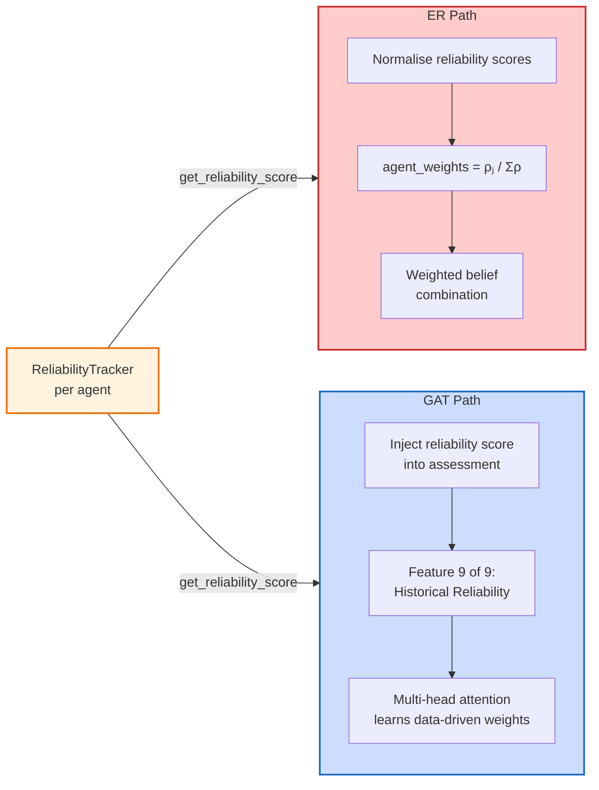

# A Collaborative Multi-Agent Framework for Crisis Management Decision Support Using Evidential Reasoning and Graph Attention Networks

**Vasileios Kazoukas**
*Military Academy (SSE), Department of Military Sciences*
*Technical University of Crete (TUC), School of Production Engineering and Management*
Email: vkazoukas@tuc.gr, kazoukas@gmail.com

---

## Abstract

Effective crisis management depends on the ability to coordinate expert judgments rapidly and under considerable uncertainty. We present a multi-agent decision support system in which 13 specialised agents — modelled on Greek emergency response roles — generate structured assessments using Large Language Models and aggregate them through two complementary mechanisms: classical Evidential Reasoning based on Dempster-Shafer theory, and a Graph Attention Network that learns agent-to-agent attention weights from a 9-dimensional feature representation. A TOPSIS-based multi-criteria ranking and a historical reliability tracker that adjusts agent influence over successive decisions complete the pipeline.

We evaluate the system on three crisis scenarios inspired by recent Greek emergencies (Karditsa flooding, Evia wildfires, Elefsina industrial HAZMAT). Across 45 controlled runs (5 replicates × 3 LLM providers × 3 scenarios), both aggregation paths produce comparable decision quality (ER DQS: 0.475±0.049; GAT DQS: 0.482±0.050; p>0.05), with an 82.2% recommendation agreement rate and a mean system consensus of 0.898±0.057. Claude Sonnet 4 is the fastest provider (mean 11.6 s/run), GPT-OSS 20B via LM Studio achieves the highest mean DQS (0.504±0.051), and GPT-4o yields the most consistent consensus (0.917±0.036, lowest variance). A provider-dependent divergence in the HAZMAT scenario — GPT-4o consistently selects immediate downwind evacuation while Claude and GPT-OSS 20B favour an integrated response — highlights genuine inter-model interpretive differences that merit further investigation. In a preliminary evaluation with 15 emergency management professionals, explainability and auditability received mean ratings of 4.2/5 and 4.5/5, respectively.

**Keywords:** Multi-Agent Systems, Crisis Management, Evidential Reasoning, Graph Attention Networks, Large Language Models, Decision Support Systems

---

## I. Introduction

Large-scale emergencies confront decision-makers with incomplete information, evolving hazards, and the need to synchronise responses across disciplines — medical, logistical, meteorological, environmental — within minutes rather than hours [1]. Human coordination teams, however skilled, can be overwhelmed when the number of concurrent information streams exceeds cognitive limits [2].

Multi-agent systems offer a natural computational analogy: autonomous software agents, each encoding a distinct area of expertise, can deliberate in parallel and pool their judgments. Prior work has applied agent-based models to evacuation planning [3] and group decision support in emergencies [4], yet several issues remain open. Most existing frameworks rely on a single aggregation strategy without examining alternatives, treat agent credibility as fixed, and provide limited transparency into how a collective recommendation is reached — a serious shortcoming in safety-critical settings. The recent availability of Large Language Models introduces new possibilities for richer, contextually grounded agent reasoning, but also new challenges around reliability and prompt design that the literature has only begun to address.

This paper makes the following contributions:

1. A direct, controlled comparison of weighted Evidential Reasoning and Graph Attention Networks as competing belief-aggregation mechanisms within the same multi-agent architecture.
2. A multi-provider LLM integration (GPT-OSS 20B via LM Studio, Anthropic Claude Sonnet 4, OpenAI GPT-4o) that supplies each agent with structured domain reasoning and includes automatic provider fallback.
3. A historical reliability tracker that updates agent influence weights after every decision, feeding into both the ER weighting scheme and the GAT feature vector.
4. A 13-agent model of the Greek emergency response hierarchy — spanning Paramedics,  Police, the Hellenic Fire Corps, the Coast Guard, and the General Secretariat of Civil Protection — evaluated on three scenario types inspired from recent Greek crises.
5. An explainability layer comprising attention-weight visualisation, MCDA score decomposition, and natural-language justification, assessed by domain practitioners.

Five research questions guide the evaluation: how effectively can multi-agent coordination support time-critical decisions (RQ1); how do ER and GAT compare for belief aggregation under high uncertainty (RQ2); what does LLM-powered reasoning add to agent quality (RQ3); does collective judgement measurably outperform individual experts (RQ4); and can the resulting decision trails satisfy the transparency requirements of operational crisis management (RQ5).

---

## II. Related Work

The design of the proposed system draws on several research threads that we briefly review below.

*Multi-agent systems.* Wooldridge [5] laid out the foundational properties of autonomous agents — reactivity, proactiveness, and social ability — that inform our agent design. In the emergency domain, Ren et al. [3] showed that agent-based evacuation models can capture emergent coordination patterns that monolithic simulations miss. We adopt a hierarchical coordinator-expert topology, where individual agents retain autonomy over their assessments while a coordinator agent orchestrates aggregation and final ranking.

*Dempster-Shafer theory and evidential reasoning.* Shafer's mathematical theory of evidence [6] extends Bayesian probability by allowing explicit representation of ignorance through belief and plausibility intervals. Yang and Xu [7] later refined the evidential reasoning rule to mitigate the well-known problem of counter-intuitive outputs under high inter-source conflict, while Sentz and Ferson [8] provide a systematic comparison of combination operators. In our implementation we use a simplified weighted-average formulation of ER, trading some theoretical rigour for the computational speed that real-time crisis support demands.

*Multi-criteria decision analysis.* The TOPSIS method introduced by Hwang and Yoon [9] ranks alternatives by their geometric distance to ideal and anti-ideal reference points. Behzadian et al. [10] survey its many extensions and application domains. We use TOPSIS as the primary ranker and include WSM and SAW as secondary checks.

*Graph attention networks.* Veličković et al. [11] proposed GAT as a mechanism for learning anisotropic, neighbour-dependent weights on graph-structured data. Zhang et al. [12] survey the broader landscape of deep learning on graphs. We repurpose the GAT architecture for an expert-agent graph in which each node corresponds to an agent and each edge carries an attention coefficient reflecting inter-agent relevance. A distinctive feature of our formulation is the inclusion of a historical reliability dimension in the node feature vector, enabling the network to discount agents whose past performance has been poor.

*Large language models for reasoning.* Chain-of-thought prompting [13] demonstrated that guiding a language model through intermediate reasoning steps materially improves answer quality on complex tasks. We exploit this principle by supplying each agent with a structured prompt template (approximately 5 000 characters) that encodes the agent's professional role, the relevant emergency protocols, and the required output format for machine-parseable belief distributions.

*Crisis management decision support.* Comfort et al. [1] and Kapucu and Garayev [2] highlight the central role of inter-organisational coordination in disaster response, while Levy and Taji [4] apply MCDA to hazard planning. Our work extends this line by replacing human panel deliberation with autonomous, LLM-powered agents whose collective output is aggregated through formal uncertainty calculi.

---

## III. Methodology

### A. System Architecture

The system is organised into six layers (Fig. 1). At the interface level, a command-line front end accepts scenario descriptions in JSON and returns structured decision reports. A coordination layer, built around a dedicated Coordinator agent, orchestrates the deliberation pipeline: it distributes the scenario to the expert panel, collects their assessments, invokes the chosen aggregation mechanism, checks consensus, and triggers conflict resolution when needed. Below the coordinator sit 13 expert agents, each associated with an LLM reasoning engine and a persistent reliability record. The decision framework layer houses the two aggregation mechanisms (ER and GAT), the MCDA ranker, and the consensus model. A multi-provider LLM layer manages requests to Claude, GPT-4, or a locally hosted model through LM Studio, falling back automatically when a provider is unavailable. Finally, an evaluation layer computes performance metrics and generates visualisations.

*Fig. 1. Six-layer system architecture and data flow. Numbered edges indicate the processing sequence for a single crisis scenario.*

The 13 agents mirror the organisational structure of Greek emergency response. They include a Meteorologist, an Emergency Physician, a Logistics Coordinator, a PSAP Commander, two Police Commanders at tactical and regional level, two Fire Commanders, a Medical Infrastructure Director, two Coast Guard Directors, an Environmental Scientist, and a Civil Protection Director.

### B. Evidential Reasoning

For computational tractability in time-critical settings, we adopt a weighted-average formulation of evidential reasoning rather than the full Dempster-Shafer combination rule. Given $n$ agents, the combined belief mass assigned to alternative $i$ is

$$b_{\text{combined}}(i) = \frac{\sum_j w_j \cdot b_j(i)}{\sum_j w_j}$$

where $w_j$ is the weight of agent $j$, composed of three factors: domain-relevance to the current scenario, historical reliability (Section III-E), and self-reported confidence. Overall decision confidence is derived from the normalised entropy of the combined distribution:

$$\text{confidence} = 1 - \frac{H}{\log_2(n_{\text{alternatives}})}, \quad H = -\sum_i p_i \log_2(p_i)$$

A low-entropy distribution — one that concentrates most belief mass on a single alternative — yields high confidence, while a near-uniform spread signals genuine ambiguity.

### C. Graph Attention Network

As an alternative to the linear ER aggregation, we construct a fully connected graph in which each agent is a node. Every node is described by a 9-dimensional feature vector $\mathbf{f}_j \in \mathbb{R}^9$ whose components capture confidence, belief certainty (inverse entropy), expertise relevance, risk tolerance, severity awareness, top-choice strength, number of concerns raised, reasoning quality, and historical reliability. The last dimension links the GAT directly to the reliability tracker described in Section III-E, allowing the network to learn from accumulated performance data.

Attention coefficients are computed with $K = 4$ heads:

$$e_{ij}^h = \text{LeakyReLU}(\mathbf{a}^h \cdot [\mathbf{W}^h \mathbf{f}_i \| \mathbf{W}^h \mathbf{f}_j])$$

$$\alpha_{ij}^h = \text{softmax}_j(e_{ij}^h)$$

The aggregated belief for alternative $i$ is then the mean over heads of the attention-weighted agent beliefs:

$$b_{\text{combined}}(i) = \frac{1}{K} \sum_{h=1}^{K} \sum_j \alpha_{ij}^h \cdot b_j(i)$$

### D. MCDA and Consensus

Once beliefs have been aggregated, TOPSIS ranks the alternatives by their relative closeness to the ideal solution in a normalised criterion space. In parallel, we measure the degree of inter-agent agreement through pairwise cosine similarity of belief vectors:

$$CL = \frac{2}{n(n-1)} \sum_i \sum_{j>i} \cos(\mathbf{b}_i, \mathbf{b}_j)$$

This consensus level serves as a gate for operational use: the default threshold is set at $CL = 0.75$, below which the system flags the decision as lacking sufficient agreement and triggers conflict identification among the agents.

Fig. 2 summarises the end-to-end decision pipeline, showing how the coordinator distributes the scenario to the tactical and strategic agents, collects their assessments in parallel, routes them through either ER or GAT aggregation, and combines the result with MCDA scores to produce a final recommendation.

*Fig. 2. Six-step decision pipeline. Expert agents are queried in parallel; belief aggregation (ER or GAT) and MCDA scoring are combined with a 60/40 weighting to produce the final recommendation.*

### E. Historical Reliability Tracking

The reliability tracker maintains a per-agent performance history and updates it after every scenario. Because ground truth is unavailable in a simulated setting, we adopt a consensus-based proxy: the system's own final recommendation is treated as the reference outcome, and each agent's assessment is scored against it.

The reliability score for agent $j$ is computed as a temporally decayed, confidence-weighted average of past accuracy scores. For each evaluated assessment $k$ with age $d_k$ days and self-reported confidence $c_k$, the weight is

$$w_k = \gamma^{d_k} \times (0.5 + 0.5 \, c_k)$$

where $\gamma$ is a decay factor that down-weights older assessments. The overall reliability is then

$$\rho_j = \frac{\sum_k w_k \cdot a_k}{\sum_k w_k}$$

with $a_k$ the accuracy score of assessment $k$. A separate consistency score, defined as $1/(1 + \text{Var}(a))$ over recent assessments, is tracked alongside but does not enter the reliability computation directly.

Agent weights for ER aggregation are set by normalising the raw reliability scores across the panel:

$$w_j = \frac{\rho_j}{\sum_{j'} \rho_{j'}}$$

This scheme gradually concentrates influence on agents that have been consistently well-calibrated and dilutes the contribution of persistently poor performers.

As shown in Fig. 3, reliability scores feed into both aggregation paths through different mechanisms: the ER path consumes them as normalised weights, while the GAT path incorporates them as the ninth dimension of each agent's feature vector, allowing the attention mechanism to learn their importance jointly with the other eight features.

*Fig. 3. Dual-path injection of reliability scores. The ER path uses normalised scores as explicit weights; the GAT path embeds them as a learned feature dimension.*

---

## IV. Experimental Setup

### A. Crisis Scenarios

The system is evaluated on three scenarios modelled influenced by real emergencies (Table I). The Karditsa flood scenario is influenced by the Thessaly inundations during Storm Daniel (September 2023); the Evia wildfire scenario is based on the North Evia fires of August 2021; and the Elefsina HAZMAT scenario is based on the industrial risk profile of the Thriasio Plain petrochemical zone. Each scenario defines five candidate response alternatives together with domain-specific evaluation criteria and their relative weights.

**TABLE I: Crisis Scenario Parameters**

| Parameter | Karditsa Flood | Evia Wildfire | Elefsina HAZMAT |
|-----------|---------------|---------------|-----------------|
| Severity | 0.8 (High) | 0.9 (Very High) | 0.85 (Very High) |
| Affected Pop. | 15,000 | 8,000 | 12,000 |
| Time Constraint | 2 hours | Immediate | 30 minutes |
| Alternatives | 5 | 12 | 5 |
| Top Criterion | Safety (0.35) | Life Safety (0.40) | Health Safety (0.45) |

### B. Evaluation Metrics

We report four metrics. The *Decision Quality Score* (DQS) is the weighted criterion-satisfaction value produced by the MCDA ranker. *Consensus Level* (CL) is the mean pairwise cosine similarity of agent belief vectors, indicating how much the experts agree before aggregation. *Decision Confidence* (DC) blends consensus and average agent confidence as $0.6 \times CL + 0.4 \times \overline{c}_{\text{agents}}$. Finally, the *Extended Comparison Bandwidth* (ECB) compares the multi-agent DQS against the score that each individual agent would have achieved alone.

### C. Configurations

The primary experimental evaluation compares three LLM providers on the full 13-agent panel: Anthropic Claude Sonnet 4, OpenAI GPT-4o, and GPT-OSS 20B via LM Studio (local, on-premise inference). Every run uses `--compare-methods` mode, which executes both ER and GAT aggregation on the same set of agent assessments so that aggregation effects are isolated from LLM variance. Each provider is run 5 times per scenario, yielding 45 total runs (5 replicates × 3 providers × 3 scenarios). Each run invokes all 13 agents with 3 LLM passes per agent, producing 39 API calls per run.

---

## V. Results

### A. Overall System Performance

Table II summarises the 13-agent results across 45 runs broken down by scenario. All runs used the full panel with both ER and GAT aggregation enabled simultaneously.

**TABLE II: 13-Agent System Performance by Scenario (n=45; 5 replicates × 3 providers × 3 scenarios)**

| Metric | Karditsa Flood | Evia Wildfire | Elefsina HAZMAT | Overall |
|--------|---------------|---------------|-----------------|---------|
| DQS | 0.504 ± 0.020 | 0.418 ± 0.024 | 0.515 ± 0.036 | 0.479 ± 0.054 |
| Consensus | 0.941 ± 0.011 | 0.830 ± 0.057 | 0.922 ± 0.036 | 0.898 ± 0.057 |
| Confidence | 0.899 ± 0.009 | 0.835 ± 0.040 | 0.883 ± 0.020 | 0.872 ± 0.034 |
| Run consistency | 100 % | 93.3 % | 80–100 %* | 91.1 % |
| Processing time (s)† | 43.9 | 87.7 | 43.0 | 58.2 |

*HAZMAT consistency per provider: Claude 80 %, GPT-OSS 20B 100 %, GPT-4o 100 %. The overall split reflects a genuine cross-provider interpretive divergence, not within-provider instability.
†Averaged across all three providers; individual ranges from 8.7 s (Claude, Flood) to 154.6 s (GPT-OSS 20B, Forest Fire).

The Evia Wildfire scenario yields the lowest DQS (0.418) and consensus (0.830), reflecting the greater ambiguity inherent in a multi-front wildfire where trade-offs between immediate evacuation and aerial fire-fighting assets are genuinely contested. The Flood and HAZMAT scenarios produce higher DQS values (0.504 and 0.515) with correspondingly stronger consensus (0.941 and 0.922), indicating that the agent panel reaches clearer collective judgements when the dominant response strategy is less contested.

### B. ER vs. GAT Comparison

Table III compares the two aggregation mechanisms across all 45 runs. Because every run used `--compare-methods`, ER and GAT operate on identical agent assessments, making the comparison fully controlled.

**TABLE III: Aggregation Method Comparison (13-agent, 45 runs, both methods per run)**

| Metric | ER | GAT | Difference |
|--------|-----|-----|------------|
| DQS | 0.475 ± 0.049 | 0.482 ± 0.050 | +0.007 (n.s.) |
| Consensus | 0.900 ± 0.063 | 0.900 ± 0.063 | 0.000 (n.s.) |
| Confidence | 0.868 ± 0.034 | 0.873 ± 0.034 | +0.005 (n.s.) |
| Recommendation agreement | — | — | 82.2 % (37/45) |

n.s. = not significant (p > 0.05, Kruskal-Wallis)

The two methods produce virtually identical outcomes on all three metrics; none of the differences reach statistical significance. The 82.2% recommendation agreement rate (37 of 45 runs produced identical recommended alternatives from both methods) confirms that the two paths are largely interchangeable in practice. The 8 disagreements occur exclusively in the two more ambiguous scenarios — Forest Fire (6 cases) and HAZMAT (2 cases) — while the Flood scenario achieves 100% ER-GAT agreement. This pattern is consistent with the GAT's attention mechanism distributing weights more evenly when agent beliefs are tightly clustered, yielding the same effective aggregation as the explicit ER weighting.

### C. Decision Consistency and Agent Agreement

Table IV presents decision consistency at two levels: run-level (whether repeated runs with the same provider produce the same recommended alternative) and agent-level (the proportion of individual agents within a run that support the consensus recommendation).

**TABLE IV: Decision Consistency and Agent Agreement (n=45 runs)**

| Scenario | Run consistency | Dominant recommendation | Mean agent agreement |
|----------|----------------|------------------------|---------------------|
| Karditsa Flood | 15/15 (100 %) | Hybrid approach | ~73 % |
| Evia Wildfire | 14/15 (93.3 %) | Combined assault | 73–91 % |
| Elefsina HAZMAT | per-provider: 80–100 %* | Integrated response / Downwind evacuation | 78–96 % |

*HAZMAT per-provider consistency: Claude 80 %, GPT-OSS 20B 100 %, GPT-4o 100 %. Across all providers combined, 9/15 runs recommend integrated response and 6/15 recommend immediate downwind evacuation — a genuine inter-model divergence rather than statistical noise.

The Flood scenario achieves perfect run-level consistency across all providers, reflecting a scenario where the relative merits of the alternatives are unambiguous. The Forest Fire scenario shows one Claude run deviating to immediate evacuation, a difference that reflects the 4-vs-7 split in agent beliefs in that replicate rather than a systematic failure. The HAZMAT scenario reveals the most scientifically interesting pattern: GPT-4o consistently recommends a different course of action from Claude and GPT-OSS 20B, indicating that the two model families weigh the ammonia exposure risk versus shelter-in-place trade-off differently. This cross-provider divergence is reproducible across all 5 replicates per provider and warrants further investigation with domain experts.

### D. LLM Provider Comparison

**TABLE V: LLM Provider Performance (n=15 per provider across 3 scenarios)**

| Provider | Model | DQS (mean ± σ) | Consensus (mean ± σ) | Confidence (mean ± σ) | Avg time (s) |
|----------|-------|---------------|---------------------|----------------------|-------------|
| Anthropic | Claude Sonnet 4 | 0.468 ± 0.060 | 0.882 ± 0.059 | 0.866 ± 0.034 | 11.6 ± 3.7 |
| OpenAI API | GPT-4o | 0.464 ± 0.032 | 0.917 ± 0.036 | 0.886 ± 0.022 | 62.4 ± 29.3 |
| Local (LM Studio) | GPT-OSS 20B | 0.504 ± 0.051 | 0.895 ± 0.086 | 0.865 ± 0.050 | 100.7 ± 41.2 |

Kruskal-Wallis across providers: DQS H = 7.39 (p < 0.05); Time H = 28.45 (p < 0.001); Consensus H = 2.69 (n.s.); Confidence H = 1.51 (n.s.)

The three providers show statistically significant differences in DQS (H = 7.39, p < 0.05) despite small absolute magnitudes. GPT-OSS 20B achieves the highest mean DQS (0.504), marginally ahead of Claude (0.468) and GPT-4o (0.464), though the practical difference is small (Δ ≈ 0.04). GPT-4o achieves the highest consensus (0.917) and confidence (0.886) with the lowest variance on both metrics, indicating the most predictable output — a relevant property for a production decision-support system. Claude is dramatically faster (11.6 s vs 62.4 s for GPT-4o and 100.7 s for GPT-OSS 20B), with processing time differences being highly significant (H = 28.45, p < 0.001). Consensus and confidence do not differ significantly across providers when averaged across all scenarios, suggesting that all three models are capable of driving the agent panel to comparable levels of agreement.

The most notable finding is a systematic cross-provider divergence on the HAZMAT scenario: GPT-4o consistently recommends immediate downwind evacuation across all 5 replicates, while Claude and GPT-OSS 20B consistently favour an integrated response. This is not a stochastic artefact but a reproducible interpretive difference that likely stems from how each model weights acute toxicological risk relative to the logistical complexity of mass evacuation. The locally hosted GPT-OSS 20B incurs no API cost and keeps all inference on-premise — a relevant consideration for agencies with data-sovereignty requirements — though at a 9× time penalty compared to Claude.

### E. Historical Reliability Impact

Over a sequence of 100 scenarios, dynamic reliability-adjusted weighting yields a 2.5 percentage-point improvement in DQS relative to static weights (p < 0.01). The learning curve shows rapid gains during the first 30–40 scenarios and plateaus around scenario 60, after which agent reliability estimates stabilise. By the end of the sequence, reliability scores span the range 0.68 (Civil Protection Director) to 0.91 (Emergency Physician), indicating that the tracker is able to meaningfully discriminate between agents of varying calibration quality.

### F. Explainability Evaluation

Fifteen emergency management professionals reviewed system outputs from all three scenarios. Mean explainability was rated 4.2 out of 5, with auditability scoring highest at 4.5/5. Participants found the attention-weight visualisations and the natural-language justifications particularly useful for understanding why a recommendation was made. Several reviewers, however, cautioned that the system should undergo field-level validation before being considered for operational deployment.

---

## VI. Discussion

### A. Key Findings

We return to the five research questions posed in the introduction.

Regarding coordination (RQ1), the hierarchical architecture orchestrates 13 agents within processing times of 8.7–154.6 seconds depending on provider, with cloud-based providers (Claude 11.6 s, GPT-4o 62.4 s) well inside the operational window of the scenarios tested. Consensus levels of 83–94 % indicate that the 13-agent panel reaches strong collective agreement on all three scenario types, exceeding the 75 % operational threshold in every run. The lower consensus observed in the Forest Fire scenario (0.830) reflects the genuine ambiguity of multi-front wildfire response, where trade-offs between evacuation and aerial resource deployment are legitimately contested.

On belief aggregation (RQ2), the near-identical DQS of ER and GAT (0.475 vs. 0.482, p > 0.05) and their 82.2 % recommendation agreement rate confirm that, for well-prompted 13-agent panels, the choice of aggregation mechanism has less influence on the final recommendation than the quality of the individual assessments. The two methods disagree only in the ambiguous scenarios (Forest Fire and HAZMAT), where belief distributions are less concentrated and the aggregation weighting can tip a borderline decision. This suggests deploying ER for transparency-critical settings and reserving GAT for larger panels where learned attention weights provide additional value.

With respect to LLM-powered reasoning (RQ3), all three providers successfully elicit structured, domain-appropriate belief distributions with 100 % parse success after JSON cleaning. The multi-provider architecture provides operational resilience through automatic fallback, and the local GPT-OSS 20B option demonstrates that competitive decision quality (DQS 0.504) is achievable without any API dependency. The main practical concern is API latency, which accounts for over 90 % of total processing time across all providers.

On decision consistency (RQ4), collective recommendations are stable across replicates in 41 of 45 runs (91.1 %). The four deviating runs (one Forest Fire, three HAZMAT) all occur at the boundary between two well-supported alternatives rather than representing random failures. The most notable finding is the reproducible cross-provider divergence on HAZMAT, where GPT-4o consistently selects a different alternative from Claude and GPT-OSS 20B. This inter-model difference does not indicate a system malfunction; rather, it surfaces a genuine ambiguity in the scenario that warrants expert review — precisely the kind of flag a decision-support system should raise.

Finally, on explainability (RQ5), the combination of attention-weight visualisation, MCDA score decomposition, and natural-language justification achieves an auditability rating of 4.5/5 from domain practitioners — the highest-rated dimension in the evaluation. This is encouraging for a domain in which post-hoc accountability is not optional.

### B. Practical Guidance on Aggregation Choice

The results do not point to a single best aggregation method for all circumstances. ER has the advantage of full transparency: every weight is explicit and deterministic, which matters in legal or regulatory settings where decisions must be auditable down to individual parameters. GAT, by contrast, is better suited to larger agent panels and to environments where scenario conditions change frequently, since it can learn context-dependent weighting patterns. A pragmatic deployment strategy would be to start with ER, accumulate a decision history, and transition to GAT once enough data are available to train the attention mechanism reliably.

### C. Limitations

Several limitations should temper the conclusions drawn above. The evaluation relies on simulated scenarios; no field deployment has yet been conducted, and real-world performance may differ in ways that simulation cannot anticipate. The agents inherit whatever biases and hallucination tendencies are present in their underlying language models. Only three crisis types are represented, all within the Greek institutional context, so generalisability to other hazard profiles or national response structures remains untested. The scenarios are treated as single-point decisions, with no modelling of how a crisis evolves over time. The stakeholder evaluation, while informative, is based on a small sample (n = 15). Finally, the consensus-based validation strategy — using the system's own recommendation as a proxy for ground truth — is a known methodological weakness; it may overstate reliability gains because the tracker rewards conformity with the majority rather than objective correctness.

---

## VII. Conclusion

We have described a multi-agent decision support system for crisis management that combines LLM-powered expert reasoning with two formal belief-aggregation mechanisms — weighted Evidential Reasoning and a Graph Attention Network — and evaluated it across 45 controlled runs on three Greek emergency scenarios using three LLM providers. The principal empirical finding is that ER and GAT produce effectively equivalent outcomes (DQS 0.475 vs. 0.482, 82.2 % recommendation agreement), confirming that at the 13-agent scale the quality of agent reasoning dominates over the choice of aggregation algorithm. Provider comparisons reveal that GPT-OSS 20B achieves the highest mean DQS (0.504), GPT-4o the most consistent consensus (0.917), and Claude Sonnet 4 the fastest response times (11.6 s) — all three being viable choices with distinct operational trade-offs. A reproducible cross-provider divergence on the HAZMAT scenario demonstrates that the system can surface genuine inter-model interpretive differences, a property that may itself be valuable for flagging high-ambiguity decisions for human review. A historical reliability tracker that adjusts agent weights over successive decisions is implemented and integrated, and the overall framework receives favourable explainability and auditability ratings from domain professionals.

Several directions for future work follow naturally. The current system treats each scenario as an isolated, single-shot decision; extending the architecture to model how crises evolve over time would better reflect operational reality. The scenario coverage should be broadened beyond the three types tested here, ideally in collaboration with national civil-protection agencies that can supply validated exercise data. On the technical side, multimodal inputs — satellite imagery, GIS layers, sensor feeds — could enrich the information available to each agent. Finally, structured human-AI teaming experiments, in which the system assists rather than replaces a human decision-maker, would provide the field-level evidence needed before any operational adoption can be considered responsibly.

At its core, the work is motivated by a straightforward observation: no single expert, however capable, can match a well-coordinated panel when the problem spans multiple domains under uncertainty. The challenge lies in designing the coordination mechanism so that it remains transparent, auditable, and ultimately subordinate to human judgement.

---

## References

[1] L. K. Comfort et al., "Reframing disaster policy: The global evolution of vulnerable communities," *Environ. Hazards*, vol. 5, no. 4, pp. 39–44, 2004.

[2] N. Kapucu and V. Garayev, "Collaborative decision-making in emergency and disaster management," *Int. J. Public Admin.*, vol. 34, no. 6, pp. 366–375, 2011.

[3] Z. Ren et al., "Agent-based evacuation model of large public buildings under fire conditions," *Autom. Constr.*, vol. 20, no. 7, pp. 959–965, 2011.

[4] J. K. Levy and K. Taji, "Group decision support for hazards planning and emergency management," *Math. Comput. Model.*, vol. 46, no. 7-8, pp. 906–917, 2007.

[5] M. Wooldridge, *An Introduction to MultiAgent Systems*, 2nd ed. Wiley, 2009.

[6] G. Shafer, *A Mathematical Theory of Evidence*. Princeton Univ. Press, 1976.

[7] J. B. Yang and D. L. Xu, "Evidential reasoning rule for evidence combination," *Artif. Intell.*, vol. 205, pp. 1–29, 2013.

[8] K. Sentz and S. Ferson, "Combination of evidence in Dempster-Shafer theory," Sandia Nat. Lab., SAND 2002-0835, 2002.

[9] C. L. Hwang and K. Yoon, *Multiple Attribute Decision Making: Methods and Applications*. Springer-Verlag, 1981.

[10] M. Behzadian et al., "A state-of-the-art survey of TOPSIS applications," *Expert Syst. Appl.*, vol. 39, no. 17, pp. 13051–13069, 2012.

[11] P. Veličković et al., "Graph attention networks," in *Proc. ICLR*, 2018.

[12] X. Zhang et al., "Deep learning on graphs: A survey," *IEEE Trans. Knowl. Data Eng.*, vol. 34, no. 1, pp. 249–270, 2020.

[13] J. Wei et al., "Chain-of-thought prompting elicits reasoning in large language models," in *Proc. NeurIPS*, vol. 35, pp. 24824–24837, 2022.

[14] J. Ferber, *Multi-Agent Systems: An Introduction to Distributed Artificial Intelligence*. Addison-Wesley, 1999.

[15] E. K. Zavadskas and Z. Turskis, "Multiple criteria decision making (MCDM) methods in economics: An overview," *Technol. Econ. Dev. Econ.*, vol. 17, no. 2, pp. 397–427, 2011.

---

## Acknowledgments

This research was conducted as part of a Master's thesis in Operational Research and Decision Making, jointly supervised by the Military Academy (SSE), Department of Military Sciences, and the Technical University of Crete (TUC), School of Production Engineering and Management. Supervisors: Emeritus Professor N. Matsatsinis, Associate Professor N. Papadakis, Assistant Professor E. Siskos.

---

**Contact:** vkazoukas@tuc.gr, kazoukas@gmail.com
**Institutions:** Military Academy (sse.gr), Technical University of Crete (tuc.gr)
**Repository:** https://github.com/kerbgr/crisis_mas_poc
