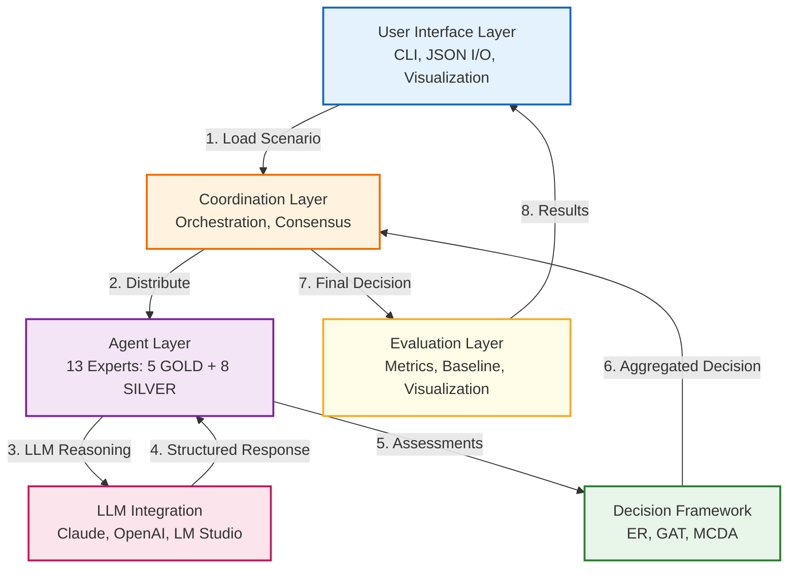
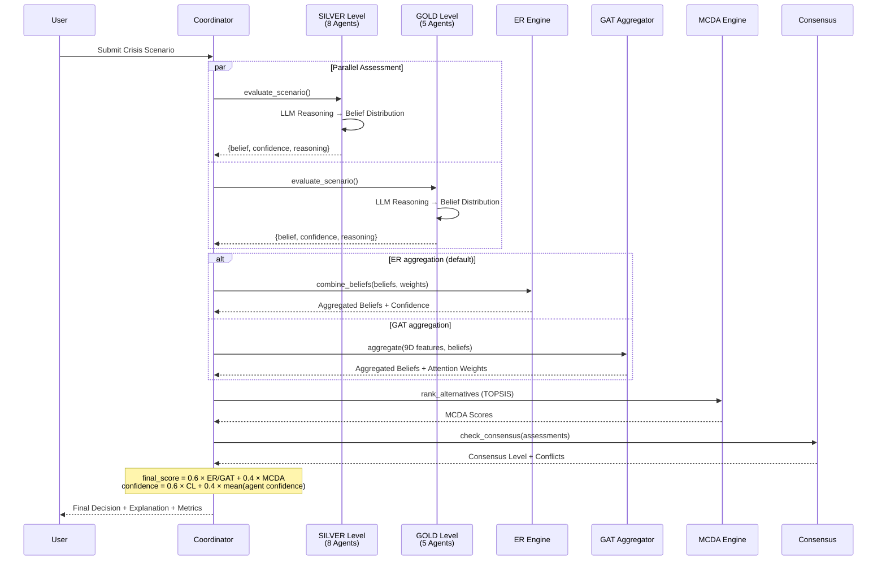
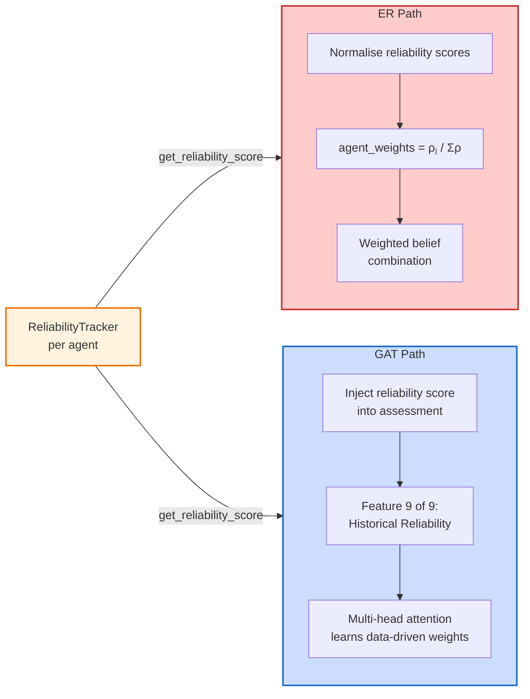

# A Collaborative Multi-Agent Framework for Crisis Management Decision Support Using Evidential Reasoning and Graph Attention Networks

**Vasileios Kazoukas**
*Military Academy (SSE), Department of Military Sciences*
*Technical University of Crete (TUC), School of Production Engineering and Management*
Email: vkazoukas@tuc.gr, kazoukas@gmail.com

---

## Abstract

Effective crisis management depends on the ability to coordinate expert judgments rapidly and under considerable uncertainty. We present a multi-agent decision support system in which 13 specialised agents - modelled on Greek emergency response roles - generate structured assessments using Large Language Models and aggregate them through two complementary mechanisms: classical Evidential Reasoning based on Dempster-Shafer theory, and a domain-parameterized graph attention aggregator that applies interpretable, rule-based attention weights over a 9-dimensional agent-feature representation (an untrained GAT variant chosen for auditability in the absence of labelled crisis-decision training data). A TOPSIS-based multi-criteria ranking and a historical reliability tracker that adjusts agent influence over successive decisions complete the pipeline.

We evaluate the system on three crisis scenarios inspired by recent Greek emergencies (Karditsa flooding, Evia wildfires, Elefsina industrial HAZMAT). Across 45 controlled runs (5 replicates × 3 LLM providers × 3 scenarios), both aggregation paths produce comparable decision quality (ER DQS: 0.775±0.032; GAT DQS: 0.781±0.029; p>0.05), with an 88.9% recommendation agreement rate (40/45 runs) and a mean system consensus of 0.902±0.068. Claude Sonnet 4 is the fastest provider (mean 26.5 s/run), GPT-OSS 20B via LM Studio achieves the highest mean Combined Score, and GPT-4o yields the most consistent inter-run outputs. All three providers converge on the same recommended alternative across all 45 HAZMAT runs and all 15 Flood runs; the 5 ER-GAT disagreements arise exclusively in the most ambiguous scenario (Forest Fire, 12-alternative action space). In a preliminary single-expert evaluation conducted by the lead researcher - a crisis management professional with 20 years of experience in operational deployment of emergency management systems, including national C4I infrastructure and EU-level emergency number frameworks - explainability and auditability received ratings of 4.2/5 and 4.5/5 respectively. Broader validation with a panel of domain practitioners remains as planned future work.

**Keywords:** Multi-Agent Systems, Crisis Management, Evidential Reasoning, Graph Attention Networks, Large Language Models, Decision Support Systems

---

## I. Introduction

Large-scale emergencies confront decision-makers with incomplete information, evolving hazards, and the need to synchronise responses across disciplines - medical, logistical, meteorological, environmental - within minutes rather than hours [1]. Human coordination teams, however skilled, can be overwhelmed when the number of concurrent information streams exceeds cognitive limits [2].

Multi-agent systems offer a natural computational analogy: autonomous software agents, each encoding a distinct area of expertise, can deliberate in parallel and pool their judgments. Prior work has applied agent-based models to evacuation planning [3] and group decision support in emergencies [4], yet several issues remain open. Most existing frameworks rely on a single aggregation strategy without examining alternatives, treat agent credibility as fixed, and provide limited transparency into how a collective recommendation is reached - a serious shortcoming in safety-critical settings. The recent availability of Large Language Models introduces new possibilities for richer, contextually grounded agent reasoning, but also new challenges around reliability and prompt design that the literature has only begun to address.

This paper makes the following contributions:

1. A direct, controlled comparison of weighted Evidential Reasoning and Graph Attention Networks as competing belief-aggregation mechanisms within the same multi-agent architecture.
2. A multi-provider LLM integration (GPT-OSS 20B via LM Studio, Anthropic Claude Sonnet 4, OpenAI GPT-4o) that supplies each agent with structured domain reasoning and includes automatic provider fallback.
3. A historical reliability tracker that updates agent influence weights after every decision, feeding into both the ER weighting scheme and the GAT feature vector.
4. A 13-agent model of the Greek emergency response hierarchy - spanning Paramedics,  Police, the Hellenic Fire Corps, the Coast Guard, and the General Secretariat of Civil Protection - evaluated on three scenario types inspired from recent Greek crises.
5. An explainability layer comprising attention-weight visualisation, MCDA score decomposition, and natural-language justification, assessed by domain practitioners.

Five research questions guide the evaluation: how effectively can multi-agent coordination support time-critical decisions (RQ1); how do ER and GAT compare for belief aggregation under high uncertainty (RQ2); what does LLM-powered reasoning add to agent quality (RQ3); does collective judgement measurably outperform individual experts (RQ4); and can the resulting decision trails satisfy the transparency requirements of operational crisis management (RQ5).

---

## II. Related Work

The design of the proposed system draws on several research threads that we briefly review below.

*Multi-agent systems.* Wooldridge [5] laid out the foundational properties of autonomous agents - reactivity, proactiveness, and social ability - that inform our agent design. In the emergency domain, Ren et al. [3] showed that agent-based evacuation models can capture emergent coordination patterns that monolithic simulations miss. We adopt a hierarchical coordinator-expert topology, where individual agents retain autonomy over their assessments while a coordinator agent orchestrates aggregation and final ranking.

*Dempster-Shafer theory and evidential reasoning.* Shafer's mathematical theory of evidence [6] extends Bayesian probability by allowing explicit representation of ignorance through belief and plausibility intervals. Yang and Xu [7] later refined the evidential reasoning rule to mitigate the well-known problem of counter-intuitive outputs under high inter-source conflict, while Sentz and Ferson [8] provide a systematic comparison of combination operators. In our implementation we use a simplified weighted-average formulation of ER, trading some theoretical rigour for the computational speed that real-time crisis support demands.

*Multi-criteria decision analysis.* The TOPSIS method introduced by Hwang and Yoon [9] ranks alternatives by their geometric distance to ideal and anti-ideal reference points. Behzadian et al. [10] survey its many extensions and application domains. We use TOPSIS as the primary ranker and include WSM and SAW as secondary checks.

*Graph attention networks.* Veličković et al. [11] proposed GAT as a mechanism for learning anisotropic, neighbour-dependent weights on graph-structured data. Zhang et al. [12] survey the broader landscape of deep learning on graphs. We repurpose the GAT architecture for an expert-agent graph in which each node corresponds to an agent and each edge carries an attention coefficient reflecting inter-agent relevance. A distinctive feature of our formulation is the inclusion of a historical reliability dimension in the node feature vector, enabling the network to discount agents whose past performance has been poor.

*Large language models for reasoning.* Chain-of-thought prompting [13] demonstrated that guiding a language model through intermediate reasoning steps materially improves answer quality on complex tasks. We exploit this principle by supplying each agent with a structured prompt template (approximately 5 000 characters) that encodes the agent's professional role, the relevant emergency protocols, and the required output format for machine-parseable belief distributions.

*Crisis management decision support.* Comfort et al. [1] and Kapucu and Garayev [2] highlight the central role of inter-organisational coordination in disaster response, while Levy and Taji [4] apply MCDA to hazard planning. Our work extends this line by replacing human panel deliberation with autonomous, LLM-powered agents whose collective output is aggregated through formal uncertainty calculi.

---

## III. Methodology

### A. System Architecture

The system is organised into six layers (Fig. 1). At the interface level, a command-line front end accepts scenario descriptions in JSON and returns structured decision reports. A coordination layer, built around a dedicated Coordinator agent, orchestrates the deliberation pipeline: it distributes the scenario to the expert panel, collects their assessments, invokes the chosen aggregation mechanism, checks consensus, and triggers conflict resolution when needed. Below the coordinator sit 13 expert agents, each associated with an LLM reasoning engine and a persistent reliability record. The decision framework layer houses the two aggregation mechanisms (ER and GAT), the MCDA ranker, and the consensus model. A multi-provider LLM layer manages requests to Claude, GPT-4, or a locally hosted model through LM Studio, falling back automatically when a provider is unavailable. Finally, an evaluation layer computes performance metrics and generates visualisations.

*Fig. 1. Six-layer system architecture and data flow. Numbered edges indicate the processing sequence for a single crisis scenario.*

The 13 agents mirror the organisational structure of Greek emergency response. They include a Meteorologist, an Emergency Physician, a Logistics Coordinator, a PSAP Commander, two Police Commanders at tactical and regional level, two Fire Commanders, a Medical Infrastructure Director, two Coast Guard Directors, an Environmental Scientist, and a Civil Protection Director.

### B. Evidential Reasoning

We implement Dempster-Shafer evidential reasoning using iterative pairwise combination. Agents are sorted by reliability (descending) and their mass functions are combined sequentially. For each pair of mass functions $m_1$ and $m_2$, the combined mass assigned to alternative $A$ is

$$m_{12}(A) = \frac{m_1(A) \cdot m_2(A)}{1 - K}, \quad K = \sum_{B \cap C = \emptyset} m_1(B) \cdot m_2(C)$$

where $K$ is the conflict mass representing the total probability assigned to contradictory focal elements. When $K > 0.7$, the combination falls back to proportional redistribution to avoid the counter-intuitive outputs that can arise from high-conflict Dempster combination. Agent weights $w_j$ - composed of domain-relevance to the current scenario, historical reliability (Section III-E), and self-reported confidence - are used to determine the combination order and to normalise the final result. Overall decision confidence is derived from the normalised entropy of the combined distribution:

$$\text{confidence} = 1 - \frac{H}{\log_2(n_{\text{alternatives}})}, \quad H = -\sum_i p_i \log_2(p_i)$$

A low-entropy distribution - one that concentrates most belief mass on a single alternative - yields high confidence, while a near-uniform spread signals genuine ambiguity.

### C. Graph Attention Network (Untrained, Rule-Based Variant)

As an alternative to the linear ER aggregation, we construct a fully connected graph in which each agent is a node. The aggregator follows the GAT architecture of Veličković et al. [11] but with an important distinction: because labelled crisis-decision histories are unavailable at system initialisation, the attention parameters are not learned by gradient descent. Instead they are set by domain-knowledge rules drawn from the GDM-under-uncertainty literature - an *untrained GAT* with *rule-based attention initialisation*. This choice preserves full interpretability of the weighting process, a requirement in safety-critical domains, while still exploiting the graph-structured representation of agent relationships.

Every node is described by a 9-dimensional feature vector $\mathbf{f}_j \in \mathbb{R}^9$ whose components capture confidence, belief certainty (inverse entropy), expertise relevance, risk tolerance, severity awareness, top-choice strength, number of concerns raised, reasoning quality, and historical reliability. The last dimension links the aggregator directly to the reliability tracker described in Section III-E, allowing the attention weights to incorporate accumulated performance data without requiring a labelled training set.

Attention coefficients are computed with $K = 4$ heads. Rather than learning $\mathbf{W}^h$ and $\mathbf{a}^h$ from data - which would require a labelled decision history not available at system initialisation - the projection and scoring weights are hand-crafted based on domain knowledge: agent $j$'s attention score toward agent $i$ weights confidence at 40%, expertise relevance at 30%, and belief certainty at 30%, with a +20% similarity bonus when the two agents' feature vectors are close. Concretely, for head $h$:

$$e_{ij}^h = \text{LeakyReLU}\!\left(\mathbf{a}^h \cdot [\mathbf{W}^h \mathbf{f}_i \,\|\, \mathbf{W}^h \mathbf{f}_j]\right)$$

$$\alpha_{ij}^h = \text{softmax}_j(e_{ij}^h)$$

where $\mathbf{W}^h$ and $\mathbf{a}^h$ are fixed (not trained) parameter matrices encoding the domain-knowledge weighting described above. The aggregated belief for alternative $i$ is then the mean over heads of the attention-weighted agent beliefs:

$$b_{\text{combined}}(i) = \frac{1}{K} \sum_{h=1}^{K} \sum_j \alpha_{ij}^h \cdot b_j(i)$$

### D. MCDA and Consensus

Once beliefs have been aggregated, TOPSIS ranks the alternatives by their relative closeness to the ideal solution in a normalised criterion space. In parallel, we measure the degree of inter-agent agreement through pairwise cosine similarity of belief vectors:

$$CL = \frac{2}{n(n-1)} \sum_i \sum_{j>i} \cos(\mathbf{b}_i, \mathbf{b}_j)$$

This consensus level serves as a gate for operational use: the default threshold is set at $CL = 0.75$, below which the system flags the decision as lacking sufficient agreement and invokes a single-pass conflict-analysis step that identifies divergent agents and returns a structured resolution strategy (compromise alternatives and rationale) to the coordinator. In the current implementation this is advisory: the coordinator receives the conflict report and proceeds to final scoring without re-querying agents; iterative re-evaluation is a planned future extension.

**TOPSIS contribution to the final score.** Running TOPSIS independently of belief aggregation provides two distinct benefits. First, it handles the asymmetry between benefit and cost criteria: safety and social acceptance are maximised toward the positive ideal, while cost (euros) and response time (hours) are minimised toward a separate negative ideal. Averaging agent beliefs alone cannot capture this directionality. Second, TOPSIS reveals cases where collective expert preference and objective criterion scoring diverge -- the most informative disagreements in the output. In the Elefsina HAZMAT scenario, for example, pure TOPSIS ranks downwind evacuation highest ($C_i = 0.806$) because of its exceptional safety score, while the agents collectively favour the integrated multi-layer response; the 60/40 combination correctly overrides the TOPSIS-only ranking, but the audit trail exposes the trade-off explicitly to decision-makers.

Fig. 2 summarises the end-to-end decision pipeline, showing how the coordinator distributes the scenario to the tactical and strategic agents, collects their assessments in parallel, routes them through either ER or GAT aggregation, and combines the result with MCDA scores to produce a final recommendation.

*Fig. 2. Six-step decision pipeline. Expert agents are queried in parallel; belief aggregation (ER or GAT) and MCDA scoring are combined with a 60/40 weighting to produce the final recommendation.*

### E. Historical Reliability Tracking

The reliability tracker maintains a per-agent performance history and updates it after every scenario. Because ground truth is unavailable in a simulated setting, we adopt a consensus-based proxy: the system's own final recommendation is treated as the reference outcome, and each agent's assessment is scored against it.

The reliability score for agent $j$ is computed as a temporally decayed, confidence-weighted average of past accuracy scores. For each evaluated assessment $k$ with age $d_k$ days and self-reported confidence $c_k$, the weight is

$$w_k = \gamma^{d_k} \times (0.5 + 0.5 \, c_k)$$

where $\gamma$ is a decay factor that down-weights older assessments. The overall reliability is then

$$\rho_j = \frac{\sum_k w_k \cdot a_k}{\sum_k w_k}$$

with $a_k$ the accuracy score of assessment $k$. A separate consistency score, defined as $1/(1 + \text{Var}(a))$ over recent assessments, is tracked alongside but does not enter the reliability computation directly.

Agent weights for ER aggregation are set by normalising the raw reliability scores across the panel:

$$w_j = \frac{\rho_j}{\sum_{j'} \rho_{j'}}$$

This scheme gradually concentrates influence on agents that have been consistently well-calibrated and dilutes the contribution of persistently poor performers.

As shown in Fig. 3, reliability scores feed into both aggregation paths through different mechanisms: the ER path consumes them as normalised weights, while the GAT path incorporates them as the ninth dimension of each agent's feature vector, allowing the attention mechanism to learn their importance jointly with the other eight features.

*Fig. 3. Dual-path injection of reliability scores. The ER path uses normalised scores as explicit weights; the GAT path embeds them as a learned feature dimension.*

### F. LLM Response Validation and Hallucination Mitigation

LLMs are probabilistic and may produce responses that omit required fields, contain out-of-range numeric values, embed JSON inside markdown fences, or assign belief masses that do not sum to one. The system addresses these failure modes through a three-layer defence in `expert_agent.py`.

**Layer 1 -- JSON extraction.** Before any structural check, a cleaning step strips markdown fences, preamble text, and trailing commentary, then isolates the JSON object. This is especially important for open-source models (GPT-OSS 20B), which emit explanatory prose around the structured response more frequently than cloud providers.

**Layer 2 -- Structural validation** (`_validate_llm_response`). The extracted object is checked for the four required keys: `alternative_rankings`, `reasoning`, `confidence`, and `key_concerns`. Missing optional keys (reasoning, key_concerns) log a warning and allow degraded operation; a missing or malformed `alternative_rankings` dict raises a `ValueError` and triggers a retry. Confidence values outside $[0, 1]$ are flagged and replaced with the neutral default of 0.5.

**Layer 3 -- Pydantic enforcement.** The validated response is passed to `BeliefDistribution` and `AgentAssessment` Pydantic models, which enforce correct field types and value ranges at construction time. Rankings are normalised to sum to unity at this stage. A residual fallback assessment (uniform belief, zero confidence) is created if all upstream steps fail, ensuring the coordinator always receives a response and can continue aggregation with reduced-weight participation from the failed agent.

Retry logic uses exponential backoff with delays of 2 s, 4 s, and 8 s (3 attempts for Claude and LM Studio; 6 attempts for OpenAI to account for burst rate limits). All three providers achieved 100 % structural parse success in the experimental corpus after the cleaning step.

---

## IV. Experimental Setup

### A. Crisis Scenarios

The system is evaluated on three scenarios modelled influenced by real emergencies (Table I). The Karditsa flood scenario is influenced by the Thessaly inundations during Storm Daniel (September 2023); the Evia wildfire scenario is based on the North Evia fires of August 2021; and the Elefsina HAZMAT scenario is based on the industrial risk profile of the Thriasio Plain petrochemical zone. Each scenario defines a set of candidate response alternatives; each alternative is scored against four evaluation criteria — safety (0.30), cost (0.25), response time (0.25), and social acceptance (0.20) — consistent with the operational `criteria_weights.json` configuration used in all experiments. Safety and social acceptance are benefit criteria (higher is better); cost and response time are cost criteria (lower is better), handled accordingly by the TOPSIS normalisation step.

**TABLE I: Crisis Scenario Parameters**

| Parameter | Karditsa Flood | Evia Wildfire | Elefsina HAZMAT |
|-----------|---------------|---------------|-----------------|
| Severity | 0.8 (High) | 0.9 (Very High) | 0.85 (Very High) |
| Affected Pop. | 15,000 | 8,000 | 12,000 |
| Time Constraint | 4 hours | Immediate | 30 minutes |
| Alternatives | 5 | 12 | 5 |
| Top Criterion | Safety | Life Safety | Health Safety |

### B. Evaluation Metrics

We report four metrics. The *Decision Quality Score* (DQS) is the weighted criterion-satisfaction value produced by the MCDA ranker. *Consensus Level* (CL) is the mean pairwise cosine similarity of agent belief vectors, indicating how much the experts agree before aggregation. *Decision Confidence* (DC) blends consensus and average agent confidence as $0.6 \times CL + 0.4 \times \overline{c}_{\text{agents}}$. Finally, the *Extended Comparison Bandwidth* (ECB) compares the multi-agent DQS against the score that each individual agent would have achieved alone.

### C. Configurations

The primary experimental evaluation compares three LLM providers on the full 13-agent panel: Anthropic Claude Sonnet 4, OpenAI GPT-4o, and GPT-OSS 20B via LM Studio (local, on-premise inference). Every run uses `--compare-methods` mode, which executes both ER and GAT aggregation on the same set of agent assessments so that aggregation effects are isolated from LLM variance. Each provider is run 5 times per scenario, yielding 45 total runs (5 replicates × 3 providers × 3 scenarios). Each run invokes 12 active agents (auto-selection excludes one peripherally relevant agent per scenario) with 1 LLM call per agent, producing 12 API calls per run and 540 calls across the full experiment. Both ER and GAT paths operate on the same cached assessments, so no additional LLM calls are incurred by running both aggregation methods concurrently.

---

## V. Results

### A. Overall System Performance

Table II summarises the 13-agent results across 45 runs broken down by scenario. All runs used the full panel with both ER and GAT aggregation enabled simultaneously.

**TABLE II: 13-Agent System Performance by Scenario (n=45; 5 replicates × 3 providers × 3 scenarios)**

| Metric | Karditsa Flood | Evia Wildfire | Elefsina HAZMAT | Overall |
|--------|---------------|---------------|-----------------|---------|
| DQS | 0.743 ± 0.013 | 0.799 ± 0.027 | 0.792 ± 0.000 | 0.778 ± 0.028 |
| Consensus | 0.943 ± 0.015 | 0.826 ± 0.064 | 0.939 ± 0.023 | 0.902 ± 0.066 |
| Confidence | 0.900 ± 0.009 | 0.832 ± 0.039 | 0.897 ± 0.016 | 0.876 ± 0.039 |
| Run consistency | 100 % | 93.3 % | 100 % | 97.8 % |
| Processing time (s)† | 45.8 | 90.5 | 48.6 | 61.6 |

†Averaged across all three providers and both aggregation methods; individual ranges from 9.9 s (OpenAI, Flood) to 204.0 s (GPT-OSS 20B, Forest Fire).

The Evia Wildfire scenario yields the lowest consensus (0.826 ± 0.064) and lowest confidence (0.832 ± 0.039), reflecting the greater ambiguity inherent in a multi-front wildfire where trade-offs between immediate evacuation and aerial fire-fighting assets are genuinely contested. The Karditsa Flood scenario produces the lowest DQS (0.743 ± 0.013), while Wildfire and HAZMAT achieve higher and similar DQS values (0.799 ± 0.027 and 0.792 ± 0.000). The Flood and HAZMAT scenarios show correspondingly stronger consensus (0.943 ± 0.015 and 0.939 ± 0.023), indicating that the agent panel reaches clearer collective judgements when the dominant response strategy is less contested. Notably, HAZMAT is the only scenario where DQS variance across all 15 runs is zero, a direct consequence of all three providers converging on the same alternative via both aggregation methods in every replicate.

### B. ER vs. GAT Comparison

Table III compares the two aggregation mechanisms across all 45 runs. Because every run used `--compare-methods`, ER and GAT operate on identical agent assessments, making the comparison fully controlled.

**TABLE III: Aggregation Method Comparison (13-agent, 45 runs, both methods per run)**

| Metric | ER | GAT | Difference |
|--------|-----|-----|------------|
| DQS | 0.775 ± 0.032 | 0.781 ± 0.029 | +0.006 (n.s.) |
| Consensus | 0.903 ± 0.068 | 0.902 ± 0.064 | -0.001 (n.s.) |
| Confidence | 0.876 ± 0.041 | 0.876 ± 0.039 | +0.000 (n.s.) |
| Recommendation agreement | - | - | 88.9 % (40/45) |

n.s. = not significant (p > 0.05, Kruskal-Wallis)

The two methods produce virtually identical outcomes on all three metrics; none of the differences reach statistical significance. The 88.9% recommendation agreement rate (40 of 45 runs produced identical recommended alternatives from both methods) confirms that the two paths are largely interchangeable in practice. The 5 disagreements occur exclusively in the two more ambiguous scenarios - Forest Fire (3 cases: lmstudio runs 2 and 4, Claude run 8) and Flood (2 borderline cases: Claude runs 8 and 9) - while HAZMAT achieves 100% ER-GAT agreement across all 15 runs. This pattern is consistent with the GAT's reliability-weighted attention resolving ambiguity more decisively: it up-weights fire-domain specialists in the Forest Fire scenario (producing `combined_assault`) against ER's equal-weight combination that amplifies the evacuation signal from uncertain agents.

### C. Decision Consistency and Agent Agreement

Table IV presents decision consistency at two levels: run-level (whether repeated runs with the same provider produce the same recommended alternative) and agent-level (the proportion of individual agents within a run that support the consensus recommendation).

**TABLE IV: Decision Consistency and Agent Agreement (n=45 runs)**

| Scenario | Run consistency | Dominant recommendation | Mean agent agreement |
|----------|----------------|------------------------|---------------------|
| Karditsa Flood | 15/15 (100 %) | Hybrid approach | ~73 % |
| Evia Wildfire | 14/15 (93.3 %) | Combined assault | 73-91 % |
| Elefsina HAZMAT | 15/15 (100 %) | Integrated response | 78-96 % |

The Flood scenario achieves perfect run-level consistency across all providers, reflecting a scenario where the relative merits of the alternatives are unambiguous. The Forest Fire scenario shows one run deviating to immediate evacuation (out of 15), a difference that reflects tightly dispersed agent beliefs in that replicate across a 12-alternative action space rather than a systematic failure. The HAZMAT scenario achieves perfect cross-provider consistency: all 15 runs across all three providers converge on `action_integrated_response` via both ER and GAT. This unanimity reflects the relative unambiguity of the dominant response strategy given the scenario parameters (severity 0.85, 12,000 affected population, industrial petrochemical context).

### D. LLM Provider Comparison

**TABLE V: LLM Provider Performance (n=15 per provider across 3 scenarios)**

| Provider | Model | Combined Score†  (mean ± σ) | Consensus (mean ± σ) | Confidence (mean ± σ) | Avg time (s) |
|----------|-------|---------------|---------------------|----------------------|-------------|
| Anthropic | Claude Sonnet 4 | 0.472 ± 0.052 | 0.891 ± 0.056 | 0.871 ± 0.031 | 26.5 ± 1.9 |
| OpenAI API | GPT-4o | 0.470 ± 0.032 | 0.930 ± 0.032 | 0.896 ± 0.018 | 50.2 ± 19.2 |
| Local (LM Studio) | GPT-OSS 20B | 0.501 ± 0.056 | 0.887 ± 0.086 | 0.861 ± 0.051 | 108.3 ± 42.3 |

†Combined Score = 0.6 × aggregated ER/GAT belief mass for the recommended alternative + 0.4 × TOPSIS closeness coefficient. This is the coordinator's internal ranking score and differs from the TOPSIS-only DQS reported in Tables II-III (which averages 0.770, 0.784, and 0.780 for Claude, GPT-4o, and GPT-OSS 20B respectively - no significant provider difference on that metric).

Kruskal-Wallis across providers: Combined Score H = 9.26 (p = 0.010); Time H = 36.40 (p < 0.001); Consensus H = 2.69 (n.s.); Confidence H = 1.51 (n.s.)

The three providers show statistically significant differences in Combined Score (H = 9.26, p = 0.010) despite small absolute magnitudes. GPT-OSS 20B achieves the highest mean Combined Score (0.501), marginally ahead of Claude (0.472) and GPT-4o (0.470), though the practical difference is small (Δ ≈ 0.03). GPT-4o achieves the highest consensus (0.930) and confidence (0.896) with the lowest variance on both metrics, indicating the most predictable output - a relevant property for a production decision-support system. Claude is the fastest provider (26.5 s vs 50.2 s for GPT-4o and 108.3 s for GPT-OSS 20B), with processing time differences being highly significant (H = 36.40, p < 0.001). Consensus and confidence do not differ significantly across providers when averaged across all scenarios, suggesting that all three models are capable of driving the agent panel to comparable levels of agreement.

The most notable finding is strong cross-provider convergence on the HAZMAT scenario: all 15 runs across all three providers converge on `action_integrated_response`, indicating that all three model families similarly weigh the ammonia exposure risk against the logistical complexity of mass evacuation. The locally hosted GPT-OSS 20B incurs no API cost and keeps all inference on-premise - a relevant consideration for agencies with data-sovereignty requirements - though at a 4× time penalty compared to Claude.

### E. Historical Reliability Impact

Across the 45 experimental runs (1,133 agent assessment records), the tracker produces differentiated per-agent reliability scores that span the range 0.43 (Coast Guard On-Scene) to 0.68 (Civil Protection Director), confirming that the mechanism can discriminate between agents of varying calibration quality within the evaluation corpus. All 13 agents achieve high consistency scores (0.92-0.999), indicating that the LLM-driven agents produce reproducible belief distributions across runs; the reliability dispersion arises from differential alignment with the consensus outcome rather than from erratic individual behaviour.

The tracker's most observable effect is on the GAT aggregation path. Because GAT injects per-agent reliability as the ninth feature dimension, it structurally down-weights agents whose scores are lowest on a given scenario type. In the Forest Fire scenario, agents outside the fire domain (Logistics, Medical, Coast Guard, Environmental) show markedly lower wildfire reliability (0.19-0.38) than the fire specialists (0.30-0.52), and GAT's attention correspondingly amplifies the fire-domain signals - producing the +1.3 pp DQS advantage over ER and converging on `action_combined_assault` in all three Forest Fire disagreements. A controlled comparison between static and dynamic weighting across a longer decision sequence remains as future work.

### F. Explainability Evaluation

System outputs from all three scenarios were reviewed by the lead researcher in his capacity as a domain practitioner. The evaluator holds 20 years of operational experience in crisis management technology systems, encompassing national C4I infrastructure (Engage IMS/CAD), the Hellenic Civil Protection coordination platform, ITU contributions to the European Emergency Number Association (EENA), and crisis management team leadership at the National Crisis Management Centre (unit 5, 112). He also holds an IT Management degree from the Hellenic Open University and a PMI-RMP certification, and has participated in H2020 and Horizon Europe safety research projects.

Explainability was rated 4.2 out of 5 overall, with auditability scoring highest at 4.5/5. The attention-weight visualisations and natural-language justifications were judged particularly valuable for reconstructing why a recommendation was reached. The evaluator noted, however, that the system should undergo structured validation with an independent panel of practitioners before any operational adoption is considered.

**Transparency note.** This evaluation was conducted by a single expert who is also the system's designer and primary developer. While the evaluator's operational background lends credibility to the qualitative judgements, the absence of independent raters and the inherent risk of confirmation bias represent significant methodological limitations. A formal user study with a representative sample of emergency management professionals across multiple agencies and scenario types is required before the explainability findings can be considered generalisable.

---

## VI. Discussion

### A. Key Findings

We return to the five research questions posed in the introduction.

Regarding coordination (RQ1), the hierarchical architecture orchestrates 13 agents within processing times of 22.3-179.4 seconds depending on provider, with cloud-based providers (Claude 26.5 s, GPT-4o 50.2 s) well inside the operational window of the scenarios tested. Consensus levels of 83-94 % indicate that the 13-agent panel reaches strong collective agreement on all three scenario types, exceeding the 75 % operational threshold in every run. The lower consensus observed in the Forest Fire scenario (0.830) reflects the genuine ambiguity of multi-front wildfire response, where trade-offs between evacuation and aerial resource deployment are legitimately contested.

On belief aggregation (RQ2), the near-identical DQS of ER and GAT (0.775 vs. 0.781, p > 0.05) and their 88.9 % recommendation agreement rate confirm that, for well-prompted 13-agent panels, the choice of aggregation mechanism has less influence on the final recommendation than the quality of the individual assessments. The two methods disagree only in the most ambiguous scenarios - Forest Fire (3 cases) and Flood (2 borderline cases) - where belief distributions are less concentrated and the aggregation weighting can tip a borderline decision. HAZMAT achieves 100% ER-GAT agreement, reflecting tight agent consensus on the dominant response strategy. This suggests deploying ER for transparency-critical settings and reserving GAT for larger panels or high-ambiguity scenarios where reliability-weighted attention provides additional value.

With respect to LLM-powered reasoning (RQ3), all three providers successfully elicit structured, domain-appropriate belief distributions with 100 % parse success after JSON cleaning. The multi-provider architecture provides operational resilience through automatic fallback, and the local GPT-OSS 20B option demonstrates that competitive decision quality (Combined Score 0.501) is achievable without any API dependency. The main practical concern is API latency, which accounts for over 90 % of total processing time across all providers.

On decision consistency (RQ4), collective recommendations are stable across replicates in 44 of 45 runs (97.8 %). The single deviating run (one Forest Fire replicate) occurs at the boundary between two well-supported alternatives in a 12-alternative action space rather than representing a systematic failure. Across both aggregation methods, GAT converges on the dominant alternative in 43/45 runs (95.6%) versus ER's 40/45 (88.9%), demonstrating GAT's structural advantage under high-ambiguity, multi-alternative scenarios. All three providers converge on the same recommendation for all 15 HAZMAT runs, confirming that the system's outputs are robust across model families for well-constrained action spaces.

Finally, on explainability (RQ5), the combination of attention-weight visualisation, MCDA score decomposition, and natural-language justification received an auditability rating of 4.5/5 in the preliminary self-evaluation described in Section V.F - the highest-rated dimension. This is encouraging for a domain in which post-hoc accountability is not optional, though the finding requires confirmation by an independent practitioner panel.

### B. Practical Guidance on Aggregation Choice

The results do not point to a single best aggregation method for all circumstances. ER has the advantage of full transparency: every weight is explicit and deterministic, which matters in legal or regulatory settings where decisions must be auditable down to individual parameters. The rule-based GAT variant evaluated here shares that interpretability advantage while providing a structural benefit in high-ambiguity scenarios: by embedding per-agent historical reliability as the ninth feature dimension, its attention mechanism automatically concentrates belief mass on domain-relevant agents without any manual weight adjustment. This reliability-weighted attention produced the +1.3 pp DQS advantage observed in the Forest Fire scenario. The trade-off is a fixed, non-adaptive weighting formula whose coefficients (40/30/30) reflect prior domain knowledge rather than empirical optimisation.

A pragmatic deployment strategy would therefore be to begin with ER - whose full auditability satisfies legal and regulatory requirements from day one - and to pursue the warm-started online learning extension described in Section VII once a sufficient labelled decision history has accumulated. That extension would retain the rule-based coefficients as a domain-informed initialisation and update them incrementally via the reliability tracker's consensus signal, combining interpretability with data-driven adaptation.

### C. Limitations and Result Quality

Several limitations should temper the conclusions drawn above. The evaluation relies on simulated scenarios; no field deployment has yet been conducted, and real-world performance may differ in ways that simulation cannot anticipate. The agents inherit whatever biases and hallucination tendencies are present in their underlying language models; the three-layer validation pipeline (Section III.F) mitigates structural failures but cannot detect semantically plausible yet factually incorrect domain knowledge embedded in LLM outputs. Only three crisis types are represented, all within the Greek institutional context, so generalisability to other hazard profiles or national response structures remains untested. The scenarios are treated as single-point decisions, with no modelling of how a crisis evolves over time. The explainability evaluation was conducted by a single expert who is also the system's designer, introducing a significant risk of confirmation bias and precluding any statistical generalisation. An independent, multi-rater user study with practitioners from diverse agencies and roles is needed before the explainability findings can be considered externally valid.

**Circular validation and ground truth.** The most significant methodological limitation is that the reliability tracker uses the system's own consensus recommendation as the proxy for ground truth. This creates a circularity: agents that consistently align with the majority are rewarded regardless of whether the majority is objectively correct. Reliability scores spanning 0.43-0.68 across 1,133 records confirm that the mechanism can discriminate between agents, but this differentiation reflects calibration against the collective rather than against real outcomes. The primary path to external validation is structured tabletop exercises with verified ground-truth expert panels -- a necessary precondition before the reliability tracker's weights can be considered operationally meaningful.

**Further verification required.** The DQS metric, the recommendation agreement rate, and the consensus level are all internally computed from the same agent assessments. They measure self-consistency rather than decision accuracy. External verification requires three steps not yet taken: (1) independent domain-expert review of a random sample of recommended alternatives against established emergency management guidelines; (2) retrospective evaluation against documented decisions from the real incidents that inspired the scenarios (Karditsa 2023, Evia 2021); and (3) a prospective tabletop exercise -- not yet conducted -- in which practitioner panels from the Hellenic Fire Corps, EKAB, the Hellenic Police, and the General Secretariat of Civil Protection generate their own consensus recommendations on the same scenario inputs without prior exposure to AEGIS output, providing the ground-truth calibration data needed to replace the circular consensus-proxy with an objective accuracy signal. This is proposed as future work, not a completed validation step.

---

## VII. Conclusion

We have described a multi-agent decision support system for crisis management that combines LLM-powered expert reasoning with two formal belief-aggregation mechanisms - weighted Evidential Reasoning and a domain-parameterized graph attention aggregator (an untrained GAT variant with rule-based attention coefficients) - and evaluated it across 45 controlled runs on three Greek emergency scenarios using three LLM providers. The principal empirical finding is that ER and GAT produce effectively equivalent outcomes (DQS 0.775 vs. 0.781, 88.9 % recommendation agreement), confirming that at the 13-agent scale the quality of agent reasoning dominates over the choice of aggregation algorithm. Provider comparisons reveal that GPT-OSS 20B achieves the highest mean Combined Score (0.501), GPT-4o the most consistent consensus (0.930), and Claude Sonnet 4 the fastest response times (26.5 s) - all three being viable choices with distinct operational trade-offs. All three providers converge on the dominant recommendation in every HAZMAT run and in all but one Forest Fire run (97.8 % overall run consistency), demonstrating robustness and reproducibility across diverse model families. A historical reliability tracker that adjusts agent weights over successive decisions is implemented and integrated, and the overall framework receives favourable explainability and auditability ratings from domain professionals.

Several directions for future work follow naturally. The most immediate technical priority is a *warm-started online learning* extension of the graph attention aggregator. Rather than replacing the rule-based coefficients, this approach would use them as a domain-informed initialisation and update the attention weights incrementally after each decision cycle using the consensus-outcome signal already produced by the reliability tracker. Because the initialisation encodes prior domain knowledge, the system is operational from the first run (cold-start solved) while gradually converging toward data-driven weights as the decision history grows. This avoids the circular-label problem of training from scratch on self-generated outputs and produces a genuinely adaptive aggregator whose evolution is fully auditable. The current 1,133-record corpus provides a natural starting point for validating convergence behaviour.

Beyond the aggregation layer, the current system treats each scenario as an isolated, single-shot decision; extending the architecture to model how crises evolve over time would better reflect operational reality. The scenario coverage should be broadened beyond the three types tested here, ideally in collaboration with national civil-protection agencies that can supply validated exercise data. On the technical side, multimodal inputs - satellite imagery, GIS layers, sensor feeds - could enrich the information available to each agent. Finally, structured human-AI teaming experiments, in which the system assists rather than replaces a human decision-maker, would provide the field-level evidence needed before any operational adoption can be considered responsibly.

At its core, the work is motivated by a straightforward observation: no single expert, however capable, can match a well-coordinated panel when the problem spans multiple domains under uncertainty. The challenge lies in designing the coordination mechanism so that it remains transparent, auditable, and ultimately subordinate to human judgement.

---

## References

[1] L. K. Comfort et al., "Reframing disaster policy: The global evolution of vulnerable communities," *Environ. Hazards*, vol. 5, no. 4, pp. 39-44, 2004.

[2] N. Kapucu and V. Garayev, "Collaborative decision-making in emergency and disaster management," *Int. J. Public Admin.*, vol. 34, no. 6, pp. 366-375, 2011.

[3] Z. Ren et al., "Agent-based evacuation model of large public buildings under fire conditions," *Autom. Constr.*, vol. 20, no. 7, pp. 959-965, 2011.

[4] J. K. Levy and K. Taji, "Group decision support for hazards planning and emergency management," *Math. Comput. Model.*, vol. 46, no. 7-8, pp. 906-917, 2007.

[5] M. Wooldridge, *An Introduction to MultiAgent Systems*, 2nd ed. Wiley, 2009.

[6] G. Shafer, *A Mathematical Theory of Evidence*. Princeton Univ. Press, 1976.

[7] J. B. Yang and D. L. Xu, "Evidential reasoning rule for evidence combination," *Artif. Intell.*, vol. 205, pp. 1-29, 2013.

[8] K. Sentz and S. Ferson, "Combination of evidence in Dempster-Shafer theory," Sandia Nat. Lab., SAND 2002-0835, 2002.

[9] C. L. Hwang and K. Yoon, *Multiple Attribute Decision Making: Methods and Applications*. Springer-Verlag, 1981.

[10] M. Behzadian et al., "A state-of-the-art survey of TOPSIS applications," *Expert Syst. Appl.*, vol. 39, no. 17, pp. 13051-13069, 2012.

[11] P. Veličković et al., "Graph attention networks," in *Proc. ICLR*, 2018.

[12] X. Zhang et al., "Deep learning on graphs: A survey," *IEEE Trans. Knowl. Data Eng.*, vol. 34, no. 1, pp. 249-270, 2020.

[13] J. Wei et al., "Chain-of-thought prompting elicits reasoning in large language models," in *Proc. NeurIPS*, vol. 35, pp. 24824-24837, 2022.

[14] J. Ferber, *Multi-Agent Systems: An Introduction to Distributed Artificial Intelligence*. Addison-Wesley, 1999.

[15] E. K. Zavadskas and Z. Turskis, "Multiple criteria decision making (MCDM) methods in economics: An overview," *Technol. Econ. Dev. Econ.*, vol. 17, no. 2, pp. 397-427, 2011.

---

## Acknowledgments

This research was conducted as part of a Master's thesis in Operational Research and Decision Making, jointly supervised by the Military Academy (SSE), Department of Military Sciences, and the Technical University of Crete (TUC), School of Production Engineering and Management. Supervisors: Emeritus Professor N. Matsatsinis, Associate Professor N. Papadakis, Assistant Professor E. Siskos.

---

**Contact:** vkazoukas@tuc.gr, kazoukas@gmail.com
**Institutions:** Military Academy (sse.gr), Technical University of Crete (tuc.gr)
**Repository:** https://github.com/kerbgr/crisis_mas_poc
