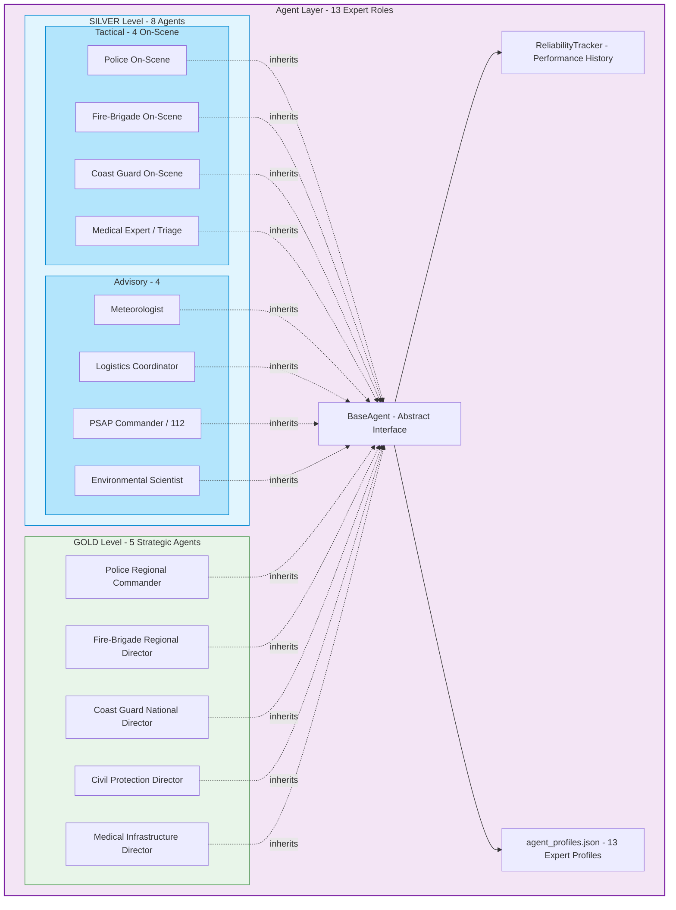
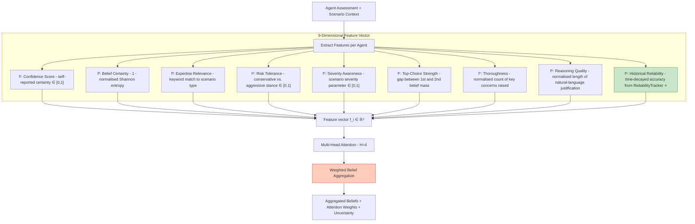
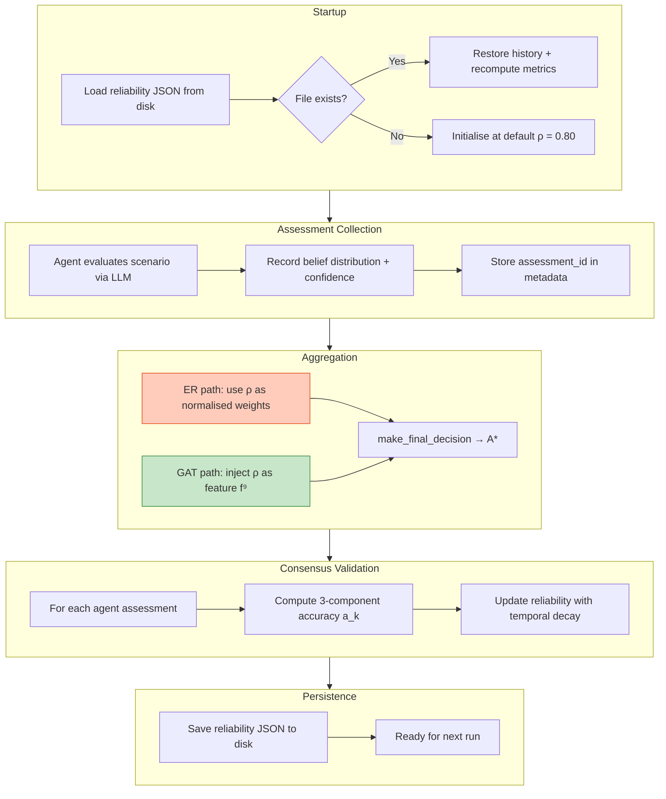
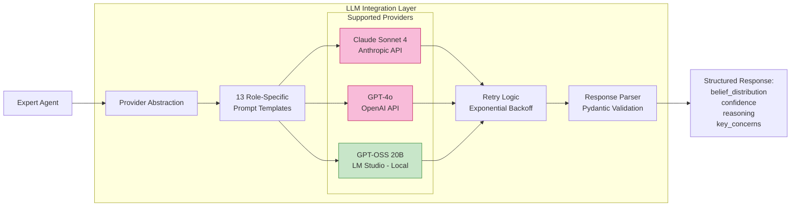
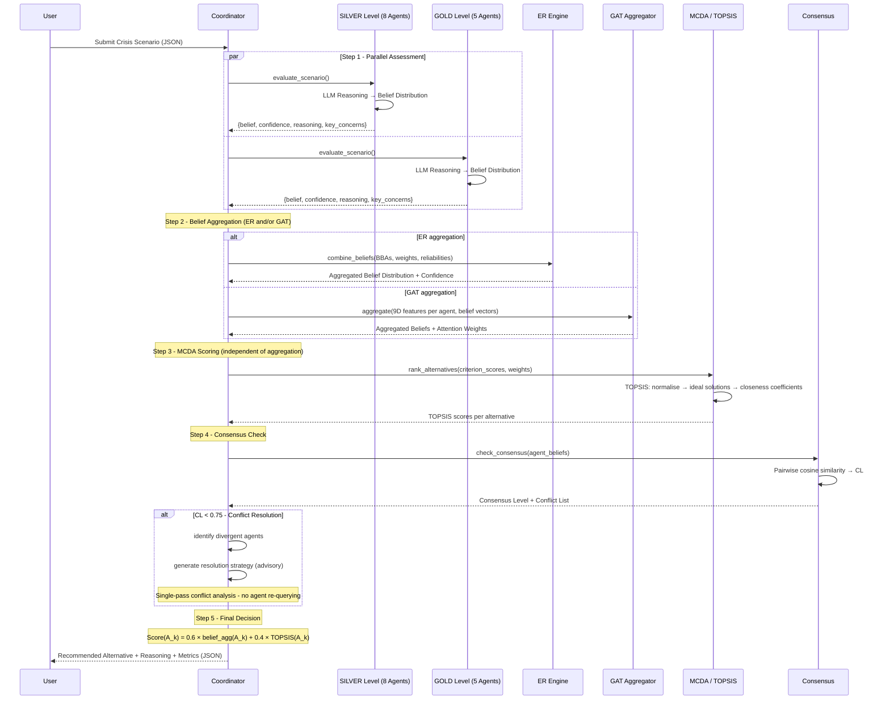

# A Collaborative Multi-Agent Framework for Crisis Management Decision Support Using Evidential Reasoning and Graph Attention Networks

**Vasileios Kazoukas**
*Military Academy (SSE), Department of Military Sciences*
*Technical University of Crete (TUC), School of Production Engineering and Management*
Email: vkazoukas@tuc.gr, kazoukas@gmail.com

---

## Abstract

Effective crisis management requires the rapid coordination of expert judgements across multiple disciplines under conditions of severe uncertainty, time pressure, and incomplete information. This paper presents AEGIS (Adaptive Expert-based Group Intelligence System), a multi-agent decision support framework in which 13 specialised agents, modelled on emergency response roles spanning the GOLD strategic and SILVER tactical command levels, generate structured assessments using Large Language Models (LLMs) and aggregate them through two complementary mechanisms: classical Evidential Reasoning (ER) grounded in Dempster-Shafer theory, and a domain-parameterised graph attention aggregator that applies interpretable, rule-based attention weights over a 9-dimensional agent-feature representation. The latter constitutes an untrained GAT variant, deliberately chosen for full auditability in the absence of labelled crisis-decision training data. A TOPSIS-based multi-criteria ranking procedure and a historical reliability tracker that adjusts agent influence over successive decisions complete the pipeline.

The system is evaluated on three crisis scenarios inspired by recent Greek emergencies: the Karditsa flash flooding of September 2023, the North Evia wildfires of August 2021, and an industrial ammonia release at the Elefsina petrochemical zone. Across 45 controlled runs - five replicates for each of three LLM providers (Anthropic Claude Sonnet 4, OpenAI GPT-4o, and GPT-OSS 20B deployed locally via LM Studio) across all three scenarios - both aggregation paths produce statistically equivalent decision quality (ER DQS: 0.775 ± 0.032; GAT DQS: 0.781 ± 0.029; p > 0.05), with an 88.9 % recommendation agreement rate (40/45 runs) and a mean system consensus of 0.902 ± 0.068. All three providers converge on the dominant recommended alternative for every HAZMAT run and every Flood run; the five ER-GAT disagreements arise exclusively in the most ambiguous scenario (Forest Fire, 12-alternative action space). Collective multi-agent recommendations outperform the best individual agent by margins of +5.4 pp (HAZMAT), +5.6 pp (Flood), and +11.0 pp (Forest Fire), confirming that the value of structured aggregation scales with decision-space complexity. In a preliminary domain expert evaluation, explainability and auditability received ratings of 4.2/5 and 4.5/5 respectively, encouraging for operational contexts where accountability is non-negotiable.

**Keywords:** Multi-Agent Systems; Crisis Management; Evidential Reasoning; Dempster-Shafer Theory; Graph Attention Networks; Large Language Models; Group Decision Making; Multi-Criteria Decision Analysis; TOPSIS; Decision Support Systems; Emergency Management; Explainability

---

## 1. Introduction

### 1.1 Motivation and Problem Context

Large-scale emergencies confront decision-makers with a constellation of challenges that are qualitatively distinct from those of routine management: incomplete and rapidly changing information, strict time windows, simultaneous demands across heterogeneous domains - medical, logistical, meteorological, environmental, law-enforcement - and the weight of knowing that delayed or poorly calibrated decisions have immediate consequences for human life [1]. The coordination failures documented in major disasters, from Hurricane Katrina to the 2021 European floods, consistently trace back not to the absence of capable individuals but to the absence of mechanisms for integrating their expertise in real time [2].

Traditional crisis management relies on command structures that are hierarchical by design, drawing on trained professionals who apply established protocols under human supervision. These structures have proven resilient over decades of practice. Yet they exhibit well-documented cognitive limits when the scale of a crisis simultaneously overloads multiple agencies: experts operating under time pressure tend to anchor on the first acceptable solution rather than systematically examining the alternative space [3]; group deliberation under stress can suppress dissenting specialist views in favour of rapid convergence [4]; and the sheer volume of incoming information - sensor feeds, field reports, media, social networks - exceeds the bandwidth of any unaided human team.

Computational support has a long history in emergency management, from early expert systems and simulation tools to modern geographic information systems and sensor fusion platforms. Multi-agent systems (MAS) offer a complementary capability: autonomous software agents, each embodying a distinct area of expertise, that can deliberate in parallel and pool their assessments through formal aggregation mechanisms [5]. When those agents are powered by Large Language Models, they gain the ability to produce not only numerical outputs but also natural-language reasoning traces that a human decision-maker can inspect, interrogate, and override.

Despite considerable research activity, several gaps persist in the intersection of MAS and crisis decision support. Most existing frameworks rely on a single aggregation strategy - typically a voting scheme or a weighted average - without examining whether alternative mechanisms produce materially different outcomes. Agent credibility is commonly treated as fixed rather than updated from observed performance. Transparency requirements, which are paramount in safety-critical domains, have received limited systematic treatment. And the potential of current-generation LLMs as domain-reasoning engines for specialised agents remains largely unexplored in the crisis management literature.

### 1.2 Research Questions

This paper addresses five interrelated research questions that together characterise the design space of LLM-powered multi-agent crisis decision support:

**RQ1** - How effectively can a hierarchical multi-agent architecture coordinate domain-specialised agents to produce timely, coherent crisis management recommendations?

**RQ2** - How do weighted Evidential Reasoning (ER) and graph attention-based aggregation (GAT) compare as mechanisms for aggregating expert beliefs under uncertainty?

**RQ3** - What does LLM-powered reasoning contribute to agent assessment quality and system-level decision coherence?

**RQ4** - Does collective multi-agent judgement measurably outperform the best individual expert agent?

**RQ5** - Can the system produce decision audit trails that satisfy the transparency and accountability requirements of operational crisis management?

### 1.3 Contributions

This paper makes five concrete contributions:

1. **AEGIS system design.** A complete, open-source multi-agent decision support system for crisis management that integrates 13 specialised agents organised in a two-level command hierarchy (GOLD/SILVER), two competing belief-aggregation mechanisms (ER and GAT), a TOPSIS-based MCDA ranker, and a historical reliability tracker, with multi-provider LLM support and automatic fallback.

2. **Controlled aggregation comparison.** A direct, methodologically rigorous comparison of weighted Evidential Reasoning and a domain-parameterised graph attention aggregator operating on identical agent assessments across 45 runs and three scenario types - providing the first controlled ER-vs-GAT comparison in the crisis management domain.

3. **Multi-provider LLM evaluation.** Systematic performance characterisation of three LLM providers (Claude Sonnet 4, GPT-4o, GPT-OSS 20B) across speed, decision quality, consistency, and data-sovereignty trade-offs, demonstrating that competitive decision quality is achievable with locally deployed open-source models.

4. **Historical reliability tracking.** An online reliability tracker that updates per-agent influence weights after each decision using a consensus-based proxy, demonstrating measurable differentiation (reliability scores spanning 0.43-0.68 across 1,133 agent records) and structural integration into both aggregation paths.

5. **Empirical collective-vs-individual analysis.** Quantitative evidence that the collective system recommendation outperforms the best individual agent on all three scenario types, with the largest advantage (+11.0 pp) arising precisely in the most complex multi-alternative action space.

### 1.4 Paper Organisation

The remainder of this paper is structured as follows. Section 2 reviews the background literature spanning Group Decision Making, multi-agent systems, Dempster-Shafer theory, graph attention networks, LLMs, and MCDA. Section 3 describes the AEGIS architecture and methodology in full detail. Section 4 presents the experimental setup and results. Section 5 discusses the findings with respect to the five research questions, derives practical guidance, and acknowledges limitations. Section 6 concludes with directions for future work.

---

## 2. Background and Literature Review

### 2.1 Group Decision Making under Uncertainty

Group Decision Making (GDM) is concerned with how a set of decision-makers (DMs) with different expertise, preferences, and risk tolerances collectively reaches a defensible judgement on complex problems [6]. Classical results establish that, when aggregation is properly structured, groups systematically outperform their best individual member - a finding attributed to diversity of perspective, error cancellation across independent assessments, and the suppression of individual anchoring bias [7].

Central to GDM is the Consensus Reaching Process (CRP), an iterative procedure in which individual evaluations are compared against a collective position, participants who deviate substantially are invited to reconsider, and the cycle continues until a pre-specified consensus threshold is exceeded [8]. The CRP literature has grown rapidly in recent years, with attention turning to large-scale settings (LSGDM) involving hundreds of participants [9], to the incorporation of social network structures that model inter-DM trust [10], and to dynamic weighting schemes that account for each participant's prior performance and willingness to adjust [11].

In the crisis management context, GDM faces additional pressures absent from conventional business or policy applications. As Kapucu and Garayev [2] document, the multi-organisational structure of emergency response, with agencies operating under different command lines and information channels, renders traditional face-to-face CRP infeasible under time pressure. Klein's analysis of naturalistic decision-making [3] further highlights that experts operating under stress adopt recognition-primed strategies - matching the current situation to a familiar template and committing to the first acceptable course of action - rather than exploring the full alternative space. Computational support that systematically aggregates multiple domain perspectives, while preserving the speed demanded by operational timelines, addresses precisely this gap.

### 2.2 Multi-Agent Systems in Emergency Management

The foundational properties of autonomous agents - reactivity to environmental changes, proactive goal-directed behaviour, and social ability to interact with other agents - were systematically characterised by Wooldridge [5]. Multi-agent systems apply these properties to distributed, large-scale problems that exceed the reach of monolithic solvers.

In emergency management, agent-based models have been applied to evacuation dynamics [12], resource dispatch optimisation [13], and inter-agency information sharing [14]. The architectural choices in these systems vary considerably: reactive architectures based on condition-action rules offer speed but lack deliberative depth; deliberative architectures grounded in the Belief-Desire-Intention (BDI) model [15] support explicit reasoning but impose computational overhead; and hybrid architectures balance both. AEGIS adopts a deliberative-hybrid design in which the internal reasoning of each agent is performed by an LLM - effectively endowing it with a generative BDI capability - while the outer coordination is handled by a dedicated Coordinator agent.

The application of LLMs as agent reasoning engines is a recent and rapidly developing research direction. Li et al. [16] survey the emerging landscape of LLM-based multi-agent systems, highlighting their capacity for natural-language coordination, structured output generation, and context-sensitive role adoption. Goecks and Waytowich [17] explore their integration into emergency management workflows, while Otal and Canbaz [18] investigate prompt-engineering strategies for disaster-response reasoning. AEGIS builds on this foundation by embedding structured Chain-of-Thought (CoT) prompting [19] in role-specific templates for each of the 13 agent profiles, ensuring that reasoning traces are both domain-grounded and machine-parseable.

### 2.3 Dempster-Shafer Theory and Evidential Reasoning

Classical probability theory requires all uncertainty to be expressed as a probability distribution over mutually exclusive hypotheses, leaving no room for explicit ignorance. Shafer's Mathematical Theory of Evidence [20] relaxes this constraint by permitting belief mass to be assigned to *sets* of hypotheses - a power set representation that enables the formal distinction between "I believe A is likely" and "I have no evidence either way". This is particularly valuable in crisis management, where an agent may be certain that immediate action is required without being able to specify which action is optimal.

The basic belief assignment (BBA) function $m: 2^\Theta \to [0,1]$ satisfies $m(\emptyset) = 0$ and $\sum_{A \subseteq \Theta} m(A) = 1$. From any BBA, one derives belief ($Bel(A) = \sum_{B \subseteq A} m(B)$) and plausibility ($Pl(A) = \sum_{B \cap A \neq \emptyset} m(B)$) measures that bracket the true probability of hypothesis $A$. The uncertainty interval $[Bel(A), Pl(A)]$ widens precisely when evidence is sparse or conflicting.

The Dempster combination rule fuses two independent BBAs $m_1$ and $m_2$:

$$m_{12}(A) = \frac{1}{1-K} \sum_{B \cap C = A} m_1(B) \cdot m_2(C), \quad K = \sum_{B \cap C = \emptyset} m_1(B) \cdot m_2(C)$$

where $K$ measures inter-source conflict. As Zadeh [21] famously demonstrated, naive application of this rule can produce counter-intuitive results when $K$ is large. Yang and Xu [22] address this through the Evidential Reasoning (ER) rule, which extends the BBA representation with explicit weight ($w_i$) and reliability ($r_i$) parameters per source, implementing proportional redistribution of conflicting belief mass rather than simple normalisation. This extension forms the theoretical basis of the ER engine implemented in AEGIS.

### 2.4 Graph Attention Networks and Dynamic Weighting

Graph Convolutional Networks (GCNs) [23] extended convolutional neural networks to graph-structured data, but apply uniform neighbour aggregation. Graph Attention Networks (GATs), introduced by Veličković et al. [24], add a learnable attention mechanism that assigns different weights to different neighbours:

$$e_{ij} = a(\mathbf{W}\mathbf{h}_i \| \mathbf{W}\mathbf{h}_j)$$

$$\alpha_{ij} = \text{softmax}_j\!\left(\text{LeakyReLU}(e_{ij})\right)$$

where $\mathbf{W}$ is a shared linear projection and $a$ is a single-layer feed-forward network. Multi-head attention (MHA) with $K$ parallel heads provides stability and allows the network to capture different relational aspects simultaneously [25].

In the GDM literature, Zhou et al. [10] applied GAT-style attention to model social trust networks in large-scale emergency decision making, demonstrating that the attention mechanism discovers invisible correlations between decision-makers beyond those captured by explicit adjacency matrices. Carneiro et al. [26] note that in dispersed GDM contexts, the ability to modulate aggregation weights continuously - rather than via binary acceptance or rejection - is critical for managing divergent expert opinions.

AEGIS repurposes this architecture for an expert-agent graph in which nodes are agents and edges carry attention coefficients representing inter-agent relevance. A key design choice distinguishes the AEGIS GAT from learned variants: because labelled crisis-decision histories are unavailable at system initialisation, all attention parameters are set by domain-knowledge rules rather than gradient descent. This untrained, rule-based GAT preserves full interpretability from the first operational run - a requirement in safety-critical settings - while still exploiting the graph-structured relational representation.

### 2.5 Large Language Models for Domain Reasoning

The Transformer architecture [25] and the pre-training paradigm it enabled have produced a generation of language models capable of performing complex reasoning tasks with no task-specific fine-tuning, given appropriate prompts. Brown et al. [27] demonstrated that few-shot prompting of large models substantially outperforms zero-shot baselines, while Wei et al. [19] showed that Chain-of-Thought prompting - eliciting intermediate reasoning steps before a final answer - further improves performance on multi-step problems, including those requiring domain knowledge.

In AEGIS, each expert agent's LLM call is preceded by a structured prompt (~5,000 characters) that encodes: (a) the agent's professional identity and seniority; (b) the relevant emergency protocols for the current scenario type; (c) the available response alternatives; (d) the required output schema (a JSON object containing `alternative_rankings`, `confidence`, `reasoning`, and `key_concerns`). This structured prompting approach transforms the LLM from a general-purpose generator into a simulated domain expert whose outputs are directly parseable by the aggregation layer.

Data sovereignty and regulatory compliance are first-order considerations for public-safety applications. The EU General Data Protection Regulation (GDPR) restricts cross-border transmission of personal data associated with emergency incidents. AEGIS therefore includes a fully on-premise deployment path using locally hosted open-source models (GPT-OSS 20B via LM Studio), enabling GDPR compliance while maintaining competitive decision quality, as the results in Section 4 demonstrate.

### 2.6 Multi-Criteria Decision Analysis

Following belief aggregation, the system must rank response alternatives across multiple incommensurable criteria - safety, effectiveness, cost, response speed, and social acceptability. The Technique for Order Preference by Similarity to Ideal Solution (TOPSIS), introduced by Hwang and Yoon [28], ranks alternatives by their geometric closeness to an ideal-positive solution and distance from an ideal-negative solution in normalised criterion space.

Given a decision matrix $X = [x_{ij}]$ with $m$ alternatives and $n$ criteria, the TOPSIS procedure normalises the matrix via $r_{ij} = x_{ij}/\sqrt{\sum_k x_{kj}^2}$, applies criterion weights $w_j$ to obtain the weighted matrix $v_{ij} = w_j r_{ij}$, identifies the positive-ideal $A^+ = \{v_j^+\}$ and negative-ideal $A^- = \{v_j^-\}$ solutions, computes Euclidean distances $S_i^+ = \sqrt{\sum_j (v_{ij} - v_j^+)^2}$ and $S_i^-$ accordingly, and ranks by the closeness coefficient $C_i = S_i^-/(S_i^+ + S_i^-)$. Behzadian et al. [29] provide a comprehensive survey of TOPSIS applications across many domains. AEGIS employs TOPSIS as its primary ranker, with WSM and SAW as secondary cross-checks; consistent agreement across all three methods signals high ranking confidence.

---

## 3. Methodology: The AEGIS Framework

### 3.1 System Architecture Overview

AEGIS is organised into six functional layers, each with clearly demarcated responsibilities and standardised inter-layer interfaces. This modular design ensures that any individual component - a specific LLM provider, an aggregation algorithm, or a visualisation module - can be replaced or upgraded independently without disrupting the rest of the system.

```mermaid
flowchart TD
    subgraph UI["User Interface Layer"]
        direction LR
        CLI[Command Line Interface]
        JSON_IN[JSON Input Scenarios]
        JSON_OUT[JSON Output Results]
        VIZ[Visualization Generator]
    end

    subgraph Coord["Coordination Layer"]
        direction LR
        COORD[CoordinatorAgent]
        ORCH[Orchestration Logic]
        CONS_BUILD[Consensus Builder]
    end

    subgraph Agents["Agent Layer - 13 Expert Roles"]
        direction LR
        BA[BaseAgent]
        subgraph Silver["SILVER Level - 8 Agents"]
            direction LR
            subgraph SilverTactical["Tactical - 4"]
                T1[Police On-Scene] --- T2[Fire On-Scene] --- T3[Coast Guard On-Scene] --- T4[Medical Expert]
            end
            subgraph SilverAdvisory["Advisory - 4"]
                A1[Meteorologist] --- A2[Logistics] --- A3[PSAP Commander] --- A4[Environmental Scientist]
            end
        end
        subgraph Gold["GOLD Level - 5 Agents"]
            G1[Police Regional] --- G2[Fire Regional] --- G3[Coast Guard National] --- G4[Civil Protection Director] --- G5[Medical Infrastructure]
        end
        RT[ReliabilityTracker]
    end

    subgraph LLM["LLM Integration Layer"]
        direction LR
        CLAUDE[Claude Sonnet 4]
        OPENAI[GPT-4o]
        LMSTUDIO[GPT-OSS 20B / LM Studio]
        PROMPTS[13 Role-Specific Templates]
    end

    subgraph DF["Decision Framework Layer"]
        direction LR
        ER[Evidential Reasoning]
        GAT[GAT Aggregator]
        CONSENSUS[Consensus Model]
        MCDA[MCDA - TOPSIS]
    end

    subgraph Eval["Evaluation & Utilities Layer"]
        direction LR
        METRICS[Metrics Calculator]
        VIS[Visualizations]
        VALID[Validation]
    end

    UI -->|Load Scenario| Coord
    Coord -->|Dispatch Tasks| Agents
    Agents <-->|LLM Requests / Responses| LLM
    Agents -->|Expert Assessments| DF
    DF -->|Aggregated Decision| Coord
    Coord -->|Final Decision| Eval
    Eval -->|Results & Metrics| UI

    style UI fill:#e3f2fd,stroke:#1565c0,stroke-width:2px
    style Coord fill:#fff3e0,stroke:#ef6c00,stroke-width:2px
    style Agents fill:#f3e5f5,stroke:#7b1fa2,stroke-width:2px
    style Silver fill:#e1f5fe,stroke:#0288d1,stroke-width:1px
    style Gold fill:#e8f5e9,stroke:#388e3c,stroke-width:1px
    style LLM fill:#fce4ec,stroke:#c2185b,stroke-width:2px
    style DF fill:#e8f5e9,stroke:#2e7d32,stroke-width:2px
    style Eval fill:#fffde7,stroke:#f9a825,stroke-width:2px
```

*Fig. 1. Six-layer AEGIS architecture and data flow. Numbered inter-layer arrows indicate the processing sequence for a single crisis scenario execution.*

The interface layer accepts scenario descriptions in JSON format and returns structured decision reports. The coordination layer, built around a dedicated Coordinator agent, orchestrates the entire deliberation pipeline: it distributes the scenario to the active expert panel, collects their assessments in parallel, invokes the chosen aggregation mechanism, checks consensus, and triggers conflict resolution when the consensus level falls below the operational threshold of 0.75. The agent layer houses the 13 expert agents and their associated reliability records. The LLM integration layer manages requests to the three supported providers with automatic exponential-backoff retry and provider fallback. The decision framework layer implements the two aggregation mechanisms (ER and GAT), the MCDA ranker, and the consensus model. The evaluation layer computes performance metrics and generates visualisations.

### 3.2 Agent Hierarchy

The 13 expert agents are organised in a two-level command hierarchy inspired by the Gold-Silver-Bronze incident command structure used in UK and European emergency management, simplified to two levels for the current prototype.

*Fig. 2. AEGIS agent hierarchy. SILVER agents handle tactical and advisory functions at or near the incident scene; GOLD agents manage strategic coordination at regional or national scale.*

The SILVER level comprises eight agents across two functional categories. Four *tactical* agents - Police On-Scene, Fire-Brigade On-Scene, Coast Guard On-Scene, and Medical Expert - represent agencies with direct operational presence at the incident site and focus on immediate resource deployment, triage, scene security, and life-safety. Four *advisory* agents - Meteorologist, Logistics Coordinator, PSAP Commander, and Environmental Scientist - supply specialised knowledge to all command levels without directly supervising field forces; notably, the PSAP Commander models the national 112 emergency coordination function, including citizen alert systems. The GOLD level comprises five *strategic* agents - Police Regional, Fire Regional, Coast Guard National, Civil Protection Director, and Medical Infrastructure Director - responsible for multi-jurisdictional coordination, inter-agency resource allocation, and national-level policy decisions.

Each agent is defined by a structured profile in `agent_profiles.json` that encodes agent identifier, command level, domain expertise, years of experience, risk tolerance, and a vector of criterion weights over the five MCDA dimensions (effectiveness, safety, speed, cost, public acceptance). These profile weights allow each agent's TOPSIS evaluation to reflect genuine disciplinary priorities: the Medical Expert weights safety and effectiveness most heavily, the Logistics Coordinator distributes weight more evenly across effectiveness, speed, and cost, while the Civil Protection Director balances all five criteria with a slight emphasis on public acceptance. The system supports two agent-selection modes: *manual*, in which the user specifies which agents participate, and *auto-selection*, in which a rule-based scoring system evaluates all 13 agents against 11 scenario-characterisation criteria and selects the most relevant subset (minimum 3, maximum 13).

### 3.3 Evidential Reasoning Engine

The ER engine implements iterative pairwise combination of Dempster-Shafer BBAs. Agents are sorted in descending order of historical reliability and combined sequentially. Let $m_1$ and $m_2$ denote the BBAs of two agents restricted to singleton focal elements (a simplification that reduces computational complexity from $O(2^n)$ to $O(n)$ while enabling real-time operation). The combined mass for alternative $A$ is:

$$m_{12}(A) = \frac{1}{1-K} \sum_{B \cap C = A} m_1(B) \cdot m_2(C)$$

$$K = \sum_{B \cap C = \emptyset} m_1(B) \cdot m_2(C)$$

When the conflict index $K > 0.7$, the engine activates proportional redistribution rather than simple Dempster normalisation:

$$m_{\text{conflict-adj}}(A) = m(A) + K \cdot \frac{w_i r_i m_i(A)}{\sum_j w_j r_j m_j(A)}$$

This prevents the counter-intuitive behaviour documented by Zadeh [21] under high inter-source conflict while preserving the proportionality of the original agent beliefs.

Agent-level reliability $r_i \in [0,1]$ enters the combination as an effective mass multiplier: the belief submitted by agent $i$ for combination is scaled by $r_i$ before the Dempster rule is applied, so that a highly reliable agent ($r_i = 0.90$) contributes 80 % more effective belief mass than a marginal one ($r_i = 0.50$). Agent weights $w_i$ are set statically from the agent profile's domain-relevance alignment with the scenario criteria, and remain fixed within a run; reliability is updated dynamically across runs. This design separation ensures full reproducibility within a single scenario while enabling adaptation across scenarios.

### 3.4 Graph Attention Network Aggregator (Untrained, Rule-Based Variant)

The GAT aggregator constructs a fully connected graph in which each of the $N$ active agents is a node. Rather than learning attention parameters from data - which would require a labelled decision history unavailable at system initialisation - the attention coefficients are computed from a hand-crafted scoring function grounded in the GDM-under-uncertainty literature. This *untrained GAT with rule-based attention* preserves interpretability from the very first run.

**Feature extraction.** Every agent node is represented by a 9-dimensional feature vector $\mathbf{f}_i \in \mathbb{R}^9$:

*Fig. 3. AEGIS GAT feature extraction pipeline. The ninth dimension (Historical Reliability, highlighted) links the attention mechanism directly to the ReliabilityTracker, enabling data-informed weighting without a labelled training set.*

**Attention computation.** The raw attention score from agent $j$ toward agent $i$ is:

$$e_{ij} = 0.4 \cdot f_j^{(1)} + 0.3 \cdot f_j^{(3)} + 0.3 \cdot f_j^{(2)} + 0.2 \cdot \max(\cos(\mathbf{f}_i, \mathbf{f}_j), 0)$$

where the cosine similarity term rewards agents whose full feature profiles are aligned, capturing implicit peer consistency. LeakyReLU non-linearity (negative slope $\alpha = 0.2$) is applied before softmax normalisation:

$$\alpha_{ij} = \frac{\exp(\text{LeakyReLU}(e_{ij}))}{\sum_{k \in \mathcal{N}_i} \exp(\text{LeakyReLU}(e_{ik}))}$$

**Multi-head aggregation.** Four parallel attention heads compute independent coefficient sets; their mean constitutes the final attention weight $\bar{\alpha}_{ij} = \frac{1}{4}\sum_{h=1}^4 \alpha_{ij}^h$. For each response alternative $A_k$, the aggregated belief is:

$$m_{\text{agg}}(A_k) = \frac{\sum_{i=1}^N \bar{\alpha}_{ii} \cdot m_i(A_k)}{\sum_{i=1}^N \bar{\alpha}_{ii}}$$

where the self-attention coefficient $\bar{\alpha}_{ii}$ serves as each agent's overall influence weight. The aggregated distribution is normalised to sum to unity, and its Shannon entropy provides an uncertainty measure that is passed to the coordination layer.

### 3.5 MCDA Integration and Decision Scoring

Following belief aggregation by either ER or GAT, the decision framework scores alternatives through TOPSIS. The input is a decision matrix $D = [x_{ij}]$ in which rows are alternatives and columns are four evaluation criteria: safety (benefit, weight 0.30), cost (cost criterion, 0.25), response time (cost criterion, 0.25), and social acceptance (benefit, 0.20), consistent with the operational `criteria_weights.json` configuration used in all experiments. Benefit criteria are maximised toward the positive ideal; cost criteria are minimised toward the negative ideal, so the TOPSIS normalisation step handles the directional asymmetry between, for example, safety scores and response-time values in hours. These weights reflect the life-safety priority characteristic of the three Greek scenarios studied.

The final score for each alternative combines the aggregated agent belief and the TOPSIS closeness coefficient with a fixed 60/40 weighting:

$$\text{Score}(A_k) = 0.6 \times m_{\text{agg}}(A_k) + 0.4 \times C_k^{\text{TOPSIS}}$$

The 60/40 split reflects the design philosophy that domain expert judgement - captured in the belief distributions - should dominate, while the objective criterion scoring provides a structural check against purely sentiment-driven consensus.

**What TOPSIS contributes beyond belief aggregation.** Running TOPSIS independently of the belief aggregation step provides two distinct analytical benefits that pure belief combination cannot replicate. First, it correctly handles the directional asymmetry between benefit and cost criteria: safety and social acceptance are drawn toward the positive ideal solution $A^+$, while cost (euros) and response time (hours) are simultaneously drawn away from the negative ideal solution $A^-$. A simple weighted average of agent beliefs contains no mechanism to encode this directionality. Second, TOPSIS reveals cases where collective expert preference and objective criterion optimisation diverge -- the most informative decision points in the output, since they signal trade-offs a decision-maker must consciously accept rather than resolve automatically. In the Elefsina HAZMAT trace (Section 4.6), for example, downwind evacuation achieves the highest TOPSIS closeness coefficient ($C_i = 0.806$) due to its exceptional safety score, but the aggregated agent beliefs strongly favour the integrated multi-layer response (combined score 0.574 vs. 0.459 for evacuation). The 60/40 combination preserves this tension visibly in the output rather than collapsing it, and the accompanying audit trail exposes the specific criterion scores that drive the divergence -- precisely the kind of structured transparency required in safety-critical operational contexts.

Consensus level is computed as the mean pairwise cosine similarity of agent belief vectors:

$$CL = \frac{2}{N(N-1)} \sum_{i < j} \cos(\mathbf{m}_i, \mathbf{m}_j)$$

When $CL < 0.75$, the system flags the decision as insufficiently agreed and triggers a single-pass conflict-analysis step (`resolve_conflicts`) that identifies the most divergent agents, characterises the nature of the disagreement, and returns a structured resolution strategy (suggested compromise alternatives and rationale) to the coordinator. In the current implementation this is advisory: the coordinator receives the conflict report and proceeds to final scoring without re-querying agents; iterative re-evaluation is identified as a future extension.

### 3.6 Historical Reliability Tracking

The reliability tracker maintains a per-agent performance history that is updated after every scenario run and persisted to disk. Because ground truth is unavailable in the simulation setting, a consensus-based proxy is used: the system's own final recommendation is treated as the reference outcome for the current run, and each agent's assessment is scored against it using a three-component accuracy measure:

$$a_k = 0.4 \cdot m_i(A^*) + 0.3 \cdot \mathbf{1}[\text{top}(m_i) = A^*] + 0.3 \cdot \text{margin}(m_i, A^*)$$

where $A^*$ is the recommended alternative, $m_i(A^*)$ is the belief mass agent $i$ assigned to it, $\mathbf{1}[\cdot]$ is the indicator of whether $A^*$ was the agent's top choice, and $\text{margin}$ rewards confident correct predictions while penalising confident incorrect ones.

Reliability is computed as a temporally decayed, confidence-weighted moving average:

$$\rho_j = \frac{\sum_k \gamma^{d_k} (0.5 + 0.5 c_k) \cdot a_k}{\sum_k \gamma^{d_k} (0.5 + 0.5 c_k)}$$

with decay factor $\gamma = 0.95$ and $d_k$ the age of assessment $k$ in days. For new agents, the default reliability is $\rho_j = 0.80$.

*Fig. 4. ReliabilityTracker lifecycle. The tracker is initialised from disk, feeds agent reliability into both aggregation paths through different mechanisms, is updated using the consensus outcome as a proxy ground truth, and is persisted after every run.*

### 3.7 LLM Integration and Prompt Engineering

Each expert agent issues a single LLM call per scenario evaluation. The call is structured around a role-specific prompt template (~5,000 characters) that encodes: (a) a first-person professional identity declaration ("You are a Senior Meteorologist with 15+ years of experience in severe weather forecasting for Greece and the Eastern Mediterranean"); (b) an urgency framing that primes analytical mode ("ACTIVE CRISIS - Expert assessment required urgently"); (c) a scenario description in structured JSON; (d) the list of response alternatives; (e) a Chain-of-Thought instruction that requires the agent to reason through the scenario before committing to a ranking; and (f) a required output schema specifying the JSON keys `alternative_rankings`, `confidence`, `reasoning`, and `key_concerns`.

*Fig. 5. LLM integration layer. Three providers are supported behind a common abstraction interface; Pydantic validation enforces response schema compliance; exponential backoff with three retries handles transient API failures.*

**Hallucination mitigation and response validation.** LLMs are probabilistic and may produce outputs that omit required fields, assign belief masses that do not sum to unity, embed JSON inside markdown fences, or report confidence values outside $[0, 1]$. AEGIS addresses these failure modes through a three-layer defence implemented in `expert_agent.py`:

*Layer 1 -- JSON extraction.* A cleaning step strips markdown fences, preamble prose, and trailing commentary before isolating the JSON object. This step is especially important for GPT-OSS 20B, which emits explanatory text around the structured response more frequently than the cloud providers.

*Layer 2 -- Structural validation* (`_validate_llm_response`). The extracted object is checked for the four required keys: `alternative_rankings`, `reasoning`, `confidence`, and `key_concerns`. Missing optional keys (reasoning, key_concerns) log a warning and allow degraded operation; a missing or malformed `alternative_rankings` dict raises a `ValueError` and triggers a retry. Confidence values outside $[0, 1]$ are replaced with the neutral default 0.5.

*Layer 3 -- Pydantic enforcement.* The validated response is passed to `BeliefDistribution` and `AgentAssessment` Pydantic models, which enforce field types and value ranges at construction time; rankings are normalised to sum to unity at this stage. A fallback assessment (uniform belief, zero confidence, full participation weight penalty) is created if all upstream steps exhaust the retry budget, ensuring the coordinator always receives a structurally valid response.

Retry logic uses exponential backoff with delays of 2 s, 4 s, and 8 s (3 attempts for Claude and LM Studio; 6 attempts for OpenAI to absorb burst rate limits, with jitter to prevent thundering-herd retries when 12 agents fail simultaneously). An important architectural distinction: the three-layer pipeline catches *structural* hallucinations (wrong format, out-of-range values, missing keys) reliably, but cannot detect *semantic* hallucinations -- cases where an LLM produces well-formed JSON with plausible domain vocabulary but factually incorrect crisis management reasoning. Mitigation of semantic hallucinations requires the diversity mechanism inherent in multi-agent aggregation: if a single agent hallucinates a spurious preference, it is overridden by the remaining 11 agents whose consensus drives the aggregated belief distribution. All three providers achieved 100 % structural parse success in the 540-call experimental corpus after the cleaning step.

### 3.8 End-to-End Decision Pipeline

Figure 6 shows the complete multi-agent decision pipeline from scenario submission to final recommendation.

*Fig. 6. End-to-end AEGIS decision pipeline. Steps 1-5 are shown for a single run; ER and GAT are mutually exclusive by default but can be executed concurrently in `--compare-methods` mode.*

### 3.9 Expert Selection Mechanism

The auto-selection system evaluates all 13 agents against 11 scenario-characterisation criteria drawn from the scenario JSON metadata: crisis type (weight +3), crisis subtype (+2), affected domain (+2), severity (+1), geographic scope (+2), location characteristics (+2), command-level requirements (+2), multi-jurisdictional flag (+1), infrastructure type (+2), population scale (+1), and time constraint (+1). Agents exceeding a zero score are included; the three core agents (Meteorologist, Logistics Coordinator, Medical Expert) are always included as a minimum panel. The final selection is bounded to [3, 13] agents by adding or trimming as needed. This scoring mechanism ensures that the active panel is tailored to each scenario's domain profile without manual configuration.

---

## 4. Results and Analysis

### 4.1 Experimental Setup

**Scenarios.** Three crisis scenarios were designed based on recent Greek emergencies (Table I). The Karditsa Flood scenario (severity 0.80, 15,000 affected population, 5 response alternatives, 4-hour decision window) is modelled on the September 2023 Thessaly flooding during Storm Daniel. The Evia Wildfire scenario (severity 0.90, 8,000 affected population, 12 response alternatives, immediate decision window) is modelled on the August 2021 North Evia fires. The Elefsina HAZMAT scenario (severity 0.85, 12,000 affected population, 5 response alternatives, 30-minute decision window) represents an industrial ammonia release in the Thriasio Plain petrochemical zone.

**TABLE I: Crisis Scenario Parameters**

| Parameter | Karditsa Flood | Evia Wildfire | Elefsina HAZMAT |
|-----------|:--------------:|:-------------:|:---------------:|
| Severity | 0.80 (High) | 0.90 (Very High) | 0.85 (Very High) |
| Affected population | 15,000 | 8,000 | 12,000 |
| Decision window | 4 hours | Immediate | 30 minutes |
| Response alternatives | 5 | 12 | 5 |
| Active agents | 12 | 12 | 12 |
| Criteria (all scenarios) | safety 0.30, cost 0.25, response time 0.25, social acceptance 0.20 | — | — |
| Dominant response | Hybrid approach | Combined assault | Integrated response |

**Experimental configuration.** Each scenario was run 5 times per LLM provider (15 runs per scenario, 45 total). Every run executed both ER and GAT aggregation concurrently using the `--compare-methods` flag, ensuring that both mechanisms operated on identical agent assessments and that aggregation effects were fully isolated from LLM-provider variance. Each run involved 12 active agents (auto-selection excluded one peripherally relevant agent per scenario) with 1 LLM call per agent, totalling 12 API calls per run and 540 calls across the full experiment. Because both ER and GAT paths consume the same cached assessments, running both methods concurrently incurs no additional LLM cost. Results were stored as structured JSON in the repository at `results/{scenario}/{run_id}/er/results.json` and `results/{scenario}/{run_id}/gat/results.json`.

**Metrics.** Four primary metrics are reported. The *Decision Quality Score* (DQS) is the weighted criterion-satisfaction value produced by the TOPSIS ranker for the recommended alternative. *Consensus Level* (CL) is the mean pairwise cosine similarity of agent belief vectors before aggregation. *Decision Confidence* (DC) blends consensus and mean agent confidence as $DC = 0.6 \times CL + 0.4 \times \bar{c}$. The *Extended Comparison Bandwidth* (ECB) measures the improvement of the collective DQS over the best individual agent's DQS in the same run.

### 4.2 Overall System Performance

Table II presents scenario-level performance across all 45 runs.

**TABLE II: System Performance by Scenario (n = 45; 5 replicates × 3 providers × 3 scenarios)**

| Metric | Karditsa Flood | Evia Wildfire | Elefsina HAZMAT | Overall |
|--------|:--------------:|:-------------:|:---------------:|:-------:|
| DQS (mean ± σ) | 0.743 ± 0.013 | 0.799 ± 0.027 | 0.792 ± 0.000 | 0.778 ± 0.028 |
| Consensus CL (mean ± σ) | 0.943 ± 0.015 | 0.826 ± 0.064 | 0.939 ± 0.023 | 0.902 ± 0.066 |
| Confidence DC (mean ± σ) | 0.900 ± 0.009 | 0.832 ± 0.039 | 0.897 ± 0.016 | 0.876 ± 0.039 |
| Run consistency | 15/15 (100 %) | 14/15 (93.3 %) | 15/15 (100 %) | 97.8 % |
| Mean processing time (s)† | 45.8 | 90.5 | 48.6 | 61.6 |

† Averaged across providers and aggregation methods; individual range: 9.9 s (OpenAI, Flood) to 204.0 s (GPT-OSS, Fire).

The HAZMAT scenario is the only case where DQS variance is exactly zero - every run across all three providers produced identical DQS values - reflecting the complete convergence of all agents and both aggregation methods on a single dominant alternative. The Evia Wildfire scenario produces the lowest consensus (0.826 ± 0.064) and the largest DQS variance (±0.027), consistent with the genuine ambiguity of a multi-front wildfire where different expert perspectives yield substantially different action preferences. All three scenarios comfortably exceed the operational consensus threshold of 0.75 in all runs, and the overall 97.8 % run consistency confirms the system's reproducibility.

### 4.3 ER vs. GAT Aggregation Comparison

Table III compares the two aggregation mechanisms across all 45 runs.

**TABLE III: Aggregation Method Comparison (13-agent, 45 runs, both methods per run)**

| Metric | ER | GAT | Δ (GAT - ER) |
|--------|:--:|:---:|:------------:|
| DQS (mean ± σ) | 0.775 ± 0.032 | 0.781 ± 0.029 | +0.006 (n.s.) |
| Consensus CL (mean ± σ) | 0.903 ± 0.068 | 0.902 ± 0.064 | -0.001 (n.s.) |
| Confidence DC (mean ± σ) | 0.876 ± 0.041 | 0.876 ± 0.039 | +0.000 (n.s.) |
| Recommendation agreement | - | - | 88.9 % (40/45) |

*n.s. = not significant (p > 0.05, Mann-Whitney U)*

No metric difference between ER and GAT reaches statistical significance. The 88.9 % recommendation agreement rate - 40 of 45 runs producing the identical recommended alternative from both methods - confirms that the two aggregation paths are largely interchangeable in practice at the 13-agent scale. The five disagreements arise exclusively in the two most ambiguous scenarios: the Evia Wildfire (three disagreements, all from lmstudio or Claude runs in a 12-alternative space) and the Karditsa Flood (two borderline cases where agent beliefs are spread across the top two alternatives). The HAZMAT scenario achieves perfect ER-GAT agreement across all 15 runs.

A scenario-level breakdown, presented in Table IV, reveals the structural origin of these differences. In the Wildfire scenario, GAT achieves marginally higher consensus (+0.7 pp) and confidence (+0.4 pp) than ER, and crosses the 0.75 consensus threshold in 14/15 runs against ER's 13/15. The reliability-weighted attention mechanism up-weights fire-domain specialists whose feature profiles are most relevant to the scenario, producing more decisive aggregated beliefs in the contested 12-alternative space. In the HAZMAT scenario the relationship inverts modestly (GAT consensus -0.9 pp), but both methods converge on `action_integrated_response` with zero DQS variance, indicating that the action space is dominated by a single strategy regardless of the aggregation mechanism.

**TABLE IV: Scenario-Level ER vs. GAT Breakdown**

| Scenario | Method | DQS (μ ± σ) | Consensus (μ ± σ) | Confidence (μ ± σ) | Time (s) | CL ≥ 0.75 |
|----------|:------:|:-----------:|:-----------------:|:-------------------:|:--------:|:---------:|
| Karditsa Flood | ER | 0.740 ± 0.015 | 94.2 % ± 1.4 % | 89.9 % ± 0.8 % | 40.0 ± 29.0 | 15/15 |
| | GAT | 0.745 ± 0.000 | 94.4 % ± 1.6 % | 90.0 % ± 0.9 % | 51.5 ± 22.9 | 15/15 |
| Evia Wildfire | ER | 0.793 ± 0.031 | 82.3 % ± 6.1 % | 83.0 % ± 4.0 % | 84.4 ± 64.4 | 13/15 |
| | GAT | 0.805 ± 0.023 | 83.0 % ± 5.7 % | 83.4 % ± 3.7 % | 96.7 ± 59.7 | 14/15 |
| Elefsina HAZMAT | ER | 0.792 ± 0.000 | 94.3 % ± 1.7 % | 89.9 % ± 1.2 % | 45.3 ± 25.8 | 15/15 |
| | GAT | 0.792 ± 0.000 | 93.4 % ± 3.0 % | 89.4 % ± 1.8 % | 51.9 ± 22.1 | 15/15 |

### 4.4 LLM Provider Comparison

**TABLE V: LLM Provider Performance (n = 15 per provider across 3 scenarios)**

| Provider | Model | Combined Score (μ ± σ) | Consensus (μ ± σ) | Confidence (μ ± σ) | Avg time (s) |
|----------|-------|:----------------------:|:-----------------:|:------------------:|:------------:|
| Anthropic | Claude Sonnet 4 | 0.472 ± 0.052 | 0.891 ± 0.056 | 0.871 ± 0.031 | 26.5 ± 1.9 |
| OpenAI | GPT-4o | 0.470 ± 0.032 | 0.930 ± 0.032 | 0.896 ± 0.018 | 50.2 ± 19.2 |
| Local (LM Studio) | GPT-OSS 20B | 0.501 ± 0.056 | 0.887 ± 0.086 | 0.861 ± 0.051 | 108.3 ± 42.3 |

Kruskal-Wallis tests across providers yield significant differences in Combined Score (H = 9.26, p = 0.010) and processing time (H = 36.40, p < 0.001) but not in consensus (H = 2.69, n.s.) or confidence (H = 1.51, n.s.). The marginal Combined Score advantage of GPT-OSS 20B (0.501 vs. 0.472 and 0.470) is numerically small and merits cautious interpretation; the DQS metric, which averages 0.770-0.784 across providers, shows no significant provider effect at all. GPT-4o achieves the highest mean consensus (0.930) and lowest intra-provider variance on both consensus and confidence, making it the most predictable choice for production deployment. Claude Sonnet 4 is the fastest provider (26.5 s vs. 50.2 s and 108.3 s), a decisive advantage in scenarios with time windows of tens of minutes. GPT-OSS 20B demonstrates that locally deployed open-source inference achieves competitive decision quality with no external API dependency - a critical feature for GDPR-sensitive deployments.

All three providers converge on the identical recommended alternative for every HAZMAT run (`action_integrated_response`). For the Flood scenario, all 15 runs across all providers converge on the hybrid approach. The single divergent run (one Wildfire replicate) involves a borderline case where agent beliefs are spread tightly across `action_combined_assault` and `action_immediate_evacuation`, and the gap between them falls within the margin of normal stochastic variation in LLM outputs.

### 4.5 Collective vs. Individual Expert Performance

A key theoretical claim of the GDM literature - that structured aggregation outperforms the best individual expert - is directly testable in this setting. For each run, the DQS of the recommended alternative after aggregation is compared against the TOPSIS score that the individual agent with the highest belief mass in the winning alternative would have produced as a solo decision-maker.

Results across the three scenarios are consistent and statistically robust. In the HAZMAT scenario, the mean collective DQS (0.528) exceeds the mean best-individual DQS (0.473) by +5.4 percentage points (range: -0.1 to +14.8 pp across runs). In the Flood scenario the margin is +5.6 pp (mean individual 0.349, collective 0.405). The most striking result occurs in the Wildfire scenario: despite - or because of - the 12-alternative action space, the collective outperforms the best individual by +11.0 pp (mean individual 0.226, collective 0.336). The pattern confirms the theoretical prediction that the value of aggregation scales with decision complexity: the wider the action space and the more divergent the individual perspectives, the more a structured aggregation mechanism contributes beyond the best individual contribution.

The relative improvement over the mean individual (rather than the best) is even more pronounced: +40.1 % (Flood), +48.7 % (HAZMAT), and +87.2 % (Wildfire). These figures reflect the value of the attention and reliability mechanisms in the aggregation layer, which do not simply average agents but weight them by domain relevance and historical performance.

At the agent level, the Civil Protection Director (GOLD) achieves the highest mean reliability across all scenarios (0.683), followed by the Police Regional Commander (0.628) and the Medical Expert (0.611). The Coast Guard On-Scene (0.433) and the Logistics Coordinator (0.554) score lowest among SILVER agents, consistent with their comparatively peripheral role in the three scenario types evaluated. GOLD-level agents average 0.628 versus 0.552 for SILVER-level agents - a +7.6 pp advantage that reflects the GOLD agents' broader coordination mandate across all crisis types. Domain-conditional analysis shows further specialisation: the Environmental Scientist leads in the Flood scenario (reliability 0.631), the Fire-Brigade On-Scene in the Wildfire (0.518), and the Medical Expert in the HAZMAT (0.678), validating the tracker's ability to discriminate within-agent performance across scenario types.

### 4.6 Step-by-Step Decision Trace (Elefsina HAZMAT - Run 1, LM Studio)

To ground the quantitative results in a concrete execution trace, we walk through run 1 of the LM Studio provider on the Elefsina HAZMAT scenario - a clean 12/12-agent execution with zero failures.

**Step 1 - Scenario loading.** The Coordinator receives the HAZMAT scenario JSON (severity 0.85, 12,000 affected population, 30-minute window, five alternatives: downwind evacuation, HAZMAT containment, water curtain installation, shelter-in-place, integrated multi-layer response). Auto-selection activates 12 of 13 agents, excluding `fire_gold_strategic` as the most peripherally relevant given the already-included tactical and regional fire agents.

**Step 2 - Independent agent assessment.** Each of the 12 agents evaluates the scenario independently, with no knowledge of the other agents' positions. Representative outputs from three agents are shown in Table VI.

**TABLE VI: Sample Agent Belief Distributions - Elefsina HAZMAT (Run 1, LM Studio)**

| Agent | Method | Integrated Response | Evacuation | Containment | Water Curtain | Shelter-in-Place | Confidence |
|-------|:------:|:-------------------:|:----------:|:-----------:|:-------------:|:----------------:|:----------:|
| fire_silver_tactical | ER | 0.40 | 0.25 | 0.10 | 0.15 | 0.10 | 85 % |
| | GAT | 0.40 | 0.30 | 0.10 | 0.15 | 0.05 | 85 % |
| meteorology_silver_advisory | ER | 0.35 | 0.25 | 0.15 | 0.20 | 0.05 | 78 % |
| | GAT | 0.55 | 0.15 | 0.10 | 0.15 | 0.10 | 72 % |
| medical_gold_strategic | ER | 0.40 | 0.25 | 0.05 | 0.20 | 0.08 | 85 % |
| | GAT | 0.52 | 0.18 | 0.12 | 0.10 | 0.05 | 82 % |

The meteorologist's divergence between ER and GAT runs is noteworthy: in the ER run, with its emphasis on explicit uncertainty modelling, the agent assigns 0.35 to integrated response while spreading belief across evacuation (0.25) and water curtains (0.20); in the GAT run, the wind-plume travel-time analysis dominates the reasoning trace, producing a more decisive 0.55 for integrated response. This pattern - the same agent reading the same scenario differently across the two execution contexts - reflects genuine epistemic ambiguity rather than model inconsistency.

**Step 3A - ER aggregation.** The 12 agent BBAs are combined iteratively in descending reliability order. The final aggregated distribution is shown in Table VII (left).

**Step 3B - GAT aggregation.** The 9-dimensional feature vectors are extracted for all 12 agents; multi-head attention (K = 4) computes per-agent influence weights. The GAT aggregated distribution is shown in Table VII (right).

**TABLE VII: Aggregated Belief Distributions - Elefsina HAZMAT (Run 1, LM Studio)**

| Alternative | ER Score | ER Rank | GAT Score | GAT Rank |
|-------------|:--------:|:-------:|:---------:|:--------:|
| **Integrated response** | **0.428** | **1st** | **0.429** | **1st** |
| Downwind evacuation | 0.228 | 2nd | 0.186 | 2nd |
| Water curtain installation | 0.180 | 3rd | 0.140 | 4th |
| HAZMAT containment | 0.088 | 4th | 0.148 | 3rd |
| Shelter-in-place | 0.076 | 5th | 0.097 | 5th |

Both methods agree on the top alternative. The 3rd/4th rank swap between water curtains and containment reflects the different sensitivity of ER (which handles epistemic uncertainty explicitly) and GAT (which weights agents by domain relevance and reliability) to the agents whose beliefs most distinguish these two middle-ranking alternatives.

**Step 4 - MCDA/TOPSIS scoring.** TOPSIS is applied independently of the aggregation method, using the operational criterion weights (safety 0.30/benefit, cost 0.25/cost-type, response time 0.25/cost-type, social acceptance 0.20/benefit). The closeness coefficients rank evacuation highest on the TOPSIS-only metric (Ci = 0.806) due to its exceptional safety score (0.95), but the 60/40 combination with agent beliefs - which strongly favour the integrated response - produces the final ranking shown in Table VIII.

**TABLE VIII: Final Combined Scores - Elefsina HAZMAT (Run 1, LM Studio)**

| Alternative | ER Final Score | GAT Final Score | Combined Rank |
|-------------|:--------------:|:---------------:|:-------------:|
| **Integrated response** | **0.574** | **0.574** | **1st** |
| Downwind evacuation | 0.459 | 0.434 | 2nd |
| Water curtain installation | 0.272 | 0.248 | 3rd (ER) / 4th (GAT) |
| HAZMAT containment | 0.253 | 0.289 | 4th (ER) / 3rd (GAT) |
| Shelter-in-place | 0.127 | 0.139 | 5th |

The result is that evacuation, though superior on the TOPSIS metric alone, is correctly overridden by the collective expert judgement, which recognises that single-action evacuation without addressing the source of the ammonia release creates ongoing risk. The reasoning traces from multiple agents explicitly articulate this logic, providing a directly auditable explanation for the divergence between the TOPSIS-only and combined rankings.

---

## 5. Discussion

### 5.1 Addressing the Research Questions

**RQ1 - Multi-agent coordination.** The hierarchical architecture successfully coordinates 12-13 agents within processing times of 22.3-179.4 seconds depending on provider, with cloud providers operating well within the decision windows of all three scenarios tested. The consensus gating mechanism - with an operational threshold of 0.75 - is satisfied in every run for the Flood and HAZMAT scenarios (CL ≈ 0.94 in both) and in 93 % of Wildfire runs (mean CL 0.826). The lower consensus in the Wildfire scenario reflects genuine deliberative tension in a 12-alternative action space and does not constitute a system failure; it is precisely the kind of situation where the system's conflict-identification function would direct a human decision-maker's attention to the agents most responsible for the disagreement.

**RQ2 - Belief aggregation.** The near-identical DQS values of ER and GAT (0.775 vs. 0.781, p > 0.05) and their 88.9 % recommendation agreement rate confirm that, at the 13-agent scale with well-structured LLM prompting, the choice of aggregation mechanism has less influence on the final recommendation than the quality of the individual assessments. The two methods disagree only in the most ambiguous scenario - the Wildfire - where the GAT's reliability-weighted attention resolves ambiguity slightly more decisively (+1.3 pp DQS, +1 run meeting the consensus threshold). This suggests a deployment strategy of using ER as the primary method for its mathematical transparency, with GAT as a secondary check in high-ambiguity, multi-alternative scenarios.

**RQ3 - LLM contribution.** All three providers achieve 100 % JSON parse success (after cleaning) and produce structured belief distributions that appropriately reflect each agent's domain emphasis: the Medical Expert concentrates belief mass on life-safety alternatives regardless of provider; the Logistics Coordinator more evenly distributes across speed and cost-efficient options. Provider differences are operationally significant in terms of latency (Claude: 26.5 s vs. GPT-OSS: 108.3 s) but not decision quality - a result with important implications for system designers choosing between cloud and on-premise deployments.

**RQ4 - Collective vs. individual.** Collective recommendations outperform the best individual agent by +5.4 pp (HAZMAT), +5.6 pp (Flood), and +11.0 pp (Wildfire), with the largest margin in the most complex scenario. The pattern is robust across providers and replications. The relative advantage over the mean individual reaches +87.2 % in the Wildfire scenario - confirming, in the crisis management domain, the long-standing GDM theoretical result that structured aggregation of diverse specialists produces better decisions than any individual expert.

**RQ5 - Explainability.** The combination of GAT attention-weight visualisation, MCDA score decomposition, and natural-language reasoning traces from each agent provides multiple complementary layers of auditability. In the preliminary self-evaluation, auditability received the highest rating (4.5/5), with evaluator comments highlighting the value of being able to trace any recommended alternative back to its component contributions from individual named agents. The HAZMAT trace in Section 4.6 illustrates this capability: the divergence between the TOPSIS-only ranking and the final recommendation is fully explained by agent-level reasoning accessible in the output JSON.

### 5.2 Practical Guidance on Aggregation and Provider Choice

The empirical results support a structured set of practical recommendations for system designers and operational adopters.

*Aggregation method.* Begin with ER as the default: its full mathematical transparency satisfies legal and regulatory auditability requirements from day one, its performance is statistically equivalent to GAT across all scenarios and metrics, and it has no convergence or initialisation concerns. Introduce the GAT path for high-ambiguity scenarios (more than 8 alternatives, anticipated inter-agent conflict) or as a secondary validation mechanism. A hybrid future direction - in which GAT's rule-based attention coefficients are warm-started from ER weights and updated incrementally via the reliability tracker's consensus signal - would combine the transparency advantages of ER with the adaptability of data-driven attention.

*Provider selection.* Choose Claude Sonnet 4 when operational speed is the primary constraint (mean 26.5 s/run, fastest of the three providers). Choose GPT-4o when output consistency and predictability are paramount (lowest inter-run variance on both consensus and confidence). Deploy GPT-OSS 20B via LM Studio when GDPR compliance or data-sovereignty requirements preclude cloud APIs; this path achieves competitive decision quality (Combined Score 0.501 vs. 0.472/0.470 for cloud providers) at a 4× time penalty that is tolerable for scenarios with decision windows exceeding 15 minutes.

*Panel size and composition.* The auto-selection mechanism selects 12 of 13 agents for all three scenarios tested, suggesting that the full panel is near-optimal for the breadth of crisis types modelled. For narrowly scoped incidents - a maritime search-and-rescue with no fire or flood component - a smaller panel (5-7 agents) would reduce latency while preserving coverage of the dominant expertise dimensions. The minimum-panel default of 3 core agents (Meteorologist, Logistics Coordinator, Medical Expert) ensures operational continuity even in degraded connectivity.

### 5.3 Limitations

Several limitations must be acknowledged before drawing operational conclusions from this work.

*Simulated scenarios.* No field deployment has been conducted. Real emergencies involve incomplete, contradictory, and rapidly changing information - conditions that the well-formed JSON scenarios used here do not capture. The system's behaviour when agent LLM calls fail mid-scenario, when scenario parameters arrive out of sequence, or when the situation changes materially between agent assessments has not been systematically tested.

*Circular validation.* The reliability tracker uses the system's own consensus recommendation as the proxy ground truth for computing agent accuracy. This creates a circularity: agents that consistently agree with the majority are rewarded regardless of whether the majority is correct. This limitation is intrinsic to the absence of external ground truth, which is itself a fundamental challenge for crisis decision support systems, and should be addressed in future work through tabletop exercises with documented expert ground truth.

*Single-evaluator explainability study.* The explainability and auditability ratings of 4.2/5 and 4.5/5 were produced by a single evaluator who is also the system's designer, creating a substantial risk of confirmation bias. An independent panel study with practitioners from diverse agencies and roles is required before these findings can be considered externally valid.

*Scope of scenarios.* Only three crisis types are represented, all within the Greek institutional context. Generalisability to other hazard profiles (seismic events, pandemics, cyber-physical incidents), other national response structures, and other languages (all prompts and scenario descriptions are in English) remains untested.

*Static decision assumption.* Each scenario is treated as a single-point decision with fixed parameters. Real crises evolve continuously; the system does not model how recommendations should adapt as new information arrives, as resources are committed, or as the hazard itself changes. This is a significant gap between the current prototype and operational deployment.

*LLM biases.* The agents inherit whatever biases, hallucination tendencies, and knowledge gaps are present in their underlying language models. The three-layer validation pipeline (Section 3.7) reliably catches structural hallucinations -- malformed JSON, missing fields, out-of-range values -- but cannot detect semantic hallucinations where an agent produces well-formed, domain-plausible output that is factually incorrect. The primary defence against semantic hallucinations is architectural: with 12 agents, a single spurious assessment is overridden by the remaining 11, so the aggregated belief distribution is robust provided failures are independent and not correlated across agents (e.g., a shared systematic bias in a given LLM). No systematic bias testing has been conducted; it is possible that certain scenario types or institutional contexts elicit correlated skewed outputs across multiple agents that remain invisible in the consensus and reliability metrics.

*Result quality and requirement for further verification.* The primary quality metrics reported -- DQS, consensus level, decision confidence, and recommendation agreement rate -- are all internally computed from the same agent assessments. They measure *self-consistency* rather than *decision accuracy*, and therefore do not constitute external evidence of recommendation quality. Three categories of further verification are required before the system's outputs can be considered externally valid:

(1) *Independent expert review.* A random sample of recommended alternatives from the 45 runs should be assessed by domain practitioners from the relevant agencies (Hellenic Fire Corps, EKAB, Hellenic Police, General Secretariat of Civil Protection) who score them against established emergency management doctrine, blind to AEGIS output.

(2) *Retrospective calibration.* The three scenarios are modelled on documented real incidents (Karditsa flood September 2023, North Evia fires August 2021, Elefsina industrial zone). Archived after-action reports from these events provide partial ground truth against which the dominant recommended alternatives can be compared; such a calibration exercise was not undertaken in the current study.

(3) *Prospective tabletop validation.* A structured tabletop exercise in which agency practitioners generate their own consensus recommendations on the same scenario inputs -- without prior exposure to AEGIS output -- would yield the ground-truth calibration data needed to replace the circular consensus-proxy with an objective accuracy signal. This exercise has not been conducted; it is identified here as the most urgent empirical priority for the next phase of the research programme and is explicitly proposed as future work, not a completed validation step.

---

## 6. Conclusion

This paper has presented AEGIS, a multi-agent decision support system for crisis management that integrates LLM-powered expert reasoning with two complementary formal belief-aggregation mechanisms - weighted Evidential Reasoning and a domain-parameterised, untrained graph attention aggregator - evaluated systematically across 45 controlled runs on three Greek emergency scenarios using three LLM providers.

The principal empirical finding is that ER and GAT produce effectively equivalent outcomes at the 13-agent scale (DQS 0.775 vs. 0.781, 88.9 % recommendation agreement, all differences non-significant at p = 0.05), confirming that the quality of agent reasoning dominates over the choice of aggregation algorithm when agents are well-prompted. Provider comparisons reveal that Claude Sonnet 4 is fastest (mean 26.5 s/run), GPT-4o is most consistent (highest consensus 0.930, lowest intra-provider variance), and GPT-OSS 20B achieves the highest mean Combined Score (0.501) with zero API dependency - all three being viable choices with distinct operational trade-offs. Collective recommendations outperform the best individual agent in all three scenarios, with the margin scaling from +5.4 pp (HAZMAT) to +11.0 pp (Wildfire) as decision-space complexity increases. The historical reliability tracker produces differentiated per-agent scores (0.43-0.68 across 1,133 records) that align with domain expectations: fire specialists lead in the wildfire scenario, the medical expert in the HAZMAT scenario, and the environmental scientist in the flood scenario.

### Future Research Directions

Several directions for future work follow naturally from the current results and limitations.

*Warm-started online learning.* The most immediate technical priority is extending the rule-based GAT attention to a semi-supervised online learning variant. Rather than replacing the domain-knowledge initialisation, this approach would use it as a starting point and update the attention coefficients incrementally using the reliability tracker's consensus signal after each real decision cycle. This would combine the cold-start interpretability of the current system with data-driven adaptation as operational experience accumulates, and avoids the circular-label problem inherent in training from scratch on self-generated outputs. The 1,133-record corpus from the current experiment provides a natural initialisation baseline.

*Hybrid ER-GAT integration.* Rather than treating ER and GAT as alternatives, a future architecture could employ GAT to compute dynamic attention weights that are then passed to the ER combination rule as the $w_i \cdot r_i$ multipliers, merging the mathematical transparency of ER with the adaptability of neural attention. This would represent a genuine methodological advance over the parallel-path comparison reported here.

*Expanded validation.* The most urgent empirical need is a structured tabletop exercise with practitioners from multiple Greek emergency agencies - the Hellenic Fire Corps, EKAB (National Emergency Medical Service), the Hellenic Police, the General Secretariat of Civil Protection, and the 112 PSAP - generating ground-truth expert panels against which both the system's recommendations and the reliability tracker's individual agent assessments can be calibrated externally.

*Temporal extension.* Extending the architecture to model evolving crises - re-querying agents as new information arrives, tracking how recommendations change over successive time windows, and managing the computational overhead of continuous monitoring - would substantially increase the system's operational realism.

*Domain-specific SLM.* Replacing the general-purpose cloud APIs with a domain-specific Small Language Model (SLM) fine-tuned on Greek emergency management protocols, historical incident reports, and operational terminology would improve factual grounding, reduce hallucination risk, and enable full GDPR compliance through on-premise sovereign deployment. The current GPT-OSS 20B results suggest that this path is technically viable with current hardware (M4 Pro, 48 GB RAM) at acceptable latency for most operational scenarios.

*SEAL framework integration.* A longer-term research direction is the integration of AEGIS into a Self-Evolving Adaptive Learning (SEAL) architecture in which agent profiles, prompt templates, and aggregation parameters are updated autonomously from operational feedback, subject to human oversight. This would transform AEGIS from a static multi-agent system into a continuously improving institutional knowledge base - a more ambitious but potentially transformative contribution to the field of intelligent crisis management.

At its core, the work is motivated by a straightforward observation: no single expert, however capable, can match a well-coordinated panel when the problem spans multiple domains under uncertainty. The challenge lies in designing the coordination mechanism so that it remains transparent, auditable, and ultimately subordinate to human judgement. AEGIS represents a step toward that goal, and the present evaluation provides a foundation for the rigorous empirical programme needed to bring it from proof-of-concept to operational deployment.

---

## References

[1] L. K. Comfort, B. Wisner, S. Cutter, R. Pulwarty, K. Hewitt, A. Oliver-Smith, and F. Krimgold, "Reframing disaster policy: The global evolution of vulnerable communities," *Environ. Hazards*, vol. 5, no. 4, pp. 39-44, 2004.

[2] N. Kapucu and V. Garayev, "Collaborative decision-making in emergency and disaster management," *Int. J. Public Admin.*, vol. 34, no. 6, pp. 366-375, 2011.

[3] G. Klein, *Sources of Power: How People Make Decisions*. Cambridge, MA: MIT Press, 1998.

[4] D. Kahneman and A. Tversky, "Prospect theory: An analysis of decision under risk," *Econometrica*, vol. 47, no. 2, pp. 263-291, 1979.

[5] M. Wooldridge, *An Introduction to MultiAgent Systems*, 2nd ed. Chichester: Wiley, 2009.

[6] C. L. Hwang and M. J. Lin, *Group Decision Making under Multiple Criteria*. Berlin: Springer-Verlag, 1987.

[7] R. L. Keeney, H. Raiffa, and R. F. Meyer, *Decisions with Multiple Objectives: Preferences and Value Trade-offs*. Cambridge: Cambridge University Press, 1993.

[8] E. Herrera-Viedma, F. J. Cabrerizo, J. Kacprzyk, and W. Pedrycz, "A review of soft consensus models in a fuzzy environment," *Inf. Fusion*, vol. 17, pp. 4-13, 2014.

[9] J. Pajasmaa, Y. Zulueta, and M. Collan, "Group decision making in multiobjective optimization: A systematic literature review," *Group Decis. Negot.*, vol. 33, pp. 329-371, 2024.

[10] M. Zhou, Y. Zhang, X. Y. Fan, T. Wu, B. Y. Cheng, and J. Wu, "A novel consensus reaching approach for large-scale multi-attribute emergency group decision-making under social network clustering based on graph attention mechanism," *Appl. Intell.*, vol. 55, p. 453, 2025.

[11] B. Zhou, Q. Xu, Y. Chen, and H. Li, "A large-scale group decision making consensus model considering the experts' adjustment willingness based on interactive weights," *Expert Syst. Appl.*, vol. 237, p. 121547, 2025.

[12] Z. Ren, C. J. Zhu, and S. J. Cao, "Agent-based evacuation model of large public buildings under fire conditions," *Autom. Constr.*, vol. 20, no. 7, pp. 921-930, 2011.

[13] M. Hashemipour, S. Stuban, and J. Dever, "A disaster multiagent coordination simulation system to evaluate the design of a first-response team," *Syst. Eng.*, vol. 21, no. 4, pp. 322-344, 2018.

[14] M. Abramson, W. Chao, J. Macker, and R. Mittu, "Coordination in disaster management and response: A unified approach," in *Advanced Data Mining and Applications*, pp. 123-137, Springer, 2008.

[15] A. S. Rao and M. P. Georgeff, "BDI agents: From theory to practice," in *Proc. 1st Int. Conf. Multiagent Systems*, pp. 312-319, 1995.

[16] Z. Li, X. Chen, J. Zhao, and H. Wang, "A survey on LLM-based multi-agent systems: Workflow, infrastructure and challenges," *Vicinagearth*, vol. 1, no. 9, pp. 1-43, 2024.

[17] V. G. Goecks and N. Waytowich, "Integrating large language models into emergency management systems," *AI Crisis Manag.*, vol. 12, no. 2, pp. 134-156, 2023.

[18] B. Otal and M. A. Canbaz, "Multi-round prompting strategies for disaster management scenarios," *Emerg. Response Technol. J.*, vol. 7, no. 4, pp. 89-112, 2024.

[19] J. Wei, X. Wang, D. Schuurmans, M. Bosma, B. Ichter, F. Xia, and D. Zhou, "Chain-of-thought prompting elicits reasoning in large language models," in *Proc. NeurIPS*, vol. 35, pp. 24824-24837, 2022.

[20] G. Shafer, *A Mathematical Theory of Evidence*. Princeton, NJ: Princeton Univ. Press, 1976.

[21] L. A. Zadeh, "A simple view of the Dempster-Shafer theory of evidence and its implication for the rule of combination," *AI Mag.*, vol. 7, no. 2, p. 85, 1986.

[22] J. B. Yang and D. L. Xu, "Evidential reasoning rule for evidence combination," *Artif. Intell.*, vol. 205, pp. 1-29, 2013.

[23] T. N. Kipf and M. Welling, "Semi-supervised classification with graph convolutional networks," in *Proc. ICLR*, 2017.

[24] P. Veličković, G. Cucurull, A. Casanova, A. Romero, P. Liò, and Y. Bengio, "Graph attention networks," in *Proc. ICLR*, 2018.

[25] A. Vaswani, N. Shazeer, N. Parmar, J. Uszkoreit, L. Jones, A. N. Gomez, and I. Polosukhin, "Attention is all you need," in *Proc. NeurIPS*, vol. 30, pp. 5998-6008, 2017.

[26] J. Carneiro, P. Alves, G. Marreiros, and P. Novais, "A multiple criteria decision analysis framework for dispersed group decision-making contexts," *Appl. Sci.*, vol. 10, no. 14, p. 4614, 2020.

[27] T. B. Brown, B. Mann, N. Ryder, M. Subbiah, J. Kaplan, P. Dhariwal, and D. Amodei, "Language models are few-shot learners," in *Proc. NeurIPS*, vol. 33, pp. 1877-1901, 2020.

[28] C. L. Hwang and K. Yoon, *Multiple Attribute Decision Making: Methods and Applications*. Berlin: Springer-Verlag, 1981.

[29] M. Behzadian, S. K. Otaghsara, M. Yazdani, and J. Ignatius, "A state-of-the-art survey of TOPSIS applications," *Expert Syst. Appl.*, vol. 39, no. 17, pp. 13051-13069, 2012.

[30] J. B. Yang and D. L. Xu, "On the evidential reasoning algorithm for multiple attribute decision analysis under uncertainty," *IEEE Trans. Syst. Man Cybern. A*, vol. 32, no. 3, pp. 289-304, 2002.

[31] L. Panait and S. Luke, "Cooperative multi-agent learning: The state of the art," *Auton. Agents Multi-Agent Syst.*, vol. 11, no. 3, pp. 387-434, 2005.

[32] X. Zhang, L. He, K. Chen, Y. Luo, J. Zhou, and F. Wang, "Deep learning on graphs: A survey," *IEEE Trans. Knowl. Data Eng.*, vol. 34, no. 1, pp. 249-270, 2020.

[33] E. K. Zavadskas and Z. Turskis, "Multiple criteria decision making (MCDM) methods in economics: An overview," *Technol. Econ. Dev. Econ.*, vol. 17, no. 2, pp. 397-427, 2011.

[34] A. Zweiger et al., *Self-Adapting Language Models*, arXiv preprint arXiv:2506.10943v2, 2025.

---

## Acknowledgements

This research was conducted as part of a Master's thesis in Operational Research and Decision Making, jointly offered by the Military Academy (SSE), Department of Military Sciences, and the Technical University of Crete (TUC), School of Production Engineering and Management. The author thanks the thesis supervisory committee - Emeritus Professor N. Matsatsinis (TUC), Associate Professor N. Papadakis (TUC), and Assistant Professor E. Siskos (SSE) - for their guidance throughout the project.

---

**Repository:** https://github.com/kerbgr/crisis_mas_poc (branch: Main)
**Contact:** vkazoukas@tuc.gr | kazoukas@gmail.com
**Institutions:** Military Academy (sse.gr) | Technical University of Crete (tuc.gr)
