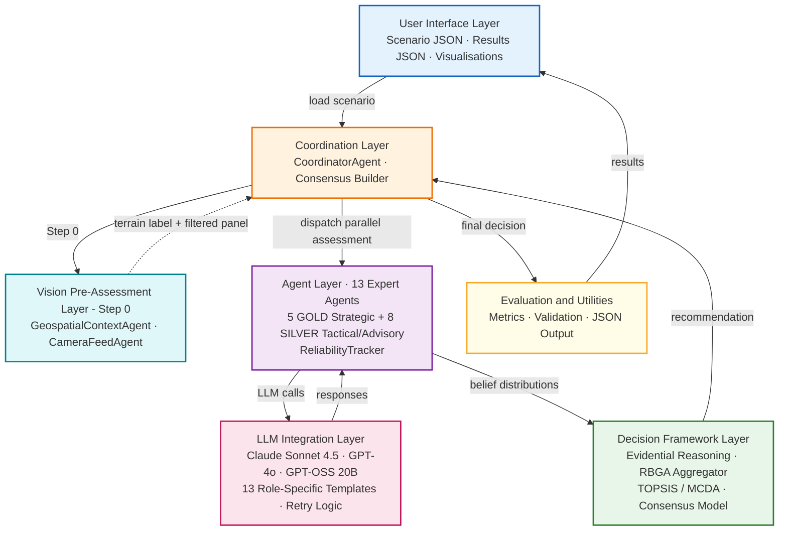
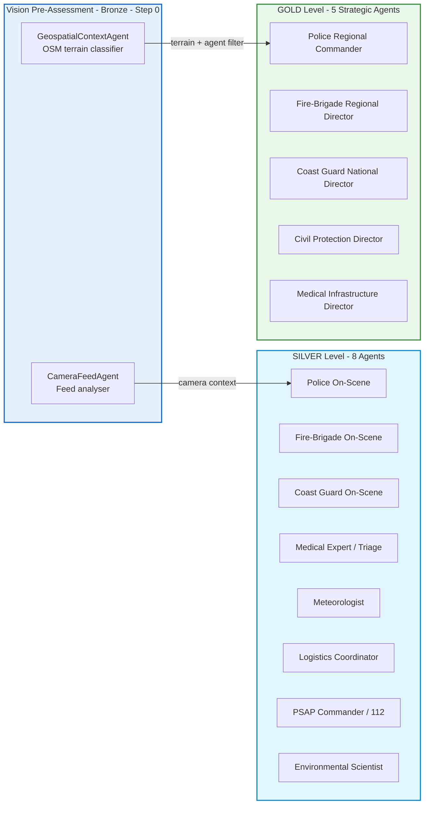
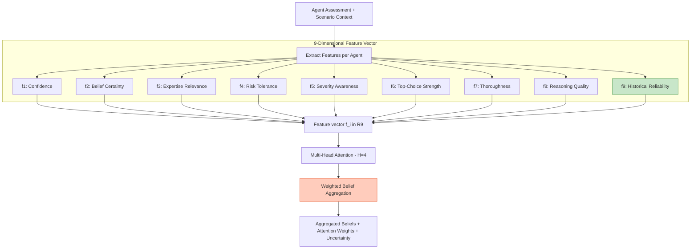
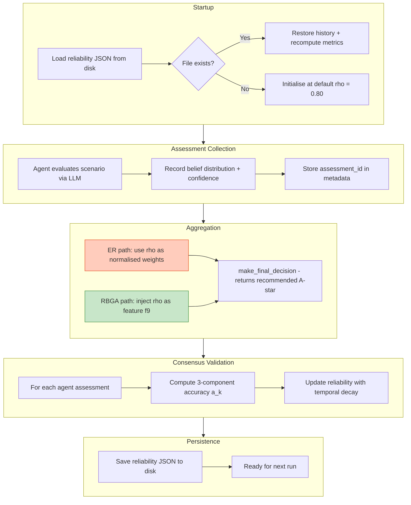
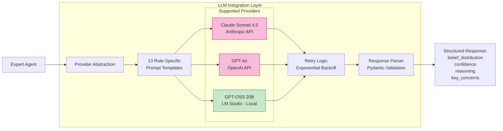
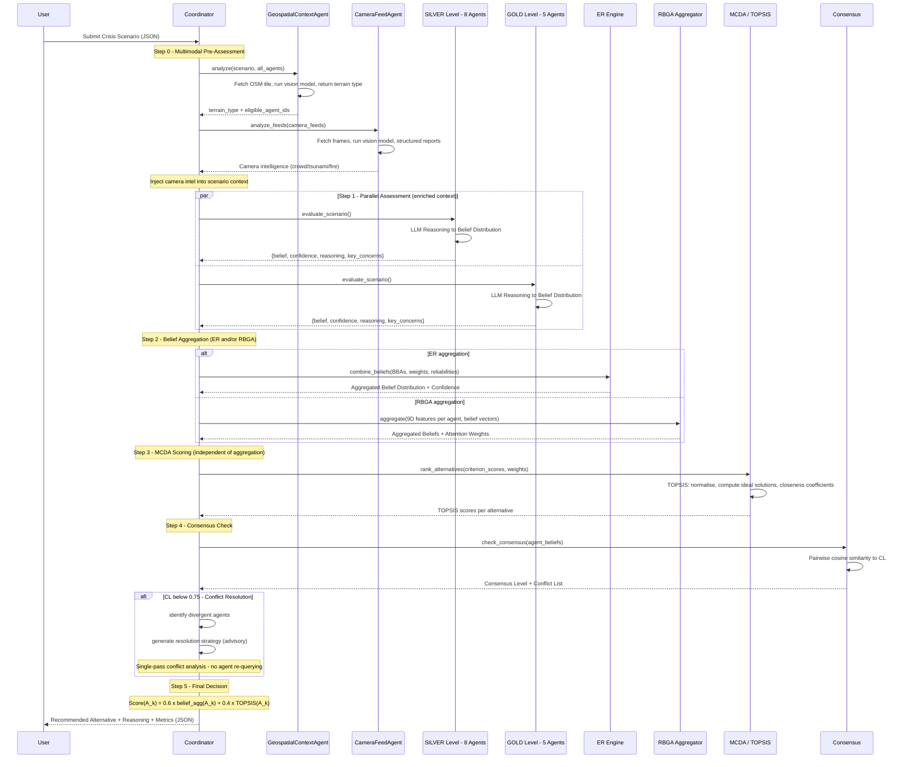
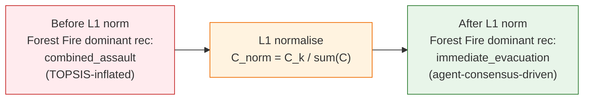

# A Collaborative Multi-Agent Framework for Crisis Management Decision Support Using Evidential Reasoning and Rule-Based Graph Attention Aggregation

**Vasileios Kazoukas**
*Military Academy (SSE), Department of Military Sciences*
*Technical University of Crete (TUC), School of Production Engineering and Management*
Email: vkazoukas@tuc.gr, kazoukas@gmail.com

---

## Abstract

Effective crisis management demands rapid coordination of expert knowledge across disciplines under severe uncertainty and time pressure. This paper presents AEGIS (Adaptive Expert-based Group Intelligence System), a multi-agent decision support framework that orchestrates 13 domain-expert agents modelled on emergency response roles at GOLD (strategic) and SILVER (tactical) command levels. Each agent generates structured belief assessments using Large Language Models; these are then aggregated through two complementary mechanisms: classical Evidential Reasoning (ER) grounded in Dempster-Shafer theory, and a rule-based graph attention aggregator (RBGA) that applies interpretable, fixed-scalar weights over a 9-dimensional agent-feature representation. RBGA was deliberately designed for full auditability where labelled crisis-decision training data are unavailable. A TOPSIS-based multi-criteria ranker and a historical reliability tracker that adjusts per-agent influence over successive decisions complete the pipeline. Before expert assessment begins, a multimodal pre-assessment layer - comprising a geospatial terrain classifier and a camera-feed vision agent - enriches the scenario context with real-time observational data and filters domain-ineligible agents.

The system is evaluated on three crisis scenarios inspired by recent Greek emergencies: the Karditsa flash flooding (September 2023), the North Evia wildfires (August 2021), and an industrial ammonia release at the Elefsina petrochemical zone. Across 45 controlled runs - five replicates per LLM provider (Anthropic Claude Sonnet 4.5, OpenAI GPT-4o, and GPT-OSS 20B via LM Studio) for each scenario - ER and RBGA produced statistically equivalent decision quality (ER DQS: 0.783 ± 0.042; RBGA DQS: 0.790 ± 0.036; paired Wilcoxon p > 0.05), with 93.3% recommendation agreement (42/45 runs) and a mean consensus of 0.912 ± 0.071. All three providers converged on the dominant alternative for every HAZMAT run; the three ER-RBGA disagreements arose in the two most contested decision spaces (two in the 12-alternative Forest Fire scenario, one borderline Flood run). On an identical TOPSIS choice-quality scale, collective recommendations matched the post-hoc best individual agent (within 2 pp) while outperforming the mean individual expert by +0.5 pp (Flood), +1.9 pp (Forest Fire), and +3.2 pp (HAZMAT) - in the most ambiguous scenario, only 68% of solo expert choices coincided with the system recommendation, quantifying the dispersion that aggregation resolves. Preliminary author self-assessed explainability and auditability ratings of 4.2/5 and 4.5/5 suggest the structured audit trail is well-suited to operational contexts where accountability is non-negotiable; independent practitioner validation remains future work.

**Keywords:** Multi-Agent Systems; Crisis Management; Evidential Reasoning; Dempster-Shafer Theory; Rule-Based Graph Attention Aggregation; Graph Attention Networks; Large Language Models; Group Decision Making; Multi-Criteria Decision Analysis; TOPSIS; Decision Support Systems; Emergency Management; Explainability

---

## 1. Introduction

### 1.1 Motivation and Problem Context

Large-scale emergencies confront decision-makers with a constellation of challenges that are qualitatively distinct from those of routine management: incomplete and rapidly changing information, strict time windows, simultaneous demands across heterogeneous domains - medical, logistical, meteorological, environmental, law-enforcement - and the weight of knowing that delayed or poorly calibrated decisions have immediate consequences for human life [1]. The coordination failures documented in major disasters, from Hurricane Katrina to the 2021 European floods, consistently trace back not to the absence of capable individuals but to the absence of mechanisms for integrating their expertise in real time [2].

Traditional crisis management relies on command structures that are hierarchical by design, drawing on trained professionals who apply established protocols under human supervision. These structures have proven resilient over decades of practice. Yet they exhibit well-documented cognitive limits when the scale of a crisis simultaneously overloads multiple agencies: experts operating under time pressure tend to anchor on the first acceptable solution rather than systematically examining the alternative space [3]; group deliberation under stress can suppress dissenting specialist views in favour of rapid convergence [4]; and the sheer volume of incoming information - sensor feeds, field reports, media, social networks - exceeds the bandwidth of any unaided human team.

Computational support has a long history in emergency management, from early expert systems and simulation tools to modern geographic information systems and sensor fusion platforms. Multi-agent systems (MAS) offer a complementary capability: autonomous software agents, each embodying a distinct area of expertise, that can deliberate in parallel and pool their assessments through formal aggregation mechanisms [5]. When those agents are powered by Large Language Models, they gain the ability to produce not only numerical outputs but also natural-language reasoning traces that a human decision-maker can inspect, interrogate, and override.

Despite considerable research activity, several gaps persist in the intersection of MAS and crisis decision support. Most existing frameworks rely on a single aggregation strategy - typically a voting scheme or a weighted average - without examining whether alternative mechanisms produce materially different outcomes. Agent credibility is commonly treated as fixed rather than updated from observed performance. Transparency requirements, which are paramount in safety-critical domains, have received limited systematic treatment. And the potential of current-generation LLMs as domain-reasoning engines for specialised agents remains largely unexplored in the crisis management literature.

### 1.2 Research Questions

This paper addresses five interrelated research questions that together characterise the design space of LLM-powered multi-agent crisis decision support:

**RQ1** - How effectively can a hierarchical multi-agent architecture coordinate domain-specialised agents to produce timely, coherent crisis management recommendations?

**RQ2** - How do weighted Evidential Reasoning (ER) and rule-based graph attention aggregation (RBGA) compare as mechanisms for aggregating expert beliefs under uncertainty?

**RQ3** - What does LLM-powered reasoning contribute to agent assessment quality and system-level decision coherence?

**RQ4** - Does collective multi-agent judgement measurably outperform the best individual expert agent?

**RQ5** - Can the system produce decision audit trails that satisfy the transparency and accountability requirements of operational crisis management?

### 1.3 Contributions

This paper makes six concrete contributions:

1. **AEGIS system design.** A complete, open-source multi-agent decision support system for crisis management that integrates 13 domain-expert agents organised in a two-level command hierarchy (GOLD/SILVER), two competing belief-aggregation mechanisms (ER and RBGA), a TOPSIS-based MCDA ranker, and a historical reliability tracker, with multi-provider LLM support and automatic fallback.

2. **Controlled aggregation comparison.** A direct, methodologically rigorous comparison of weighted Evidential Reasoning and a rule-based graph attention aggregator (RBGA) operating on byte-for-byte identical agent assessments across 45 runs and three scenario types - guaranteed by a single-collection architecture in which ER and RBGA receive the same assessment dict from one shared LLM pass - providing the first controlled ER-vs-RBGA comparison in the crisis management domain.

3. **Multi-provider LLM evaluation.** Systematic performance characterisation of three LLM providers (Claude Sonnet 4.5, GPT-4o, GPT-OSS 20B) across speed, decision quality, consistency, and data-sovereignty trade-offs, demonstrating that competitive decision quality is achievable with locally deployed open-source models.

4. **Historical reliability tracking.** An online reliability tracker that updates per-agent influence weights after each decision using a consensus-based proxy, demonstrating measurable differentiation (per-agent mean accuracy spanning 0.445-0.665 across 642 agent records (577 training, 65 frozen-weight holdout)) and structural integration into both aggregation paths.

5. **Empirical collective-vs-individual analysis.** A same-scale choice-quality comparison showing that the collective recommendation matches the post-hoc best individual agent (within 2 pp) while consistently exceeding the mean individual expert, with only 68% of solo choices coinciding with the system recommendation in the most complex multi-alternative action space - characterising aggregation as a reliable selection-and-stabilisation mechanism.

6. **Multimodal pre-assessment layer.** A two-agent vision subsystem (GeospatialContextAgent and CameraFeedAgent) that runs before expert assessment, classifying terrain from OSM satellite tiles, analysing live camera feeds in scenario-specific modes (tsunami, crowd, fire), and injecting structured observational intelligence into the scenario context seen by all 13 domain-expert agents - demonstrating how real-time visual evidence extends and constrains LLM-based expert reasoning without requiring additional API calls.

### 1.4 Paper Organisation

The remainder of this paper is structured as follows. Section 2 reviews the background literature spanning Group Decision Making, multi-agent systems, Dempster-Shafer theory, graph attention networks, LLMs, and MCDA. Section 3 describes the AEGIS architecture and methodology in full detail. Section 4 presents the experimental setup and results. Section 5 discusses the findings with respect to the five research questions, derives practical guidance, and acknowledges limitations. Section 6 concludes with directions for future work.

---

## 2. Background and Literature Review

### 2.1 Group Decision Making under Uncertainty

Group Decision Making (GDM) is concerned with how a set of decision-makers (DMs) with different expertise, preferences, and risk tolerances collectively reaches a defensible judgement on complex problems [6]. Classical results establish that, when aggregation is properly structured, groups systematically outperform their best individual member - a finding attributed to diversity of perspective, error cancellation across independent assessments, and the suppression of individual anchoring bias [7].

Central to GDM is the Consensus Reaching Process (CRP), an iterative procedure in which individual evaluations are compared against a collective position, participants who deviate substantially are invited to reconsider, and the cycle continues until a pre-specified consensus threshold is exceeded [8]. The CRP literature has grown rapidly in recent years, with attention turning to large-scale settings (LSGDM) involving hundreds of participants [9], to the incorporation of social network structures that model inter-DM trust [10], and to dynamic weighting schemes that account for each participant's prior performance and willingness to adjust [11].

In the crisis management context, GDM faces additional pressures absent from conventional business or policy applications. As Kapucu and Garayev [2] document, the multi-organisational structure of emergency response, with agencies operating under different command lines and information channels, renders traditional face-to-face CRP infeasible under time pressure. Klein's analysis of naturalistic decision-making [3] further highlights that experts operating under stress adopt recognition-primed strategies - matching the current situation to a familiar template and committing to the first acceptable course of action - rather than exploring the full alternative space. Computational support that systematically aggregates multiple domain perspectives, while preserving the speed demanded by operational timelines, addresses precisely this gap.

### 2.2 Multi-Agent Systems in Emergency Management

The foundational properties of autonomous agents - reactivity to environmental changes, proactive goal-directed behaviour, and social ability to interact with other agents - were systematically characterised by Wooldridge [5]. Multi-agent systems apply these properties to distributed, large-scale problems that exceed the reach of monolithic solvers.

In emergency management, agent-based models have been applied to evacuation dynamics [12], resource dispatch optimisation [13], and inter-agency information sharing [14]. The architectural choices in these systems vary considerably: reactive architectures based on condition-action rules offer speed but lack deliberative depth; deliberative architectures grounded in the Belief-Desire-Intention (BDI) model [15] support explicit reasoning but impose computational overhead; and hybrid architectures balance both. AEGIS adopts a deliberative-hybrid design in which the internal reasoning of each agent is performed by an LLM - effectively endowing it with a generative BDI capability - while the outer coordination is handled by a dedicated Coordinator agent.

The application of LLMs as agent reasoning engines is a recent and rapidly developing research direction. Li et al. [16] survey the emerging landscape of LLM-based multi-agent systems, highlighting their capacity for natural-language coordination, structured output generation, and context-sensitive role adoption. Goecks and Waytowich [17] demonstrate LLM-generated plans of action for disaster response scenarios, while Otal et al. [18] build LLM-assisted platforms for emergency coordination and public communication. AEGIS builds on this foundation by embedding structured Chain-of-Thought (CoT) prompting [19] in role-specific templates for each of the 13 agent profiles, ensuring that reasoning traces are both domain-grounded and machine-parseable.

### 2.3 Dempster-Shafer Theory and Evidential Reasoning

Classical probability theory requires all uncertainty to be expressed as a probability distribution over mutually exclusive hypotheses, leaving no room for explicit ignorance. Shafer's Mathematical Theory of Evidence [20] relaxes this constraint by permitting belief mass to be assigned to *sets* of hypotheses - a power set representation that enables the formal distinction between "I believe A is likely" and "I have no evidence either way". This is particularly valuable in crisis management, where an agent may be certain that immediate action is required without being able to specify which action is optimal.

The basic belief assignment (BBA) function $m: 2^\Theta \to [0,1]$ satisfies $m(\emptyset) = 0$ and $\sum_{A \subseteq \Theta} m(A) = 1$. From any BBA, one derives belief ($Bel(A) = \sum_{B \subseteq A} m(B)$) and plausibility ($Pl(A) = \sum_{B \cap A \neq \emptyset} m(B)$) measures that bracket the true probability of hypothesis $A$. The uncertainty interval $[Bel(A), Pl(A)]$ widens precisely when evidence is sparse or conflicting.

The Dempster combination rule fuses two independent BBAs $m_1$ and $m_2$:

$$m_{12}(A) = \frac{1}{1-K} \sum_{B \cap C = A} m_1(B) \cdot m_2(C), \quad K = \sum_{B \cap C = \emptyset} m_1(B) \cdot m_2(C)$$

where $K$ measures inter-source conflict. As Zadeh [21] famously demonstrated, naive application of this rule can produce counter-intuitive results when $K$ is large. Yang and Xu [22] address this through the Evidential Reasoning (ER) rule, which extends the BBA representation with explicit weight ($w_i$) and reliability ($r_i$) parameters per source, implementing proportional redistribution of conflicting belief mass rather than simple normalisation. This extension forms the theoretical basis of the ER engine implemented in AEGIS.

### 2.4 Graph Attention Networks and Dynamic Weighting

Graph Convolutional Networks (GCNs) [23] extended convolutional neural networks to graph-structured data, but apply uniform neighbour aggregation. Graph Attention Networks (GATs), introduced by Veličković et al. [24], add a learnable attention mechanism that assigns different weights to different neighbours:

$$e_{ij} = a(\mathbf{W}\mathbf{h}_i \| \mathbf{W}\mathbf{h}_j)$$

$$\alpha_{ij} = \text{softmax}_j\!\left(\text{LeakyReLU}(e_{ij})\right)$$

where $\mathbf{W}$ is a shared linear projection and $a$ is a single-layer feed-forward network. Multi-head attention (MHA) with $K$ parallel heads provides stability and allows the network to capture different relational aspects simultaneously [25].

In the GDM literature, Zhou et al. [10] applied GAT-style attention to model social trust networks in large-scale emergency decision making, demonstrating that the attention mechanism discovers invisible correlations between decision-makers beyond those captured by explicit adjacency matrices. Carneiro et al. [26] note that in dispersed GDM contexts, the ability to modulate aggregation weights continuously - rather than via binary acceptance or rejection - is critical for managing divergent expert opinions.

AEGIS repurposes this architecture for an expert-agent graph in which nodes are agents and edges carry attention coefficients representing inter-agent relevance. A key design choice distinguishes the AEGIS RBGA aggregator from learned GAT variants: because labelled crisis-decision histories are unavailable at system initialisation, all attention parameters are set by domain-knowledge rules rather than gradient descent. This rule-based graph attention aggregator (RBGA) preserves full interpretability from the first operational run - a requirement in safety-critical settings - while still exploiting the graph-structured relational representation.

### 2.5 Large Language Models for Domain Reasoning

The Transformer architecture [25] and the pre-training paradigm it enabled have produced a generation of language models capable of performing complex reasoning tasks with no task-specific fine-tuning, given appropriate prompts. Brown et al. [27] demonstrated that few-shot prompting of large models substantially outperforms zero-shot baselines, while Wei et al. [19] showed that Chain-of-Thought prompting - eliciting intermediate reasoning steps before a final answer - further improves performance on multi-step problems, including those requiring domain knowledge.

In AEGIS, each expert agent's LLM call is preceded by a structured prompt (~5,000 characters) that encodes: (a) the agent's professional identity and seniority; (b) the relevant emergency protocols for the current scenario type; (c) the available response alternatives; (d) the required output schema (a JSON object containing `alternative_rankings`, `confidence`, `reasoning`, and `key_concerns`). This structured prompting approach transforms the LLM from a general-purpose generator into a simulated domain expert whose outputs are directly parseable by the aggregation layer.

Data sovereignty and regulatory compliance are first-order considerations for public-safety applications. The EU General Data Protection Regulation (GDPR) restricts cross-border transmission of personal data associated with emergency incidents. AEGIS therefore includes a fully on-premise deployment path using locally hosted open-source models (GPT-OSS 20B via LM Studio), enabling GDPR compliance while maintaining competitive decision quality, as the results in Section 4 demonstrate.

### 2.6 Multi-Criteria Decision Analysis

Following belief aggregation, the system must rank response alternatives across multiple incommensurable criteria - safety, effectiveness, cost, response speed, and social acceptability. The Technique for Order Preference by Similarity to Ideal Solution (TOPSIS), introduced by Hwang and Yoon [28], ranks alternatives by their geometric closeness to an ideal-positive solution and distance from an ideal-negative solution in normalised criterion space.

Given a decision matrix $X = [x_{ij}]$ with $m$ alternatives and $n$ criteria, the TOPSIS procedure normalises the matrix via $r_{ij} = x_{ij}/\sqrt{\sum_k x_{kj}^2}$, applies criterion weights $w_j$ to obtain the weighted matrix $v_{ij} = w_j r_{ij}$, identifies the positive-ideal $A^+ = \{v_j^+\}$ and negative-ideal $A^- = \{v_j^-\}$ solutions, computes Euclidean distances $S_i^+ = \sqrt{\sum_j (v_{ij} - v_j^+)^2}$ and $S_i^-$ accordingly, and ranks by the closeness coefficient $C_i = S_i^-/(S_i^+ + S_i^-)$. Behzadian et al. [29] provide a comprehensive survey of TOPSIS applications across many domains. AEGIS employs TOPSIS as its primary ranker, with WSM and SAW as secondary cross-checks; consistent agreement across all three methods signals high ranking confidence.

---

## 3. Methodology: The AEGIS Framework

### 3.1 System Architecture Overview

AEGIS is organised into seven functional layers, each with clearly demarcated responsibilities and standardised inter-layer interfaces. This modular design ensures that any individual component - a specific LLM provider, an aggregation algorithm, or a visualisation module - can be replaced or upgraded independently without disrupting the rest of the system.

*Fig. 1. Seven-layer AEGIS architecture and data flow. The Vision Pre-Assessment Layer (Step 0) executes before expert agents receive the scenario, enriching the context with terrain classification and camera intelligence.*

The interface layer accepts scenario descriptions in JSON format and returns structured decision reports. The vision pre-assessment layer runs before any expert agent call: GeospatialContextAgent classifies terrain from an OSM tile and filters domain-ineligible agents; CameraFeedAgent analyses declared camera feeds and injects observational intelligence into the scenario context. The coordination layer, built around a dedicated Coordinator agent, orchestrates the expert deliberation pipeline: it distributes the enriched scenario to the eligible agent panel, collects their assessments in parallel, invokes the chosen aggregation mechanism, checks consensus, and triggers conflict resolution when the consensus level falls below 0.75. The agent layer houses the 13 domain-expert agents and their reliability records. The LLM integration layer manages requests to the three supported providers with automatic exponential-backoff retry and provider fallback. The decision framework layer implements the two aggregation mechanisms (ER and RBGA), the MCDA ranker, and the consensus model. The evaluation layer computes performance metrics and generates visualisations.

### 3.2 Agent Hierarchy

AEGIS deploys 15 agents in two functional categories. Two multimodal pre-assessment agents (described in Section 3.10) execute before expert deliberation begins, providing terrain context and camera intelligence. Thirteen domain-expert agents then conduct the structured assessment; these are organised in a two-level command hierarchy inspired by the Gold-Silver-Bronze incident command structure used in UK and European emergency management, simplified to two levels for the current prototype.

*Fig. 2. AEGIS agent hierarchy. The Vision Pre-Assessment Layer (Step 0, Bronze) runs before the expert panel and enriches the context seen by all 13 domain-expert agents: GeospatialContextAgent classifies terrain and filters domain-ineligible agents; CameraFeedAgent injects structured camera intelligence into the shared scenario context. Arrows show representative routing; both Vision agents provide output to the full expert panel. SILVER agents handle tactical and advisory functions at or near the incident scene; GOLD agents manage strategic coordination at regional or national scale.*

The SILVER level comprises eight agents across two functional categories. Four *tactical* agents - Police On-Scene, Fire-Brigade On-Scene, Coast Guard On-Scene, and Medical Expert - represent agencies with direct operational presence at the incident site and focus on immediate resource deployment, triage, scene security, and life-safety. Four *advisory* agents - Meteorologist, Logistics Coordinator, PSAP Commander, and Environmental Scientist - supply specialised knowledge to all command levels without directly supervising field forces; notably, the PSAP Commander models the national 112 emergency coordination function, including citizen alert systems. The GOLD level comprises five *strategic* agents - Police Regional, Fire Regional, Coast Guard National, Civil Protection Director, and Medical Infrastructure Director - responsible for multi-jurisdictional coordination, inter-agency resource allocation, and national-level policy decisions.

Each agent is defined by a structured profile in `agent_profiles.json` that encodes agent identifier, command level, domain expertise, years of experience, risk tolerance, and a five-criterion declarative preference vector (effectiveness, safety, speed, cost, public acceptance) that captures each role's disciplinary priorities: the Medical Expert prioritises effectiveness and safety most heavily, the Logistics Coordinator distributes preference more evenly across effectiveness, speed, and cost, while the Civil Protection Director places its greatest weight on safety. The operational TOPSIS ranking in all experiments uses the five global criteria defined in `criteria_weights.json` (safety 0.30, cost 0.25, effectiveness 0.20, response speed 0.20, public acceptance 0.20; engine-normalised to effective weights of approximately 0.26, 0.22, 0.17, 0.17, 0.17 respectively before use); the per-agent preference vectors are stored for future per-agent TOPSIS weighting extensions. The system supports two agent-selection modes: *manual*, in which the user specifies which agents participate, and *auto-selection*, in which a rule-based scoring system evaluates all 13 agents against 11 scenario-characterisation criteria and selects the most relevant subset (minimum 3, maximum 13).

### 3.3 Evidential Reasoning Engine

The ER engine implements iterative pairwise combination of Dempster-Shafer BBAs. Agents are sorted in descending order of historical reliability and combined sequentially. Let $m_1$ and $m_2$ denote the BBAs of two agents restricted to singleton focal elements (a simplification that reduces computational complexity from $O(2^n)$ to $O(n)$ while enabling real-time operation). Note that this singleton restriction eliminates the capacity to represent non-specific belief - mass assigned to sets of alternatives - thereby reducing the ER engine to a reliability-weighted Bayesian combination with a conflict patch; full DST expressivity over non-singleton focal elements is reserved for future extensions. The combined mass for alternative $A$ is:

$$m_{12}(A) = \frac{1}{1-K} \sum_{B \cap C = A} m_1(B) \cdot m_2(C)$$

$$K = \sum_{B \cap C = \emptyset} m_1(B) \cdot m_2(C)$$

When the conflict index $K > 0.7$, the engine activates proportional redistribution rather than simple Dempster normalisation:

$$m_{\text{conflict-adj}}(A) = m(A) + K \cdot \frac{w_i \rho_i m_i(A)}{\sum_j w_j \rho_j m_j(A)}$$

This prevents the counter-intuitive behaviour documented by Zadeh [21] under high inter-source conflict while preserving the proportionality of the original agent beliefs. In the current implementation the redistribution is applied locally within each pairwise step - between the accumulated combined mass and the incoming agent's BBA - using their simple average as the base; the full reliability-weighted global formulation above represents the intended design and is a planned extension that would more directly leverage the ReliabilityTracker scores at the redistribution stage. Agent reliability already enters the combination indirectly through ordering: agents are combined in descending reliability order, so the most reliable agents' beliefs accumulate first and carry greater influence over the final result.

Agent-level reliability $\rho_i \in [0,1]$ enters the combination as an effective mass multiplier: the belief submitted by agent $i$ for combination is scaled by $\rho_i$ before the Dempster rule is applied, so that a highly reliable agent ($\rho_i = 0.90$) contributes 80 % more effective belief mass than a marginal one ($\rho_i = 0.50$). Agent weights $w_i$ are set statically from the agent profile's domain-relevance alignment with the scenario criteria, and remain fixed within a run; reliability is updated dynamically across runs. This design separation ensures full reproducibility within a single scenario while enabling adaptation across scenarios.

### 3.4 Graph Attention-Inspired Aggregator (RBGA: Rule-Based Graph Attention)

The RBGA aggregator constructs a fully connected graph in which each of the $N$ active agents is a node. Rather than learning attention parameters from data - which would require a labelled decision history unavailable at system initialisation - the attention coefficients are computed from a hand-crafted scoring function grounded in the GDM-under-uncertainty literature. This *rule-based graph attention* preserves interpretability from the very first run.

A key architectural distinction from standard GAT [24] is that RBGA contains no learnable weight matrix $\mathbf{W} \in \mathbb{R}^{F \times F'}$ and no trainable attention vector $\mathbf{a} \in \mathbb{R}^{2F'}$. Instead, four fixed scalar coefficients - set by domain-knowledge rules and optionally refined via L-BFGS-B optimisation (the RBGA-Opt variant, described in Section 4.3) - govern how agent features are weighted in the attention score. This is a deliberate design choice: it provides full auditability from cold-start and avoids the circular-label problem that would arise from training on self-generated consensus outputs. The trade-off, and the motivation for the proper learned GAT described in Section 6, is that the fixed coefficients cannot adapt to unseen scenario types without explicit reconfiguration.

**Feature extraction.** Every agent node is represented by a 9-dimensional feature vector $\mathbf{f}_i \in \mathbb{R}^9$:

*Fig. 3. AEGIS RBGA feature extraction pipeline. The ninth dimension (Historical Reliability, highlighted) links the attention mechanism directly to the ReliabilityTracker, enabling data-informed weighting without a labelled training set.*

**Attention computation.** The raw attention score from agent $j$ toward agent $i$ is:

$$e_{ij} = 0.4 \cdot f_j^{(1)} + 0.3 \cdot f_j^{(3)} + 0.3 \cdot f_j^{(2)} + 0.2 \cdot \max(\cos(\mathbf{f}_i, \mathbf{f}_j), 0)$$

where the cosine similarity term rewards agents whose full feature profiles are aligned, capturing implicit peer consistency. The scalar coefficients sum to 1.2 rather than 1.0 by design: the formula is not required to be a convex combination because the subsequent softmax normalisation enforces a proper probability distribution over neighbours. LeakyReLU non-linearity (negative slope $\nu = 0.2$) is applied before softmax normalisation:

$$\alpha_{ij} = \frac{\exp(\text{LeakyReLU}(e_{ij}))}{\sum_{k \in \mathcal{N}_i} \exp(\text{LeakyReLU}(e_{ik}))}$$

**Multi-head aggregation.** Four parallel attention heads compute coefficient sets using the same scoring formula; their mean constitutes the final attention weight $\bar{\alpha}_{ij} = \frac{1}{4}\sum_{h=1}^4 \alpha_{ij}^h$. In the current implementation all heads share identical scalar coefficients, so the averaging serves as an architectural provision for differentiated heads (e.g., confidence-dominant, relevance-dominant) in future extensions. For each response alternative $A_k$, the aggregated belief is:

$$m_{\text{agg}}(A_k) = \frac{\sum_{i=1}^N c_i \cdot m_i(A_k)}{\sum_{i=1}^N c_i}, \qquad c_i = \frac{1}{N}\sum_{j=1}^N \bar{\alpha}_{ji}$$

where $c_i$ is agent $i$'s **received attention** - the mean attention directed at agent $i$ across all $N$ agents - and serves as its influence weight in the aggregation. Using the column sum of the attention matrix (rather than the diagonal self-attention $\bar{\alpha}_{ii}$) correctly captures how much the collective panel defers to each agent's assessment. The aggregated distribution is normalised to sum to unity, and its Shannon entropy provides an uncertainty measure that is passed to the coordination layer.

### 3.5 MCDA Integration and Decision Scoring

Following belief aggregation by either ER or RBGA, the decision framework scores alternatives through TOPSIS. The input is a decision matrix $D = [x_{ij}]$ in which rows are alternatives and columns are five evaluation criteria, all drawn from the scenario criterion-score fields and governed by `criteria_weights.json`: safety (benefit, $w=0.30$), cost (cost criterion, $w=0.25$), effectiveness (benefit, $w=0.20$), response speed (benefit, $w=0.20$), and public acceptance (benefit, $w=0.20$). Before application, the engine normalises these declared weights to sum to unity, yielding effective weights of approximately 0.26, 0.22, 0.17, 0.17, and 0.17 respectively. The four benefit criteria are maximised toward the positive ideal; the cost criterion is minimised toward the negative ideal. The cost field encodes resource-mobilisation intensity on $[0,1]$: lower values indicate higher resource deployment (comprehensive multi-modal responses), higher values indicate lower resource requirements (simpler, cheaper alternatives). TOPSIS cost-criterion distance logic therefore positions comprehensively-resourced responses closest to the positive ideal, correctly reflecting the operational priority that acute crises warrant full resource mobilisation rather than expenditure minimisation. These weights reflect the life-safety priority characteristic of the three Greek scenarios studied.

The final score for each alternative combines the aggregated agent belief and the TOPSIS closeness coefficient with a fixed 60/40 weighting:

$$\text{Score}(A_k) = 0.6 \times m_{\text{agg}}(A_k) + 0.4 \times C_k^{\text{norm}}$$

The 60/40 split reflects the design philosophy that domain expert judgement - captured in the belief distributions - should dominate, while the objective criterion scoring provides a structural check against purely sentiment-driven consensus.

**L1 normalisation of TOPSIS scores.** A critical precondition of the 60/40 formula is that both components share the same distributional scale. ER and RBGA aggregated beliefs are proper probability distributions: they always sum to 1.0 across all alternatives, so the per-alternative average is $1/N$. TOPSIS closeness coefficients $C_k = S_k^-/(S_k^+ + S_k^-)$ are geometric proximity scores individually bounded in $[0,1]$ but with no constraint on their sum across alternatives. In the AEGIS experimental corpus, raw TOPSIS scores sum to approximately 1.8-3.2 across alternatives depending on the scenario and run, giving per-alternative averages of 0.36-0.64 for $N=5$ and 0.15-0.27 for $N=12$ - systematically larger than the corresponding belief averages of 0.20 ($N=5$) and 0.083 ($N=12$).

Without correction, the MCDA component contributes 55-79% of the combined score, compared with the nominal 40%. The distortion is largest when TOPSIS scores are high and beliefs are dispersed - precisely the condition that arises in large action spaces. To restore the intended balance, raw TOPSIS scores are L1-normalised before the blend:

$$C_k^{\text{norm}} = \frac{C_k}{\displaystyle\sum_j C_j}$$

This transforms the TOPSIS output into a proper distribution summing to 1.0 while preserving the ranking order among alternatives. The normalised coefficient $C_k^{\text{norm}}$ is used in all analyses throughout this paper. A post-hoc recalculation (Section 4.7) quantifies the impact of this correction across the full experimental corpus.

**What TOPSIS contributes beyond belief aggregation.** Running TOPSIS independently of the belief aggregation step provides two distinct analytical benefits that pure belief combination cannot replicate. First, it correctly handles the directional asymmetry between benefit and cost criteria: safety, effectiveness, response speed, and public acceptance are drawn toward the positive ideal solution $A^+$, while the resource-intensity cost dimension is simultaneously drawn away from the negative ideal solution $A^-$, rewarding comprehensive responses over minimal-cost alternatives. A simple weighted average of agent beliefs contains no mechanism to encode this directionality. Second, TOPSIS reveals cases where collective expert preference and objective criterion optimisation diverge -- the most informative decision points in the output, since they signal trade-offs a decision-maker must consciously accept rather than resolve automatically. In the Elefsina HAZMAT trace (Section 4.6), for example, downwind evacuation achieves the highest TOPSIS closeness coefficient ($C_k = 0.806$) due to its exceptional safety score, but the aggregated agent beliefs strongly favour the integrated multi-layer response (ER combined score 0.717 vs. 0.119 for evacuation). The 60/40 combination preserves this tension visibly in the output rather than collapsing it, and the accompanying audit trail exposes the specific criterion scores that drive the divergence -- precisely the kind of structured transparency required in safety-critical operational contexts.

Consensus level is computed as the mean pairwise cosine similarity of agent belief vectors:

$$CL = \frac{2}{N(N-1)} \sum_{i < j} \cos(\mathbf{m}_i, \mathbf{m}_j)$$

When $CL < 0.75$, the system flags the decision as insufficiently agreed and triggers a single-pass conflict-analysis step (`resolve_conflicts`) that identifies the most divergent agents, characterises the nature of the disagreement, and returns a structured resolution strategy (suggested compromise alternatives and rationale) to the coordinator. In the current implementation this is advisory: the coordinator receives the conflict report and proceeds to final scoring without re-querying agents; iterative re-evaluation is identified as a future extension.

### 3.6 Historical Reliability Tracking

The reliability tracker maintains a per-agent performance history that is updated after every scenario run and persisted to disk. Because ground truth is unavailable in the simulation setting, a consensus-based proxy is used: the system's own final recommendation is treated as the reference outcome for the current run, and each agent's assessment is scored against it using a three-component accuracy measure:

$$
a_t = 0.4 \cdot m_i(A^r)
     + 0.3 \cdot \mathbf{1}\!\left[\text{top}(m_i) = A^r\right]
     + 0.3 \cdot \text{margin}(m_i, A^r)
$$

where $A^r$ is the recommended alternative, $m_i(A^r)$ is the belief mass agent $i$ assigned to it, $\mathbf{1}[\cdot]$ is the indicator of whether $A^r$ was the agent's top choice, and $\text{margin}$ is defined as:

$$\text{margin}(m_i, A^r) = \begin{cases} 0.5 + 0.5\,c_i & \text{if } \text{top}(m_i) = A^r \\ 0.5 - 0.5\,c_i & \text{otherwise} \end{cases}$$

with $c_i \in [0,1]$ the agent's self-reported LLM confidence. This formulation rewards agents that were both correct and confident (maximum $= 1.0$), penalises agents that were wrong and confident (minimum $= 0.0$), and treats uncertain agents symmetrically regardless of outcome (both cases approach $0.5$ as $c_i \to 0$).

Reliability is computed as a temporally decayed, confidence-weighted moving average:

$$\rho_j = \frac{\sum_t \gamma^{d_t} (0.5 + 0.5 c_t) \cdot a_t}{\sum_t \gamma^{d_t} (0.5 + 0.5 c_t)}$$

with decay factor $\gamma = 0.95$ and $d_t$ the age of assessment $t$ in days. For new agents, the default reliability is $\rho_j = 0.80$.

*Fig. 4. ReliabilityTracker lifecycle. The tracker is initialised from disk, feeds agent reliability into both aggregation paths through different mechanisms, is updated using the consensus outcome as a proxy ground truth, and is persisted after every run.*

### 3.7 LLM Integration and Prompt Engineering

Each expert agent issues a single LLM call per scenario evaluation. The call is structured around a role-specific prompt template (~5,000 characters) that encodes: (a) a first-person professional identity declaration ("You are a Senior Meteorologist with 15+ years of experience in severe weather forecasting for Greece and the Eastern Mediterranean"); (b) an urgency framing that primes analytical mode ("ACTIVE CRISIS - Expert assessment required urgently"); (c) a scenario description in structured JSON; (d) the list of response alternatives; (e) a Chain-of-Thought instruction that requires the agent to reason through the scenario before committing to a ranking; and (f) a required output schema specifying the JSON keys `alternative_rankings`, `confidence`, `reasoning`, and `key_concerns`.

*Fig. 5. LLM integration layer. Three providers are supported behind a common abstraction interface; Pydantic validation enforces response schema compliance; exponential backoff with three retries handles transient API failures.*

**Hallucination mitigation and response validation.** LLMs are probabilistic and may produce outputs that omit required fields, assign belief masses that do not sum to unity, embed JSON inside markdown fences, or report confidence values outside $[0, 1]$. AEGIS addresses these failure modes through a three-layer defence implemented in `expert_agent.py`:

*Layer 1 -- JSON extraction.* A cleaning step strips markdown fences, preamble prose, and trailing commentary before isolating the JSON object. This step is especially important for GPT-OSS 20B, which emits explanatory text around the structured response more frequently than the cloud providers.

*Layer 2 -- Structural validation* (`_validate_llm_response`). The extracted object is checked for the four required keys: `alternative_rankings`, `reasoning`, `confidence`, and `key_concerns`. Missing optional keys (reasoning, key_concerns) log a warning and allow degraded operation; a missing or malformed `alternative_rankings` dict raises a `ValueError` and triggers a retry. Confidence values outside $[0, 1]$ are replaced with the neutral default 0.5.

*Layer 3 -- Pydantic enforcement.* The validated response is passed to `BeliefDistribution` and `AgentAssessment` Pydantic models, which enforce field types and value ranges at construction time; rankings are normalised to sum to unity at this stage. A fallback assessment (uniform belief, zero confidence, full participation weight penalty) is created if all upstream steps exhaust the retry budget, ensuring the coordinator always receives a structurally valid response.

Retry logic uses exponential backoff with delays of 2 s, 4 s, and 8 s (3 attempts for Claude and LM Studio; 6 attempts for OpenAI to absorb burst rate limits, with jitter to prevent thundering-herd retries when 13 agents fail simultaneously). An important architectural distinction: the three-layer pipeline catches *structural* hallucinations (wrong format, out-of-range values, missing keys) reliably, but cannot detect *semantic* hallucinations -- cases where an LLM produces well-formed JSON with plausible domain vocabulary but factually incorrect crisis management reasoning. Mitigation of semantic hallucinations requires the diversity mechanism inherent in multi-agent aggregation: if a single agent hallucinates a spurious preference, it is overridden by the remaining 10-12 agents whose consensus drives the aggregated belief distribution. All three providers achieved 100 % structural parse success in the 555-call experimental corpus after the cleaning step.

### 3.8 End-to-End Decision Pipeline

Figure 6 shows the complete multi-agent decision pipeline from scenario submission to final recommendation.

*Fig. 6. End-to-end AEGIS decision pipeline. Step 0 (multimodal pre-assessment) runs before expert agents receive the scenario; Steps 1-5 are the core deliberation and aggregation pipeline. ER and RBGA are mutually exclusive by default but can be executed concurrently in `--compare-methods` mode.*

### 3.9 Expert Selection Mechanism

The auto-selection system evaluates all 13 agents against 11 scenario-characterisation criteria drawn from the scenario JSON metadata: crisis type (weight +3), crisis subtype (+2), affected domain (+2), severity (+1), geographic scope (+2), location characteristics (+2), command-level requirements (+2), multi-jurisdictional flag (+1), infrastructure type (+2), population scale (+1), and time constraint (+1). Agents exceeding a zero score are included; the three core agents (Meteorologist, Logistics Coordinator, Medical Expert) are always included as a minimum panel. The final selection is bounded to [3, 13] agents by adding or trimming as needed. This scoring mechanism ensures that the active panel is tailored to each scenario's domain profile without manual configuration.

### 3.10 Multimodal Pre-Assessment Layer

Two specialised agents execute as Step 0 of the decision pipeline -- before any domain-expert LLM call -- providing real-time situational awareness that enriches the scenario context visible to all 13 expert agents and validates the agent panel composition.

**GeospatialContextAgent.** This agent fetches a 256×256 OpenStreetMap raster tile for the scenario's declared coordinates via the Slippy Map tile service, base64-encodes it, and submits it to a locally hosted Ollama vision model (default: `minicpm-v`, fallback-compatible with `llama3.2-vision` or `moondream`) for terrain classification. The model returns one of three labels -- `island`, `coastal_mainland`, or `inland` -- which the coordinator uses to filter domain-ineligible expert agents before assessment begins. For example, a volcanic scenario on Santorini (coordinates 36.41°N, 25.46°E) is correctly classified as `island`, triggering the exclusion of any agent whose domain expertise is contingent on continental road or rail infrastructure; conversely, for the inland Karditsa flood the filter excludes the two Coast Guard agents, reducing the active panel to 11. A deterministic bounding-box fallback covers Greek geographic coordinates whenever Ollama is unreachable or the vision response cannot be reduced to a single valid label, preserving the filtering function without vision inference and ensuring the pipeline degrades gracefully. Both paths were exercised in the experimental corpus: the recorded holdout runs used the deterministic fallback after the vision model echoed the label options verbatim (a failure mode subsequently eliminated by a response-normalisation step and verified against the live model), and in every case the fallback label agreed with the vision classification.

**CameraFeedAgent** (Bronze command level). This agent processes camera feeds declared in the scenario JSON under the key `camera_feeds`, each specifying a source URL (static image, RTSP stream, or local file path), an analysis mode, and a human-readable label. For each feed it fetches a frame -- using OpenCV for RTSP streams -- base64-encodes it, and submits it to the vision model. The response is parsed into a typed report with mode-specific fields:

- *Tsunami mode*: `tsunami_indicators_present`, `wave_detected`, `wave_height_estimate_m`, `water_withdrawal_observed`, `warning_level`
- *Crowd mode*: `crowd_density` (low / moderate / high / critical), `panic_indicators`, `stampede_risk`, `estimated_crowd_size`
- *Fire mode*: `smoke_visible`, `fire_visible`, `fire_size_estimate`, `spread_direction`
- *General mode*: `situation_severity`, `situation_summary`, `immediate_hazards`

Reports are formatted as structured human-readable text and injected into `scenario["additional_context"]`, which is appended to the scenario description block of every expert agent's prompt. Only reports with `status == "ok"` (vision model successfully returned a response) are included; feeds where the vision model was unavailable produce no injection, leaving agent prompts unaffected.

**Added value: extending the case description.** The pre-assessment layer's core contribution is that it grounds LLM expert reasoning in real-time observational evidence rather than static scenario parameters alone. This matters in two distinct ways.

*Presence of signal.* A camera reporting `crowd_density: elevated` at a caldera rim viewpoint before any evacuation order has been issued signals spontaneous congregation -- a secondary hazard that no static scenario parameter captures. Expert agents that receive this observation can factor uncontrolled crowd movement into their belief distributions over evacuation alternatives, distinguishing between a "phased harbour evacuation" (tractable if crowds are dispersed) and "immediate caldera rim clearance" (necessary if crowds have already self-assembled at the most dangerous vantage point).

*Absence of signal.* "No tsunami wave indicators detected at harbour cameras, confidence 0.80" is not a null result -- it is evidence that constrains the threat envelope. Agents can weight sea-evacuation alternatives differently knowing that the harbour is currently free of wave activity, reducing the urgency weight on alternatives that assume a simultaneous tsunami component. Without the camera layer, agents must reason from scenario severity alone (0.95) and may conservatively weight all co-occurring threats equally.

Both effects are structurally invisible to the 13 expert agents without Step 0, even though they are critical for risk discrimination in multi-hazard scenarios.

**Camera feed coverage.** All four scenarios in the experimental corpus declare camera feeds in their scenario JSON. The three training scenarios each include three feeds: the Karditsa Flood scenario provides two general-mode feeds (Pineios River bridge for water level monitoring; city centre for street flooding depth and vehicle count) and one crowd-mode feed (municipal hall assembly point); the Evia Wildfire scenario provides two fire-mode feeds (hillside flame-front perimeter; village eastern approach) and one crowd-mode evacuation road feed; the Elefsina HAZMAT scenario provides two general-mode feeds (facility gate with visible ammonia cloud; 500 m downwind residential zone) and one crowd-mode emergency corridor feed. The Santorini holdout declares four feeds: two tsunami-mode harbour cameras and two crowd-mode caldera-rim cameras.

**Illustrative case: Santorini volcanic-seismic scenario.** In a representative holdout run (`run_1_lmstudio_frozen`) with the Ollama vision model active, Step 0 processed the two tsunami-mode harbour feeds and returned an asymmetric picture: at Athinios port, active wave-surge indicators (abnormal wave pattern, estimated 2.5 m wave height, debris in the water, vessels in distress - warning level `warning`), while at Fira Skala the model reported calm water, no withdrawal, and orderly pedestrian movement (warning level `watch`). The two crowd-mode feeds returned severity `elevated` at both caldera-rim viewpoints, with a bottleneck observed in Oia's narrow alleys and crowd movement *toward* the hazard-facing viewpoints. This context -- "wave surge at Athinios but calm at Fira Skala; crowds elevated at the rim, moving toward the caldera" -- was injected before any of the 13 eligible expert agents generated their belief distributions. The spatial asymmetry is exactly the kind of evidence Step 0 exists to provide: it discriminates *which* harbour faces the immediate maritime threat while the calm reading at Fira Skala constrains the threat envelope (Section 3.10, "absence of signal"), directly informing the relative urgency of port evacuation versus caldera-rim dispersal. This trade-off does not appear explicitly in the scenario's static parameters and would otherwise depend entirely on each LLM's priors about volcanic hazard profiles.

**Operational constraints.** Both vision agents are optional: the coordinator accepts `vision_agent=None` and `camera_agent=None` at construction, in which case Step 0 is skipped entirely. When Ollama is reachable but returns a response the vision model cannot parse, the pipeline continues with whatever partial information is available. The full vision path adds approximately 5-40 seconds to Step 0 depending on model size and number of feeds; this is acceptable for scenarios whose decision windows are measured in minutes or hours, and negligible relative to the 30-140 seconds consumed by the 11-13 parallel LLM expert assessments in Step 1.

---

## 4. Results and Analysis

### 4.1 Experimental Setup

**Scenarios.** Three crisis scenarios were designed based on recent Greek emergencies (Table I). The Karditsa Flood scenario (severity 0.80, 15,000 affected population, 5 response alternatives, 4-hour decision window) is modelled on the September 2023 Thessaly flooding during Storm Daniel. The Evia Wildfire scenario (severity 0.90, 8,000 affected population, 12 response alternatives, immediate decision window) is modelled on the August 2021 North Evia fires, the largest wildfire in Greek recorded history at the time, consuming over 120,000 hectares. The Elefsina HAZMAT scenario (severity 0.85, 12,000 affected population, 5 response alternatives, 30-minute decision window) represents an industrial ammonia release in the Thriasio Plain petrochemical zone.

Response alternatives and TOPSIS criteria scores for each scenario were derived from Greek Civil Protection (GSCP) operational doctrine, published after-action analyses of the reference incidents, and established emergency management MCDA frameworks [28, 29]. The Evia Wildfire action space deliberately spans the full spectrum of responses documented or deployed in the 2021 event (including EU Civil Protection Mechanism activation for additional aerial assets, Hellenic Coast Guard maritime evacuation of coastal villages whose road access was severed, and phosphate retardant barrier drops), creating a genuinely contested 12-alternative decision space in which different expert domains hold legitimately divergent priorities. The post-Mati 2018 policy context (102 fatalities attributed to shelter-in-place failure) is reflected in the low safety and public acceptance scores assigned to the defensive-perimeter-shelter alternative. These scenario inputs serve as realistic testbed configurations for evaluating the AEGIS aggregation architecture; operational deployment would require domain practitioners to validate and update criterion scores from live incident data, which is identified as future work in Section 5.

**TABLE I: Crisis Scenario Parameters**

| Parameter | Karditsa Flood | Evia Wildfire | Elefsina HAZMAT |
|-----------|:--------------:|:-------------:|:---------------:|
| Severity | 0.80 (High) | 0.90 (Very High) | 0.85 (Very High) |
| Affected population | 15,000 | 8,000 | 12,000 |
| Decision window | 4 hours | Immediate | 30 minutes |
| Response alternatives | 5 | 12 | 5 |
| Active agents | 11 (2 terrain-excluded) | 13 | 13 |
| Criteria (all scenarios) | safety 0.30, cost 0.25, effectiveness 0.20, speed 0.20, public acceptance 0.20 (engine-normalised) | - | - |
| Dominant response | Hybrid approach | Hybrid evacuation-suppression | Integrated response |

**Experimental configuration.** Each scenario was run 5 times per LLM provider (15 runs per scenario, 45 total). Every run executed both ER and RBGA aggregation concurrently using the `--compare-methods` flag. The `run_comparative_analysis` function collects agent assessments exactly once per run - via the ER coordinator, which also executes the vision pre-assessment (Step 0) - and then passes the same assessment dict to the RBGA coordinator without any additional LLM calls. This single-collection design guarantees that both mechanisms operate on byte-for-byte identical inputs, fully isolating aggregation algorithm as the sole variable in the comparison. Auto-selection activated all 13 agents for the Wildfire and HAZMAT scenarios; for the inland Flood scenario the geospatial terrain filter (Step 0) excluded the two Coast Guard agents, yielding an 11-agent panel. With 1 LLM call per active agent this totals 555 API calls across the full experiment (15 × 11 + 30 × 13); no additional calls are incurred by running both aggregation paths. Exact model versions: `claude-sonnet-4-5` (Anthropic), `gpt-4o` (OpenAI), and GPT-OSS 20B served locally by LM Studio; sampling temperature 0.7 for all providers. The vision pre-assessment layer (Step 0) was active in all runs across all three scenarios, with camera feeds providing situational context before expert assessment. Results were stored as structured JSON in the repository at `results/{scenario}/{run_id}/er/results.json` and `results/{scenario}/{run_id}/gat/results.json` (the `gat` directory name is retained for backward compatibility; it holds the RBGA output). All tables in this section are generated by `scripts/analyze_corpus.py` directly from the stored result files.

**Reliability tracker holdout evaluation.** To assess the reliability tracker's ability to generalise to an unseen crisis type, a fourth scenario - the Santorini Volcanic-Seismic scenario (5 runs, LM Studio provider, weights frozen) - served as a held-out test set. These runs were executed after the three training scenarios with training weights frozen: the snapshot-restore wrapper in `run_frozen_volcanic_test.py` captures each run's accuracy scores then restores the pre-run reliability files, so all 5 runs start from identical training-phase weights and no cross-run contamination occurs. The Santorini scenario introduces a novel crisis type (volcanic-seismic island emergency) with a distinct agent relevance profile and a 12-alternative action space, making it a meaningful zero-shot test of tracker generalisation. The 65 volcanic-seismic agent records from these 5 runs form the test corpus reported in §4.5; the training corpus comprises 577 records from the three main scenarios (555 from the 45 controlled runs plus 22 from two Flood pilot runs executed under the same configuration before the controlled series). The 65 frozen-weight test records are stored separately in `results/reliability_test_volcanic/`, together with a provenance manifest recording the git commit, the training-corpus size at freeze time (577), and the per-run output directories (`run_*_lmstudio_frozen`), preserving the training weights unchanged in `results/reliability/`.

**Metrics.** Four primary metrics are reported. The *Decision Quality Score* (DQS) is the raw TOPSIS closeness coefficient of the recommended alternative - the criterion-satisfaction quality of the chosen course of action, deterministic given the recommendation and the scenario's fixed criterion matrix. *Consensus Level* (CL) is the mean pairwise cosine similarity of agent belief vectors before aggregation. *Decision Confidence* (DC) is an exploratory composite metric that blends consensus and mean agent confidence as $DC = 0.6 \times CL + 0.4 \times \bar{c}$; the 0.6/0.4 split is heuristic and the $\bar{c}$ component relies on uncalibrated LLM self-reported confidence scores, which are known to exhibit overconfidence bias - DC should therefore be interpreted as a directional indicator rather than a calibrated measure. The *Extended Comparison Bandwidth* (ECB) measures the improvement of the collective DQS over the best individual agent's DQS in the same run. A fifth quantity, the *Combined Score* (CS), is the value of the blended selection criterion evaluated at the recommended alternative: $\text{CS}(A^r) = 0.6 \times m_{\text{agg}}(A^r) + 0.4 \times C^{\text{norm}}_{A^r}$, where $m_{\text{agg}}(A^r)$ is the aggregated belief mass assigned to $A^r$ and $C^{\text{norm}}_{A^r}$ is its L1-normalised TOPSIS closeness coefficient. CS is the criterion the system maximises to select its recommendation and is distinct from DQS: DQS measures criterion-satisfaction quality alone (range 0.69-0.85 in the experimental corpus), whereas CS measures the weighted combination of agent consensus and criterion quality (range 0.15-0.72, the wide span reflecting its dependence on action-space size). CS is used as the primary provider-comparison metric in Section 4.4 because it reflects both dimensions of the recommendation decision.

**Construct validity of DQS.** Three properties of DQS must be stated explicitly before interpreting the results. First, DQS measures *doctrine-encoded criterion satisfaction* - how well the chosen alternative satisfies the scenario's criterion matrix, itself derived from GSCP operational doctrine and after-action analyses - not externally validated outcome quality; no ground-truth calibration exists (Section 5.3). Second, DQS is structurally coupled to the selection criterion: CS contains a 40% normalised-TOPSIS component, so the system partially optimises the quantity DQS measures. The coupling is, however, demonstrably partial rather than circular: on the ER path the recommendation coincides with the TOPSIS-argmax alternative in 27 of 45 runs (Flood 14/15, Wildfire 13/15), while in the HAZMAT scenario the belief component overrides the TOPSIS-best alternative in *all 15 runs* (selecting the integrated response, $C_k = 0.792$, over downwind evacuation, $C_k = 0.806$), at a mean DQS cost of only 0.029 when overrides occur - direct evidence that expert consensus, not criterion geometry, dominates the selection. Third, because TOPSIS closeness coefficients are specific to each scenario's criterion matrix and action-space size, cross-scenario DQS averages (e.g., the Overall column of Table II) are indicative summaries rather than measurements on a common scale.

### 4.2 Overall System Performance

Table II presents scenario-level performance across all 45 runs.

**TABLE II: System Performance by Scenario (n = 45; 5 replicates × 3 providers × 3 scenarios)**

| Metric | Karditsa Flood | Evia Wildfire | Elefsina HAZMAT | Overall |
|--------|:--------------:|:-------------:|:---------------:|:-------:|
| DQS (mean ± σ) | 0.744 ± 0.008 | 0.823 ± 0.036 | 0.792 ± 0.000 | 0.786 ± 0.039 |
| Consensus CL (mean ± σ) | 0.959 ± 0.014 | 0.823 ± 0.050 | 0.954 ± 0.012 | 0.912 ± 0.071 |
| Confidence DC (mean ± σ) | 0.904 ± 0.008 | 0.830 ± 0.032 | 0.903 ± 0.007 | 0.879 ± 0.040 |
| Run consistency | 14/15 (93.3 %) | 13/15 (86.7 %) | 15/15 (100 %) | 93.3 % |
| Mean processing time (s)† | 69.5 | 102.8 | 74.3 | 82.2 |

† End-to-end ER-path time including the vision pre-assessment (Step 0) and parallel expert collection; in `--compare-methods` mode the RBGA pass reuses the collected assessments and adds only sub-second aggregation time. DQS is the raw TOPSIS closeness coefficient of the recommended alternative; the L1-normalised variant enters only the combined selection score (Sections 3.5, 4.7).

The HAZMAT scenario is the only case where DQS variance is exactly zero - every run across all three providers produced identical recommendations, and DQS is deterministic given the recommended alternative (it is that alternative's TOPSIS value in a fixed criterion matrix), so identical recommendations necessarily yield identical DQS. The Evia Wildfire scenario produces the lowest consensus (0.823 ± 0.050) and the largest DQS variance (±0.036), consistent with the genuine ambiguity of a multi-front wildfire where different expert perspectives yield substantially different action preferences. All three scenarios comfortably exceed the operational consensus threshold of 0.75 on average - the threshold is missed only in isolated Wildfire runs (Table IV) - and the overall 93.3 % run consistency (42 of 45 runs selecting the scenario's modal recommendation) confirms the system's reproducibility.

### 4.3 ER vs. RBGA Aggregation Comparison

Table III compares the two aggregation mechanisms across all 45 runs.

**TABLE III: Aggregation Method Comparison (45 runs, both methods per run)**

| Metric | ER | RBGA | Δ (RBGA - ER) |
|--------|:--:|:----:|:--------------:|
| DQS (mean ± σ) | 0.783 ± 0.042 | 0.790 ± 0.036 | +0.007 (n.s., p = 0.102) |
| Consensus CL (mean ± σ) | 0.912 ± 0.071 | 0.912 ± 0.071 | 0 (identical by construction) |
| Confidence DC (mean ± σ) | 0.879 ± 0.040 | 0.879 ± 0.040 | 0 (identical by construction) |
| Recommendation agreement | - | - | 93.3 % (42/45) |

*n.s. = not significant (Wilcoxon signed-rank on paired per-run values; the paired test is appropriate because both methods operate on identical assessments in every run). CL and DC are computed from the pre-aggregation agent beliefs, which the single-collection design makes identical for both paths - they are reported for completeness. Because DQS is deterministic given the recommendation (Section 4.1), the DQS comparison carries information only in the 3 runs where the methods disagree; it is best read as a re-expression of the recommendation-agreement statistic. RBGA-Opt (L-BFGS-B optimised variant) is discussed below.*

The DQS difference between ER and RBGA does not reach statistical significance. The 93.3 % recommendation agreement rate - 42 of 45 runs producing the identical recommended alternative from both methods - confirms that the two aggregation paths are largely interchangeable in practice at the 11-13-agent scale. The three disagreements arise exclusively in the two most contested decision spaces: the Evia Wildfire (two Claude runs in which ER selects `action_maritime_coastal_evacuation` while RBGA selects the modal `action_hybrid_evacuation_suppression`) and the Karditsa Flood (one borderline OpenAI run splitting between `action_rescue_operations` and `action_hybrid_approach`). The HAZMAT scenario achieves perfect ER-RBGA agreement across all 15 runs.

A scenario-level breakdown, presented in Table IV, reveals the structural origin of these differences. In the Wildfire scenario RBGA produces marginally higher and markedly more stable DQS (0.833 ± 0.004 vs. 0.814 ± 0.050 for ER): the attention mechanism's relevance weighting keeps the recommendation on the modal alternative in runs where ER's reliability-ordered multiplicative combination is swayed toward a minority evacuation preference. In the Flood and HAZMAT scenarios the two methods are statistically indistinguishable, converging on a single dominant strategy with zero or near-zero DQS variance.

**TABLE IV: Scenario-Level ER vs. RBGA Breakdown**

| Scenario | Method | DQS (μ ± σ) | Consensus (μ ± σ) | Confidence (μ ± σ) | Time (s)† | CL ≥ 0.75 |
|----------|:------:|:-----------:|:-----------------:|:-------------------:|:--------:|:---------:|
| Karditsa Flood | ER | 0.742 ± 0.011 | 95.9 % ± 1.4 % | 90.4 % ± 0.8 % | 69.5 ± 34.6 | 15/15 |
| | RBGA | 0.745 ± 0.000 | 95.9 % ± 1.4 % | 90.4 % ± 0.8 % | < 1 | 15/15 |
| Evia Wildfire | ER | 0.814 ± 0.050 | 82.3 % ± 5.1 % | 83.0 % ± 3.3 % | 102.8 ± 64.2 | 14/15 |
| | RBGA | 0.833 ± 0.004 | 82.3 % ± 5.1 % | 83.0 % ± 3.3 % | < 1 | 14/15 |
| Elefsina HAZMAT | ER | 0.792 ± 0.000 | 95.4 % ± 1.3 % | 90.3 % ± 0.7 % | 74.3 ± 38.6 | 15/15 |
| | RBGA | 0.792 ± 0.000 | 95.4 % ± 1.3 % | 90.3 % ± 0.7 % | < 1 | 15/15 |

† ER time is the end-to-end run time (Step 0 vision pre-assessment + parallel LLM collection + aggregation). The RBGA pass reuses the same collected assessments in `--compare-methods` mode, so its own cost is aggregation-only (sub-second).

#### RBGA-Opt: Empirical Validation of Rule-Based Priors

The L-BFGS-B optimiser was applied to the 45 stored runs of the main corpus to test whether gradient-free scalar optimisation of the four attention coefficients can improve on the hand-crafted prior. The training objective is:

$$\mathcal{L}(w) = -\frac{1}{R}\sum_{n} \log \text{softmax}(T \cdot \text{DQS}_n)[gt_n] + \lambda \lVert w - w_{\text{prior}} \rVert^2$$

where $T = 10$ is a temperature scaling factor, $R = 45$ is the number of training runs, $gt_n$ is the consensus ground-truth alternative for run $n$, $\lambda = 0.1$ regularises toward the hand-crafted prior, and $w_{\text{prior}} = [0.4, 0.3, 0.3, 0.2]$. Box bounds $w_i \in [0, 1]$ are enforced; the optimiser is warm-started from the prior.

**TABLE IIIb: Prior vs. Trained RBGA Attention Weights**

| Coefficient | Role | Prior | Trained | $\Delta$ |
| ------------- | ------ | :-----: | :-------: | :-------: |
| $w_{\text{conf}}$ | LLM output confidence | 0.400 | 0.3967 | --0.0033 |
| $w_{\text{rel}}$ | Domain relevance | 0.300 | 0.3051 | +0.0051 |
| $w_{\text{cert}}$ | Belief certainty | 0.300 | 0.2992 | --0.0008 |
| $w_{\text{sim}}$ | Inter-agent similarity | 0.200 | 0.1980 | --0.0020 |

The optimiser converges to weights that are near-identical to the hand-crafted prior: the maximum absolute deviation across all four coefficients is $\max|\Delta| = 0.0051$ (on $w_{\text{rel}}$). Top-1 accuracy on the training corpus is unchanged at 97.8 % (44/45 samples agree with consensus) before and after optimisation; mean rank is likewise invariant (1.022 in both cases).

*Note on cross-revision transfer.* An earlier RBGA-Opt fit, produced on a 46-run pilot corpus collected before the scenario-enrichment revision, transferred poorly to the current corpus: the pilot-fitted weights diverge from the ER/RBGA consensus recommendation in 15 of 45 current runs. All RBGA-Opt values reported above are therefore from a re-optimisation on the current 45-run corpus. The transfer failure is itself instructive - even mildly tuned scalar attention coefficients are sensitive to the decision-space definition and should be re-validated after any scenario revision - while the re-fit's convergence back to the prior confirms that the instability lies in the tuned deviations, not in the domain-knowledge prior itself.

This null result has a direct architectural interpretation. The four scalar attention coefficients span a low-dimensional hypothesis class: within that class, the rule-based prior is already at or near the optimum -- no reweighting of the four scalars recovers more consensus-ground-truth alternatives from the training corpus. This is not evidence that graph attention cannot improve crisis-decision aggregation; it is evidence that the current scalar architecture lacks the expressiveness to surpass the domain-knowledge prior on 46 samples. The finding directly motivates the proper learned GAT architecture discussed in Section 6, which introduces a full $\mathbf{W} \in \mathbb{R}^{F \times F'}$ projection and a learned pair-wise attention vector $\mathbf{a}$, significantly expanding the hypothesis class. Practically, RBGA-Opt confirms that practitioners can deploy the rule-based RBGA with confidence that the hand-crafted coefficients are not merely heuristic defaults but empirically validated near-optima for the current architecture.

### 4.4 LLM Provider Comparison

**TABLE V: LLM Provider Performance (n = 15 per provider across 3 scenarios; ER path)**

| Provider | Model | Combined Score (μ ± σ) | DQS (μ ± σ) | Consensus (μ ± σ) | Confidence (μ ± σ) | Avg time (s) |
|----------|-------|:----------------------:|:-----------:|:-----------------:|:------------------:|:------------:|
| Anthropic | Claude Sonnet 4.5 | 0.398 ± 0.229 | 0.771 ± 0.046 | 0.919 ± 0.062 | 0.880 ± 0.030 | 77.4 ± 7.8 |
| OpenAI | GPT-4o | 0.250 ± 0.062 | 0.787 ± 0.042 | 0.916 ± 0.055 | 0.888 ± 0.032 | 32.2 ± 7.6 |
| Local (LM Studio) | GPT-OSS 20B | 0.346 ± 0.169 | 0.791 ± 0.038 | 0.901 ± 0.093 | 0.869 ± 0.055 | 137.1 ± 38.0 |

Kruskal-Wallis tests across providers yield a significant difference only in processing time (H = 39.13, p < 0.001); Combined Score (H = 5.24, p = 0.073), consensus (H = 1.00, n.s.), and confidence (H = 1.22, n.s.) show no significant provider effect. The absence of a Combined Score effect - together with DQS means within 2 pp of each other (0.771-0.791) - is the central finding of the provider comparison: decision quality is provider-independent in this corpus, so the choice among providers reduces to operational criteria. The large Combined Score standard deviations reflect the metric's dependence on action-space size (a 12-alternative space dilutes aggregated belief mass), not provider instability. On speed, GPT-4o is the fastest provider in this corpus (32.2 s), Claude Sonnet 4.5 is intermediate (77.4 s), and GPT-OSS 20B is slowest (137.1 s) while remaining well within the decision windows of all three scenarios. GPT-OSS 20B demonstrates that locally deployed open-source inference achieves statistically indistinguishable decision quality with no external API dependency - a critical feature for GDPR-sensitive deployments.

All three providers converge on the identical recommended alternative for every HAZMAT run (`action_integrated_response`). The three provider-linked divergences (Table III) are borderline runs in the Flood and Wildfire scenarios where agent beliefs are spread tightly across the top two alternatives and the gap falls within the margin of normal stochastic variation in LLM outputs.

### 4.5 Collective vs. Individual Expert Performance

A key theoretical claim of the GDM literature - that structured aggregation outperforms the best individual expert - is directly testable in this setting. To keep both sides of the comparison on an identical scale, each decision-maker (collective or solo) is scored by the raw TOPSIS closeness coefficient of the alternative it selects: the collective selects the system recommendation, while each solo agent selects its own top-belief alternative. This choice-quality framing asks the operationally relevant question - does aggregation choose better courses of action than individual experts would? - without mixing belief-mass and criterion-score scales. The best-individual baseline is identified post-hoc, after each agent's choice quality is known, and therefore represents an optimistic upper bound on individual-agent performance; a pre-committed baseline (the highest-reliability agent at the start of each run) would yield a stricter comparison and is planned for future analysis.

The results are more nuanced than the classical "collective beats best individual" prediction. The collective recommendation statistically matches the post-hoc best individual in all three scenarios (Flood: 0.742 vs. 0.745; Wildfire: 0.814 vs. 0.833; HAZMAT: 0.792 vs. 0.797 - differences of 0.3-1.9 pp, within run-to-run noise), while consistently exceeding the mean individual expert by +0.5 pp (Flood), +1.9 pp (Wildfire), and +3.2 pp (HAZMAT). In other words, aggregation does not discover alternatives that no individual expert saw; its value lies in reliably landing on the strongest expert position without knowing in advance which expert holds it. That guarantee is far from trivial: in the 12-alternative Wildfire scenario only 67.7 % of solo expert choices coincide with the system recommendation (78.5 % Flood, 79.2 % HAZMAT), so an operator delegating to a single arbitrarily chosen expert would receive a below-collective-quality recommendation roughly one time in three in the contested case. The post-hoc best-individual margin being near zero, while the mean-individual margin is positive and the solo dispersion substantial, is precisely the signature expected when aggregation acts as a selection-and-stabilisation mechanism rather than a synthesis mechanism - a distinction the original GDM formulation does not draw but which matters for deployment: the system's contribution is consistency and expert-identification, not superhuman synthesis.

At the agent level, training performance (577 records across Flood, Wildfire, and HAZMAT) reveals clear domain specialisation. The Civil Protection Director (GOLD) leads overall (0.665), with strong domain-conditional scores in both Flood (0.668) and HAZMAT (0.732), followed by the PSAP Coordinator (0.632) - the two roles whose remit is precisely cross-domain coordination. Domain-conditional leaders align with expectations: the Police Regional Commander tops the Flood sub-corpus (0.722, ahead of the Fire Regional Director at 0.704), the Fire-Brigade Tactical specialist leads the Wildfire sub-corpus (0.602), and the Civil Protection Director (0.732) and Medical Expert (SILVER-Tactical, 0.710) lead HAZMAT. The Coast Guard Tactical agent records the lowest overall training score (0.445, driven by a 0.198 Wildfire sub-score), consistent with its peripheral role across the three land-based scenario types. GOLD-level agents average 0.588 versus 0.539 for SILVER-level agents - a +4.9 pp training advantage.

On the held-out Santorini volcanic-seismic frozen-weight test (65 records, 5 runs with identical training-phase weights), the GOLD-SILVER ordering is directionally preserved but largely flattens: GOLD agents average 0.639 versus 0.606 for SILVER, a +3.3 pp gap versus +4.9 pp during training. The test-set ranking is led by coordination-centric roles - the PSAP Coordinator (0.696) and Police On-Scene Commander (0.685), followed by the Fire Regional Director (0.684) and Coast Guard Strategic Commander (0.682) - consistent with the multi-agency coordination and maritime mass-evacuation demands of a volcanic island emergency. The Environmental Scientist records the lowest test score (0.428), reflecting the reduced environmental-monitoring role in a seismic crisis. Five agents - including two GOLD-level agents (Police Regional, 0.121 minimum; Medical Infrastructure Director, 0.064 minimum) - show strongly bimodal test scores: near-ceiling in most runs but near-zero in one run where they confidently backed a non-consensus alternative. The tracker correctly captures this instability as high within-test variance, discriminating between agents whose expertise transfers stably to the unseen crisis type and those whose does not - which, rather than the level-based (GOLD/SILVER) distinction, emerges as the more robust generalisation signal. This supports the tracker's design as a generalisation-capable weighting mechanism rather than a scenario-specific lookup table, while cautioning that command level alone is a weak predictor of out-of-domain reliability.

### 4.6 Step-by-Step Decision Trace (Elefsina HAZMAT - Run 1, LM Studio)

To ground the quantitative results in a concrete execution trace, we walk through run 1 of the LM Studio provider on the Elefsina HAZMAT scenario - a clean 13/13-agent execution with zero failures.

**Step 1 - Scenario loading.** The Coordinator receives the HAZMAT scenario JSON (severity 0.85, 12,000 affected population, 30-minute window, five alternatives: downwind evacuation, HAZMAT containment, water curtain installation, shelter-in-place, integrated multi-layer response). Auto-selection activates all 13 agents; the geospatial pre-assessment classifies the coastal Elefsina site with maritime access, so no agent is terrain-excluded.

**Step 2 - Independent agent assessment.** Each of the 13 agents evaluates the scenario independently, with no knowledge of the other agents' positions; the single collected assessment set feeds both aggregation paths. Representative outputs from three agents are shown in Table VI.

**TABLE VI: Sample Agent Belief Distributions - Elefsina HAZMAT (Run 1, LM Studio)**

| Agent | Integrated Response | Evacuation | Containment | Water Curtain | Shelter-in-Place | Confidence |
|-------|:-------------------:|:----------:|:-----------:|:-------------:|:----------------:|:----------:|
| fire_silver_tactical | 0.45 | 0.25 | 0.15 | 0.10 | 0.05 | 88 % |
| meteorology_silver_advisory | 0.35 | 0.25 | 0.15 | 0.20 | 0.05 | 82 % |
| medical_gold_strategic | 0.40 | 0.25 | 0.10 | 0.15 | 0.10 | 85 % |

All 13 agents rank the integrated response first (belief mass 0.35-0.55), but with meaningfully different margins over their second choices and different secondary preferences: the meteorologist hedges toward water curtains (0.20, reflecting wind-dispersion reasoning), while tactical agents place their residual mass on evacuation. This unanimity-with-dispersion profile is the input condition under which the two aggregation mechanisms behave most differently, as Step 3 shows.

**Step 3A - ER aggregation.** The 13 agent BBAs are combined iteratively in descending reliability order. The final aggregated distribution is shown in Table VII (left).

**Step 3B - RBGA aggregation.** The 9-dimensional feature vectors are extracted for all 13 agents; multi-head attention (K = 4) computes per-agent influence weights. The RBGA aggregated distribution is shown in Table VII (right).

**TABLE VII: Aggregated Belief Distributions - Elefsina HAZMAT (Run 1, LM Studio)**

| Alternative | ER Score | ER Rank | RBGA Score | RBGA Rank |
|-------------|:--------:|:-------:|:----------:|:---------:|
| **Integrated response** | **0.9995** | **1st** | **0.390** | **1st** |
| Downwind evacuation | 0.0005 | 2nd | 0.219 | 2nd |
| HAZMAT containment | < 0.0001 | 3rd | 0.171 | 3rd |
| Water curtain installation | < 0.0001 | 4th | 0.149 | 4th |
| Shelter-in-place | < 0.0001 | 5th | 0.072 | 5th |

Both methods produce the identical ranking, but with radically different belief concentration. With 13 concordant sources, the multiplicative Dempster combination compounds the shared preference at every pairwise step, concentrating virtually all mass (0.9995) on the common top choice - the aggregated ER mass is best read as a measure of unanimity, not as a calibrated probability that the alternative is correct. RBGA's attention-weighted averaging, by contrast, preserves the shape of the panel's dispersion (0.390 for the leader, meaningful residual mass on evacuation and containment), which retains information about the strength of secondary options. This contrast - invisible in the recommendation-agreement statistics of Table III - is operationally relevant: a decision-maker reading the ER output sees a panel that is certain; one reading the RBGA output sees a panel that agrees on the leader but keeps live alternatives in reserve.

**Step 4 - MCDA/TOPSIS scoring.** TOPSIS is applied independently of the aggregation method, using the five operational criterion weights (safety 0.30/benefit, cost 0.25/cost-type, effectiveness 0.20/benefit, response speed 0.20/benefit, public acceptance 0.20/benefit; effective normalised weights approx. 0.26/0.22/0.17/0.17/0.17). The closeness coefficients rank evacuation highest on the TOPSIS-only metric (Ci = 0.806) due to its exceptional safety score (0.95), but the 60/40 combination with agent beliefs - which strongly favour the integrated response - produces the final ranking shown in Table VIII.

**TABLE VIII: Final Combined Scores - Elefsina HAZMAT (Run 1, LM Studio)**

| Alternative | ER Final Score | RBGA Final Score | Combined Rank |
|-------------|:--------------:|:----------------:|:-------------:|
| **Integrated response** | **0.717** | **0.351** | **1st** |
| Downwind evacuation | 0.119 | 0.250 | 2nd |
| HAZMAT containment | 0.074 | 0.176 | 3rd |
| Water curtain installation | 0.061 | 0.150 | 4th |
| Shelter-in-place | 0.030 | 0.073 | 5th |

The result is that evacuation, though superior on the TOPSIS metric alone, is correctly overridden by the collective expert judgement, which recognises that single-action evacuation without addressing the source of the ammonia release creates ongoing risk. The reasoning traces from multiple agents explicitly articulate this logic, providing a directly auditable explanation for the divergence between the TOPSIS-only and combined rankings.

### 4.7 MCDA-ER Scale Mismatch: Discovery and Correction

During the pilot phase of this study, post-hoc analysis across the 92 result files of the pilot corpus (45 runs × 2 aggregation methods, executed with an earlier revision of the scenario definitions) revealed a systematic scale incompatibility in the original score-blending formula that had differential impact across scenarios. The correction was subsequently integrated into the decision engine, so every run in the main corpus of Sections 4.2-4.6 applies L1 normalisation at decision time. This section documents the finding, its cause, and its quantified effect on the pilot corpus, both as a methodological caution for other belief-MCDA hybrid systems and because it motivated a required preprocessing step for future attention-weight training. Alternative identifiers below refer to the pilot-phase scenario revision.

**Root cause.** ER and RBGA aggregated beliefs are proper probability distributions that always sum to 1.0 across all alternatives; their per-alternative average is therefore $1/N$. For $N=5$ (Flood, HAZMAT) this is 0.200; for $N=12$ (Forest Fire) this is 0.083. Raw TOPSIS closeness coefficients are geometric proximity scores that are individually bounded in $[0,1]$ but carry no distributional constraint: in the experimental corpus their cross-alternative sums range from 1.8 to 3.2, giving per-alternative averages of 0.15-0.27 for $N=12$ - two to three times larger than the corresponding belief values. Without L1 normalisation, the MCDA component contributes 55-79% of the blended score per alternative, depending on the action-space size and the specific TOPSIS geometry of that run. Table IX summarises the measured effective MCDA contribution before and after normalisation.

**TABLE IX: Effective MCDA Contribution Before and After L1 Normalisation**

| Scenario | N | Avg ER belief (1/N) | Avg TOPSIS raw | MCDA contrib. (before) | MCDA contrib. (after) |
|----------|---|---------------------|----------------|------------------------|----------------------|
| Karditsa Flood | 5 | 0.200 | ~0.40 | ~58 % | 40 % |
| Elefsina HAZMAT | 5 | 0.200 | ~0.40 | ~58 % | 40 % |
| Evia Wildfire | 12 | 0.083 | ~0.21 | ~72 % | 40 % |

*MCDA contribution computed as $0.4 \bar{C} / (0.6 \bar{m} + 0.4 \bar{C})$ where $\bar{m}$ and $\bar{C}$ are the per-alternative means. Post-normalisation the contribution is always exactly 40% by construction.*

**Manifestation in the Forest Fire scenario.** The distortion was most consequential for the Evia Wildfire scenario ($N=12$), where the widest TOPSIS score dispersion coincided with the flattest belief distributions. `action_combined_assault` had the highest raw TOPSIS score in a substantial fraction of runs (e.g., $C_k = 0.814$ in run 7, Claude, ER path), even in runs where agent consensus favoured evacuation alternatives. The scale-inflated MCDA component elevated it to the top combined score despite being outranked by belief mass from the agent panel.

**Illustrative case - forest_fire_evia / run_7_claude / ER:**

| Alternative | ER belief | TOPSIS raw | TOPSIS norm | Old DQS | New DQS |
|-------------|:---------:|:----------:|:-----------:|:-------:|:-------:|
| action_combined_assault | 0.1425 | **0.8139** | 0.1314 | **0.4110 (rec)** | 0.1380 |
| action_immediate_evacuation | **0.1549** | 0.7891 | 0.1274 | 0.3987 | **0.1414 (rec)** |

Before normalisation, `combined_assault` was recommended despite carrying lower agent belief mass than `immediate_evacuation`. Its TOPSIS raw advantage of 0.025 translated into a 0.013 DQS advantage, overriding the signal from the expert panel. After L1 normalisation the TOPSIS advantage shrinks to 0.004, the correct agent-consensus-driven alternative is selected, and the combined score magnitude drops from 0.41 to 0.14 - a level commensurate with the true belief concentration in a 12-alternative space.

**Recalculation results across all 92 files.** The standalone script `scripts/recalculate_dqs.py` applied L1 normalisation to all stored result files without modifying the originals. Results are summarised in Table X.

**TABLE X: Recommendation Changes After L1 Normalisation (n = 92 result files)**

| Scenario | Method | Files processed | Recommendation changed | Primary transition |
|----------|:------:|:---------------:|:----------------------:|-------------------|
| Evia Wildfire | ER | 15 | 6 (40.0 %) | 5: combined_assault -> immediate_evacuation |
| Evia Wildfire | RBGA | 15 | 5 (33.3 %) | 5: combined_assault -> immediate_evacuation |
| Karditsa Flood | ER | 16 | 1 (6.3 %) | hybrid_approach <-> rescue_operations (borderline) |
| Karditsa Flood | RBGA | 16 | 0 | -- |
| Elefsina HAZMAT | ER | 15 | 0 | -- |
| Elefsina HAZMAT | RBGA | 15 | 0 | -- |
| **Total** | **Both** | **92** | **12 (13.0 %)** | **11 in Forest Fire** |

The effect scales precisely with action-space complexity: $N=5$ scenarios are nearly unaffected because belief masses and TOPSIS averages are closer in magnitude, while $N=12$ is maximally sensitive. All Flood and HAZMAT results that were previously interpreted as confirmed findings remain unchanged under normalisation. The Forest Fire dominant recommendation, however, shifts: after correction, `action_immediate_evacuation` and `action_phased_evacuation` are the agent-consensus-supported alternatives in the majority of runs where `action_combined_assault` was previously selected.

**Implication for RBGA training.** The 577-record training corpus and the decision scores derived from it are the intended supervision signal for the warm-started online learning extension described in Section 6. Training on unnormalised DQS would encode the scale bias as a spurious learning target, causing the learned attention weights to over-represent TOPSIS geometry rather than agent-consensus quality. L1 normalisation of all historical DQS labels is therefore a required preprocessing step before any supervised fine-tuning of the attention parameters.

---

## 5. Discussion

### 5.1 Addressing the Research Questions

**RQ1 - Multi-agent coordination.** The hierarchical architecture successfully coordinates 11-13 agents within mean end-to-end times of 32.2-137.1 seconds depending on provider (including the Step 0 vision pre-assessment), with all providers operating well within the decision windows of all three scenarios tested. The consensus gating mechanism - with an operational threshold of 0.75 - is satisfied in every run for the Flood and HAZMAT scenarios (CL ≈ 0.96 and 0.95) and in 93 % of Wildfire runs (mean CL 0.823). The lower consensus in the Wildfire scenario reflects genuine deliberative tension in a 12-alternative action space and does not constitute a system failure; it is precisely the kind of situation where the system's conflict-identification function would direct a human decision-maker's attention to the agents most responsible for the disagreement.

**RQ2 - Belief aggregation.** The near-identical DQS values of ER and RBGA (0.783 vs. 0.790, paired Wilcoxon p = 0.102) and their 93.3 % recommendation agreement rate confirm that, at the 11-13-agent scale with well-structured LLM prompting, the choice of aggregation mechanism has less influence on the final recommendation than the quality of the individual assessments. The methods differ in two second-order respects. First, in the contested Wildfire scenario RBGA is markedly more stable (DQS 0.833 ± 0.004 vs. ER's 0.814 ± 0.050), holding the modal recommendation in the two runs where ER's reliability-ordered combination follows a minority evacuation preference. Second, the §4.6 trace shows the mechanisms produce structurally different belief profiles from identical inputs: ER's multiplicative combination concentrates near-unit mass on the consensus choice (unanimity signal), while RBGA's attention-weighted averaging preserves the panel's dispersion (calibrated-spread signal) - complementary readings for a human decision-maker. The RBGA-Opt experiment (§4.3) adds that L-BFGS-B optimisation of the four scalar attention coefficients on the current 45-run corpus converges to weights within $\max|\Delta| = 0.005$ of the hand-crafted prior with zero accuracy gain (top-1 accuracy 97.8 % before and after) - while pilot-fitted weights from the earlier scenario revision transfer poorly (§4.3 note) - underscoring that the rule-based coefficients are near-optimal within the scalar architecture and that any further performance ceiling requires a richer hypothesis class. This suggests a deployment strategy of using ER as the primary method for its mathematical transparency, with RBGA as a stabilising secondary check in high-ambiguity, multi-alternative scenarios.

**RQ3 - LLM contribution.** All three providers achieve 100 % JSON parse success (after cleaning) and produce structured belief distributions that appropriately reflect each agent's domain emphasis: the Medical Expert concentrates belief mass on life-safety alternatives regardless of provider; the Logistics Coordinator more evenly distributes across speed and cost-efficient options. Provider differences are operationally significant in terms of latency (GPT-4o: 32.2 s vs. GPT-OSS: 137.1 s) but not decision quality (no significant provider effect on Combined Score or DQS) - a result with important implications for system designers choosing between cloud and on-premise deployments.

**RQ4 - Collective vs. individual.** On an identical TOPSIS choice-quality scale, collective recommendations match the post-hoc best individual agent within noise (0.3-1.9 pp) while consistently exceeding the mean individual expert (+0.5 pp Flood, +1.9 pp Wildfire, +3.2 pp HAZMAT), with solo-expert choices coinciding with the system recommendation in only 67.7 % of cases in the most ambiguous scenario. The classical GDM claim therefore holds in a qualified form in this setting: aggregation does not synthesise alternatives beyond the best expert's reach, but it reliably identifies and stabilises the strongest expert position without prior knowledge of which expert holds it - a selection-and-stabilisation contribution whose operational value grows with the dispersion of solo opinions, and which a pre-committed individual baseline (future work) would quantify more strictly.

**RQ5 - Explainability.** The combination of RBGA attention-weight visualisation, MCDA score decomposition, and natural-language reasoning traces from each agent provides multiple complementary layers of auditability. In the preliminary self-evaluation, auditability received the highest rating (4.5/5), with evaluator comments highlighting the value of being able to trace any recommended alternative back to its component contributions from individual named agents. The HAZMAT trace in Section 4.6 illustrates this capability: the divergence between the TOPSIS-only ranking and the final recommendation is fully explained by agent-level reasoning accessible in the output JSON.

### 5.2 Practical Guidance on Aggregation and Provider Choice

The empirical results support a structured set of practical recommendations for system designers and operational adopters.

*Aggregation method.* Begin with ER as the default: its full mathematical transparency satisfies legal and regulatory auditability requirements from day one, its performance is statistically equivalent to RBGA across all scenarios and metrics, and it has no convergence or initialisation concerns. Introduce the RBGA path for high-ambiguity scenarios (more than 8 alternatives, anticipated inter-agent conflict) or as a secondary validation mechanism. A hybrid future direction - in which RBGA's rule-based attention coefficients are warm-started from ER weights and updated incrementally via the reliability tracker's consensus signal - would combine the transparency advantages of ER with the adaptability of data-driven attention.

*Provider selection.* Decision quality shows no significant provider effect in this corpus (DQS 0.771-0.791 across providers), so the choice reduces to operational criteria. Choose GPT-4o when speed is the primary constraint (mean 32.2 s/run, fastest of the three, and lowest run-time variance). Claude Sonnet 4.5 offers intermediate latency (77.4 s) with the highest mean consensus (0.919) and low variance on consensus and confidence. Deploy GPT-OSS 20B via LM Studio when GDPR compliance or data-sovereignty requirements preclude cloud APIs; this path achieves statistically indistinguishable decision quality at a ~4× time penalty relative to GPT-4o (137.1 s) that is tolerable for scenarios with decision windows exceeding 15 minutes.

*Panel size and composition.* The auto-selection mechanism activates the full 13-agent panel for the Wildfire and HAZMAT scenarios, while the geospatial terrain filter prunes the two Coast Guard agents from the inland Flood panel (11 agents) - demonstrating evidence-based rather than fixed panel composition. For narrowly scoped incidents - a maritime search-and-rescue with no fire or flood component - a smaller panel (5-7 agents) would reduce latency while preserving coverage of the dominant expertise dimensions. The minimum-panel default of 3 core agents (Meteorologist, Logistics Coordinator, Medical Expert) ensures operational continuity even in degraded connectivity.

### 5.3 Limitations

Several limitations must be acknowledged before drawing operational conclusions from this work.

*Simulated scenarios.* No field deployment has been conducted. Real emergencies involve incomplete, contradictory, and rapidly changing information - conditions that the well-formed JSON scenarios used here do not capture. The system's behaviour when agent LLM calls fail mid-scenario, when scenario parameters arrive out of sequence, or when the situation changes materially between agent assessments has not been systematically tested.

*Circular validation.* The reliability tracker uses the system's own consensus recommendation as the proxy ground truth for computing agent accuracy. This creates a circularity: agents that consistently agree with the majority are rewarded regardless of whether the majority is correct. This limitation is intrinsic to the absence of external ground truth, which is itself a fundamental challenge for crisis decision support systems, and should be addressed in future work through tabletop exercises with documented expert ground truth.

*Individual comparison baseline.* The collective-vs-individual analysis (§4.5) uses a post-hoc best-individual identified after each agent's choice quality is known - an optimistic upper bound on individual performance. Against this deliberately strict bound the collective matches rather than exceeds the best individual; a pre-committed baseline defined by the reliability tracker's per-agent score prior to each run would produce the operationally relevant comparison (can the tracker pre-identify the expert whose solo choice matches collective quality?) and remains future work. The margins over the mean individual, and the substantial dispersion of solo choices in the contested scenario, are unaffected by this caveat.

*Single-evaluator explainability study.* The explainability and auditability ratings of 4.2/5 and 4.5/5 were produced by a single evaluator who is also the system's designer, creating a substantial risk of confirmation bias. An independent panel study with practitioners from diverse agencies and roles is required before these findings can be considered externally valid.

*Scope of scenarios.* Only three crisis types are represented, all within the Greek institutional context. Generalisability to other hazard profiles (seismic events, pandemics, cyber-physical incidents), other national response structures, and other languages (all prompts and scenario descriptions are in English) remains untested.

*Static decision assumption.* Each scenario is treated as a single-point decision with fixed parameters. Real crises evolve continuously; the system does not model how recommendations should adapt as new information arrives, as resources are committed, or as the hazard itself changes. This is a significant gap between the current prototype and operational deployment.

*LLM biases.* The agents inherit whatever biases, hallucination tendencies, and knowledge gaps are present in their underlying language models. The three-layer validation pipeline (Section 3.7) reliably catches structural hallucinations -- malformed JSON, missing fields, out-of-range values -- but cannot detect semantic hallucinations where an agent produces well-formed, domain-plausible output that is factually incorrect. The primary defence against semantic hallucinations is architectural: with 11-13 agents, a single spurious assessment is overridden by the rest of the panel, so the aggregated belief distribution is robust provided failures are independent and not correlated across agents (e.g., a shared systematic bias in a given LLM). No systematic bias testing has been conducted; it is possible that certain scenario types or institutional contexts elicit correlated skewed outputs across multiple agents that remain invisible in the consensus and reliability metrics.

*Result quality and requirement for further verification.* The primary quality metrics reported -- DQS, consensus level, decision confidence, and recommendation agreement rate -- are all internally computed from the same agent assessments. They measure *self-consistency* rather than *decision accuracy*, and therefore do not constitute external evidence of recommendation quality. DQS in particular inherits the construct-validity constraints stated in Section 4.1: it scores choices against the author-encoded doctrine matrix (with a partial structural coupling to the selection criterion), and its criterion weights have not been subjected to sensitivity analysis - a perturbation study of the five weights is a low-cost, LLM-free addition planned for the next revision. Three categories of further verification are required before the system's outputs can be considered externally valid:

(1) *Independent expert review.* A random sample of recommended alternatives from the 45 runs should be assessed by domain practitioners from the relevant agencies (Hellenic Fire Corps, EKAB, Hellenic Police, General Secretariat of Civil Protection) who score them against established emergency management doctrine, blind to AEGIS output.

(2) *Retrospective calibration.* The three scenarios are modelled on documented real incidents (Karditsa flood September 2023, North Evia fires August 2021, Elefsina industrial zone). Archived after-action reports from these events provide partial ground truth against which the dominant recommended alternatives can be compared; such a calibration exercise was not undertaken in the current study.

(3) *Prospective tabletop validation.* A structured tabletop exercise in which agency practitioners generate their own consensus recommendations on the same scenario inputs -- without prior exposure to AEGIS output -- would yield the ground-truth calibration data needed to replace the circular consensus-proxy with an objective accuracy signal. This exercise has not been conducted; it is identified here as the most urgent empirical priority for the next phase of the research programme and is explicitly proposed as future work, not a completed validation step.

---

## 6. Conclusion

This paper has presented AEGIS, a multi-agent decision support system for crisis management that integrates LLM-powered expert reasoning with two complementary formal belief-aggregation mechanisms - weighted Evidential Reasoning and a domain-parameterised, untrained graph attention aggregator - evaluated systematically across 45 controlled runs on three Greek emergency scenarios using three LLM providers.

The principal empirical finding is that ER and RBGA produce effectively equivalent outcomes at the 11-13-agent scale (DQS 0.783 vs. 0.790, 93.3 % recommendation agreement, paired differences non-significant at p = 0.05), confirming that the quality of agent reasoning dominates over the choice of aggregation algorithm when agents are well-prompted - though the two mechanisms yield structurally different belief profiles from identical inputs (ER concentrates near-unit mass under unanimity; RBGA preserves the panel's dispersion), and RBGA is markedly more stable in the contested 12-alternative Wildfire space (DQS σ 0.004 vs. 0.050). A methodological finding with direct practical consequences, established on the pilot corpus and integrated into the engine for all main-corpus runs, is that TOPSIS closeness coefficients must be L1-normalised before blending with ER/RBGA beliefs; without this step, the MCDA component contributes 55-79% of the combined score despite its nominal 40% weight. Provider comparisons reveal no significant provider effect on decision quality; operationally, GPT-4o is fastest (mean 32.2 s/run), Claude Sonnet 4.5 is intermediate (77.4 s) with the highest mean consensus (0.919), and GPT-OSS 20B (137.1 s) achieves statistically indistinguishable quality with zero API dependency - all three being viable choices with distinct operational trade-offs. On an identical choice-quality scale, collective recommendations match the post-hoc best individual agent (within 2 pp) while exceeding the mean individual by up to +3.2 pp, with only 67.7 % of solo choices coinciding with the system recommendation in the most ambiguous scenario - aggregation acts as a reliable selection-and-stabilisation mechanism rather than a synthesis mechanism. The historical reliability tracker produces differentiated per-agent scores (0.445-0.665 across 577 training records), with the Civil Protection Director achieving the highest training reliability (0.665) and clear domain-conditional specialisation (Police Regional leads Flood at 0.722; Fire-Brigade Tactical leads Wildfire at 0.602). On the 65-record frozen-weight holdout (Santorini volcanic-seismic), the GOLD-SILVER ordering is directionally preserved (+3.3 pp) but largely flattens, with coordination-centric roles (PSAP Coordinator, 0.696) rising to the top; the tracker's within-test variance - not command level - emerges as the robust discriminator of expertise that transfers to an unseen crisis type.

### Future Research Directions

Several directions for future work follow naturally from the current results and limitations.

*Warm-started online learning.* The most immediate technical priority is extending the RBGA rule-based attention to a semi-supervised online learning variant. Rather than replacing the domain-knowledge initialisation, this approach would use it as a starting point and update the attention coefficients incrementally using the reliability tracker's consensus signal after each real decision cycle. This would combine the cold-start interpretability of the current system with data-driven adaptation as operational experience accumulates, and avoids the circular-label problem inherent in training from scratch on self-generated outputs. The 642-record corpus from the current experiment (577 training, 65 frozen-weight test) provides a natural initialisation baseline.

*Proper learned GAT.* The RBGA aggregator used in this study deliberately replaces the learnable weight matrix $\mathbf{W}$ and attention vector $\mathbf{a}$ of a standard GAT with fixed domain-knowledge scalars, because the 45-run corpus is insufficient to train a gradient-based model without overfitting to the rule-based prior. Preliminary weight optimisation via L-BFGS-B confirmed this: the trained scalars deviated by less than 0.006 from the hand-crafted initialisation and produced no improvement in top-1 accuracy, indicating that the synthetic corpus is too small and too homogeneous for data-driven methods to outlearn the prior. A genuine learned GAT - with backpropagation over $\mathbf{W} \in \mathbb{R}^{F \times F'}$ and $\mathbf{a} \in \mathbb{R}^{2F'}$ - becomes viable once two conditions are met: (1) a labelled corpus of at least 300-500 scenario runs with externally verified ground-truth decisions, such as those generated by the tabletop exercises described above; and (2) diverse scenario coverage across crisis type, geographic context, and agent-panel composition to prevent the attention parameters from collapsing to the dominant prior. This transition from RBGA to a fully learned GAT is the central empirical challenge for the next research phase and the point at which the neural-network framing of the aggregation step becomes fully justified.

*Hybrid ER-RBGA integration.* Rather than treating ER and RBGA as alternatives, a future architecture could employ RBGA to compute dynamic attention weights that are then passed to the ER combination rule as the $w_i \cdot r_i$ multipliers, merging the mathematical transparency of ER with the adaptability of graph-based attention. This would represent a genuine methodological advance over the parallel-path comparison reported here.

*Expanded validation.* The most urgent empirical need is a structured tabletop exercise with practitioners from multiple Greek emergency agencies - the Hellenic Fire Corps, EKAB (National Emergency Medical Service), the Hellenic Police, the General Secretariat of Civil Protection, and the 112 PSAP - generating ground-truth expert panels against which both the system's recommendations and the reliability tracker's individual agent assessments can be calibrated externally.

*Temporal extension.* Extending the architecture to model evolving crises - re-querying agents as new information arrives, tracking how recommendations change over successive time windows, and managing the computational overhead of continuous monitoring - would substantially increase the system's operational realism.

*Domain-specific SLM.* Replacing the general-purpose cloud APIs with a domain-specific Small Language Model (SLM) fine-tuned on Greek emergency management protocols, historical incident reports, and operational terminology would improve factual grounding, reduce hallucination risk, and enable full GDPR compliance through on-premise sovereign deployment. The current GPT-OSS 20B results suggest that this path is technically viable with current hardware (M4 Pro, 48 GB RAM) at acceptable latency for most operational scenarios.

*SEAL framework integration.* A longer-term research direction is the integration of AEGIS into a Self-Evolving Adaptive Learning (SEAL) architecture in which agent profiles, prompt templates, and aggregation parameters are updated autonomously from operational feedback, subject to human oversight. This would transform AEGIS from a static multi-agent system into a continuously improving institutional knowledge base - a more ambitious but potentially transformative contribution to the field of intelligent crisis management.

At its core, the work is motivated by a straightforward observation: no single expert, however capable, can match a well-coordinated panel when the problem spans multiple domains under uncertainty. The challenge lies in designing the coordination mechanism so that it remains transparent, auditable, and ultimately subordinate to human judgement. AEGIS represents a step toward that goal, and the present evaluation provides a foundation for the rigorous empirical programme needed to bring it from proof-of-concept to operational deployment.

---

## References

[1] L. K. Comfort, B. Wisner, S. Cutter, R. Pulwarty, K. Hewitt, A. Oliver-Smith, J. Wiener, M. Fordham, W. Peacock, and F. Krimgold, "Reframing disaster policy: The global evolution of vulnerable communities," *Environ. Hazards*, vol. 1, no. 1, pp. 39-44, 1999.

[2] N. Kapucu and V. Garayev, "Collaborative decision-making in emergency and disaster management," *Int. J. Public Admin.*, vol. 34, no. 6, pp. 366-375, 2011.

[3] G. Klein, *Sources of Power: How People Make Decisions*. Cambridge, MA: MIT Press, 1998.

[4] D. Kahneman and A. Tversky, "Prospect theory: An analysis of decision under risk," *Econometrica*, vol. 47, no. 2, pp. 263-291, 1979.

[5] M. Wooldridge, *An Introduction to MultiAgent Systems*, 2nd ed. Chichester: Wiley, 2009.

[6] C. L. Hwang and M. J. Lin, *Group Decision Making under Multiple Criteria*. Berlin: Springer-Verlag, 1987.

[7] R. L. Keeney and H. Raiffa, *Decisions with Multiple Objectives: Preferences and Value Trade-offs*. Cambridge: Cambridge University Press, 1993.

[8] E. Herrera-Viedma, F. J. Cabrerizo, J. Kacprzyk, and W. Pedrycz, "A review of soft consensus models in a fuzzy environment," *Inf. Fusion*, vol. 17, pp. 4-13, 2014.

[9] J. Pajasmaa, K. Miettinen, and J. Silvennoinen, "Group decision making in multiobjective optimization: A systematic literature review," *Group Decis. Negot.*, vol. 34, no. 2, pp. 329-371, 2025, doi: 10.1007/s10726-024-09915-8.

[10] M. Zhou, Y. Zhang, X. Y. Fan, T. Wu, B. Y. Cheng, and J. Wu, "A novel consensus reaching approach for large-scale multi-attribute emergency group decision-making under social network clustering based on graph attention mechanism," *Appl. Intell.*, vol. 55, no. 6, art. no. 453, 2025, doi: 10.1007/s10489-024-05992-z.

[11] S. Bai, H. He, D. Luo, M. Ge, R. Yang, and X. Bi, "A large-scale group decision-making consensus model considering the experts' adjustment willingness based on the interactive weights' determination," *Complexity*, vol. 2022, art. no. 2691804, 2022, doi: 10.1155/2022/2691804.

[12] J. Shi, A. Ren, and C. Chen, "Agent-based evacuation model of large public buildings under fire conditions," *Autom. Constr.*, vol. 18, no. 3, pp. 338-347, 2009.

[13] M. Hashemipour, S. Stuban, and J. Dever, "A disaster multiagent coordination simulation system to evaluate the design of a first-response team," *Syst. Eng.*, vol. 21, no. 4, pp. 322-344, 2018.

[14] M. Abramson, W. Chao, J. Macker, and R. Mittu, "Coordination in disaster management and response: A unified approach," in *Massively Multi-Agent Technology* (Lecture Notes in Computer Science, vol. 5043), Berlin: Springer, 2008, pp. 162-175.

[15] A. S. Rao and M. P. Georgeff, "BDI agents: From theory to practice," in *Proc. 1st Int. Conf. Multiagent Systems*, pp. 312-319, 1995.

[16] X. Li, S. Wang, S. Zeng, Y. Wu, and Y. Yang, "A survey on LLM-based multi-agent systems: Workflow, infrastructure, and challenges," *Vicinagearth*, vol. 1, art. no. 9, 2024, doi: 10.1007/s44336-024-00009-2.

[17] V. G. Goecks and N. R. Waytowich, "DisasterResponseGPT: Large language models for accelerated plan of action development in disaster response scenarios," arXiv preprint arXiv:2306.17271, Jun. 2023.

[18] H. T. Otal, E. Stern, and M. A. Canbaz, "LLM-Assisted crisis management: Building advanced LLM platforms for effective emergency response and public collaboration," in *Proc. IEEE Conf. Artif. Intell. (CAI)*, Singapore, Jun. 2024, pp. 851-859, doi: 10.1109/CAI59869.2024.00159.

[19] J. Wei, X. Wang, D. Schuurmans, M. Bosma, B. Ichter, F. Xia, and D. Zhou, "Chain-of-thought prompting elicits reasoning in large language models," in *Proc. NeurIPS*, vol. 35, pp. 24824-24837, 2022.

[20] G. Shafer, *A Mathematical Theory of Evidence*. Princeton, NJ: Princeton Univ. Press, 1976.

[21] L. A. Zadeh, "A simple view of the Dempster-Shafer theory of evidence and its implication for the rule of combination," *AI Mag.*, vol. 7, no. 2, p. 85, 1986.

[22] J. B. Yang and D. L. Xu, "Evidential reasoning rule for evidence combination," *Artif. Intell.*, vol. 205, pp. 1-29, 2013.

[23] T. N. Kipf and M. Welling, "Semi-supervised classification with graph convolutional networks," in *Proc. ICLR*, 2017.

[24] P. Veličković, G. Cucurull, A. Casanova, A. Romero, P. Liò, and Y. Bengio, "Graph attention networks," in *Proc. ICLR*, 2018.

[25] A. Vaswani, N. Shazeer, N. Parmar, J. Uszkoreit, L. Jones, A. N. Gomez, and I. Polosukhin, "Attention is all you need," in *Proc. NeurIPS*, vol. 30, pp. 5998-6008, 2017.

[26] J. Carneiro, P. Alves, G. Marreiros, and P. Novais, "A multiple criteria decision analysis framework for dispersed group decision-making contexts," *Appl. Sci.*, vol. 10, no. 13, art. no. 4614, 2020, doi: 10.3390/app10134614.

[27] T. B. Brown, B. Mann, N. Ryder, M. Subbiah, J. Kaplan, P. Dhariwal, and D. Amodei, "Language models are few-shot learners," in *Proc. NeurIPS*, vol. 33, pp. 1877-1901, 2020.

[28] C. L. Hwang and K. Yoon, *Multiple Attribute Decision Making: Methods and Applications*. Berlin: Springer-Verlag, 1981.

[29] M. Behzadian, S. K. Otaghsara, M. Yazdani, and J. Ignatius, "A state-of-the-art survey of TOPSIS applications," *Expert Syst. Appl.*, vol. 39, no. 17, pp. 13051-13069, 2012.

[30] J. B. Yang and D. L. Xu, "On the evidential reasoning algorithm for multiple attribute decision analysis under uncertainty," *IEEE Trans. Syst. Man Cybern. A*, vol. 32, no. 3, pp. 289-304, 2002.

[31] L. Panait and S. Luke, "Cooperative multi-agent learning: The state of the art," *Auton. Agents Multi-Agent Syst.*, vol. 11, no. 3, pp. 387-434, 2005.

[32] Z. Zhang, P. Cui, and W. Zhu, "Deep learning on graphs: A survey," *IEEE Trans. Knowl. Data Eng.*, vol. 34, no. 1, pp. 249-270, 2022, doi: 10.1109/TKDE.2020.2981333.

[33] E. K. Zavadskas and Z. Turskis, "Multiple criteria decision making (MCDM) methods in economics: An overview," *Technol. Econ. Dev. Econ.*, vol. 17, no. 2, pp. 397-427, 2011.

[34] A. Zweiger et al., *Self-Adapting Language Models*, arXiv preprint arXiv:2506.10943v2, 2025.

---

## Acknowledgements

This research was conducted as part of a Master's thesis in Operational Research and Decision Making, jointly offered by the Military Academy (SSE), Department of Military Sciences, and the Technical University of Crete (TUC), School of Production Engineering and Management. The author thanks the thesis supervisory committee - Emeritus Professor N. Matsatsinis (TUC), Associate Professor N. Papadakis (TUC), and Assistant Professor E. Siskos (SSE) - for their guidance throughout the project.

---

**Repository:** https://github.com/kerbgr/CrisisMAS (branch: Main)
**Contact:** vkazoukas@tuc.gr | kazoukas@gmail.com
**Institutions:** Military Academy (sse.gr) | Technical University of Crete (tuc.gr)
