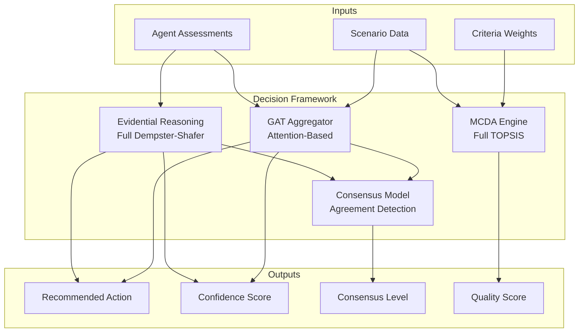

# Decision Framework - Multi-Agent Decision Aggregation

## Overview

The Decision Framework module provides the core decision-making infrastructure for the crisis management multi-agent system. It implements multiple methods for aggregating expert opinions, analyzing alternatives, building consensus, and ranking actions across competing criteria.

### Purpose

**Why This Folder Exists:**
1. **Belief Aggregation**: Combines diverse expert opinions into coherent recommendations
2. **Uncertainty Management**: Quantifies confidence and uncertainty in decisions
3. **Consensus Detection**: Identifies agreement/disagreement among agents
4. **Multi-Criteria Evaluation**: Ranks alternatives across competing criteria
5. **Dynamic Weighting**: Adapts agent importance based on scenario context

---

## Architecture

### Component Overview

```
decision_framework/
├── __init__.py                # Module exports and overview
├── evidential_reasoning.py    # Full Dempster-Shafer belief aggregation
├── gat_aggregator.py          # Graph attention network aggregator
├── mcda_engine.py             # Full TOPSIS multi-criteria decision analysis
└── consensus_model.py         # Consensus detection and conflict resolution
```

### Component Relationships



---

## Components

### 1. Evidential Reasoning (ER)

**File:** `evidential_reasoning.py`

**Purpose:** Full Dempster-Shafer belief aggregation with conflict handling

**Key Features:**
- Full Dempster's combination rule: m₁₂(A) = [Σ_{B∩C=A} m₁(B) × m₂(C)] / (1 - K)
- Conflict mass calculation: K = Σ_{B∩C=∅} m₁(B) × m₂(C)
- High conflict handling (K > 0.7) with proportional redistribution
- Entropy-based confidence scoring
- Uncertainty quantification
- Backward compatible with weighted averaging (method='weighted')

**When to Use:**
- Multiple agents with potentially conflicting views
- Need mathematically rigorous belief fusion
- Conflict detection and handling required
- Academic/research applications

**Example:**
```python
from decision_framework import EvidentialReasoning

er = EvidentialReasoning()

agent_beliefs = {
    "medical": {"A1": 0.7, "A2": 0.2, "A3": 0.1},
    "logistics": {"A1": 0.5, "A2": 0.3, "A3": 0.2}
}

agent_weights = {
    "medical": 0.55,
    "logistics": 0.45
}

# Full Dempster-Shafer combination (default)
result = er.combine_beliefs(agent_beliefs, agent_weights, method='dempster')
print(f"Combined: {result['combined_beliefs']}")
print(f"Confidence: {result['confidence']:.3f}")
print(f"Conflict mass: {result['conflict_mass']:.3f}")
print(f"Conflict detected: {result['conflict_detected']}")

# Legacy weighted averaging (backward compatible)
result_legacy = er.combine_beliefs(agent_beliefs, agent_weights, method='weighted')
```

### 2. Graph Attention Network (GAT) Aggregator

**File:** `gat_aggregator.py`

**Purpose:** Context-aware belief aggregation using attention mechanisms

**Key Features:**
- Dynamic agent weighting based on scenario
- 9-dimensional agent feature extraction
- Multi-head attention for robustness
- Trust relationship modeling
- Adaptability to heterogeneous expertise

**When to Use:**
- Diverse agent expertise domains
- Scenario type varies significantly
- Trust relationships matter
- Computational resources available
- Need context-aware weighting

**Example:**
```python
from decision_framework import GATAggregator

gat = GATAggregator(num_attention_heads=4, use_multi_head=True)

result = gat.aggregate_beliefs_with_gat(
    agent_assessments=agent_data,
    scenario=scenario_info
)

print(f"Aggregated: {result['aggregated_beliefs']}")
print(f"Attention Weights: {result['attention_weights']}")
```

### 3. MCDA Engine

**File:** `mcda_engine.py`

**Purpose:** Full TOPSIS multi-criteria decision analysis for ranking alternatives

**Key Features:**
- Full TOPSIS algorithm with ideal/anti-ideal solutions
- Vector normalization: r_ij = x_ij / √(Σ x_kj²)
- Closeness coefficient: C_i = S_i⁻ / (S_i⁺ + S_i⁻) ∈ [0, 1]
- Handles benefit and cost criteria
- Sensitivity analysis
- Weight profile comparison
- Backward compatible with weighted sum (method='weighted_sum')

**When to Use:**
- Need to rank multiple alternatives
- Multiple competing criteria (safety, cost, speed)
- Require transparent evaluation
- Distance-based ranking preferred
- Sensitivity analysis needed

**Example:**
```python
from decision_framework import MCDAEngine

mcda = MCDAEngine("scenarios/criteria_weights.json")

alternatives = scenario['available_actions']

# Full TOPSIS ranking (default)
ranked = mcda.rank_alternatives(alternatives, method='topsis')

winner = ranked[0]
print(f"Winner: {winner[0]} with closeness coefficient {winner[1]:.3f}")

# Legacy weighted sum (backward compatible)
ranked_legacy = mcda.rank_alternatives(alternatives, method='weighted_sum')

# Sensitivity analysis
sensitivity = mcda.sensitivity_analysis(
    alternatives,
    criterion_to_vary='safety',
    weight_range=(0.1, 0.6)
)
```

### 4. Consensus Model

**File:** `consensus_model.py`

**Purpose:** Detect consensus and resolve conflicts among agents

**Key Features:**
- Cosine similarity-based consensus detection
- Conflict identification and severity classification
- Compromise alternative finding
- Resolution strategy suggestions
- Consensus history tracking

**When to Use:**
- Multiple agents with potentially conflicting views
- Need to detect disagreement
- Require resolution strategies
- Building group consensus

**Example:**
```python
from decision_framework import ConsensusModel

model = ConsensusModel(consensus_threshold=0.75)

agent_beliefs = {
    "medical": {"A1": 0.8, "A2": 0.1, "A3": 0.1},
    "logistics": {"A1": 0.6, "A2": 0.3, "A3": 0.1}
}

result = model.analyze_consensus(agent_beliefs)

print(f"Consensus Level: {result['consensus_level']:.2f}")
print(f"Consensus Reached: {result['consensus_reached']}")

if result['resolution_needed']:
    print(result['resolution_suggestions'])
```

---

## Method Comparison

### Aggregation Methods

| Method | Complexity | Interpretability | Computational Cost | Best For |
|--------|-----------|------------------|-------------------|----------|
| **Evidential Reasoning (Dempster-Shafer)** | Medium | High | O(N²×M) - Fast | Conflicting agents, rigorous fusion |
| **GAT Aggregator** | High | Medium | O(N²×H×F) - Slower | Heterogeneous expertise, complex scenarios |
| **MCDA Engine (TOPSIS)** | Low | High | O(A×C) - Fast | Multi-criteria ranking, distance-based |
| **Consensus Model** | Low | High | O(N²) - Fast | Conflict detection, group decisions |

### Decision Flow

**Typical Integration Pattern:**

```
1. Expert agents generate assessments
   ↓
2. Choose aggregation method:
   - ER (simple, fast)
   - GAT (context-aware, adaptive)
   - Hybrid (combine both)
   ↓
3. Aggregate beliefs → single recommendation
   ↓
4. Consensus Model checks agreement
   ↓
5. MCDA Engine ranks alternatives
   ↓
6. Final decision with:
   - Recommended action
   - Confidence score
   - Consensus level
   - Quality score
```

---

## Configuration

### Criteria Weights

**File:** `scenarios/criteria_weights.json`

Defines decision criteria and their relative importance:

```json
{
  "decision_criteria": {
    "safety": {
      "name": "Safety",
      "weight": 0.30,
      "type": "benefit",
      "description": "Safety of the action for both responders and affected population",
      "scale": "0.0 (unsafe) to 1.0 (very safe)"
    },
    "cost": {
      "name": "Cost",
      "weight": 0.25,
      "type": "cost",
      "description": "Economic cost of implementing the action",
      "scale": "Lower is better (euros)"
    },
    "response_time": {
      "name": "Response Time",
      "weight": 0.25,
      "type": "cost",
      "description": "Time required to implement and see results",
      "scale": "Lower is better (hours)"
    },
    "social_acceptance": {
      "name": "Social Acceptance",
      "weight": 0.20,
      "type": "benefit",
      "description": "Likelihood of public cooperation and acceptance",
      "scale": "0.0 (strong resistance) to 1.0 (strong support)"
    }
  }
}
```

**Criterion Types:**
- **Benefit**: Higher values are better (maximize)
- **Cost**: Lower values are better (minimize)

**Weight Constraints:**
- Weights must sum to 1.0
- Each weight must be in range [0, 1]
- Typical distribution: Most important 0.25-0.35, least important 0.05-0.15

---

## Integration

### With Multi-Agent System

The Decision Framework integrates with the broader system:

**Coordinator Agent** (decision orchestrator):
```python
from decision_framework import EvidentialReasoning, GATAggregator, MCDAEngine

# 1. Choose aggregation method
if use_gat:
    result = gat_aggregator.aggregate_beliefs_with_gat(
        agent_assessments, scenario
    )
else:
    result = er.combine_beliefs(agent_beliefs, agent_weights)

# 2. Analyze consensus
consensus_info = consensus_model.analyze_consensus(agent_beliefs)

# 3. Rank alternatives with MCDA
mcda_scores = mcda_engine.rank_alternatives(alternatives)

# 4. Build final decision
decision = {
    'recommended_action': result['top_alternative'],
    'confidence': result['confidence'],
    'consensus_level': consensus_info['consensus_level'],
    'quality_score': mcda_scores[0][1],  # Top alternative score
    'explanation': ...
}
```

### Data Flow

```
Expert Agents
    ↓ (assessments)
Coordinator Agent
    ↓ (agent_beliefs, agent_weights)
Decision Framework
    ├→ ER or GAT → aggregated beliefs
    ├→ Consensus Model → consensus level
    └→ MCDA Engine → quality scores
    ↓
Final Decision
    ↓
Evaluation Metrics
```

---

## Mathematical Foundations and Theoretical Background

This section provides the mathematical and theoretical underpinnings of the decision aggregation methods, drawn from established research in uncertainty reasoning, neural attention mechanisms, and multi-criteria decision analysis.

### Dempster-Shafer Theory and Evidential Reasoning

**Theoretical Foundation:**

The Dempster-Shafer (DS) theory, introduced by Glenn Shafer (1976) building on Arthur Dempster's work, provides a rigorous mathematical framework for reasoning under uncertainty that extends classical probability theory. Unlike Bayesian approaches that require complete probability distributions, DS theory allows belief assignment to sets of hypotheses (power set 2^Θ), explicitly representing ignorance.

**Frame of Discernment (Θ):**
The set of all mutually exclusive and exhaustive hypotheses:
```
Θ = {H₁, H₂, ..., Hₙ}
```

**Basic Belief Assignment (bba):**
A function m: 2^Θ → [0,1] that assigns belief mass to subsets of Θ:
```
m(∅) = 0
Σ_{A⊆Θ} m(A) = 1
```

**Belief and Plausibility Functions:**
```
Bel(A) = Σ_{B⊆A} m(B)         # Lower bound: direct support
Pl(A) = Σ_{B∩A≠∅} m(B)         # Upper bound: possible support
```

The interval [Bel(A), Pl(A)] represents the uncertainty range for hypothesis A.

**Dempster's Combination Rule:**
For combining beliefs from two independent sources with belief functions m₁ and m₂:
```
m₁⊕₂(A) = (1/(1-K)) × Σ_{B∩C=A} m₁(B)·m₂(C)
```
Where K is the conflict measure:
```
K = Σ_{B∩C=∅} m₁(B)·m₂(C)
```

**Evidential Reasoning Rule (Yang & Xu, 2013):**
Extends DS theory with weighted and reliability-adjusted combination:
```
m_{i,j}(A) = [wᵢrᵢmᵢ(A)[1+wⱼrⱼmⱼ(Θ)] + wⱼrⱼmⱼ(A)[1+wᵢrᵢmᵢ(Θ)]] / K_ER
```
Where:
- wᵢ ∈ [0,1]: relative importance (weight) of source i
- rᵢ ∈ [0,1]: reliability of source i
- K_ER: normalization factor ensuring Σm(A) = 1

**Implementation in This System:**

Our full Dempster-Shafer implementation uses the complete combination rule with conflict handling:

```
m₁₂(A) = [Σ_{B∩C=A} m₁(B) × m₂(C)] / (1 - K)

Where conflict mass K = Σ_{B∩C=∅} m₁(B) × m₂(C)
```

For singleton hypotheses (disjoint alternatives), this simplifies to:
```
m₁₂(Aᵢ) = m₁(Aᵢ) × m₂(Aᵢ) / (1 - K)
```

**High Conflict Handling (K > 0.7):**
When conflict exceeds threshold, proportional redistribution is applied:
```
m_adjusted(A) = m_avg(A) + K × (m_avg(A) / Σ_supported)
```

**Backward Compatibility:**
Legacy weighted averaging is available via `method='weighted'`:
```
combined_belief(A_i) = Σⱼ(wⱼ × rⱼ × beliefⱼ(A_i)) / Σⱼ(wⱼ × rⱼ)
```

Where:
- A_i: Alternative i (e.g., "Immediate Evacuation")
- wⱼ: Static weight of agent j based on expertise relevance
- rⱼ: Dynamic reliability of agent j from historical performance
- beliefⱼ(A_i): Agent j's belief in alternative i

**Confidence Quantification (Entropy-Based):**
```
confidence = 1 - (H / H_max)
H = -Σᵢ pᵢ × log₂(pᵢ)         # Shannon entropy
H_max = log₂(N)                 # Maximum entropy for N alternatives
```

Lower entropy indicates concentrated belief (high confidence), while higher entropy indicates distributed belief (low confidence).

### Graph Attention Networks (GAT)

**Theoretical Foundation:**

Graph Attention Networks (Veličković et al., 2018) extend convolutional neural networks to graph-structured data using attention mechanisms. Unlike fixed Graph Convolutional Networks (Kipf & Welling, 2017), GATs compute dynamic node importance through learned attention coefficients.

**Attention Mechanism:**

For each node pair (i,j) in the agent network:

1. **Feature Transformation:**
```
h'ᵢ = W·hᵢ
```
Where W ∈ ℝ^(F'×F) is a learnable weight matrix transforming F-dimensional features to F'-dimensional space.

2. **Attention Coefficient Computation:**
```
eᵢⱼ = a(W·hᵢ, W·hⱼ)
   = LeakyReLU(a^T [W·hᵢ || W·hⱼ])
```
Where:
- a ∈ ℝ^(2F'): learnable attention weights
- ||: concatenation operator
- LeakyReLU(x) = max(0.01x, x): non-linearity preventing dead neurons

3. **Normalization (Softmax):**
```
αᵢⱼ = softmaxⱼ(eᵢⱼ) = exp(eᵢⱼ) / Σₖ∈𝒩ᵢ exp(eᵢₖ)
```

4. **Multi-Head Attention (K heads):**
```
h'ᵢ = σ(1/K × Σₖ₌₁^K Σⱼ∈𝒩ᵢ αᵢⱼ^k W^k hⱼ)
```
Where σ is a non-linear activation (typically ELU or sigmoid).

**Agent Feature Extraction (9-dimensional vector):**

Following Zhou et al. (2025) on large-scale emergency group decision-making, our system extracts:

1. **Confidence Level**: LLM-reported confidence score [0,1]
2. **Belief Certainty**: 1 - (entropy/max_entropy) measuring decisiveness
3. **Domain Expertise Relevance**: Scenario-to-agent expertise matching [0,1]
4. **Risk Tolerance**: Agent's propensity for high-risk alternatives
5. **Severity Awareness**: Normalized scenario severity recognition
6. **Top Choice Strength**: Belief mass on highest-ranked alternative
7. **Assessment Thoroughness**: Reasoning detail and depth measure
8. **Reasoning Quality**: Logical consistency and justification strength
9. **Historical Reliability**: Performance tracking from past scenarios

**Aggregated Belief Computation:**
```
combined_belief(Aᵢ) = Σⱼ αᵢⱼ × beliefⱼ(Aᵢ)
```
Where αᵢⱼ are the learned attention weights representing agent j's influence on the final decision.

### Multi-Criteria Decision Analysis (MCDA)

**Theoretical Foundation:**

MCDA methods (Hwang & Yoon, 1981; Behzadian et al., 2012) provide structured approaches for evaluating alternatives across competing criteria. Our implementation uses TOPSIS (Technique for Order Preference by Similarity to Ideal Solution) for its geometric interpretability and computational efficiency.

**TOPSIS Algorithm:**

1. **Decision Matrix Construction:**
```
D = [xᵢⱼ]ₘₓₙ
```
Where xᵢⱼ is the score of alternative i on criterion j.

2. **Vector Normalization:**
```
rᵢⱼ = xᵢⱼ / √(Σₖ₌₁^m xₖⱼ²)
```

3. **Weighted Normalized Matrix:**
```
vᵢⱼ = wⱼ × rᵢⱼ
```
Where wⱼ is the importance weight of criterion j (Σwⱼ = 1).

4. **Ideal Solutions:**
```
A⁺ = {v₁⁺, v₂⁺, ..., vₙ⁺}  # Best on each criterion
A⁻ = {v₁⁻, v₂⁻, ..., vₙ⁻}  # Worst on each criterion
```

5. **Euclidean Distance:**
```
Sᵢ⁺ = √(Σⱼ₌₁^n (vᵢⱼ - vⱼ⁺)²)  # Distance from ideal
Sᵢ⁻ = √(Σⱼ₌₁^n (vᵢⱼ - vⱼ⁻)²)  # Distance from anti-ideal
```

6. **Relative Closeness (Final Score):**
```
Cᵢ = Sᵢ⁻ / (Sᵢ⁺ + Sᵢ⁻) ∈ [0,1]
```
Higher Cᵢ indicates better overall performance.

**Criterion Types:**
- **Benefit Criteria**: Higher values preferred (effectiveness, safety, speed)
- **Cost Criteria**: Lower values preferred (financial cost, resource consumption)

### Consensus Detection Model

**Theoretical Foundation:**

Consensus measurement in multi-agent systems requires quantifying agreement across belief distributions (Carneiro et al., 2020).

**Cosine Similarity Between Agents:**
```
similarity(i,j) = (bᵢ · bⱼ) / (||bᵢ|| × ||bⱼ||)
                = Σₖ bᵢ(Aₖ)·bⱼ(Aₖ) / √(Σₖbᵢ²(Aₖ)) × √(Σₖbⱼ²(Aₖ))
```
Where bᵢ(Aₖ) is agent i's belief in alternative k.

**Consensus Level (Group Agreement):**
```
consensus = (2/(N(N-1))) × ΣᵢΣⱼ₍ⱼ>ᵢ₎ similarity(i,j)
```
Average over all agent pairs.

**Conflict Detection:**
When consensus < threshold (typically 0.75), conflicts are identified and severity classified:
- **High Severity**: Agents recommend contradictory actions (consensus < 0.5)
- **Moderate**: Partial disagreement on rankings (0.5 ≤ consensus < 0.75)
- **Low**: Minor preference variations (consensus ≥ 0.75)

### Computational Complexity Analysis

| Method | Time Complexity | Space Complexity | Typical Runtime |
|--------|-----------------|------------------|-----------------|
| ER Aggregation | O(N × M) | O(N × M) | < 1ms |
| GAT Aggregation | O(N² × H × F + N × M) | O(N² + N × F) | 1-5ms |
| MCDA (TOPSIS) | O(M × C) | O(M × C) | < 1ms |
| Consensus | O(N² × M) | O(N × M) | < 1ms |

Where:
- N = number of agents (typically 3-13)
- M = number of alternatives (typically 3-10)
- C = number of criteria (typically 5-8)
- H = attention heads (typically 4)
- F = feature dimensions (9)

---

## Performance

### Computational Complexity

| Component | Time Complexity | Space Complexity | Typical Runtime |
|-----------|----------------|------------------|-----------------|
| ER | O(N × M) | O(N × M) | < 1ms |
| GAT | O(N² × H × F + N × M) | O(N² + N × M) | 1-5ms |
| MCDA | O(A × C) | O(A × C) | < 1ms |
| Consensus | O(N² × M) | O(N × M) | < 1ms |

**Variables:**
- N = number of agents (typically 3-10)
- M = number of alternatives (typically 3-10)
- A = number of alternatives (typically 3-10)
- C = number of criteria (typically 5-8)
- H = number of attention heads (typically 4)
- F = feature dimensionality (9)

### Scalability

**Agent Scalability:**
- ER: Linear in agents (O(N))
- GAT: Quadratic in agents (O(N²))
- Practical limit: ~20 agents for GAT, ~100 for ER

**Alternative Scalability:**
- All methods: Linear in alternatives (O(M))
- Practical limit: ~50 alternatives

**Criteria Scalability:**
- MCDA: Linear in criteria (O(C))
- Practical limit: ~20 criteria

---

## Best Practices

### Choosing Aggregation Method

**Use Evidential Reasoning (Dempster-Shafer) when:**
- Agents may have conflicting views
- Need mathematically rigorous belief fusion
- Conflict detection and handling is important
- Academic/research applications require full theory
- Want explicit conflict mass reporting

**Use GAT Aggregator when:**
- Agents have diverse expertise domains
- Scenario type varies (flood vs. pandemic vs. fire)
- Trust relationships are important
- Context-aware weighting needed
- Computational resources available (1-5ms acceptable)

**Use Hybrid Approach when:**
- Need balance of speed and adaptability
- Production system requiring robustness
- Fall back to ER if GAT fails

### MCDA Best Practices

1. **Weight Calibration:**
   - Start with equal weights (1/C for each)
   - Adjust based on stakeholder input
   - Validate with sensitivity analysis

2. **Criterion Design:**
   - 5-8 criteria ideal (not too few, not too many)
   - Ensure independence (criteria don't overlap)
   - Mix benefit and cost criteria

3. **Sensitivity Testing:**
   - Test ±20% weight variations
   - Identify robust winners (stable across variations)
   - Document critical weight thresholds

### Consensus Management

1. **Threshold Selection:**
   - 0.75 default (75% agreement)
   - Higher for critical decisions (0.85+)
   - Lower for time-sensitive (0.60-0.70)

2. **Conflict Resolution:**
   - High severity → Escalate to human
   - Moderate → Explore compromises
   - Low → Weighted voting acceptable

3. **History Tracking:**
   - Monitor consensus trends over time
   - Identify frequently conflicting agent pairs
   - Adjust weights or conflict thresholds

---

## Error Handling

### Common Errors

**FileNotFoundError:**
```python
# criteria_weights.json missing
try:
    mcda = MCDAEngine("scenarios/criteria_weights.json")
except FileNotFoundError:
    logger.error("Criteria weights file not found")
    # Use default weights or raise error
```

**ValueError - Invalid Inputs:**
```python
# Empty agent beliefs
try:
    result = er.combine_beliefs({}, {})
except ValueError as e:
    logger.error(f"Invalid input: {e}")
    # Return default decision or error response
```

**Computation Failures:**
```python
# GAT aggregation fails
try:
    result = gat.aggregate_beliefs_with_gat(assessments, scenario)
except Exception as e:
    logger.error(f"GAT failed: {e}, falling back to ER")
    result = er.combine_beliefs(beliefs, weights)
```

### Graceful Degradation

The system includes fallback mechanisms:
1. GAT fails → Fall back to ER
2. ER fails → Use simple averaging
3. MCDA fails → Use belief aggregation scores
4. Consensus fails → Proceed without consensus check

---

## Testing

### Unit Tests

Run tests for each component:

```bash
# Test Evidential Reasoning
pytest tests/test_evidential_reasoning.py

# Test GAT Aggregator
pytest tests/test_gat_aggregator.py

# Test MCDA Engine
pytest tests/test_mcda_engine.py

# Test Consensus Model
pytest tests/test_consensus_model.py
```

### Validation Scenarios

**Test Case 1: Perfect Agreement**
```python
# All agents agree on A1
agent_beliefs = {
    "agent1": {"A1": 0.9, "A2": 0.05, "A3": 0.05},
    "agent2": {"A1": 0.9, "A2": 0.05, "A3": 0.05}
}
# Expected: consensus_level ≈ 1.0, high confidence
```

**Test Case 2: Complete Disagreement**
```python
# Agents prefer different alternatives
agent_beliefs = {
    "agent1": {"A1": 0.9, "A2": 0.05, "A3": 0.05},
    "agent2": {"A1": 0.05, "A2": 0.9, "A3": 0.05}
}
# Expected: consensus_level < 0.5, conflicts detected
```

**Test Case 3: Weight Sensitivity**
```python
# Test MCDA ranking stability
sensitivity = mcda.sensitivity_analysis(
    alternatives,
    criterion_to_vary='safety',
    weight_range=(0.1, 0.6)
)
# Expected: Identify weight thresholds where winner changes
```

---

## Troubleshooting

### ER Returns Low Confidence

**Problem:** Confidence score < 0.3 despite agent agreement

**Solution:**
- Check belief distributions are not uniform
- Verify agents have clear top choices
- Ensure beliefs sum to 1.0

### GAT Produces Unexpected Weights

**Problem:** Agent importance doesn't match expectations

**Solution:**
- Check agent features are being extracted correctly
- Verify expertise relevance matching
- Review trust matrix if provided

### MCDA Rankings Seem Wrong

**Problem:** Lower-quality alternative ranked first

**Solution:**
- Verify criterion types (benefit vs. cost)
- Check weight configuration
- Ensure criteria scores are properly normalized

### Consensus Not Detected

**Problem:** Consensus threshold not met despite agreement

**Solution:**
- Lower consensus threshold (e.g., 0.75 → 0.65)
- Check belief distributions are properly formatted
- Verify all agents' beliefs sum to ~1.0

---

## Related Documentation

### Internal Documentation
- `../agents/README.md`: Expert agent implementation
- `../scenarios/README.md`: Scenario structure and criteria
- `../evaluation/EVALUATION_METHODOLOGY.md`: Decision quality metrics
- `../README.md`: Overall system architecture

### Research References
- **Evidential Reasoning**: Shafer, G. (1976). A Mathematical Theory of Evidence
- **Graph Attention Networks**: Veličković et al. (2018). Graph Attention Networks. ICLR 2018
- **MCDA/TOPSIS**: Hwang, C.L. & Yoon, K. (1981). Multiple Attribute Decision Making
- **Multi-Agent Systems**: Wooldridge, M. (2009). An Introduction to MultiAgent Systems

---

## Version History

| Version | Date | Changes |
|---------|------|---------|
| 1.0 | 2023-Q1 | Initial implementation with ER and MCDA |
| 1.1 | 2023-Q2 | Added Consensus Model |
| 1.2 | 2023-Q3 | Added GAT Aggregator |
| 2.0 | 2024-Q4 | Enhanced with reliability tracking integration |
| 2.1 | 2025-01-09 | Fixed evaluation methodology, comprehensive documentation |
| 2.2 | 2026-01-24 | Full Dempster-Shafer implementation with conflict handling (K > 0.7) |
| 2.3 | 2026-01-24 | Full TOPSIS implementation with ideal/anti-ideal solutions |

---

## Future Enhancements

### Planned Features

1. **Learned GAT Weights**
   - Train attention weights on historical decisions
   - Requires dataset of past decisions and outcomes
   - Would improve context adaptation

2. **Dynamic Criteria Weighting**
   - Adjust criterion weights based on scenario severity
   - Example: Safety weight increases in high-severity crises

3. **Temporal Modeling**
   - Track agent performance over time
   - Adapt weights based on recent accuracy
   - Detect degrading or improving agents

4. **Hierarchical Decision-Making**
   - Multi-level decision structure
   - Strategic vs. tactical decisions
   - Delegation to specialized sub-teams

5. **Uncertainty Propagation**
   - Propagate uncertainty through decision pipeline
   - Quantify confidence bounds
   - Identify high-risk decisions

### Research Directions

- Reinforcement learning for weight adaptation
- Bayesian approaches to uncertainty quantification
- Game-theoretic conflict resolution
- Explainable AI for decision transparency
- Extended Dempster-Shafer with non-singleton focal elements
- Fuzzy TOPSIS for imprecise criteria scores

---

## Contact and Support

For questions, issues, or contributions related to the Decision Framework:

1. **Documentation Issues**: Update relevant docstrings and README
2. **Bug Reports**: Include minimal reproduction example
3. **Feature Requests**: Describe use case and expected behavior
4. **Performance Issues**: Provide profiling data and input size

---

## License

This module is part of the Crisis Management Multi-Agent System proof-of-concept.
