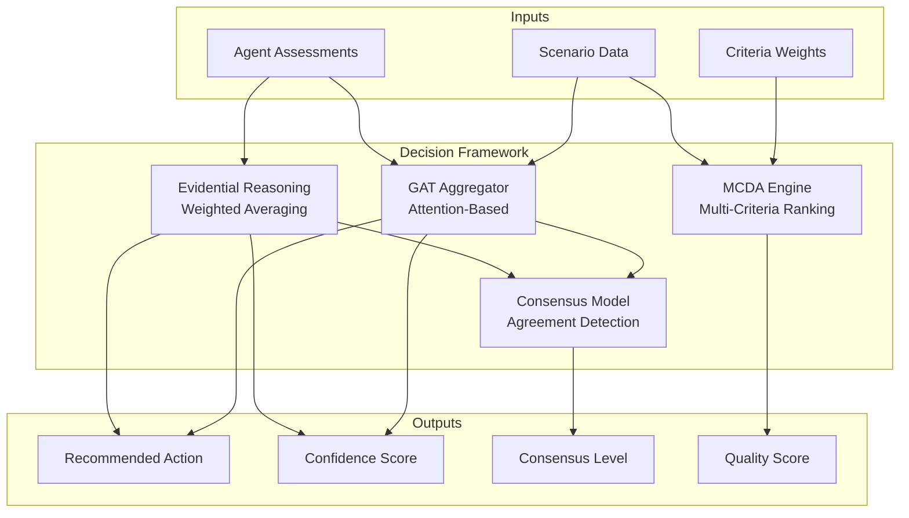

# Decision Framework - Multi-Agent Decision Aggregation

## Overview

The Decision Framework module provides the core decision-making infrastructure for the crisis management multi-agent system. It implements multiple methods for aggregating expert opinions, analyzing alternatives, building consensus, and ranking actions across competing criteria.

### Purpose

**Why This Folder Exists:**
1. **Belief Aggregation**: Combines diverse expert opinions into coherent recommendations
2. **Uncertainty Management**: Quantifies confidence and uncertainty in decisions
3. **Consensus Detection**: Identifies agreement/disagreement among agents
4. **Multi-Criteria Evaluation**: Ranks alternatives across competing criteria
5. **Dynamic Weighting**: Adapts agent importance based on scenario context

---

## Architecture

### Component Overview

```
decision_framework/
├── __init__.py                # Module exports and overview
├── evidential_reasoning.py    # Simplified ER for belief aggregation
├── gat_aggregator.py          # Graph attention network aggregator
├── mcda_engine.py             # Multi-criteria decision analysis
└── consensus_model.py         # Consensus detection and conflict resolution
```

### Component Relationships



---

## Components

### 1. Evidential Reasoning (ER)

**File:** `evidential_reasoning.py`

**Purpose:** Simplified belief aggregation using weighted averaging

**Key Features:**
- Weighted averaging of belief distributions
- Entropy-based confidence scoring
- Uncertainty quantification
- Fast computation (O(N×M))
- High interpretability

**When to Use:**
- Homogeneous agents (similar expertise)
- Time-critical decisions
- Need simple explanations
- Limited computational resources

**Example:**
```python
from decision_framework import EvidentialReasoning

er = EvidentialReasoning()

agent_beliefs = {
    "medical": {"A1": 0.7, "A2": 0.2, "A3": 0.1},
    "logistics": {"A1": 0.5, "A2": 0.3, "A3": 0.2}
}

agent_weights = {
    "medical": 0.55,
    "logistics": 0.45
}

result = er.combine_beliefs(agent_beliefs, agent_weights)
print(f"Combined: {result['combined_beliefs']}")
print(f"Confidence: {result['confidence']:.3f}")
```

### 2. Graph Attention Network (GAT) Aggregator

**File:** `gat_aggregator.py`

**Purpose:** Context-aware belief aggregation using attention mechanisms

**Key Features:**
- Dynamic agent weighting based on scenario
- 9-dimensional agent feature extraction
- Multi-head attention for robustness
- Trust relationship modeling
- Adaptability to heterogeneous expertise

**When to Use:**
- Diverse agent expertise domains
- Scenario type varies significantly
- Trust relationships matter
- Computational resources available
- Need context-aware weighting

**Example:**
```python
from decision_framework import GATAggregator

gat = GATAggregator(num_attention_heads=4, use_multi_head=True)

result = gat.aggregate_beliefs_with_gat(
    agent_assessments=agent_data,
    scenario=scenario_info
)

print(f"Aggregated: {result['aggregated_beliefs']}")
print(f"Attention Weights: {result['attention_weights']}")
```

### 3. MCDA Engine

**File:** `mcda_engine.py`

**Purpose:** Multi-criteria decision analysis for ranking alternatives

**Key Features:**
- Weighted sum with vector normalization
- Handles benefit and cost criteria
- Sensitivity analysis
- Weight profile comparison
- Human-readable explanations

**When to Use:**
- Need to rank multiple alternatives
- Multiple competing criteria (safety, cost, speed)
- Require transparent evaluation
- Sensitivity analysis needed

**Example:**
```python
from decision_framework import MCDAEngine

mcda = MCDAEngine("scenarios/criteria_weights.json")

alternatives = scenario['available_actions']
ranked = mcda.rank_alternatives(alternatives)

winner = ranked[0]
print(f"Winner: {winner[0]} with score {winner[1]:.3f}")

# Sensitivity analysis
sensitivity = mcda.sensitivity_analysis(
    alternatives,
    criterion_to_vary='safety',
    weight_range=(0.1, 0.6)
)
```

### 4. Consensus Model

**File:** `consensus_model.py`

**Purpose:** Detect consensus and resolve conflicts among agents

**Key Features:**
- Cosine similarity-based consensus detection
- Conflict identification and severity classification
- Compromise alternative finding
- Resolution strategy suggestions
- Consensus history tracking

**When to Use:**
- Multiple agents with potentially conflicting views
- Need to detect disagreement
- Require resolution strategies
- Building group consensus

**Example:**
```python
from decision_framework import ConsensusModel

model = ConsensusModel(consensus_threshold=0.75)

agent_beliefs = {
    "medical": {"A1": 0.8, "A2": 0.1, "A3": 0.1},
    "logistics": {"A1": 0.6, "A2": 0.3, "A3": 0.1}
}

result = model.analyze_consensus(agent_beliefs)

print(f"Consensus Level: {result['consensus_level']:.2f}")
print(f"Consensus Reached: {result['consensus_reached']}")

if result['resolution_needed']:
    print(result['resolution_suggestions'])
```

---

## Method Comparison

### Aggregation Methods

| Method | Complexity | Interpretability | Computational Cost | Best For |
|--------|-----------|------------------|-------------------|----------|
| **Evidential Reasoning** | Low | High | O(N×M) - Fast | Homogeneous agents, time-critical |
| **GAT Aggregator** | High | Medium | O(N²×H×F) - Slower | Heterogeneous expertise, complex scenarios |
| **MCDA Engine** | Low | High | O(A×C) - Fast | Multi-criteria ranking, transparent evaluation |
| **Consensus Model** | Low | High | O(N²) - Fast | Conflict detection, group decisions |

### Decision Flow

**Typical Integration Pattern:**

```
1. Expert agents generate assessments
   ↓
2. Choose aggregation method:
   - ER (simple, fast)
   - GAT (context-aware, adaptive)
   - Hybrid (combine both)
   ↓
3. Aggregate beliefs → single recommendation
   ↓
4. Consensus Model checks agreement
   ↓
5. MCDA Engine ranks alternatives
   ↓
6. Final decision with:
   - Recommended action
   - Confidence score
   - Consensus level
   - Quality score
```

---

## Configuration

### Criteria Weights

**File:** `scenarios/criteria_weights.json`

Defines decision criteria and their relative importance:

```json
{
  "decision_criteria": {
    "effectiveness": {
      "name": "Effectiveness",
      "weight": 0.30,
      "type": "benefit",
      "description": "How well the action addresses the crisis"
    },
    "safety": {
      "name": "Safety",
      "weight": 0.25,
      "type": "benefit",
      "description": "Safety for responders and affected population"
    },
    "speed": {
      "name": "Response Speed",
      "weight": 0.20,
      "type": "benefit",
      "description": "How quickly the action can be executed"
    },
    "cost": {
      "name": "Cost",
      "weight": 0.15,
      "type": "cost",
      "description": "Financial and resource cost"
    },
    "public_acceptance": {
      "name": "Public Acceptance",
      "weight": 0.10,
      "type": "benefit",
      "description": "Level of public support"
    }
  }
}
```

**Criterion Types:**
- **Benefit**: Higher values are better (maximize)
- **Cost**: Lower values are better (minimize)

**Weight Constraints:**
- Weights must sum to 1.0
- Each weight must be in range [0, 1]
- Typical distribution: Most important 0.25-0.35, least important 0.05-0.15

---

## Integration

### With Multi-Agent System

The Decision Framework integrates with the broader system:

**Coordinator Agent** (decision orchestrator):
```python
from decision_framework import EvidentialReasoning, GATAggregator, MCDAEngine

# 1. Choose aggregation method
if use_gat:
    result = gat_aggregator.aggregate_beliefs_with_gat(
        agent_assessments, scenario
    )
else:
    result = er.combine_beliefs(agent_beliefs, agent_weights)

# 2. Analyze consensus
consensus_info = consensus_model.analyze_consensus(agent_beliefs)

# 3. Rank alternatives with MCDA
mcda_scores = mcda_engine.rank_alternatives(alternatives)

# 4. Build final decision
decision = {
    'recommended_action': result['top_alternative'],
    'confidence': result['confidence'],
    'consensus_level': consensus_info['consensus_level'],
    'quality_score': mcda_scores[0][1],  # Top alternative score
    'explanation': ...
}
```

### Data Flow

```
Expert Agents
    ↓ (assessments)
Coordinator Agent
    ↓ (agent_beliefs, agent_weights)
Decision Framework
    ├→ ER or GAT → aggregated beliefs
    ├→ Consensus Model → consensus level
    └→ MCDA Engine → quality scores
    ↓
Final Decision
    ↓
Evaluation Metrics
```

---

## Mathematical Foundations

### Evidential Reasoning

**Weighted Average:**
```
combined_belief(A_i) = Σ(w_j × belief_j(A_i)) / Σ(w_j)
```

**Confidence (Entropy-Based):**
```
confidence = 1 - (entropy / max_entropy)
entropy = -Σ(p_i × log₂(p_i))
```

### Graph Attention Network

**Attention Coefficient:**
```
α_ij = softmax_j(LeakyReLU(a^T [W h_i || W h_j]))
```

**Agent Features:** 9-dimensional vector:
1. Confidence score
2. Belief certainty (inverse entropy)
3. Expertise relevance
4. Risk tolerance
5. Severity awareness
6. Top choice strength
7. Thoroughness
8. Reasoning quality
9. Historical reliability

### MCDA Engine

**Weighted Sum:**
```
score(A) = Σ [w_i × normalized(v_i)]
```

**Normalization:**
- Benefit: `(v - min) / (max - min)`
- Cost: `(max - v) / (max - min)`

### Consensus Model

**Cosine Similarity:**
```
similarity = (A · B) / (||A|| × ||B||)
```

**Consensus Level:** Average pairwise similarity

---

## Performance

### Computational Complexity

| Component | Time Complexity | Space Complexity | Typical Runtime |
|-----------|----------------|------------------|-----------------|
| ER | O(N × M) | O(N × M) | < 1ms |
| GAT | O(N² × H × F + N × M) | O(N² + N × M) | 1-5ms |
| MCDA | O(A × C) | O(A × C) | < 1ms |
| Consensus | O(N² × M) | O(N × M) | < 1ms |

**Variables:**
- N = number of agents (typically 3-10)
- M = number of alternatives (typically 3-10)
- A = number of alternatives (typically 3-10)
- C = number of criteria (typically 5-8)
- H = number of attention heads (typically 4)
- F = feature dimensionality (9)

### Scalability

**Agent Scalability:**
- ER: Linear in agents (O(N))
- GAT: Quadratic in agents (O(N²))
- Practical limit: ~20 agents for GAT, ~100 for ER

**Alternative Scalability:**
- All methods: Linear in alternatives (O(M))
- Practical limit: ~50 alternatives

**Criteria Scalability:**
- MCDA: Linear in criteria (O(C))
- Practical limit: ~20 criteria

---

## Best Practices

### Choosing Aggregation Method

**Use Evidential Reasoning when:**
- Agents have similar expertise
- Speed is critical (< 1ms required)
- Simple explanation needed for stakeholders
- Limited computational resources
- Agent reliability weights are well-established

**Use GAT Aggregator when:**
- Agents have diverse expertise domains
- Scenario type varies (flood vs. pandemic vs. fire)
- Trust relationships are important
- Context-aware weighting needed
- Computational resources available (1-5ms acceptable)

**Use Hybrid Approach when:**
- Need balance of speed and adaptability
- Production system requiring robustness
- Fall back to ER if GAT fails

### MCDA Best Practices

1. **Weight Calibration:**
   - Start with equal weights (1/C for each)
   - Adjust based on stakeholder input
   - Validate with sensitivity analysis

2. **Criterion Design:**
   - 5-8 criteria ideal (not too few, not too many)
   - Ensure independence (criteria don't overlap)
   - Mix benefit and cost criteria

3. **Sensitivity Testing:**
   - Test ±20% weight variations
   - Identify robust winners (stable across variations)
   - Document critical weight thresholds

### Consensus Management

1. **Threshold Selection:**
   - 0.75 default (75% agreement)
   - Higher for critical decisions (0.85+)
   - Lower for time-sensitive (0.60-0.70)

2. **Conflict Resolution:**
   - High severity → Escalate to human
   - Moderate → Explore compromises
   - Low → Weighted voting acceptable

3. **History Tracking:**
   - Monitor consensus trends over time
   - Identify frequently conflicting agent pairs
   - Adjust weights or conflict thresholds

---

## Error Handling

### Common Errors

**FileNotFoundError:**
```python
# criteria_weights.json missing
try:
    mcda = MCDAEngine("scenarios/criteria_weights.json")
except FileNotFoundError:
    logger.error("Criteria weights file not found")
    # Use default weights or raise error
```

**ValueError - Invalid Inputs:**
```python
# Empty agent beliefs
try:
    result = er.combine_beliefs({}, {})
except ValueError as e:
    logger.error(f"Invalid input: {e}")
    # Return default decision or error response
```

**Computation Failures:**
```python
# GAT aggregation fails
try:
    result = gat.aggregate_beliefs_with_gat(assessments, scenario)
except Exception as e:
    logger.error(f"GAT failed: {e}, falling back to ER")
    result = er.combine_beliefs(beliefs, weights)
```

### Graceful Degradation

The system includes fallback mechanisms:
1. GAT fails → Fall back to ER
2. ER fails → Use simple averaging
3. MCDA fails → Use belief aggregation scores
4. Consensus fails → Proceed without consensus check

---

## Testing

### Unit Tests

Run tests for each component:

```bash
# Test Evidential Reasoning
pytest tests/test_evidential_reasoning.py

# Test GAT Aggregator
pytest tests/test_gat_aggregator.py

# Test MCDA Engine
pytest tests/test_mcda_engine.py

# Test Consensus Model
pytest tests/test_consensus_model.py
```

### Validation Scenarios

**Test Case 1: Perfect Agreement**
```python
# All agents agree on A1
agent_beliefs = {
    "agent1": {"A1": 0.9, "A2": 0.05, "A3": 0.05},
    "agent2": {"A1": 0.9, "A2": 0.05, "A3": 0.05}
}
# Expected: consensus_level ≈ 1.0, high confidence
```

**Test Case 2: Complete Disagreement**
```python
# Agents prefer different alternatives
agent_beliefs = {
    "agent1": {"A1": 0.9, "A2": 0.05, "A3": 0.05},
    "agent2": {"A1": 0.05, "A2": 0.9, "A3": 0.05}
}
# Expected: consensus_level < 0.5, conflicts detected
```

**Test Case 3: Weight Sensitivity**
```python
# Test MCDA ranking stability
sensitivity = mcda.sensitivity_analysis(
    alternatives,
    criterion_to_vary='safety',
    weight_range=(0.1, 0.6)
)
# Expected: Identify weight thresholds where winner changes
```

---

## Troubleshooting

### ER Returns Low Confidence

**Problem:** Confidence score < 0.3 despite agent agreement

**Solution:**
- Check belief distributions are not uniform
- Verify agents have clear top choices
- Ensure beliefs sum to 1.0

### GAT Produces Unexpected Weights

**Problem:** Agent importance doesn't match expectations

**Solution:**
- Check agent features are being extracted correctly
- Verify expertise relevance matching
- Review trust matrix if provided

### MCDA Rankings Seem Wrong

**Problem:** Lower-quality alternative ranked first

**Solution:**
- Verify criterion types (benefit vs. cost)
- Check weight configuration
- Ensure criteria scores are properly normalized

### Consensus Not Detected

**Problem:** Consensus threshold not met despite agreement

**Solution:**
- Lower consensus threshold (e.g., 0.75 → 0.65)
- Check belief distributions are properly formatted
- Verify all agents' beliefs sum to ~1.0

---

## Related Documentation

### Internal Documentation
- `../agents/README.md`: Expert agent implementation
- `../scenarios/README.md`: Scenario structure and criteria
- `../evaluation/EVALUATION_METHODOLOGY.md`: Decision quality metrics
- `../README.md`: Overall system architecture

### Research References
- **Evidential Reasoning**: Shafer, G. (1976). A Mathematical Theory of Evidence
- **Graph Attention Networks**: Veličković et al. (2018). Graph Attention Networks. ICLR 2018
- **MCDA/TOPSIS**: Hwang, C.L. & Yoon, K. (1981). Multiple Attribute Decision Making
- **Multi-Agent Systems**: Wooldridge, M. (2009). An Introduction to MultiAgent Systems

---

## Version History

| Version | Date | Changes |
|---------|------|---------|
| 1.0 | 2023-Q1 | Initial implementation with ER and MCDA |
| 1.1 | 2023-Q2 | Added Consensus Model |
| 1.2 | 2023-Q3 | Added GAT Aggregator |
| 2.0 | 2024-Q4 | Enhanced with reliability tracking integration |
| 2.1 | 2025-01-09 | Fixed evaluation methodology, comprehensive documentation |

---

## Future Enhancements

### Planned Features

1. **Learned GAT Weights**
   - Train attention weights on historical decisions
   - Requires dataset of past decisions and outcomes
   - Would improve context adaptation

2. **Dynamic Criteria Weighting**
   - Adjust criterion weights based on scenario severity
   - Example: Safety weight increases in high-severity crises

3. **Temporal Modeling**
   - Track agent performance over time
   - Adapt weights based on recent accuracy
   - Detect degrading or improving agents

4. **Hierarchical Decision-Making**
   - Multi-level decision structure
   - Strategic vs. tactical decisions
   - Delegation to specialized sub-teams

5. **Uncertainty Propagation**
   - Propagate uncertainty through decision pipeline
   - Quantify confidence bounds
   - Identify high-risk decisions

### Research Directions

- Reinforcement learning for weight adaptation
- Bayesian approaches to uncertainty quantification
- Game-theoretic conflict resolution
- Explainable AI for decision transparency

---

## Contact and Support

For questions, issues, or contributions related to the Decision Framework:

1. **Documentation Issues**: Update relevant docstrings and README
2. **Bug Reports**: Include minimal reproduction example
3. **Feature Requests**: Describe use case and expected behavior
4. **Performance Issues**: Provide profiling data and input size

---

## License

This module is part of the Crisis Management Multi-Agent System proof-of-concept.
