# Architecture

> **Viewing Diagrams:** This documentation contains Mermaid diagrams that render automatically on GitHub. If you're viewing in a text editor or IDE without Mermaid support, you can:
> - Open `docs/architecture_viewer.html` in a web browser for rendered diagrams
> - View the README on GitHub where diagrams render automatically
> - Use https://mermaid.live to render diagram code
> - See `ARCHITECTURE_DIAGRAMS.md` for all system diagrams

## System Components

The Crisis MAS consists of six core layers with integrated evaluation framework and 13 expert agents organized in a two-level Gold-Silver command hierarchy:

```mermaid
graph TB
    subgraph UI["USER INTERFACE LAYER"]
        Main[main.py<br/>CLI & Orchestration]
        Input[JSON I/O<br/>Scenarios & Config]
        Output[Visualization<br/>Generation]
    end

    subgraph Coord["COORDINATION LAYER"]
        CA[CoordinatorAgent<br/>Orchestration & Consensus]
        CS[Consensus<br/>Builder]
        CR[Conflict<br/>Resolution]
    end

    subgraph Agents["AGENT LAYER - 13 Expert Roles"]
        direction TB
        subgraph Silver["SILVER — Tactical / Advisory (8 Agents)"]
            T1[Police On-Scene]
            T2[Fire On-Scene]
            T3[Coast Guard Tactical]
            T4[Medical Tactical]
            T5[Meteorologist]
            T6[Logistics Coordinator]
            T7[PSAP Coordinator]
            T8[Environmental Expert]
        end
        subgraph Gold["GOLD — Strategic (5 Agents)"]
            S1[Police Regional]
            S2[Fire Regional]
            S3[Coast Guard National]
            S4[Civil Protection Director]
            S5[Medical Infrastructure]
        end
        BA[BaseAgent<br/>Interface]
        RT[ReliabilityTracker<br/>Performance History]
    end

    subgraph DF["DECISION FRAMEWORK LAYER"]
        direction TB
        ER[EvidentialReasoning<br/>Dempster-Shafer]
        GAT[GATAggregator<br/>Neural Attention]
        MCDA[MCDAEngine<br/>TOPSIS]
        CM[ConflictModel<br/>Resolution]
    end

    subgraph LLM["LLM INTEGRATION LAYER"]
        direction LR
        Claude[Claude API<br/>Anthropic]
        OpenAI[OpenAI API<br/>GPT-4]
        LMStudio[LM Studio<br/>Local Models]
        Prompt[Prompt<br/>Templates]
        Parser[Response<br/>Parser]
    end

    subgraph Eval["EVALUATION & UTILITIES LAYER"]
        direction TB
        ME[MetricsEvaluator<br/>DQS, CL, CS, ECB]
        Viz[SystemVisualizer<br/>Charts & Graphs]
        Val[Validator<br/>Schema Check]
        Cfg[ConfigManager<br/>Settings]
        BL[Baseline<br/>Single-Agent]
    end

    %% Main flow
    Main -->|Load Scenario| Input
    Input -->|Initialize| CA

    CA -->|Collect Assessments| Silver & Gold
    Silver -.->|Inherit from| BA
    Gold -.->|Inherit from| BA
    Silver & Gold -->|Track Performance| RT

    Silver & Gold -->|LLM Reasoning| Prompt
    Prompt -->|Route to| Claude & OpenAI & LMStudio
    Claude & OpenAI & LMStudio -->|Parse| Parser
    Parser -->|Structured Response| Silver & Gold

    CA -->|Aggregate Beliefs| ER & GAT
    ER & GAT -.->|Use Reliability| RT
    CA -->|Rank Alternatives| MCDA
    CA -->|Build Consensus| CS
    CS -->|Detect Issues| CR

    ER & GAT & MCDA -->|Combined Decision| CA
    CA -->|Final Decision| ME

    %% Evaluation flow
    Main -->|Run Baseline| BL
    BL -->|Single-Agent| T4
    BL & CA -->|Compare| ME

    ME -->|Calculate Metrics| ME
    ME -->|Generate Viz| Viz
    Viz -->|Save Results| Output

    Val -.->|Validate| Input
    Cfg -.->|Configure| Main & CA & LLM

    %% Layer background colors (soft pastels)
    style UI fill:#e3f2fd,stroke:#1565c0,stroke-width:2px
    style Coord fill:#fff3e0,stroke:#ef6c00,stroke-width:2px
    style Agents fill:#f3e5f5,stroke:#7b1fa2,stroke-width:2px
    style Silver fill:#e1f5fe,stroke:#0288d1,stroke-width:1px
    style Gold fill:#e8f5e9,stroke:#388e3c,stroke-width:1px
    style DF fill:#e8f5e9,stroke:#2e7d32,stroke-width:2px
    style LLM fill:#fce4ec,stroke:#c2185b,stroke-width:2px
    style Eval fill:#fffde7,stroke:#f9a825,stroke-width:2px
```



**Architecture Overview:**
- **User Interface Layer**: Entry point, I/O handling, visualization generation
- **Coordination Layer**: Orchestrates multi-agent decision-making, builds consensus
- **Agent Layer**: 13 domain experts in a Gold-Silver hierarchy with LLM-enhanced reasoning and performance tracking
- **Decision Framework Layer**: Belief aggregation (ER/GAT), multi-criteria analysis (MCDA)
- **LLM Integration Layer**: Multi-provider support (Claude, OpenAI, LM Studio)
- **Evaluation Layer**: Metrics calculation, baseline comparison, visualization

### 1. Agent Layer

**BaseAgent** (`agents/base_agent.py`)
- Abstract base class defining agent interface
- Core methods: `evaluate_scenario()`, `propose_action()`, `justify_decision()`
- Manages agent state, confidence, and belief updating
- **Historical Reliability Tracking**: Integrated `ReliabilityTracker` for performance monitoring
  - `get_reliability_score()`: Overall, recent, or domain-specific reliability
  - `record_assessment()`: Track predictions for future evaluation
  - `update_assessment_outcome()`: Update with actual outcomes for learning
  - `get_performance_summary()`: Comprehensive performance statistics

**ReliabilityTracker** (`agents/reliability_tracker.py`)
- Tracks agent assessment accuracy over time
- Four reliability metrics:
  - **Overall Reliability**: Lifetime performance with temporal decay
  - **Recent Reliability**: Sliding window of last 10 assessments
  - **Consistency Score**: Inverse of performance variance
  - **Domain-Specific Reliability**: Accuracy per crisis type (flood, fire, etc.)
- Three-component accuracy calculation (probability, rank, margin)
- Confidence-weighted performance tracking
- Enables data-driven dynamic weighting in GAT

**ExpertAgent** (`agents/expert_agent.py`)
- Domain-specific experts across 13 specialized roles (see table below)
- Supports emergency response command hierarchy (tactical/strategic)
- LLM-enhanced reasoning using Claude, OpenAI, or LM Studio
- Configurable expertise profiles with criteria weights
- Generates structured assessments with confidence scores
- Role-based prompt generation mapped to agent profiles

**Expert Roles — 13 agents in a two-level Gold-Silver command hierarchy:**

| # | Agent ID | Role | Level | Focus |
|---|----------|------|-------|-------|
| 1 | `civilprotection_gold_strategic` | Civil Protection Director | GOLD | National emergency coordination |
| 2 | `police_gold_strategic` | Police Regional Commander | GOLD | Regional law enforcement ops |
| 3 | `fire_gold_strategic` | Fire Regional Commander | GOLD | Regional fire operations |
| 4 | `medical_gold_strategic` | Medical Infrastructure Director | GOLD | Healthcare system capacity |
| 5 | `coastguard_gold_strategic` | Coast Guard National Director | GOLD | National maritime operations |
| 6 | `meteorology_silver_advisory` | Meteorologist | SILVER | Severe weather forecasting |
| 7 | `logistics_silver_advisory` | Logistics Coordinator | SILVER | Emergency supply chain |
| 8 | `environment_silver_advisory` | Environmental Scientist | SILVER | Ecological impact assessment |
| 9 | `psap_silver_coordination` | PSAP Coordinator | SILVER | Emergency dispatch operations |
| 10 | `police_silver_tactical` | Police Tactical Commander | SILVER | On-scene law enforcement |
| 11 | `fire_silver_tactical` | Fire Tactical Commander | SILVER | On-scene fire suppression |
| 12 | `medical_silver_tactical` | Emergency Physician | SILVER | Pre-hospital emergency medicine |
| 13 | `coastguard_silver_tactical` | Coast Guard Tactical Commander | SILVER | Maritime search and rescue |

A fourteenth agent, `coordinator_01`, orchestrates the pipeline without contributing its own assessment.

**CoordinatorAgent** (`agents/coordinator_agent.py`)
- Orchestrates multi-agent decision process
- Aggregates expert beliefs using one of four methods: ER, GAT, GAT_TRAINED, or MCDA standalone
- Facilitates consensus through iterative refinement
- Produces final decision with explanation
- `--compare-methods` mode runs all four methods on the same assessments for direct comparison

### 2. Decision Framework Layer

**EvidentialReasoning** (`decision_framework/evidential_reasoning.py`)
- Implements Dempster-Shafer theory for belief combination
- Handles uncertainty and conflicting evidence
- Confidence-weighted aggregation
- Outputs combined belief distribution with uncertainty quantification

**GATAggregator** (`decision_framework/gat_aggregator.py`)
- Graph Attention Network for dynamic expert weighting
- **9-dimensional feature extraction** per agent:
  1. Confidence score
  2. Belief certainty (inverse entropy)
  3. Expertise relevance to scenario
  4. Risk tolerance
  5. Severity awareness
  6. Top choice strength
  7. Number of concerns
  8. Reasoning quality
  9. **Historical reliability** (from ReliabilityTracker)
- Multi-head attention (4 heads) for robustness
- Attention mechanism with **learnable/trainable weights** `[w_conf, w_rel, w_cert, w_sim]`:
  $\alpha_{ij} = \text{softmax}_j(w_0 \cdot f_j^{(1)} + w_1 \cdot f_j^{(3)} + w_2 \cdot f_j^{(2)} + w_3 \cdot \max(\cos(\mathbf{f}_i, \mathbf{f}_j), 0))$
- **Two variants**:
  - *GAT (untrained)*: Hand-crafted prior weights [0.40, 0.30, 0.30, 0.20] - interpretable, no training data required
  - *GAT_TRAINED*: Weights learned offline via L-BFGS-B on 46 historical runs - loaded from `models/gat_weights/gat_trained_weights.json`
- Methods: `save_weights()`, `load_weights()`, `from_trained()` (factory classmethod)

**MCDAEngine** (`decision_framework/mcda_engine.py`)
- Multiple MCDA methods:
  - **TOPSIS**: Distance to ideal/anti-ideal solutions
  - **WSM**: Weighted Sum Method
  - **SAW**: Simple Additive Weighting
- Sensitivity analysis
- Criteria weight normalization and validation

**ConsensusModel** (`decision_framework/consensus_model.py`)
- Measures agreement using cosine similarity
- Detects consensus achievement (threshold-based)
- Identifies conflicts and outlier opinions
- Suggests consensus-building actions

### 3. LLM Integration Layer

The system supports multiple LLM providers through a unified interface:

**ClaudeClient** (`llm_integration/claude_client.py`)
- Anthropic's Claude API wrapper (default provider)
- Best for complex reasoning and production use
- Retry logic with exponential backoff
- Token usage tracking and error handling

**OpenAIClient** (`llm_integration/openai_client.py`)
- OpenAI API wrapper (GPT-4, GPT-3.5-turbo, GPT-4-turbo)
- Alternative cloud provider with established workflows
- JSON mode support for structured responses
- Same interface as ClaudeClient for easy swapping

**LMStudioClient** (`llm_integration/lmstudio_client.py`)
- Local LLM support via LM Studio (OpenAI-compatible API)
- Runs models like Llama 2, Mistral, Mixtral locally
- No API costs, complete privacy, offline capable
- Ideal for development, testing, and sensitive data

**All clients provide:**
- `generate_assessment()` - Structured JSON expert assessments
- `parse_json_response()` - Multi-strategy JSON extraction
- `validate_response()` - Response structure validation
- `get_statistics()` - Usage metrics and success rates
- Unified error handling and retry logic

**PromptTemplates** (`llm_integration/prompt_templates.py`)
- Domain-specific prompts for all 13 expert agent types
- Supports emergency response command hierarchy (tactical vs. strategic roles)
- Structured JSON output formatting with belief distributions
- Crisis-specific reasoning patterns and decision criteria
- Provider-agnostic (works with Claude, OpenAI, LM Studio)
- Role-specific expertise templates (~5,000 characters each)
- **Protocol Integration**: Automatically injects relevant incident handling protocols into agent prompts

#### Protocol Integration in Agent Prompts

The PromptTemplates module integrates with `web_tools/protocol_integration.py` to enhance agent assessments with domain-specific expert knowledge. When an agent evaluates a crisis scenario, relevant protocols are fetched based on the crisis type and the agent's role, then injected into the LLM prompt.

**Agent-to-Category Mapping:**

| Agent Role | Protocol Categories |
| ---------- | ------------------- |
| Fire (Tactical/Strategic) | firefighting, hazmat, disaster |
| Police (Tactical/Strategic) | police, disaster |
| Medical (Tactical/Strategic) | medical, disaster |
| Coast Guard (Tactical/Strategic) | search_rescue, disaster |
| Civil Protection | disaster, firefighting, medical |
| Environment Advisory | hazmat, disaster |
| Meteorology Advisory | disaster |
| Logistics Advisory | disaster |
| PSAP Coordination | disaster |

**How It Works:**

1. When `generate_*_prompt()` is called, the crisis type is extracted from the scenario
2. `format_protocol_context()` fetches up to 3 relevant protocols from `web_tools/data/scenarios.json`
3. Protocol Q&A pairs are formatted and inserted into the prompt after scenario context
4. The LLM uses this expert knowledge to inform its assessment reasoning

**Example Protocol Injection:**

```text
━━━━━━━━━━━━━━━━━━━━━━━━━━━━━━━━━━━━━━━━━━━━━━━━━━━━━━━━━━━━━━━━━━━━━━
INCIDENT HANDLING PROTOCOLS
━━━━━━━━━━━━━━━━━━━━━━━━━━━━━━━━━━━━━━━━━━━━━━━━━━━━━━━━━━━━━━━━━━━━━━

Protocol 1: What are the key steps for initial wildfire response?
Guidance: Establish incident command, assess fire behavior, evacuate...

Consider these established procedures when evaluating alternatives.
```

**Configuration:**

- Protocol integration is enabled by default (`enable_protocols=True`)
- Can be disabled via `PromptTemplates(enable_protocols=False)`
- Graceful fallback if protocols are unavailable (empty string injected)

### 4. Evaluation Layer

**MetricsEvaluator** (`evaluation/metrics.py`)
- Decision quality metrics
- Consensus metrics (agreement level, pairwise similarity)
- Confidence metrics (average, variance, uncertainty)
- Diversity metrics (opinion spread, Gini coefficient)
- Efficiency metrics (time, iterations, API calls)

**SystemVisualizer** (`evaluation/visualizations.py`)
- Agent contribution plots
- Alternative comparison radar charts
- Consensus evolution over iterations
- Confidence distribution histograms
- 4-method comparison plots (ER / GAT / GAT_TRAINED / MCDA) via `METHOD_COLORS` dict
- GAT training result plot (`plot_gat_training_result()`) - prior vs learned weights, metric comparison, metadata table

## Decision-Making Flow

The system follows a structured 8-step process for multi-agent decision-making:

```mermaid
flowchart TD
    Start([Start]) --> LoadScenario[1. Load Scenario<br/>scenarios/flood_scenario.json]
    LoadScenario --> ParseScenario[Parse JSON<br/>Extract alternatives & criteria]

    ParseScenario --> SelectExperts{2. Select Experts<br/>--expert-selection mode?}

    SelectExperts -->|manual| ManualExperts[Manual: Use --agents flag<br/>or default 3 core experts]
    SelectExperts -->|auto| AutoExperts[Auto: ExpertSelector<br/>analyzes scenario metadata]

    ManualExperts --> InitExperts[Initialize Selected<br/>Expert Agents]
    AutoExperts --> InitExperts

    InitExperts --> AgentAssess{3. Agent Assessment<br/>For each selected expert}

    AgentAssess -->|Expert 1| Exp1[Expert Agent<br/>LLM Analysis]
    AgentAssess -->|Expert 2| Exp2[Expert Agent<br/>LLM Analysis]
    AgentAssess -->|Expert 3| Exp3[Expert Agent<br/>LLM Analysis]
    AgentAssess -->|Expert N| ExpN[Expert Agent<br/>LLM Analysis]

    Exp1 & Exp2 & Exp3 & ExpN --> Collect[Collect Assessments<br/>beliefs + confidence + reasoning]

    Collect --> ChooseAgg{4. Choose<br/>Aggregation Method}

    ChooseAgg -->|Classical| ER[Evidential Reasoning<br/>Dempster-Shafer Theory]
    ChooseAgg -->|Neural| GAT[Graph Attention Network<br/>9-dim features + attention]

    ER --> Combined[Combined Belief<br/>Distribution]
    GAT --> Combined

    Combined --> MCDA[5. MCDA Scoring<br/>TOPSIS/WSM]
    MCDA --> Ranked[Ranked Alternatives<br/>with scores]

    Ranked --> Consensus{6. Check Consensus<br/>Similarity >= threshold?}

    Consensus -->|No| Iterate[Provide Feedback<br/>Request Refinement]
    Iterate --> AgentAssess

    Consensus -->|Yes| Decision[7. Generate Decision<br/>Top alternative + explanation]

    Decision --> CalcConf[Calculate Confidence<br/>0.6 x consensus + 0.4 x avg_conf]
    CalcConf --> CalcQuality[Calculate Quality Score<br/>MCDA score for recommended]

    CalcQuality --> Baseline[Run Single-Agent Baseline<br/>Select best expert]
    Baseline --> BaselineAssess[Single Expert Assessment<br/>with criteria scores]

    BaselineAssess --> Compare[8. Evaluation & Comparison]
    CalcQuality --> Compare

    Compare --> Metrics[Calculate Metrics<br/>DQS, CL, CS, ECB]
    Metrics --> Visualize[Generate Visualizations<br/>Charts & graphs]
    Visualize --> SaveOutput[Save Results<br/>JSON + PNG]

    SaveOutput --> End([End])

    %% Styling
    classDef processClass fill:#bbdefb,stroke:#1976d2,stroke-width:2px
    classDef decisionClass fill:#fff9c4,stroke:#f57f17,stroke-width:2px
    classDef agentClass fill:#f3e5f5,stroke:#7b1fa2,stroke-width:2px
    classDef selectClass fill:#c8e6c9,stroke:#388e3c,stroke-width:2px
    classDef evalClass fill:#fff9c4,stroke:#f57f17,stroke-width:2px

    class LoadScenario,ParseScenario,Collect,Combined,Ranked,Decision,CalcConf,CalcQuality processClass
    class SelectExperts,ChooseAgg,Consensus decisionClass
    class Exp1,Exp2,Exp3,ExpN,Baseline,BaselineAssess agentClass
    class ManualExperts,AutoExperts,InitExperts selectClass
    class Compare,Metrics,Visualize,SaveOutput evalClass
```



**Process Details:**
1. **Scenario Loading**: Parse JSON scenario with alternatives and decision criteria
2. **Expert Selection**: Choose experts manually (--agents flag) or automatically (ExpertSelector analyzes scenario metadata)
3. **Agent Assessment**: Each selected expert analyzes scenario via LLM, produces structured assessment
4. **Belief Aggregation**: Combine beliefs using ER (classical) or GAT (neural attention)
5. **MCDA Scoring**: Rank alternatives using multi-criteria decision analysis (TOPSIS)
6. **Consensus Check**: Measure agreement; iterate if below threshold
7. **Decision Generation**: Select top alternative, calculate confidence and quality scores separately
8. **Evaluation**: Compare against single-agent baseline, calculate metrics, generate visualizations

## Key Algorithms

### Evidential Reasoning (Full Dempster-Shafer Implementation)

**Input:** Agent assessments $\mathcal{A} = \{A_1, A_2, \ldots, A_n\}$ where each $A_i = \{m_i, c_i\}$ with belief mass assignment $m_i$ and confidence $c_i \in [0,1]$.

**Algorithm:**

1. **Extract Beliefs:** For each agent $i$ and alternative $a$, extract belief mass:

   $$m_i(a) = \text{belief of agent } i \text{ in alternative } a$$

2. **Sort by Reliability:** Order agents by reliability weight (descending) for stable combination:

   $$\text{agents}_{\text{sorted}} = \text{sort}(\{(i, w_i)\}, \text{by } w_i \text{ descending})$$

3. **Dempster's Combination Rule:** For two agents with belief functions $m_1$ and $m_2$:

   $$m_{12}(a) = \frac{1}{1-K} \sum_{x \cap y = a} m_1(x) \cdot m_2(y)$$

   where the conflict coefficient $K$ is:

   $$K = \sum_{x \cap y = \emptyset} m_1(x) \cdot m_2(y) = \sum_{i \neq j} m_1(a_i) \cdot m_2(a_j)$$

4. **High Conflict Handling (K > 0.7):** When conflict exceeds threshold, use proportional redistribution:

   $$m_{\text{adjusted}}(a) = m_{\text{avg}}(a) + K \cdot \frac{m_{\text{avg}}(a)}{\sum_{a' \in \text{supported}} m_{\text{avg}}(a')}$$

   where $m_{\text{avg}}(a) = \frac{m_1(a) + m_2(a)}{2}$ is the average mass.

5. **Iterative Combination:** Combine all $n$ agents pairwise (most reliable first):

   $$m_{\text{combined}} = m_1 \oplus m_2 \oplus \cdots \oplus m_n$$

   where $\oplus$ denotes Dempster's combination operator.

6. **Normalization:** Ensure belief distribution sums to unity:

   $$m_{\text{final}}(a) = \frac{m_{\text{combined}}(a)}{\sum_{a' \in \mathcal{A}} m_{\text{combined}}(a')}$$

**Output:**
- Combined belief distribution $m_{\text{final}}: \mathcal{A} \rightarrow [0,1]$
- Uncertainty measure $U = m_{\text{final}}(\Theta)$
- Conflict level $K \in [0,1)$
- Conflict detection flag (true if $K > 0.7$)

### Graph Attention Network (GAT) for Multi-Agent Aggregation

**Input:**
- Agent assessments $\mathcal{A} = \{A_1, A_2, \ldots, A_n\}$
- Scenario context $S$

**Algorithm:**

**1. Feature Extraction:** For each agent $i$, construct **9-dimensional feature vector**:

$$\mathbf{f}_i = \begin{bmatrix}
f_i^{(1)} \\ f_i^{(2)} \\ f_i^{(3)} \\ f_i^{(4)} \\ f_i^{(5)} \\ f_i^{(6)} \\ f_i^{(7)} \\ f_i^{(8)} \\ f_i^{(9)}
\end{bmatrix} = \begin{bmatrix}
\text{confidence} \\
\text{certainty (inverse entropy)} \\
\text{expertise relevance} \\
\text{risk tolerance} \\
\text{severity awareness} \\
\text{top choice strength} \\
\text{number of concerns} \\
\text{reasoning quality} \\
\text{historical reliability}
\end{bmatrix}$$

where belief certainty is computed as:

$$f_i^{(2)} = 1 - \frac{H(m_i)}{H_{\max}} = 1 - \frac{-\sum_a m_i(a) \log m_i(a)}{\log |\mathcal{A}|}$$

and historical reliability (9th feature) is computed from past performance:

$$f_i^{(9)} = \text{ReliabilityScore}(i) = \frac{\sum_{t} w_t \cdot \text{Accuracy}_t}{\sum_{t} w_t}$$

where $w_t = \gamma^{(T-t)}$ is temporal decay weight ($\gamma = 0.95$), $T$ is current time, and accuracy combines probability, rank, and confidence appropriateness scores from historical assessments.

**2. Attention Score Computation:** For each agent pair $(i,j)$, compute attention logit using learnable weights $\mathbf{w} = [w_0, w_1, w_2, w_3]$ (constraints: $w_0+w_1+w_2=1$, $w_3 \geq 0$):

$$e_{ij} = w_0 \cdot f_i^{(1)} + w_1 \cdot f_i^{(3)} + w_2 \cdot f_i^{(2)} + w_3 \cdot \max\!\left(\cos(\mathbf{f}_i, \mathbf{f}_j),\, 0\right)$$

**Default (untrained GAT):** $\mathbf{w} = [0.40, 0.30, 0.30, 0.20]$ - domain-expert prior, interpretable and operational from run one.
**GAT_TRAINED:** $\mathbf{w} = [0.4002, 0.2860, 0.3127, 0.2007]$ - learned offline via L-BFGS-B on 46 historical runs; prior was already near-optimal (top-1 accuracy unchanged at 86.7%).

where cosine similarity is:

$$\cos(\mathbf{f}_i, \mathbf{f}_j) = \frac{\mathbf{f}_i \cdot \mathbf{f}_j}{\|\mathbf{f}_i\| \|\mathbf{f}_j\|}$$

Apply LeakyReLU activation with negative slope $\alpha = 0.2$:

$$e'_{ij} = \text{LeakyReLU}(e_{ij}) = \begin{cases}
e_{ij} & \text{if } e_{ij} > 0 \\
0.2 \cdot e_{ij} & \text{otherwise}
\end{cases}$$

**3. Softmax Normalization:** Compute attention coefficients using row-wise softmax:

$$\alpha_{ij} = \text{softmax}_j(e'_{ij}) = \frac{\exp(e'_{ij})}{\sum_{k=1}^{n} \exp(e'_{ik})}$$

**4. Multi-Head Attention:** With $H=4$ attention heads:

$$\alpha_{ij}^{(h)} = \text{softmax}_j(e_{ij}^{(h)}), \quad h = 1, 2, 3, 4$$

$$\alpha_{ij}^{\text{final}} = \frac{1}{H} \sum_{h=1}^{H} \alpha_{ij}^{(h)}$$

**5. Belief Aggregation:** For each alternative $a$, aggregate beliefs using self-attention weights:

$$m_{\text{GAT}}(a) = \sum_{i=1}^{n} \alpha_{ii}^{\text{final}} \cdot m_i(a)$$

Normalize to ensure valid probability distribution:

$$m_{\text{final}}(a) = \frac{m_{\text{GAT}}(a)}{\sum_{a' \in \mathcal{A}} m_{\text{GAT}}(a')}$$

**Output:**
- Aggregated belief distribution $m_{\text{final}}: \mathcal{A} \rightarrow [0,1]$
- Attention weight matrix $\mathbf{A} = [\alpha_{ij}]_{n \times n}$
- Overall confidence $c_{\text{GAT}} = \sum_{i=1}^{n} \alpha_{ii} \cdot c_i$
- Uncertainty $U_{\text{GAT}} = -\sum_{a} m_{\text{final}}(a) \log m_{\text{final}}(a)$

### TOPSIS (Full Implementation with Ideal/Anti-Ideal Solutions)

**Input:**
- Set of alternatives $\mathcal{A} = \{a_1, a_2, \ldots, a_m\}$
- Set of criteria $\mathcal{C} = \{c_1, c_2, \ldots, c_n\}$
- Criteria weights $\mathbf{w} = (w_1, w_2, \ldots, w_n)^T$ where $\sum_{j=1}^{n} w_j = 1$

**Algorithm:**

**1. Construct Decision Matrix:** Build $m \times n$ matrix $\mathbf{D}$ where element $x_{ij}$ represents the score of alternative $i$ on criterion $j$:

$$\mathbf{D} = \begin{bmatrix}
x_{11} & x_{12} & \cdots & x_{1n} \\
x_{21} & x_{22} & \cdots & x_{2n} \\
\vdots & \vdots & \ddots & \vdots \\
x_{m1} & x_{m2} & \cdots & x_{mn}
\end{bmatrix}$$

**2. Vector Normalization:** Compute normalized decision matrix $\mathbf{R} = [r_{ij}]$ using vector normalization:

$$r_{ij} = \frac{x_{ij}}{\sqrt{\sum_{k=1}^{m} x_{kj}^2}}, \quad i = 1, \ldots, m, \; j = 1, \ldots, n$$

**3. Weighted Normalized Matrix:** Apply criteria weights to obtain $\mathbf{V} = [v_{ij}]$:

$$v_{ij} = w_j \cdot r_{ij}, \quad i = 1, \ldots, m, \; j = 1, \ldots, n$$

**4. Ideal and Anti-Ideal Solutions:** Determine positive ideal solution $A^+$ and negative ideal solution $A^-$:

For benefit criteria ($\mathcal{B}$) and cost criteria ($\mathcal{C}$):

$$A^+ = \{v_1^+, v_2^+, \ldots, v_n^+\}$$

$$v_j^+ = \begin{cases}
\max_i(v_{ij}) & \text{if } j \in \mathcal{B} \\
\min_i(v_{ij}) & \text{if } j \in \mathcal{C}
\end{cases}$$

$$A^- = \{v_1^-, v_2^-, \ldots, v_n^-\}$$

$$v_j^- = \begin{cases}
\min_i(v_{ij}) & \text{if } j \in \mathcal{B} \\
\max_i(v_{ij}) & \text{if } j \in \mathcal{C}
\end{cases}$$

**5. Euclidean Distance Calculation:** Compute separation measures:

Distance to positive ideal solution:

$$S_i^+ = \sqrt{\sum_{j=1}^{n} (v_{ij} - v_j^+)^2}, \quad i = 1, \ldots, m$$

Distance to negative ideal solution:

$$S_i^- = \sqrt{\sum_{j=1}^{n} (v_{ij} - v_j^-)^2}, \quad i = 1, \ldots, m$$

**6. Relative Closeness Coefficient:** Calculate closeness to ideal solution:

$$C_i = \frac{S_i^-}{S_i^+ + S_i^-}, \quad C_i \in [0, 1]$$

where $C_i = 1$ indicates alternative $i$ is identical to ideal solution, and $C_i = 0$ indicates it equals anti-ideal.

**7. Ranking:** Order alternatives in descending order of $C_i$:

$$\text{Rank}(a_i) = \text{position of } C_i \text{ in sorted list}$$

**Output:**
- Ranked alternatives: $a_{\pi(1)}, a_{\pi(2)}, \ldots, a_{\pi(m)}$ where $C_{\pi(1)} \geq C_{\pi(2)} \geq \cdots \geq C_{\pi(m)}$
- Closeness coefficients: $(C_1, C_2, \ldots, C_m)$
- Separation measures: $(S_1^+, S_1^-, S_2^+, S_2^-, \ldots, S_m^+, S_m^-)$

### Consensus and Quality Metrics

> **Complete Evaluation Methodology:** See [`evaluation/EVALUATION_METHODOLOGY.md`](../evaluation/EVALUATION_METHODOLOGY.md) for comprehensive documentation of all metrics, formulas, and validation procedures.

**Decision Quality Score (DQS):** Measures how well the recommended alternative satisfies decision criteria:

$$\text{DQS} = \begin{cases}
\frac{1}{|C|} \sum_{c \in C} s_c(a^\ast) & \text{single-agent (criteria scores)} \\
\text{MCDA}(a^\ast) & \text{multi-agent (MCDA score)}
\end{cases}$$

where:
- $a^\ast$ = recommended alternative
- $C$ = set of decision criteria
- $s_c(a^\ast)$ = score of alternative $a^\ast$ on criterion $c$
- $\text{MCDA}(a^\ast)$ = TOPSIS score for alternative $a^\ast$

**Key:** Both single-agent and multi-agent DQS are calculated from criteria satisfaction, making them directly comparable.

**Consensus Level:** Measures agreement between agents using average pairwise cosine similarity:

$$\text{Consensus} = \frac{2}{n(n-1)} \sum_{i=1}^{n-1} \sum_{j=i+1}^{n} \cos(\mathbf{m}_i, \mathbf{m}_j)$$

where $\mathbf{m}_i$ is agent $i$'s belief vector and:

$$\cos(\mathbf{m}_i, \mathbf{m}_j) = \frac{\sum_{a \in \mathcal{A}} m_i(a) \cdot m_j(a)}{\sqrt{\sum_{a \in \mathcal{A}} m_i(a)^2} \cdot \sqrt{\sum_{a \in \mathcal{A}} m_j(a)^2}}$$

**Decision Confidence:** Measures certainty in the decision (separate from quality):

For multi-agent:
$$c_{\text{decision}} = 0.6 \times \text{Consensus} + 0.4 \times \bar{c}_{\text{agents}}$$

For single-agent:
$$c_{\text{decision}} = c_{\text{LLM}}$$

where $\bar{c}\_{\text{agents}}$ is the average agent confidence and $c\_{\text{LLM}}$ is the LLM's self-reported confidence.

**Uncertainty (Entropy):** Shannon entropy of final belief distribution:

$$H(m_{\text{final}}) = -\sum_{a \in \mathcal{A}} m_{\text{final}}(a) \log_2 m_{\text{final}}(a)$$

Normalized uncertainty in $[0, 1]$:

$$U = \frac{H(m_{\text{final}})}{\log_2 |\mathcal{A}|}$$

**Gini Coefficient (Expert Contribution Balance):** Measures inequality in expert influence:

$$G = \frac{\sum_{i=1}^{n} \sum_{j=1}^{n} |w_i - w_j|}{2n \sum_{i=1}^{n} w_i}$$

where $G = 0$ indicates perfect equality and $G = 1$ indicates maximum inequality.

---

## Training Module

The `training/` package provides offline supervised learning of the GAT attention weights. It is fully decoupled from the runtime system and does not affect ER or untrained-GAT operation.

### GATTrainingDataExtractor (`training/gat_training_data.py`)

- Walks `results/` for the three training scenarios: `flood_scenario`, `forest_fire_evia`, `ammonia_leak_elefsina`
- Extracts per-agent features and ground-truth labels from stored `results.json` files
- **Training corpus**: 46 runs (flood: 16, forest_fire: 15, hazmat: 15)
- **Held-out**: `santorini_volcanic_seismic` — excluded from training, used for out-of-distribution evaluation only
- Parses `AgentAssessment` Pydantic repr strings with regex + `ast.literal_eval`

### GATTrainer (`training/gat_trainer.py`)

- **Loss**: cross-entropy of `softmax(T * DQS_scores)[ground_truth_index]`, temperature T=10, averaged over corpus + L2 regularisation toward prior (lambda=0.1)
- **Optimiser**: `scipy.optimize.minimize` with L-BFGS-B (4 parameters, no GPU required)
- **Constraints**: `_decode_weights()` normalises first three components to sum to 1, fourth non-negative
- **Warm start**: from domain-expert prior `[0.4, 0.3, 0.3, 0.2]`
- `PRIOR_WEIGHTS = np.array([0.4, 0.3, 0.3, 0.2])`
- `train(max_iter)` returns learned weights as `np.ndarray`
- `evaluate(weights)` returns `{top1_accuracy, mean_rank, mean_rank_percentile, n_samples}`

**Training result (46-run corpus):**

| Weights | top-1 accuracy | mean rank |
|---------|----------------|-----------|
| Prior [0.40, 0.30, 0.30, 0.20] | 86.7 % | 1.178 |
| Trained [0.4002, 0.2860, 0.3127, 0.2007] | 86.7 % | 1.178 |

The optimizer converged in 3 iterations. The hand-crafted prior was already near-optimal on the 46-run corpus - confirming that the domain-expert weighting is well-calibrated.

### Training CLI (`scripts/train_gat.py`)

```
python scripts/train_gat.py [--results-dir results] [--output models/gat_weights/gat_trained_weights.json] [--max-iter 300]
```

Outputs:
- `models/gat_weights/gat_trained_weights.json` - learned weights JSON
- `models/gat_weights/gat_training_result.png` - training result visualisation (prior vs learned bars, metric comparison, metadata table)

### 4-Way Comparison Mode

Running `python main.py --scenario <scenario> --compare-methods` executes all four aggregation methods on the same 13-agent assessments:

| Method | Description |
|--------|-------------|
| ER | Dempster-Shafer evidential reasoning (classical baseline) |
| GAT | Graph attention with hand-crafted prior weights [0.40, 0.30, 0.30, 0.20] |
| GAT_TRAINED | Graph attention with weights loaded from `models/gat_weights/gat_trained_weights.json` |
| MCDA | Pure TOPSIS with uniform 1/N beliefs - no agent reasoning, no LLM calls |

**Held-out evaluation (Santorini volcanic seismic, 1 run):**

| Method | Recommendation | Confidence | Consensus | DQS |
|--------|---------------|------------|-----------|-----|
| ER | action_integrated_multi_hazard_response | 0.863 | 0.893 | 0.103 |
| GAT | action_integrated_multi_hazard_response | 0.835 | 0.838 | 0.103 |
| GAT_TRAINED | action_integrated_multi_hazard_response | **0.873** | **0.903** | 0.103 |
| MCDA | action_maritime_floating_refuge | 0.107 | 0.000 | **0.745** |

GAT_TRAINED achieves the highest confidence (0.873) and consensus (0.903) on the held-out scenario. ER, GAT, and GAT_TRAINED agree on the recommendation; MCDA selects a different alternative, illustrating the divergence between pure criterion scoring and agent-consensus-driven aggregation.
