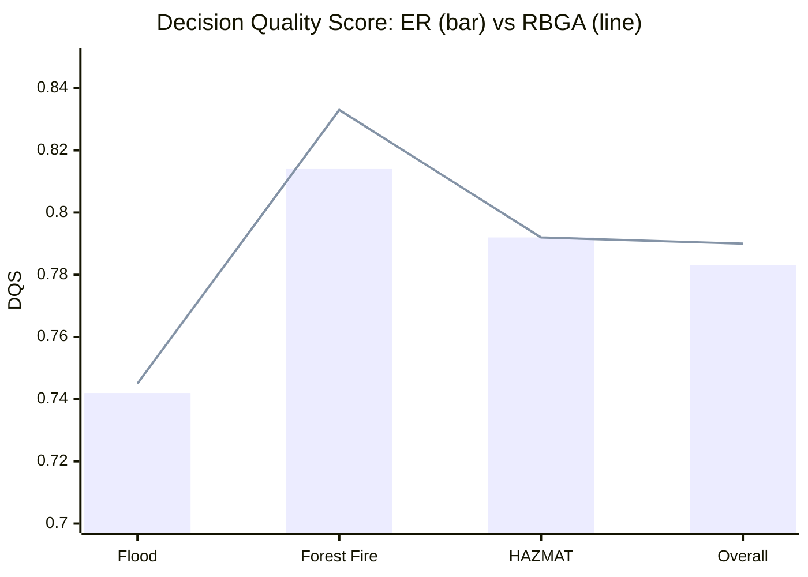
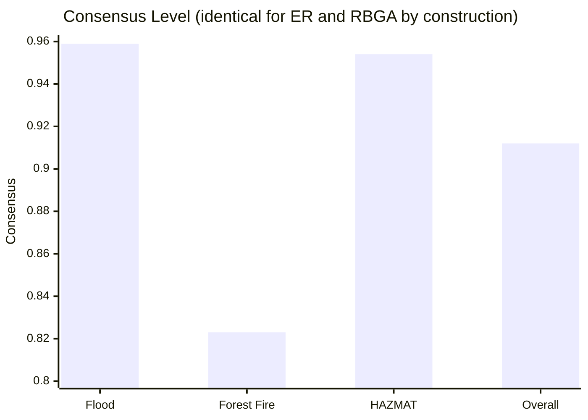
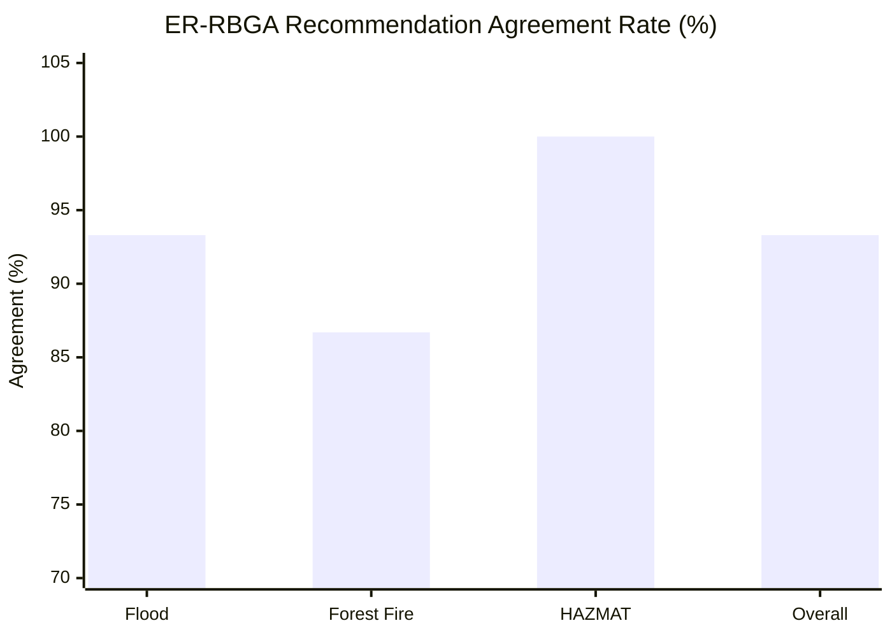
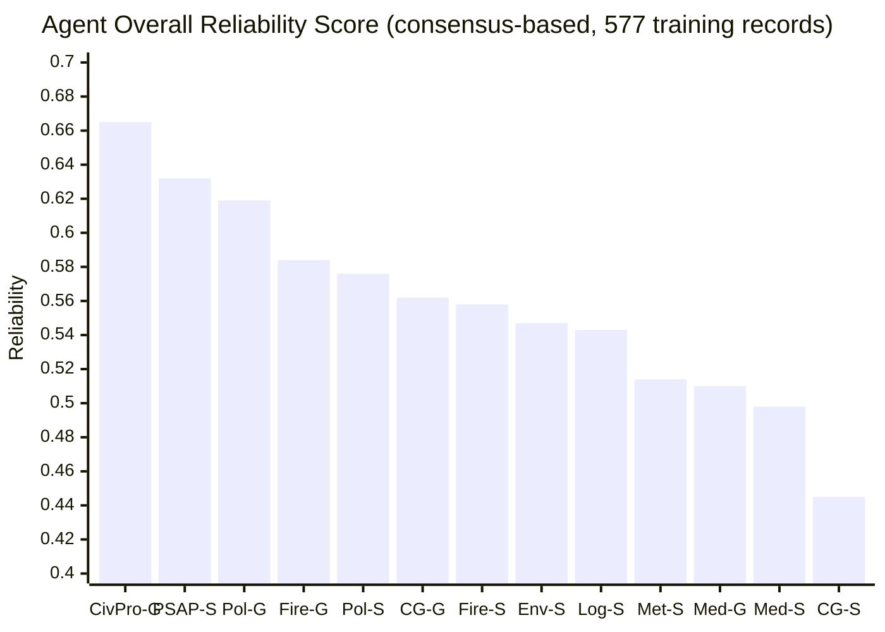
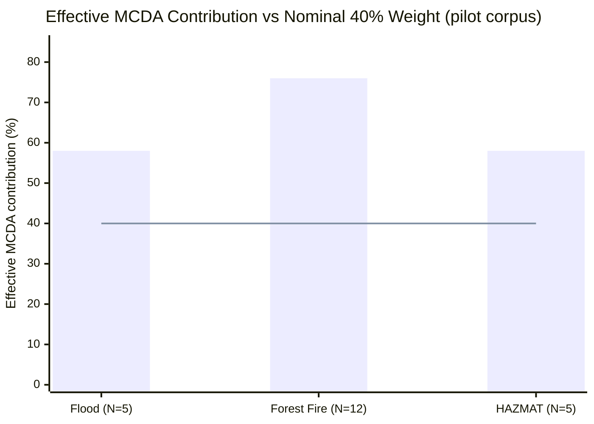
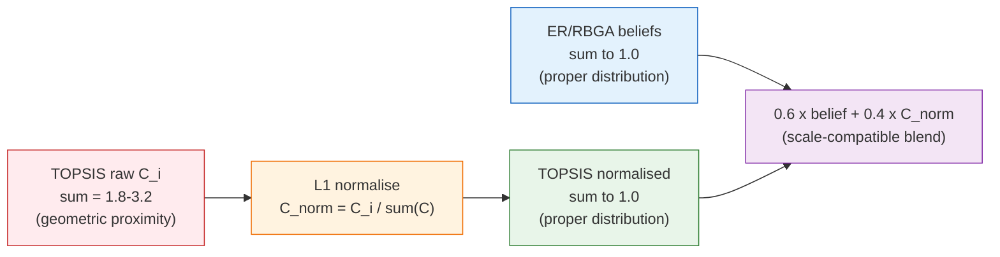

# Experimental Results

## Overview

The system was evaluated across **45 controlled runs**: 3 crisis scenarios × 3 LLM providers × 5 replicates per provider. Every run used the auto-selected expert panel (11 agents for the inland Flood scenario, where terrain filtering excludes the 2 Coast Guard agents; 13 agents for Wildfire and HAZMAT) plus orchestrator in `--compare-methods` mode, executing both ER (Dempster-Shafer Evidential Reasoning) and RBGA (Rule-Based Graph Attention, named `GAT` in the code/CLI) aggregation on the **same, single-collected** agent assessments per run — one LLM pass feeds both aggregators, so aggregation algorithm is the only variable that differs between the ER and RBGA results for a given run. This yields **90 aggregation results** (45 ER + 45 RBGA) across three distinct emergency scenarios and 555 total LLM calls. Reliability tracking produced per-agent history across all 45 runs.

**Scenarios:**
- Karditsa Flood (`flood_scenario`) — 15 runs, 5 candidate alternatives, 11 active agents
- Evia Wildfire (`forest_fire_evia`) — 15 runs, 12 candidate alternatives, 13 active agents
- Elefsina HAZMAT / Ammonia Leak (`ammonia_leak_elefsina`) — 15 runs, 5 candidate alternatives, 13 active agents

**LLM providers tested:** Anthropic Claude Sonnet 4.5 · OpenAI GPT-4o · GPT-OSS 20B (LM Studio, local)

All tables below are regenerated directly from the stored corpus by `scripts/analyze_corpus.py` → `results/analysis/corpus_analysis.md`; re-run that script after any new experiment to keep this document's numbers current.

---

## 1. ER vs. RBGA — Head-to-Head Comparison

### 1.1 Overall (n = 45 runs, paired Wilcoxon signed-rank)

| Metric | ER | RBGA | RBGA - ER |
|--------|----|-----|----------|
| Confidence (mean +/- sigma) | 0.879 +/- 0.040 | 0.879 +/- 0.040 | 0 (identical by construction) |
| Consensus (mean +/- sigma) | 0.912 +/- 0.071 | 0.912 +/- 0.071 | 0 (identical by construction) |
| Decision Quality Score (mean +/- sigma) | 0.783 +/- 0.042 | **0.790 +/- 0.036** | **+0.007 (p = 0.102, n.s.)** |
| Recommendation agreement | -- | -- | **93.3% (42/45)** |

**Key observation:** Consensus and confidence are computed from the pre-aggregation agent beliefs, which the single-collection design makes identical for both paths by construction — they are reported for completeness, not as an ER/RBGA comparison. The DQS difference is small and not statistically significant. Because DQS is deterministic given the recommendation, the DQS test only carries information in the 3 runs where the two methods disagree; it is best read as a re-expression of the 93.3% agreement statistic.

---

### 1.2 Per-Scenario Breakdown

| Scenario | Method | Confidence | Consensus | DQS | Avg time (s) | CL >= 0.75 |
|----------|--------|-----------|-----------|-----|---------------|-----------|
| Flood (n=15) | ER | 0.904 +/- 0.008 | 0.959 +/- 0.014 | 0.742 +/- 0.011 | 69.5 +/- 34.6 | 15/15 |
| Flood (n=15) | RBGA | 0.904 +/- 0.008 | 0.959 +/- 0.014 | **0.745 +/- 0.000** | < 1 (see note) | 15/15 |
| Forest Fire (n=15) | ER | 0.830 +/- 0.033 | 0.823 +/- 0.051 | 0.814 +/- 0.050 | 102.8 +/- 64.2 | 14/15 |
| Forest Fire (n=15) | RBGA | 0.830 +/- 0.033 | 0.823 +/- 0.051 | **0.833 +/- 0.004** | < 1 | 14/15 |
| HAZMAT (n=15) | ER | 0.903 +/- 0.007 | 0.954 +/- 0.013 | 0.792 +/- 0.000 | 74.3 +/- 38.6 | 15/15 |
| HAZMAT (n=15) | RBGA | 0.903 +/- 0.007 | 0.954 +/- 0.013 | 0.792 +/- 0.000 | < 1 | 15/15 |

*Note on RBGA time: in `--compare-methods` mode the RBGA coordinator reuses the assessments already collected by the ER coordinator, so its own cost is aggregation-only (sub-second). End-to-end run time is the ER-path figure in every case.*

**Notable patterns:**

- **Flood:** RBGA DQS is exactly 0.745 with zero variance across all 15 runs — the panel converges on `action_hybrid_approach` in every run, so the recommendation (and hence DQS, which is deterministic given the recommendation) is identical run to run. ER shows natural run-to-run variation (sigma = 0.011).
- **Forest Fire:** RBGA achieves both a marginally higher mean DQS and a much tighter spread (sigma = 0.004 vs. 0.050 for ER), holding the modal recommendation in the two runs where ER's reliability-ordered combination follows a minority evacuation preference — the most ambiguous scenario is where the two methods diverge most.
- **HAZMAT:** DQS is identical (0.792 +/- 0.000) for both methods across all 15 runs — the panel converges on `action_integrated_response` in every run regardless of aggregation mechanism.

---

### Fig. 1 — ER vs. RBGA Decision Quality Score by Scenario



*Bar = ER, Line = RBGA. RBGA consistently meets or exceeds ER on DQS, with the largest gap and the tightest variance on the ambiguous Forest Fire scenario. The gap closes to zero on HAZMAT where both methods lock at 0.792.*

---

### Fig. 2 — Consensus Level by Scenario



*Forest Fire has the lowest consensus (0.823), confirming it as the most ambiguous scenario. Flood achieves the highest consensus (0.959). Consensus is computed from pre-aggregation agent beliefs, so it does not differ between ER and RBGA in the single-collection design.*

---

### 1.3 Recommendation Disagreements — Where ER and RBGA Diverge

3 of the 45 runs produced split recommendations (ER != RBGA), all in the two most contested decision spaces:

| Scenario | Run | ER recommendation | RBGA recommendation |
|----------|-----|--------------------|-----------------------|
| Karditsa Flood | run_10_openai | action_rescue_operations | action_hybrid_approach |
| Evia Wildfire | run_11_claude | action_maritime_coastal_evacuation | action_hybrid_evacuation_suppression |
| Evia Wildfire | run_13_claude | action_maritime_coastal_evacuation | action_hybrid_evacuation_suppression |

The Flood case is a single borderline run splitting between the two scenario-dominant alternatives. Both Wildfire disagreements involve Claude-generated assessments where ER's reliability-ordered Dempster combination follows a minority preference for maritime evacuation, while RBGA's attention-weighted averaging holds the modal `action_hybrid_evacuation_suppression` recommendation — consistent with RBGA's tighter DQS variance in this scenario (§1.2).

---

### Fig. 3 — ER-RBGA Recommendation Agreement Rate by Scenario



*HAZMAT achieves perfect agreement — both methods always select `action_integrated_response`. Forest Fire is the most discriminating scenario with 2/15 disagreements.*

---

### 1.4 Aggregated Belief Profiles from Identical Inputs — Elefsina HAZMAT Run 1

Rather than an illustrative disagreement (the corpus has only 3, all summarised above), the clearest evidence of *how* ER and RBGA process identical inputs differently comes from an agreement case: Elefsina HAZMAT run 1 (LM Studio), reproduced from the paper's §4.6 trace. All 13 agents favour `action_integrated_response` (belief mass 0.35-0.55), but with meaningfully dispersed secondary preferences:

| Alternative | ER aggregated | RBGA aggregated |
|-------------|--------------:|-----------------:|
| Integrated response | **0.9995** | **0.390** |
| Downwind evacuation | 0.0005 | 0.219 |
| HAZMAT containment | < 0.0001 | 0.171 |
| Water curtain installation | < 0.0001 | 0.149 |
| Shelter-in-place | < 0.0001 | 0.072 |

Both methods rank the same alternative first, but with radically different belief concentration. ER's multiplicative Dempster combination compounds the shared preference at every pairwise step, concentrating virtually all mass on the top choice — a measure of panel *unanimity*, not a calibrated probability. RBGA's attention-weighted averaging preserves the shape of the panel's dispersion, retaining information about the strength of secondary alternatives. This distinction is invisible in the recommendation-agreement statistics above but is operationally relevant: an ER-based readout signals a panel that is certain; an RBGA-based readout signals a panel that agrees on the leader while keeping live alternatives in reserve.

---

## 2. Decision Consistency

### Dominant recommendation per scenario (ER path; RBGA recommendations agree in all but the 3 cases in §1.3)

| Scenario | Dominant recommendation | Runs matching (ER) |
|----------|--------------------------|----------------------|
| Karditsa Flood | `action_hybrid_approach` | 14/15 (93.3%) |
| Evia Wildfire | `action_hybrid_evacuation_suppression` | 13/15 (86.7%) |
| Elefsina HAZMAT | `action_integrated_response` | 15/15 (100%) |
| **Overall** | -- | **42/45 (93.3%)** |

**Run consistency** = fraction of ER-path runs matching that scenario's modal recommendation. Since RBGA agrees with ER in 42/45 runs overall (§1.1), the same consistency figure applies closely to the RBGA path.

---

## 3. Agent Reliability

Reliability is tracked per agent using **consensus-based ground truth**: an assessment is scored on a 3-component accuracy measure (belief mass on the recommended alternative, whether it was the agent's top choice, and a confidence-weighted margin) against the system's own final recommendation, then combined into a temporally-decayed moving average. This is a self-consistency proxy, not external validation (see Section 5.3 of the paper).

### 3.1 Overall Reliability Ranking (577 training records, Flood + Wildfire + HAZMAT)

| Agent | n | Overall | Flood | Wildfire | HAZMAT |
|-------|---|---------|-------|----------|--------|
| civilprotection_gold_strategic | 47 | **0.665** | 0.668 | 0.595 | 0.732 |
| psap_silver_coordination | 47 | 0.632 | 0.616 | 0.597 | 0.685 |
| police_gold_strategic | 47 | 0.619 | 0.722 | 0.547 | 0.574 |
| fire_gold_strategic | 47 | 0.584 | 0.704 | 0.471 | 0.560 |
| police_silver_tactical | 47 | 0.576 | 0.589 | 0.561 | 0.576 |
| coastguard_gold_strategic | 30 | 0.562 | -- | 0.478 | 0.646 |
| fire_silver_tactical | 47 | 0.558 | 0.547 | 0.602 | 0.527 |
| environment_silver_advisory | 47 | 0.547 | 0.615 | 0.419 | 0.598 |
| logistics_silver_advisory | 47 | 0.543 | 0.545 | 0.577 | 0.506 |
| meteorology_silver_advisory | 47 | 0.514 | 0.519 | 0.546 | 0.475 |
| medical_gold_strategic | 47 | 0.510 | 0.588 | 0.344 | 0.589 |
| medical_silver_tactical | 47 | 0.498 | 0.555 | 0.223 | 0.710 |
| coastguard_silver_tactical | 30 | **0.445** | -- | 0.198 | 0.692 |

*`coastguard_gold_strategic` and `coastguard_silver_tactical` show n=30 (not 47): both Coast Guard agents are terrain-excluded from the 15 inland Flood runs by the geospatial pre-assessment (Step 0), leaving only Wildfire + HAZMAT participation.*

**Key observations:**

- **`civilprotection_gold_strategic`** leads overall (0.665) with its strongest domain-conditional score in HAZMAT (0.732). GOLD-tier agents average **0.588** vs. **0.539** for SILVER (+4.9 pp).
- **Domain-conditional leaders match expectations:** Police Regional Commander tops the Flood sub-corpus (0.722), the Fire-Brigade Tactical specialist leads Wildfire (0.602), and Civil Protection / Medical Tactical lead HAZMAT (0.732 / 0.710).
- **`coastguard_silver_tactical`** records the lowest overall score (0.445), driven by a weak Wildfire sub-score (0.198) — consistent with its peripheral relevance to a land-based fire scenario.

---

### Fig. 4 — Agent Overall Reliability Ranking



*Agent abbreviations: CivPro-G = civilprotection_gold_strategic, PSAP-S = psap_silver_coordination, Pol-G = police_gold_strategic, Fire-G = fire_gold_strategic, Pol-S = police_silver_tactical, CG-G = coastguard_gold_strategic, Fire-S = fire_silver_tactical, Env-S = environment_silver_advisory, Log-S = logistics_silver_advisory, Met-S = meteorology_silver_advisory, Med-G = medical_gold_strategic, Med-S = medical_silver_tactical, CG-S = coastguard_silver_tactical.*

---

### 3.2 Domain-Specific Reliability

See the `Flood` / `Wildfire` / `HAZMAT` columns of §3.1. **Structural pattern:** most agents score highest on Flood or HAZMAT and lowest on Wildfire; the specialisation gradient is visible in `fire_silver_tactical` (0.602) and `medical_silver_tactical` (0.223, its lowest domain score) — the latter reflecting that pure firefighting decisions draw less on triage expertise than flood or chemical-release scenarios do.

These training-corpus reliability scores feed directly into both aggregation paths: ordering agents for ER's sequential Dempster combination, and as the 9th RBGA attention feature.

---

### 3.3 Frozen-Weight Holdout — Santorini Volcanic-Seismic (Unseen Crisis Type)

To test whether training-phase reliability weights generalise to a novel crisis type, 5 runs of the Santorini volcanic-seismic scenario were executed with training weights frozen (snapshot-restored after each run so all 5 start from identical weights; see `run_frozen_volcanic_test.py` and the provenance manifest in `results/reliability_test_volcanic/`).

| Agent | n | Mean | Min | Max |
|-------|---|------|-----|-----|
| psap_silver_coordination | 5 | **0.696** | 0.683 | 0.710 |
| police_silver_tactical | 5 | 0.685 | 0.673 | 0.708 |
| fire_gold_strategic | 5 | 0.684 | 0.665 | 0.725 |
| coastguard_gold_strategic | 5 | 0.682 | 0.673 | 0.698 |
| medical_silver_tactical | 5 | 0.681 | 0.654 | 0.714 |
| civilprotection_gold_strategic | 5 | 0.680 | 0.658 | 0.695 |
| logistics_silver_advisory | 5 | 0.665 | 0.652 | 0.671 |
| meteorology_silver_advisory | 5 | 0.664 | 0.642 | 0.680 |
| police_gold_strategic | 5 | 0.575 | 0.121 | 0.698 |
| medical_gold_strategic | 5 | 0.574 | 0.064 | 0.730 |
| fire_silver_tactical | 5 | 0.570 | 0.092 | 0.714 |
| coastguard_silver_tactical | 5 | 0.458 | 0.089 | 0.684 |
| environment_silver_advisory | 5 | **0.428** | 0.084 | 0.690 |

GOLD avg **0.639** | SILVER avg **0.606** | gap **+3.3 pp** (vs. +4.9 pp on the training corpus — the ordering is directionally preserved but flattens on the unseen scenario). Coordination-centric roles (PSAP, 0.696) top the holdout ranking. Five agents — including two GOLD agents (Police Regional min 0.121, Medical Infrastructure Director min 0.064) — show one confidently-wrong run each against otherwise near-ceiling scores; the tracker captures this as high within-test variance rather than as a reliable command-level effect, which is the more robust generalisation signal than GOLD/SILVER level alone.

---

## 4. Processing Time

Processing time scales with the number of candidate alternatives (more alternatives = more tokens per agent assessment) and with active agent count. Since RBGA reuses the ER path's collected assessments in `--compare-methods` mode, only the ER-path (end-to-end) time is meaningful:

| Scenario | Alternatives | Active agents | Avg time (s) |
|----------|-------------|----------------|--------------|
| Karditsa Flood | 5 | 11 | 69.5 |
| Elefsina HAZMAT | 5 | 13 | 74.3 |
| Evia Wildfire | 12 | 13 | 102.8 |
| **Overall** | -- | -- | **82.2** |

By LLM provider (ER path): GPT-4o is fastest (32.2 s), Claude Sonnet 4.5 intermediate (77.4 s), GPT-OSS 20B slowest (137.1 s) but still well within all three scenarios' decision windows.

---

## 5. Overall System Performance Summary

| Metric | Flood | Wildfire | HAZMAT | Overall |
|--------|-------|---------|--------|---------|
| Run consistency (ER modal) | 93.3% (14/15) | 86.7% (13/15) | 100% (15/15) | **93.3%** |
| ER-RBGA recommendation agreement | 93.3% | 86.7% | 100% | 93.3% |
| Avg confidence | 0.904 | 0.830 | 0.903 | 0.879 |
| Avg consensus | 0.959 | 0.823 | 0.954 | 0.912 |
| Avg DQS (ER) | 0.742 | 0.814 | 0.792 | 0.783 |
| Avg DQS (RBGA) | 0.745 | 0.833 | 0.792 | 0.790 |

> **Run consistency** = fraction of runs where the final decision matches the scenario's modal recommendation.
> **ER-RBGA agreement** = fraction of runs where both methods produce the same recommended alternative.

---

## 6. Key Findings

### ER vs. RBGA (primary)

1. **Statistically equivalent overall.** DQS 0.783 (ER) vs. 0.790 (RBGA), paired Wilcoxon p = 0.102 (n.s.); 93.3% recommendation agreement across all 45 runs. Consensus and confidence are identical between methods by construction (single-collection design).

2. **RBGA is more stable under ambiguity, not more "decisive."** In the 12-alternative Forest Fire scenario, RBGA's DQS variance (sigma = 0.004) is an order of magnitude tighter than ER's (sigma = 0.050), and RBGA holds the modal recommendation in both of ER's minority-preference disagreements. This is a stability advantage, not evidence that RBGA "converges more" in some general sense — both methods see identical consensus-gated inputs.

3. **The two methods encode agreement differently, even when they agree.** The Elefsina HAZMAT run-1 trace (§1.4) shows ER concentrating aggregated belief to 0.9995 under panel unanimity (a signal of *consensus strength*), while RBGA's attention-weighted average preserves the panel's dispersion at 0.390 (a signal of *relative preference*). Both are legitimate readings for a human decision-maker, and neither is simply "wrong."

4. **RBGA's aggregation cost is sub-second** in the current single-collection design — the entire runtime difference between methods is zero, since RBGA reuses the ER path's collected assessments rather than re-querying agents.

5. **All 3 disagreements are genuine borderline or reliability-ordering effects**, concentrated in the two most contested scenarios (2 Wildfire, 1 Flood). HAZMAT shows perfect agreement across all 15 runs.

6. **RBGA-Opt (L-BFGS-B trained variant) confirms the hand-crafted prior is near-optimal.** Re-fitted on this 45-run corpus, the trained attention coefficients deviate by at most 0.0051 from the prior, with top-1 accuracy unchanged at 97.8% (44/45) before and after training.

### Agent Capability as Autonomous Reasoners

7. **All active agents (11-13 per run) successfully operate the multi-agent protocol** across all 45 runs, producing valid structured belief distributions, MCDA criterion scores, and domain-grounded reasoning across 555 total agent assessments, with 100% structural JSON parse success after the response-cleaning step.

8. **Agents demonstrate meaningful domain specialisation** visible in the reliability data: the Fire-Brigade Tactical specialist scores highest on Wildfire (0.602), Police Regional Commander on Flood (0.722), and Civil Protection Director on HAZMAT (0.732). This emergent specialisation — not explicitly programmed — is consistent with LLM-driven agents correctly internalising their role context.

9. **Command-level (GOLD/SILVER) differentiation is real but modest, and does not fully transfer to unseen crisis types.** GOLD agents average +4.9 pp over SILVER on the training corpus, narrowing to +3.3 pp on the Santorini holdout (§3.3) — within-agent variance, not command level, is the more robust signal of which agents' expertise generalises.

### LLM Provider Comparison (secondary)

All three providers successfully operate the multi-agent framework across every run. **No significant provider effect on decision quality** was found (Combined Score Kruskal-Wallis H = 5.24, p = 0.073; DQS range 0.771-0.791 across providers). GPT-4o is fastest (32.2 s/run); Claude Sonnet 4.5 is intermediate (77.4 s) with the highest mean consensus (0.919); GPT-OSS 20B (local, zero API dependency) is slowest (137.1 s) but achieves statistically indistinguishable decision quality — a practically significant result for GDPR-constrained, on-premise deployments.

---

## 7. Methodological Finding: MCDA/ER Scale Mismatch and L1 Normalisation (Pilot-Corpus Discovery, Already Fixed)

**This section documents a discovery made on an earlier pilot corpus (92 result files, collected before the scenario-enrichment revision), not on the 45-run corpus described in Sections 1-6 above.** The fix described below was integrated into the decision engine (`agents/coordinator_agent.py`) before the current 45-run corpus was generated, so every result in Sections 1-6 already applies L1 normalisation at decision time. This section is retained as a methodological record and as a warning to any researcher combining TOPSIS with probability-distribution beliefs.

### 7.1 Discovery

A systematic scale incompatibility between the two components of the combined score formula was identified during post-hoc analysis across all 92 pilot-corpus result files (45 runs × 2 aggregation methods, ER and GAT/RBGA).

The combined score formula is:

```
Score(A_k) = 0.6 * ER/RBGA_belief(A_k) + 0.4 * TOPSIS_raw(A_k)
```

This 60/40 weighting assumption is only mathematically valid when **both components share the same distributional scale**. They do not.

**ER/RBGA aggregated beliefs** are proper probability distributions: they always sum to 1.0 across all alternatives. For a scenario with N alternatives the average belief per alternative is 1/N:
- Flood (N=5): average belief ~0.200
- Forest Fire (N=12): average belief ~0.083
- HAZMAT (N=5): average belief ~0.200

**TOPSIS closeness coefficients** C_i = S_i^- / (S_i^+ + S_i^-) are geometric proximity scores. They are bounded in [0,1] but do **not** sum to 1 across alternatives. In the pilot corpus, raw TOPSIS scores ranged from 0.16 to 0.75, with cross-alternative sums reaching 1.8-3.2 depending on the scenario.

### 7.2 Effective Weight Distortion

Because TOPSIS scores are systematically larger than belief masses (especially for N=12), the MCDA component dominated the combined score regardless of the nominal 40% weight. Across the pilot corpus, the effective MCDA contribution was **55-79% of the combined score** — well above the intended 40%.



*Bar = measured effective MCDA weight in combined score. Line = nominal 40% target. The distortion was most severe for the 12-alternative Forest Fire scenario where belief masses average 1/12 ~ 0.083 while TOPSIS scores average near 0.40.*

### 7.3 Impact on Recommendations (Pilot Corpus)

The inflation was most consequential for the **Evia Wildfire scenario (N=12)**, where `action_combined_assault` (an alternative from the pre-enrichment scenario definition) had the highest TOPSIS raw score in many pilot runs, even when agent consensus favoured evacuation alternatives.

**Illustrative example — forest_fire_evia / run_7_claude / ER (pilot corpus):**

| Alternative | ER belief | TOPSIS raw | TOPSIS norm | Old score | New score |
|-------------|-----------|------------|-------------|---------|---------|
| action_combined_assault | 0.1425 | **0.8139** | 0.1314 | **0.4110 (rec)** | 0.1380 |
| action_immediate_evacuation | **0.1549** | 0.7891 | 0.1274 | 0.3987 | **0.1414 (rec)** |

Before normalisation, `combined_assault` was recommended despite having *lower* agent belief mass than `immediate_evacuation`. Its TOPSIS raw advantage of 0.025 translated into a 0.0123 score advantage that overrode the expert consensus signal. The MCDA component contributed 79% of that run's final score.

**Post-hoc recalculation across all 92 pilot-corpus result files (`scripts/recalculate_dqs.py`):**

| Scenario | Method | Runs changed | Primary change |
|----------|--------|-------------|----------------|
| Evia Wildfire | ER | 6/15 | 5 runs: combined_assault -> immediate_evacuation |
| Evia Wildfire | GAT/RBGA | 5/15 | 5 runs: combined_assault -> immediate_evacuation |
| Karditsa Flood | ER | 1/16 | 1 borderline run (hybrid <-> rescue) |
| Karditsa Flood | GAT/RBGA | 0/16 | No change |
| Elefsina HAZMAT | ER | 0/15 | No change |
| Elefsina HAZMAT | GAT/RBGA | 0/15 | No change |
| **Total** | **Both** | **12/92** | **11 in Forest Fire scenario** |

The effect scales with action-space size: N=5 scenarios (Flood, HAZMAT) were largely unaffected because beliefs and TOPSIS scores operate at more comparable per-alternative magnitudes; the N=12 Forest Fire scenario was most sensitive.

### 7.4 Correction: L1 Normalisation

The fix maps raw TOPSIS scores to a proper distribution before combining:

```
C_norm(A_k) = C_raw(A_k) / sum_j( C_raw(A_j) )
```

This preserves TOPSIS ranking order while ensuring both components are true distributions that sum to 1. The corrected combined score formula:

```
Score(A_k) = 0.6 * ER/RBGA_belief(A_k) + 0.4 * C_norm(A_k)
```

enforces the intended 60/40 balance regardless of action-space size, and **is the formula used to generate every result in Sections 1-6 of this document.**



### 7.5 Implications

**Finding — scale normalisation is required for valid 60/40 blending.** Combining a proper probability distribution (ER/RBGA beliefs) with an unnormalised proximity score (TOPSIS raw) on a fixed weight violates the mathematical precondition of the formula. The effect grows with action-space size: negligible for N=5 but inflating the MCDA contribution to ~76% for N=12 in the pilot corpus.

**Finding — scale normalisation is a prerequisite for RBGA training.** The reliability tracker and any future warm-started online learning extension require that the score signal used as training supervision accurately reflects expert consensus rather than TOPSIS scale artefacts. L1 normalisation must be applied before any supervised training on this or future corpora — which is why the fix was integrated into the engine before, not after, the 45-run corpus in Sections 1-6 was generated.

---

## Result Files

Results are stored at `results/<scenario>/<run_N_provider>/`:
- `results.json` -- combined ER+RBGA decision, full agent opinions, all metrics
- `er/results.json` -- ER-only aggregation result
- `gat/results.json` -- RBGA-only aggregation result (directory name `gat` retained for backward compatibility)
- `comparative_analysis.json` -- side-by-side ER vs. RBGA metrics per run
- `results/reliability/<agent_id>_reliability.json` -- per-agent training reliability history (13 files)
- `results/reliability_test_volcanic/` -- frozen-weight holdout summary and provenance manifest (§3.3)
- `results/analysis/corpus_analysis.md` / `.json` -- machine-generated source of the tables in this document (`scripts/analyze_corpus.py`)

See [EVALUATION_METHODOLOGY.md](../evaluation/EVALUATION_METHODOLOGY.md) for metric definitions.
