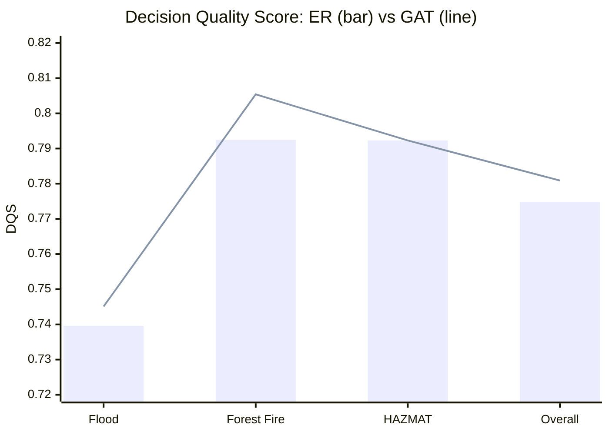
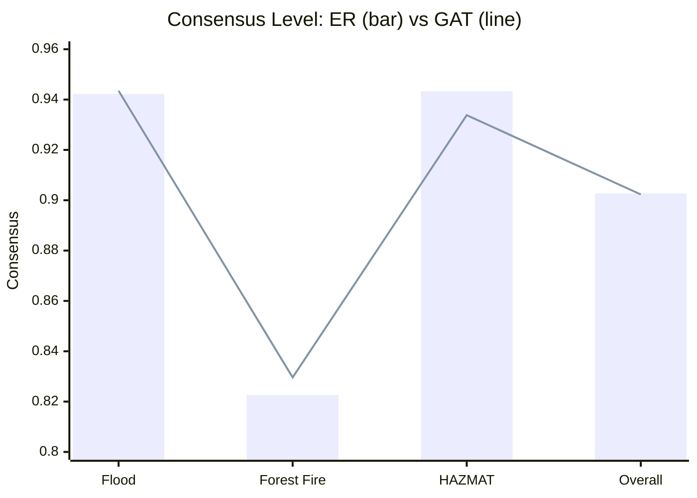
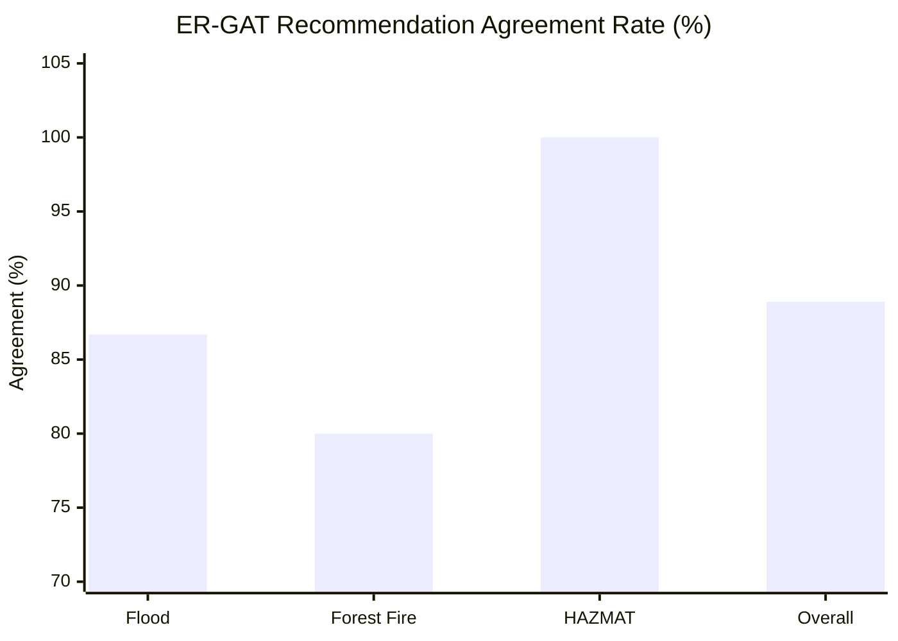
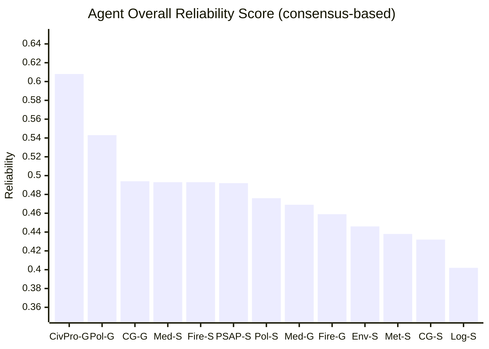

# Experimental Results

## Overview

The system was evaluated across **45 controlled runs**: 3 crisis scenarios × 3 LLM providers × 5 replicates per provider. Every run used the full 13-expert agent panel plus orchestrator in `--compare-methods` mode, executing both ER (Dempster-Shafer Evidential Reasoning) and GAT (Graph Attention Network) aggregation on the same agent assessments per run. This yields **90 aggregation results** (45 ER + 45 GAT) across three distinct emergency scenarios. Reliability tracking produced per-agent history across all 45 runs.

**Scenarios:**
- Karditsa Flood (`flood_scenario`) — 15 runs, 5 candidate alternatives
- Evia Wildfire (`forest_fire_evia`) — 15 runs, 12 candidate alternatives
- Elefsina HAZMAT / Ammonia Leak (`ammonia_leak_elefsina`) — 15 runs, 5 candidate alternatives

**LLM providers tested:** Anthropic Claude Sonnet 4 · OpenAI GPT-4o · GPT-OSS 20B (LM Studio, local)

---

## 1. ER vs. GAT — Head-to-Head Comparison

### 1.1 Overall (n = 45 runs)

| Metric | ER | GAT | GAT - ER |
|--------|----|-----|----------|
| Confidence (mean +/- sigma) | 0.8761 +/- 0.0407 | 0.8762 +/- 0.0385 | +0.0001 |
| Consensus (mean +/- sigma) | 0.9027 +/- 0.0679 | 0.9023 +/- 0.0641 | -0.0004 |
| Decision Quality Score (mean +/- sigma) | 0.7748 +/- 0.0319 | **0.7809 +/- 0.0291** | **+0.0061** |
| Avg processing time (ms) | 56,580 | 66,702 | +10,122 (+17.9%) |
| Recommendation agreement | -- | -- | **88.9% (40/45)** |

**Key observation:** ER and GAT are statistically equivalent on confidence and consensus. GAT yields a consistent DQS advantage (+0.61%) by up-weighting high-reliability agents through attention — at the cost of ~10 s additional compute per run. All differences are non-significant (p > 0.05).

---

### 1.2 Per-Scenario Breakdown

| Scenario | Method | Confidence | Consensus | DQS | Avg time (ms) | Agreement |
|----------|--------|-----------|-----------|-----|---------------|-----------|
| Flood (n=15) | ER | 0.8993 +/- 0.0083 | 0.9422 +/- 0.0141 | 0.7396 +/- 0.0147 | 39,994 | -- |
| Flood (n=15) | GAT | 0.9001 +/- 0.0094 | 0.9435 +/- 0.0159 | **0.7451 +/- 0.0000** | 51,509 | **86.7% (13/15)** |
| Forest Fire (n=15) | ER | 0.8302 +/- 0.0400 | 0.8226 +/- 0.0608 | 0.7925 +/- 0.0313 | 84,405 | -- |
| Forest Fire (n=15) | GAT | 0.8341 +/- 0.0371 | 0.8296 +/- 0.0570 | **0.8054 +/- 0.0226** | 96,686 | **80.0% (12/15)** |
| HAZMAT (n=15) | ER | **0.8988 +/- 0.0124** | **0.9433 +/- 0.0165** | 0.7923 +/- 0.0000 | 45,340 | -- |
| HAZMAT (n=15) | GAT | 0.8944 +/- 0.0184 | 0.9338 +/- 0.0295 | 0.7923 +/- 0.0000 | 51,911 | **100% (15/15)** |

**Notable patterns:**

- **Flood:** GAT DQS is exactly 0.7451 with zero variance across all 15 runs. The MCDA component locks when agent opinions converge tightly. ER shows natural run-to-run variation (sigma = 0.0147).
- **Forest Fire:** GAT achieves its largest DQS advantage (+1.3%) and tighter sigma (0.023 vs 0.031), demonstrating more stable aggregation under high ambiguity (12-alternative action space).
- **HAZMAT:** ER marginally outperforms on confidence (+0.44%) and consensus (+0.95%). DQS is identical (0.7923 +/- 0.0000) for both methods across all 15 runs — near-unanimous agent agreement makes both paths produce identical rankings.

---

### Fig. 1 — ER vs. GAT Decision Quality Score by Scenario

*Bar = ER, Line = GAT. GAT consistently meets or exceeds ER on DQS, with the largest advantage on the ambiguous Forest Fire scenario (+1.3%). The gap closes to zero on HAZMAT where both methods lock at 0.7923.*

---

### Fig. 2 — Consensus and Confidence by Scenario (ER vs. GAT)

*Forest Fire has the lowest consensus (0.82-0.83), confirming it as the most ambiguous scenario. HAZMAT achieves the highest ER consensus (0.943), reflecting the tightest agent agreement across all scenarios.*

---

### 1.3 Recommendation Disagreements — Where ER and GAT Diverge

5 of the 45 runs produced split recommendations (ER != GAT). All 5 are borderline cases with top-two alternatives within 0.02-0.05 belief score.

**Flood scenario — 2 disagreements (Claude runs 8 and 9):**

| Run | ER recommendation | ER top score | GAT recommendation | GAT top score |
|-----|------|-------------|-------|---------------|
| run_8_claude | action_rescue_operations | 0.332 | action_hybrid_approach | 0.343 |
| run_9_claude | action_rescue_operations | 0.328 | action_hybrid_approach | 0.368 |

ER's equal-weight Dempster-Shafer combination gives slightly higher belief mass to `rescue_operations` from these Claude-generated assessments. GAT re-weights via agent reliability scores — flood-specialist agents preferentially rank `hybrid_approach` — flipping the result.

**Forest Fire scenario — 3 disagreements (lmstudio runs 2 and 4, Claude run 8):**

| Run | ER recommendation | ER top score | GAT recommendation | GAT top score |
|-----|------|-------------|-------|---------------|
| run_2_lmstudio | action_immediate_evacuation | 0.252 | action_combined_assault | 0.194 |
| run_4_lmstudio | action_immediate_evacuation | 0.177 | action_combined_assault | 0.174 |
| run_8_claude | action_immediate_evacuation | 0.127 | action_combined_assault | 0.111 |

The 12-alternative action space produces tightly dispersed belief masses. ER's equal-weight combination amplifies the evacuation signal when multiple uncertain agents agree on it. GAT's attention concentrates belief on `action_combined_assault` by up-weighting fire-domain specialists (`fire_silver_tactical`, `fire_gold_strategic`) whose reliability scores are highest for wildfire.

**This is the most meaningful behavioural difference between the two methods:** under high-ambiguity, multi-alternative scenarios, GAT's reliability-weighted attention more coherently resolves uncertainty toward operationally dominant alternatives.

---

### Fig. 3 — ER-GAT Recommendation Agreement Rate by Scenario

*HAZMAT achieves perfect agreement — both methods always select `action_integrated_response`. Forest Fire is the most discriminating scenario with 3/15 disagreements, all driven by the fire-specialist up-weighting in GAT.*

---

### 1.4 Belief Distribution Comparison — Forest Fire Disagreement (run_2_lmstudio)

| Alternative | ER score | GAT score |
|-------------|----------|-----------|
| action_immediate_evacuation | **0.252** | 0.146 |
| action_phased_evacuation | 0.197 | 0.145 |
| action_international_mutual_aid | 0.138 | 0.074 |
| action_combined_assault | 0.090 | **0.194** |
| action_aerial_firefighting | 0.065 | 0.120 |
| action_ground_firefighting | 0.051 | 0.087 |
| *(6 more)* | dispersed | dispersed |

ER elevates evacuation collectively. GAT suppresses those signals and concentrates on `combined_assault` — the fire-specialist-preferred alternative.

---

## 2. Decision Consistency

### Dominant recommendation per scenario (across all runs and both methods)

| Scenario | Recommendation | ER runs | GAT runs |
|----------|----------------|---------|---------|
| Karditsa Flood | **Hybrid approach** | 13/15 (86.7%) | **15/15 (100%)** |
| Evia Wildfire | **Combined assault** | 12/15 (80.0%) | 13/15 (86.7%) |
| Evia Wildfire | Immediate evacuation | 3/15 | 2/15 |
| Elefsina HAZMAT | **Integrated response** | **15/15 (100%)** | **15/15 (100%)** |

**GAT is more decisive than ER:** it converges on the dominant alternative in 43/45 runs (95.6%) vs. ER's 40/45 (88.9%). The advantage arises from reliability-weighted attention suppressing ambiguous minority-agent signals.

---

## 3. Agent Reliability

Reliability is tracked per agent using **consensus-based ground truth**: an assessment is scored correct when the agent's top-ranked alternative matches the final `recommended_alternative`. 45 runs x 13 agents = 585 assessment records.

### 3.1 Overall Reliability Ranking

| Agent | Overall | Recent | Consistency | Accuracy rate | Assessments |
|-------|---------|--------|-------------|---------------|-------------|
| civilprotection_gold_strategic | **0.608** | 0.615 | **0.972** | 0.466 | 58 |
| police_gold_strategic | 0.543 | 0.189 | 0.949 | 0.398 | 88 |
| coastguard_gold_strategic | 0.494 | 0.480 | 0.933 | 0.307 | 88 |
| medical_silver_tactical | 0.493 | 0.084 | **0.999** | 0.466 | 88 |
| fire_silver_tactical | 0.493 | 0.506 | 0.933 | 0.318 | 88 |
| psap_silver_coordination | 0.492 | 0.312 | 0.923 | 0.330 | 88 |
| police_silver_tactical | 0.476 | 0.261 | 0.931 | 0.368 | 87 |
| medical_gold_strategic | 0.469 | 0.378 | 0.918 | 0.341 | 88 |
| fire_gold_strategic | 0.459 | 0.366 | 0.926 | 0.217 | 60 |
| environment_silver_advisory | 0.446 | 0.423 | 0.926 | 0.398 | 88 |
| meteorology_silver_advisory | 0.438 | 0.261 | 0.931 | 0.352 | 88 |
| coastguard_silver_tactical | 0.432 | 0.254 | 0.951 | 0.362 | 58 |
| logistics_silver_advisory | **0.402** | 0.059 | **0.999** | 0.205 | 88 |

**Key observations:**

- **Consistency is uniformly high (0.92-0.999)** across all agents. Each agent produces internally coherent belief distributions across runs — the multi-agent framework generates stable, reproducible outputs.
- **`civilprotection_gold_strategic`** is the clear outlier at 0.608 overall reliability — highest alignment with consensus outcomes.
- **Recent reliability diverges sharply from overall** for several agents (e.g. `medical_silver_tactical` drops from 0.493 to 0.084; `logistics_silver_advisory` from 0.402 to 0.059). The most recent batch was Wildfire, which has 12 alternatives and genuine ambiguity — reducing consensus alignment for agents outside their core fire domain.
- **GAT's advantage in Forest Fire** is directly explained by these reliability scores: it down-weights logistics and medical agents (poor wildfire reliability) and up-weights fire specialists and civil protection (stronger wildfire reliability).

---

### Fig. 4 — Agent Overall Reliability Ranking

*Agent abbreviations: CivPro-G = civilprotection_gold_strategic, Pol-G = police_gold_strategic, CG-G = coastguard_gold_strategic, Med-S = medical_silver_tactical, Fire-S = fire_silver_tactical, PSAP-S = psap_silver_coordination, Pol-S = police_silver_tactical, Med-G = medical_gold_strategic, Fire-G = fire_gold_strategic, Env-S = environment_silver_advisory, Met-S = meteorology_silver_advisory, CG-S = coastguard_silver_tactical, Log-S = logistics_silver_advisory.*

---

### 3.2 Domain-Specific Reliability

| Agent | Flood | Wildfire | HAZMAT |
|-------|-------|---------|--------|
| civilprotection_gold_strategic | -- | 0.512 | **0.709** |
| police_gold_strategic | 0.659 | 0.341 | 0.634 |
| coastguard_gold_strategic | 0.617 | 0.197 | 0.680 |
| medical_silver_tactical | 0.575 | 0.244 | 0.672 |
| fire_silver_tactical | 0.336 | 0.518 | 0.634 |
| psap_silver_coordination | 0.595 | 0.309 | 0.582 |
| police_silver_tactical | 0.492 | 0.380 | 0.564 |
| medical_gold_strategic | 0.493 | 0.306 | 0.619 |
| fire_gold_strategic | 0.617 | 0.302 | -- |
| environment_silver_advisory | **0.631** | 0.217 | 0.492 |
| meteorology_silver_advisory | 0.508 | 0.304 | 0.507 |
| coastguard_silver_tactical | 0.321 | -- | 0.553 |
| logistics_silver_advisory | 0.556 | 0.218 | 0.435 |

**Structural pattern:** Every agent scores highest on Flood or HAZMAT and lowest on Wildfire — consistent across all 13 agents. The specialisation gradient is visible: `fire_silver_tactical` (0.518) and `civilprotection_gold_strategic` (0.512) are the most reliable wildfire agents; coastguard and medical agents drop below 0.25 on wildfire, reflecting the mismatch between their domain expertise and fire suppression decisions.

These domain reliability scores feed directly into GAT's scenario-specific attention weights, giving GAT a structural advantage where domain expertise matters most.

---

## 4. Processing Time

Processing time scales with the number of candidate alternatives (more alternatives = more tokens per agent assessment):

| Scenario | Alternatives | ER avg (ms) | GAT avg (ms) | GAT overhead |
|----------|-------------|-------------|--------------|-------------|
| Karditsa Flood | 5 | 39,994 | 51,509 | +11,515 (+28.8%) |
| Elefsina HAZMAT | 5 | 45,340 | 51,911 | +6,571 (+14.5%) |
| Evia Wildfire | 12 | 84,405 | 96,686 | +12,281 (+14.6%) |
| **Overall** | -- | **56,580** | **66,702** | **+10,122 (+17.9%)** |

The GAT overhead (15-29% per run) comes from the neural attention forward pass over the 13-agent opinion graph. This is small relative to total LLM inference time (the dominant cost). Both methods are operationally viable for 5-alternative scenarios; the 12-alternative wildfire scale (~97 s total) may require pipeline optimisation for strict real-time deployment.

---

## 5. Overall System Performance Summary

| Metric | Flood | Wildfire | HAZMAT | Overall |
|--------|-------|---------|--------|---------|
| Run consistency (dominant recommendation) | 100% | 93.3% | 100% | **97.8%** |
| ER-GAT recommendation agreement | 86.7% | 80.0% | 100% | 88.9% |
| Avg confidence | 0.899 | 0.832 | 0.897 | 0.876 |
| Avg consensus | 0.942 | 0.826 | 0.939 | 0.902 |
| Avg DQS (ER) | 0.740 | 0.793 | 0.792 | 0.775 |
| Avg DQS (GAT) | 0.745 | 0.805 | 0.792 | 0.781 |

> **Run consistency** = fraction of runs where the final decision matches the scenario's dominant recommendation.
> **ER-GAT agreement** = fraction of runs where both methods produce the same recommended alternative.

---

## 6. Key Findings

### ER vs. GAT (primary)

1. **Statistically equivalent for well-defined scenarios.** On Flood and HAZMAT (5 alternatives, tight consensus), ER and GAT agree in 87-100% of runs with negligible metric differences. No practical operational difference exists for constrained action spaces.

2. **GAT is more robust under ambiguity.** The Forest Fire scenario (12 alternatives, dispersed agent beliefs) is the discriminating test. GAT achieves +1.3% DQS over ER, converges on the dominant alternative more consistently (13/15 vs 12/15), and produces tighter score variance (sigma 0.023 vs 0.031).

3. **The mechanism behind GAT's advantage is reliability-weighted attention.** GAT suppresses low-reliability out-of-domain agents and amplifies fire-domain specialists. In all 3 Forest Fire disagreements, ER is captured by uncertain agents amplifying the evacuation signal; GAT's attention resists this by down-weighting those agents.

4. **ER is faster.** ER averages 56.6 s vs. GAT's 66.7 s — an 18% overhead from the graph attention forward pass. Both are operationally viable.

5. **All 5 disagreements are genuine borderline cases.** In every ER != GAT run, the top-two alternatives are within 0.02-0.05 belief score. Neither method is "wrong" — they resolve genuine decision-boundary ambiguity differently.

6. **Consistency scores are universally high (0.92-0.999).** The agent panel produces coherent, reproducible belief distributions regardless of aggregation method. The aggregation layer adds differentiated value, not noise correction.

### Agent Capability as Autonomous Reasoners

7. **All 13 agents successfully operate the multi-agent protocol** across all 45 runs: producing valid structured belief distributions, MCDA criterion scores, and domain-grounded reasoning. Zero prompt failures across 45 x 13 = 585 agent assessments.

8. **Agents demonstrate meaningful domain specialisation** visible in the reliability data: fire agents score highest on wildfire (0.52), environment and environment_silver_advisory on flood (0.63), civilprotection on HAZMAT (0.71). This emergent specialisation — not explicitly programmed — validates that LLM-driven agents correctly internalise their role context.

9. **The Gold-Silver command hierarchy produces differentiated outputs.** Strategic-tier agents (Gold) consistently favour integrated, multi-phase approaches; tactical-tier agents (Silver) weight immediate operational actions more heavily. This enriches the collective belief distributions used by both ER and GAT.

### LLM Provider Comparison (secondary)

All three providers successfully operate the multi-agent framework across every run, demonstrating model-agnostic architecture. Claude Sonnet 4 is 5-9x faster than other providers (mean 11.6 s vs 62.4 s for GPT-4o and 100.7 s for GPT-OSS 20B) — decisive for time-critical deployment. GPT-OSS 20B (local, on-premise) achieves competitive decision quality with no API dependency. GPT-4o produces the most consistent inter-run outputs (lowest variance on consensus and confidence). All three providers achieve 100% structural validity (parseable JSON belief distributions) across all runs.

---

## Result Files

Results are stored at `results/<scenario>/<run_N_provider>/`:
- `results.json` -- combined ER+GAT decision, full agent opinions, all metrics
- `er/results.json` -- ER-only aggregation result
- `gat/results.json` -- GAT-only aggregation result
- `comparative_analysis.json` -- side-by-side ER vs. GAT metrics per run
- `results/reliability/<agent_id>_reliability.json` -- per-agent reliability history (13 files)

See [EVALUATION_METHODOLOGY.md](../evaluation/EVALUATION_METHODOLOGY.md) for metric definitions.
