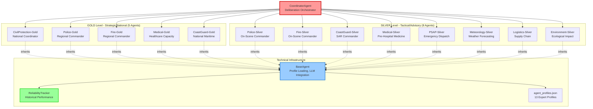
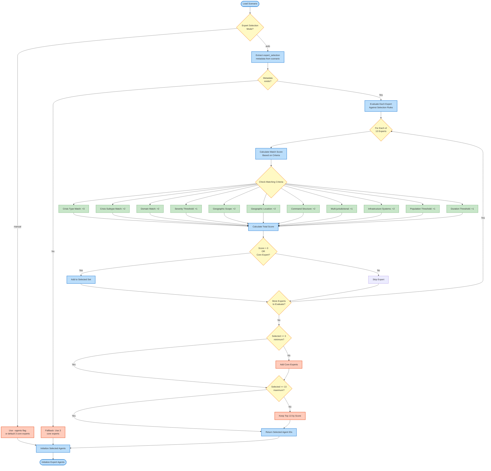

# Usage

## Quick Start

Run the default flood crisis scenario:

```bash
python main.py
```

This will:
1. Load 3 default expert agents (Meteorologist, Logistics, Medical) for backward compatibility
2. Initialize decision framework (ER + MCDA + Consensus)
3. Process the flood scenario with 5 alternative actions
4. Generate decision with explanations
5. Save results to `results/results.json`
6. Generate visualizations (if enabled)

**Note:** Use `--agents all` to load all 13 expert agents (see Expert Roles section below)

## Command-Line Options

```bash
python main.py [OPTIONS]

Options:
  --scenario PATH              Scenario JSON file (default: scenarios/flood_scenario.json)
  --agents AGENT_IDS           Specific agent IDs to load (space-separated), or "all" for all 13 experts
                               Default: meteorology_silver_advisory logistics_silver_advisory medical_silver_tactical
                               Available: meteorology_silver_advisory, logistics_silver_advisory, medical_silver_tactical,
                                         psap_silver_coordination, police_silver_tactical, police_gold_strategic,
                                         fire_silver_tactical, fire_gold_strategic, medical_gold_strategic,
                                         coastguard_silver_tactical, coastguard_gold_strategic,
                                         civilprotection_gold_strategic, environment_silver_advisory
  --expert-selection MODE      Expert selection mode: "manual" or "auto" (default: manual)
                               - manual: Use --agents flag to specify experts
                               - auto: Automatically select experts based on scenario metadata
  --criteria PATH              Criteria weights JSON (default: scenarios/criteria_weights.json)
  --output-dir PATH            Output directory for results (default: results)
  --config PATH                Configuration JSON file
  --llm-provider PROVIDER      LLM provider: claude, openai, lmstudio, or ollama (default: claude)
  --llm-model MODEL            Model name for the selected LLM provider (e.g. qwen3:8b for Ollama,
                               or a specific model tag for LM Studio)
  --vision-provider PROVIDER   Vision provider for camera/geospatial agents: ollama or lmstudio (default: ollama)
  --vision-model MODEL         Vision model name (default: minicpm-v:latest for Ollama)
                               NOTE: Do NOT use llama3.2-vision -- broken in Ollama 0.30.x (mllama regression)
  --no-llm                     Disable LLM enhancement (use rule-based reasoning)
  --no-viz                     Disable visualization generation
  --no-baseline                Skip single-agent baseline comparison
  --aggregation-method METHOD  Aggregation method: "er" or "gat" (default: er)
                               - er: Evidential Reasoning (Dempster-Shafer weighted combination)
                               - gat: Graph Attention Network (neural attention-based weighting)
  --compare-methods            Run comparative analysis of ER vs GAT methods side-by-side
                               Generates comparison visualizations and detailed metrics
  --seed N                     Random seed for reproducibility (integer)
  --consensus-threshold N      Consensus threshold 0-1 (default: 0.75)
  --verbose                    Enable verbose logging
  --help                       Show help message
```

## Usage Examples

### Example 1: Run with Different LLM Providers

**Using Claude (Default):**
```bash
python main.py
# or explicitly:
python main.py --llm-provider claude
```

**Using OpenAI (GPT-4):**
```bash
python main.py --llm-provider openai
# Requires OPENAI_API_KEY environment variable
```

**Using LM Studio (Local Model):**
```bash
# First, start LM Studio and load a model (e.g., Llama 2, Mistral)
# Then run:
python main.py --llm-provider lmstudio
# No API key required, runs completely offline
```

**Using Ollama (Local Model):**
```bash
# Pull a model first (one-time):
ollama pull qwen3:8b          # fast, good quality
ollama pull llama3.1:8b       # alternative

# Run with Ollama:
python main.py --llm-provider ollama --llm-model qwen3:8b
# Ollama loads models lazily -- the client waits automatically (warmup).
# No API key required, runs completely offline
```

### Example 2: Aggregation Method Selection (ER vs GAT)

**Using Evidential Reasoning (Default):**

```bash
python main.py --aggregation-method er
# or simply:
python main.py
```

Evidential Reasoning uses Dempster-Shafer theory-based weighted combination for belief aggregation.

**Using Graph Attention Network:**

```bash
python main.py --aggregation-method gat
```

GAT uses neural attention mechanisms with 9-dimensional feature extraction for dynamic agent weighting.

**Run Comparative Analysis (ER vs GAT side-by-side):**

```bash
python main.py --scenario flood_scenario --compare-methods
```

This runs the scenario with BOTH methods and produces:

- Side-by-side metrics comparison (DQS, consensus, confidence, processing time)
- Comparison visualizations (`er_vs_gat_metrics.png`, `er_vs_gat_recommendations.png`, `er_vs_gat_summary.png`)
- Detailed `comparative_analysis.json` with all metrics

**Full comparative analysis with all 13 agents:**

```bash
python main.py --scenario flood_scenario --agents all --compare-methods --verbose
```

### Example 3: Run Without LLM (Rule-Based Only)

```bash
python main.py --no-llm
```

Useful for:
- Testing without API costs
- Baseline comparison
- Environments without internet access

### Example 4: Custom Output Path

```bash
python main.py --scenario scenarios/ammonia_leak_elefsina.json --output results/hazmat_results.json
```

### Example 5: Adjust Consensus Requirements

```bash
python main.py --consensus-threshold 0.8 --verbose
```

Requires 80% agreement between agents (stricter consensus).

### Example 6: Run with All 13 Expert Agents

```bash
python main.py --agents all
```

This loads the full emergency response command structure with all 13 expert agents (excludes the orchestrator, which is automatically used for coordination).

### Example 7: Run with Specific Agent Subset

```bash
# Fire and police response team
python main.py --agents fire_silver_tactical fire_gold_strategic police_silver_tactical police_gold_strategic

# Maritime crisis team
python main.py --agents coastguard_silver_tactical coastguard_gold_strategic medical_silver_tactical

# Medical infrastructure focus
python main.py --agents medical_silver_tactical medical_gold_strategic logistics_silver_advisory
```

### Example 8: Automatic Expert Selection (NEW in v0.8!)

```bash
# Let the system automatically choose which experts to engage
python main.py --scenario flood_scenario --expert-selection auto

# With verbose mode to see selection reasoning
python main.py --scenario flood_scenario --expert-selection auto --verbose
```

**How it works:** The system analyses scenario metadata (crisis type, severity, affected domains, scope) and automatically selects the most relevant experts. For example, a coastal flood with high severity will auto-select: meteorologist, logistics, medical, coast guard (both levels), police (tactical + strategic), fire/rescue, PSAP commander, and medical infrastructure.

**Benefits:**
- No need to manually choose from 13 experts
- Consistent expert team selection
- Prevents over/under-engagement
- Transparent reasoning (use --verbose)

### Example 9: Combined Options

```bash
python main.py \
  --llm-provider openai \
  --aggregation-method gat \
  --expert-selection auto \
  --scenario scenarios/custom_scenario.json \
  --output results/custom_output.json \
  --verbose
```

## Greek Crisis Scenarios

The system includes three realistic Greek crisis scenarios with localized expert agents:

### Example 10: Karditsa Flood Emergency

```bash
# Run the Karditsa flood scenario with automatic expert selection
python main.py --scenario scenarios/flood_scenario.json --expert-selection auto --output-dir results/karditsa_flood

# With all experts manually specified
python main.py \
  --scenario scenarios/flood_scenario.json \
  --agents all \
  --output results/karditsa_flood_results.json \
  --verbose
```

**Scenario Details:**
- **Location:** Karditsa, Thessaly, Greece (Pineios River (Πηνειός) overflow)
- **Severity:** 0.8 (High)
- **Affected Population:** 15,000
- **Key Challenges:** Residential flooding, agricultural damage, infrastructure threats
- **Greek Experts:** Πολιτική Προστασία, ΕΚΑΒ, ΕΛΑΣ, Πυροσβεστική

### Example 11: Evia Forest Fire Emergency

```bash
# Run the Evia forest fire scenario with automatic expert selection
python main.py --scenario scenarios/forest_fire_evia.json --expert-selection auto --output-dir results/evia_fire

# With specific fire response team
python main.py \
  --scenario scenarios/forest_fire_evia.json \
  --agents fire_silver_tactical fire_gold_strategic meteorology_silver_advisory coastguard_silver_tactical \
  --output results/evia_fire_results.json \
  --verbose
```

**Scenario Details:**
- **Location:** North Evia island, Central Greece
- **Severity:** 0.9 (Very High)
- **Affected Population:** 8,000
- **Burned Area:** 12,000 hectares
- **Key Challenges:** Multiple fire fronts, strong winds, village evacuations, aerial operations
- **Resources:** Canadair CL-415, Chinook helicopters, ground fire crews
- **Greek Experts:** Πυροσβεστική (Fire Service), Λιμενικό (Coast Guard), Μετεωρολόγος

### Example 12: Elefsina Ammonia Leak (HAZMAT)

```bash
# Run the Elefsina ammonia leak scenario with automatic expert selection
python main.py --scenario scenarios/ammonia_leak_elefsina.json --expert-selection auto --output-dir results/elefsina_hazmat

# With HAZMAT-focused team
python main.py \
  --scenario scenarios/ammonia_leak_elefsina.json \
  --agents fire_silver_tactical medical_silver_tactical police_silver_tactical meteorology_silver_advisory \
  --output results/elefsina_hazmat_results.json \
  --verbose
```

**Scenario Details:**
- **Location:** Elefsina industrial zone, near Athens, Greece
- **Severity:** 0.85 (Very High)
- **Affected Population:** 12,000
- **Chemical:** 50-ton anhydrous ammonia (NH3) tank rupture - UN1005, Class 2.3 toxic gas
- **IDLH Level:** 300 ppm (current readings: 150-300 ppm downwind)
- **Key Challenges:** Toxic cloud dispersion, Level A HAZMAT operations, water curtain suppression, evacuation
- **Greek Experts:** HFC HAZMAT teams, EMS emergency medicine, LEA evacuation coordination

### Example 13: Compare All Three Greek Scenarios

```bash
# Run all three scenarios and compare results
python main.py --scenario scenarios/flood_scenario.json --expert-selection auto --output results/karditsa_results.json
python main.py --scenario scenarios/forest_fire_evia.json --expert-selection auto --output results/evia_results.json
python main.py --scenario scenarios/ammonia_leak_elefsina.json --expert-selection auto --output results/elefsina_results.json

# Results will be saved in separate files for comparison
```

## Expert Roles

The Crisis MAS system includes **13 expert roles** organised in a **two-level Gold-Silver command hierarchy** — a comprehensive emergency response command structure. The system is designed with backward compatibility — by default, it uses three core experts, but can scale to the full 13-agent team.

### Default Core Agents

When run without the `--agents` flag, the system loads **3 core expert agents** (always included):

1. **Meteorology-Silver-Advisory** (`meteorology_silver_advisory`) — Senior Meteorologist, severe weather forecasting
2. **Logistics-Silver-Advisory** (`logistics_silver_advisory`) — Emergency supply chain and resource allocation
3. **Medical-Silver-Tactical** (`medical_silver_tactical`) — Pre-hospital emergency medicine and triage

### Full Emergency Response Command Structure (13 Agents)

Use `--agents all` to activate the complete multi-agency command structure organised in two tiers:

### Agent Matrix

| # | Agent ID | Name | Level | Role | Exp (yrs) | Confidence | Risk Tol. |
|---|----------|------|-------|------|-----------|------------|-----------|
| 1 | `civilprotection_gold_strategic` | CivilProtection-Gold | GOLD | Strategic Civil Protection — National Coordination | 25 | 0.82 | 0.20 |
| 2 | `police_gold_strategic` | Police-Gold | GOLD | Strategic Police — Regional Law Enforcement | 28 | 0.90 | 0.40 |
| 3 | `fire_gold_strategic` | Fire-Gold | GOLD | Strategic Fire — Regional Fire Operations | 26 | 0.88 | 0.40 |
| 4 | `medical_gold_strategic` | Medical-Gold | GOLD | Strategic Medical — Healthcare System Capacity | 24 | 0.87 | 0.30 |
| 5 | `coastguard_gold_strategic` | CoastGuard-Gold | GOLD | Strategic Coast Guard — National Maritime Ops | 30 | 0.92 | 0.40 |
| 6 | `meteorology_silver_advisory` | Meteorology-Silver | SILVER | Senior Meteorologist — Severe Weather Forecasting | 15 | 0.88 | 0.40 |
| 7 | `logistics_silver_advisory` | Logistics-Silver | SILVER | Logistics Coordinator — Emergency Supply Chain | 12 | 0.80 | 0.50 |
| 8 | `environment_silver_advisory` | Environment-Silver | SILVER | Environmental Scientist — Ecological Impact | 18 | 0.78 | 0.40 |
| 9 | `psap_silver_coordination` | PSAP-Silver | SILVER | Emergency Communications — National Dispatch | 16 | 0.85 | 0.35 |
| 10 | `police_silver_tactical` | Police-Silver | SILVER | Tactical Police — On-Scene Law Enforcement | 22 | 0.88 | 0.30 |
| 11 | `fire_silver_tactical` | Fire-Silver | SILVER | Tactical Fire — On-Scene Suppression & Rescue | 19 | 0.86 | 0.35 |
| 12 | `medical_silver_tactical` | Medical-Silver | SILVER | Tactical Medical — Pre-Hospital Emergency Medicine | 20 | 0.85 | 0.30 |
| 13 | `coastguard_silver_tactical` | CoastGuard-Silver | SILVER | Tactical Coast Guard — Maritime SAR | 18 | 0.84 | 0.35 |

### Gold-Silver Command Hierarchy

The expert roles are organized in a **two-level Gold-Silver command hierarchy**:

- **GOLD (Strategic/National)** — 5 agents: National policy, multi-agency coordination, resource allocation
  - CivilProtection-Gold, Police-Gold, Fire-Gold, Medical-Gold, CoastGuard-Gold
  - Typical risk tolerance: 0.2–0.4 | Decision style: Formal, hierarchical

- **SILVER (Tactical/Advisory)** — 8 agents: Field operations, tactical coordination, specialist advisory
  - Police-Silver, Fire-Silver, CoastGuard-Silver, Medical-Silver, PSAP-Silver, Meteorology-Silver, Logistics-Silver, Environment-Silver
  - Typical risk tolerance: 0.3–0.5 | Decision style: Rapid assessment, balanced

**Decision Weight Profiles:**

| Priority Profile | Agents | Key Emphasis |
|---|---|---|
| **Safety-first** | CivilProtection-Gold, Police-Silver, Fire-Silver, CoastGuard-Silver | Safety 0.35, Effectiveness 0.30 |
| **Balanced** | Meteorology, Police-Gold, Fire-Gold, CoastGuard-Gold | Effectiveness/Safety ~0.25 each |
| **Effectiveness-driven** | Medical-Silver, Medical-Gold | Effectiveness 0.30–0.35, Safety 0.30 |
| **Cost-conscious** | Logistics-Silver | Cost 0.25, Speed 0.25, Effectiveness 0.25 |
| **Public-acceptance aware** | Environment-Silver | Public Acceptance 0.25 (unique) |

**Agent Hierarchy Visualization:**



**Hierarchy Key Points:**
- **CoordinatorAgent** (red): Orchestrates all deliberation and consensus building
- **GOLD Level**: 5 strategic/national agents — policy, multi-agency coordination, resource allocation
- **SILVER Level**: 8 tactical/advisory agents — on-scene command, specialist advisory, emergency communications
- **Technical Infrastructure** (blue/green): Shared components — BaseAgent for LLM integration, ReliabilityTracker for performance history

### Smart Expert Selection (Auto-Mode)

**NEW in v0.8:** The system can automatically select appropriate experts based on scenario characteristics.

**How to Enable:**
```bash
python main.py --scenario flood_scenario --expert-selection auto
```

**Expert Selection Workflow:**



**Selection Criteria:**
The ExpertSelector analyzes scenario metadata and scores each expert based on:
- **Crisis Type Matching**: Flood → Coast Guard, Fire → Fire Commanders, etc.
- **Severity Thresholds**: Higher severity → Strategic commanders included
- **Geographic Scope**: Regional/National → Strategic level, Local → Tactical only
- **Affected Domains**: Law enforcement, medical, maritime, fire/rescue, etc.
- **Command Structure Needs**: Tactical, strategic, multi-jurisdictional
- **Infrastructure Impact**: Hospitals → Medical Infrastructure Director
- **Population Impact**: Large populations → Regional/national coordination
- **Duration**: Long incidents → Strategic fire/rescue commanders

**Example Auto-Selection:**

*Scenario: Severe coastal flood (severity 0.8, 25k affected, regional scope)*

**Auto-selected experts (11 of 13 available):**
✅ Core 3 (always): Meteorologist, Logistics, Medical
✅ PSAP Commander (multi-agency coordination)
✅ Police On-Scene & Regional (evacuation + law enforcement)
✅ Fire On-Scene & Regional (rescue operations)
✅ Medical Infrastructure (hospital capacity)
✅ Coast Guard On-Scene & National (maritime rescue)

**Creating Auto-Selection Scenarios:**

Add `expert_selection` metadata to your scenario JSON:

```json
{
  "type": "flood",
  "severity": 0.8,
  "expert_selection": {
    "crisis_type": "flood",
    "crisis_subtypes": ["coastal", "evacuation"],
    "severity": 0.8,
    "geographic_scope": "regional",
    "affected_domains": ["maritime_coastal", "law_enforcement", "medical_health"],
    "command_structure_needed": {
      "tactical": true,
      "strategic": true,
      "multi_jurisdictional": true
    }
  }
}
```

See `scenarios/scenario_template.json` for complete template with all options.

## LLM Provider Comparison

The system supports three LLM providers, each with different trade-offs:

| Feature | Claude (Anthropic) | OpenAI (GPT-4) | LM Studio (Local) | Ollama (Local) |
| ------- | ------------------ | -------------- | ----------------- | -------------- |
| **Quality** | Excellent | Excellent | Good-Very Good | Good-Very Good |
| **Cost per decision** | ~$0.015-0.020 | ~$0.020-0.060 | Free | Free |
| **Latency** | 2-4s per agent | 2-4s per agent | 1-5s per agent | 1-10s per agent (model-dependent) |
| **Privacy** | Cloud (Anthropic) | Cloud (OpenAI) | 100% Local | 100% Local |
| **Internet Required** | Yes | Yes | No | No |
| **Model loading** | Instant | Instant | Manual (LM Studio UI) | Lazy (auto on first request; warmup built-in) |
| **Setup Complexity** | API key only | API key only | Download model + Run LM Studio | `ollama pull <model>` |
| **Best For** | Production, complex reasoning | Production, established workflows | Development, privacy-sensitive, offline | CLI-first local inference, scripted pipelines |

**Recommendations:**
- **Production/Critical Decisions**: Claude or OpenAI GPT-4 (best accuracy) or a Private Infrastructure.
- **Development/Testing**: LM Studio or Ollama (no costs, fast iteration)
- **Privacy/GDPR Compliance**: LM Studio or Ollama (data never leaves your machine)
- **High Volume**: LM Studio, Ollama, or OpenAI GPT-3.5 (lower cost per call)
- **Offline/Air-Gapped**: LM Studio or Ollama (no internet connection needed; required for EUCI-class sensitive information)

## Programmatic Usage

### Basic Python API

```python
from agents import ExpertAgent, CoordinatorAgent
from decision_framework import EvidentialReasoning, MCDAEngine, ConsensusModel
from llm_integration import ClaudeClient, OpenAIClient, LMStudioClient
from scenarios import ScenarioLoader

# 1. Initialize LLM client (choose one)

# Option A: Claude (default, recommended)
llm_client = ClaudeClient(api_key="your-api-key")

# Option B: OpenAI
# llm_client = OpenAIClient(api_key="your-openai-key", model="gpt-4-turbo-preview")

# Option C: LM Studio (local)
# llm_client = LMStudioClient(base_url="http://localhost:1234/v1")

# 2. Load scenario
scenario = ScenarioLoader.load('scenarios/flood_scenario.json')
alternatives = scenario['available_actions']

# 3. Create expert agents
agent_profiles = ScenarioLoader.load('agents/agent_profiles.json')
expert_agents = []
for profile in agent_profiles['agents']:
    agent = ExpertAgent(
        agent_id=profile['agent_id'],
        profile=profile,
        llm_client=llm_client
    )
    expert_agents.append(agent)

# 4. Initialize decision framework
er_engine = EvidentialReasoning()
mcda_engine = MCDAEngine(criteria_weights_path='scenarios/criteria_weights.json')
consensus_model = ConsensusModel(threshold=0.7)

# 5. Create coordinator
coordinator = CoordinatorAgent(
    expert_agents=expert_agents,
    er_engine=er_engine,
    mcda_engine=mcda_engine,
    consensus_model=consensus_model,
    aggregation_method="ER"  # or "GAT"
)

# 6. Make decision
decision = coordinator.make_final_decision(scenario, alternatives)

# 7. Access results
print(f"Recommended Action: {decision['recommended_alternative']}")
print(f"Confidence: {decision['confidence']:.2%}")
print(f"Consensus Level: {decision['consensus_level']:.2%}")
print(f"Explanation: {decision['explanation']}")
```

### Using GAT Aggregation

```python
from decision_framework import GATAggregator

# Create coordinator with GAT
gat_aggregator = GATAggregator(
    num_attention_heads=4,
    use_multi_head=True
)

coordinator = CoordinatorAgent(
    expert_agents=expert_agents,
    er_engine=er_engine,
    mcda_engine=mcda_engine,
    consensus_model=consensus_model,
    gat_aggregator=gat_aggregator,
    aggregation_method="GAT"
)

decision = coordinator.make_final_decision(scenario, alternatives)

# Access attention weights to see expert influence
if 'aggregation_details' in decision:
    attention = decision['aggregation_details'].get('attention_weights', {})
    print("\nExpert Influence (Attention Weights):")
    for agent_id, weight in attention.items():
        print(f"  {agent_id}: {weight:.1%}")
```

## Expected Output

### Console Output

```
=== Crisis MAS - Decision Support System ===

Loading scenario: flood_scenario.json
Scenario: Urban Flood Emergency Response
Severity: 8.5/10
Affected Population: 10,000

Initializing 3 expert agents (default)...
✓ meteorologist (confidence: 0.85)
✓ logistics_expert (confidence: 0.80)
✓ medical_expert (confidence: 0.90)

Note: Use --agents all to load all 13 expert agents

Evaluating 3 alternative actions...

Expert Assessments:
  medical_expert → Immediate Evacuation (confidence: 0.82)
  logistics_expert → Immediate Evacuation (confidence: 0.78)
  safety_expert → Immediate Evacuation (confidence: 0.88)
  environmental_expert → Deploy Flood Barriers (confidence: 0.71)

Aggregating beliefs using Evidential Reasoning...
Consensus level: 75.3%

Running MCDA analysis (TOPSIS)...
Final ranking:
  1. Immediate Evacuation (score: 0.847)
  2. Deploy Flood Barriers (score: 0.623)
  3. Shelter in Place (score: 0.412)

=== DECISION ===
Recommended Action: Immediate Evacuation
Confidence: 84.7%
Consensus: Achieved (75.3% agreement)

Rationale: Immediate evacuation is strongly recommended due to high
effectiveness (0.90), excellent safety profile (0.95), and strong
expert consensus. While costlier than alternatives, the life-safety
imperative and time-critical nature of flooding justify rapid action.

Results saved to: results/results.json
Visualizations saved to: results/visualizations/
```

### Output Files

**results/results.json** - Complete decision data:
```json
{
  "timestamp": "2025-11-06T14:30:00",
  "scenario_id": "flood_scenario_001",
  "decision": {
    "recommended_alternative": "action_evacuate",
    "confidence": 0.847,
    "consensus_level": 0.753,
    "final_scores": {
      "action_evacuate": 0.847,
      "action_barriers": 0.623,
      "action_shelter": 0.412
    },
    "aggregation_method": "ER",
    "mcda_method": "TOPSIS"
  },
  "metrics": {
    "decision_quality": {
      "weighted_score": 0.847,
      "criteria_satisfaction": {
        "effectiveness": 0.90,
        "safety": 0.95,
        "speed": 0.85,
        "cost": 0.45,
        "public_acceptance": 0.78
      }
    },
    "consensus": {
      "consensus_level": 0.753,
      "agreement_matrix": {...}
    },
    "confidence": {
      "average_confidence": 0.798,
      "decision_confidence": 0.847,
      "uncertainty": 0.153
    }
  }
}
```

**results/visualizations/** - Generated charts:
- `agent_contributions.png` - Bar chart of expert influence
- `alternative_comparison.png` - Radar chart comparing alternatives
- `consensus_evolution.png` - Line plot of consensus building
- `decision_confidence.png` - Confidence distribution
