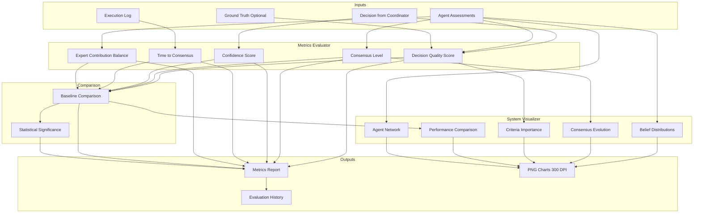

# Evaluation Module - Comprehensive Performance Assessment

## Overview

The Evaluation module provides standardized metrics and professional visualizations for assessing multi-agent system performance in crisis management scenarios. It enables objective comparison against single-agent baselines and produces publication-quality charts for results communication.

### Purpose

**Why This Module Exists:**
1. **Objective Measurement**: Quantify system performance across multiple dimensions
2. **Baseline Comparison**: Compare multi-agent vs. single-agent approaches
3. **Statistical Rigor**: Validate improvements with statistical significance testing
4. **Result Communication**: Generate professional visualizations for stakeholders
5. **Reproducibility**: Enable consistent, auditable evaluations

---

## Architecture

### Component Overview

```
evaluation/
├── __init__.py                      # Module exports and overview
├── metrics.py                       # Performance metrics calculation
├── visualizations.py                # Publication-quality chart generation
├── EVALUATION_METHODOLOGY.md        # Detailed formulas and methodology
└── FORMULA_VERIFICATION.md         # Code-to-formula verification
```

### Data Flow



---

## Five Core Metrics

### 1. Decision Quality Score (DQS)

**What it measures:** How well decisions satisfy weighted criteria

**Range:** 0.0-1.0 (higher is better)

**Formula:**
```
DQS = Σ(w_i × score_i) / Σ(w_i)
```

Where:
- `w_i` = weight for criterion i
- `score_i` = normalized score for criterion i
- Sum over all criteria

**Calculation Approaches:**
1. **Primary**: criteria_scores (detailed per-criterion evaluation)
2. **Secondary**: mcda_scores (MCDA output)
3. **Tertiary**: final_scores (aggregated scores)

**Example:**
```python
dqs = evaluator.calculate_decision_quality(
    decision=coordinator_decision,
    ground_truth={'correct_alternative': 'A1'},
    criteria_weights={'safety': 0.35, 'cost': 0.25, 'speed': 0.20, 'effectiveness': 0.20}
)

print(f"Quality: {dqs['weighted_score']:.3f}")
print(f"Criteria Satisfaction: {dqs['criteria_satisfaction']}")
```

**Output:**
```
Quality: 0.825
Criteria Satisfaction: {'safety': 0.90, 'cost': 0.75, 'speed': 0.80, 'effectiveness': 0.85}
```

---

### 2. Consensus Level (CL)

**What it measures:** Agreement between agents using cosine similarity

**Range:** 0.0-1.0 (1.0 = perfect agreement)

**Formula:**
```
similarity(A, B) = (A · B) / (||A|| × ||B||)
CL = average of all pairwise similarities
```

**Threshold:** 0.75 (75% similarity required for consensus)

**Example:**
```python
cl = evaluator.calculate_consensus_metrics(agent_assessments)

print(f"Consensus Level: {cl['consensus_level']:.1%}")
print(f"Consensus Reached: {cl['consensus_reached']}")
print(f"Agreement on: {cl['top_preference']}")
```

**Output:**
```
Consensus Level: 82.5%
Consensus Reached: True
Agreement on: A1
```

---

### 3. Confidence Score (CS)

**What it measures:** Certainty/uncertainty in the decision

**Range:** 0.0-1.0 (higher = more certain)

**Components:**
- Agent confidences (individual certainty)
- Decision confidence (overall certainty)
- Confidence variance (disagreement)

**Important:** Confidence is separate from quality! You can be confident in a poor decision.

**Example:**
```python
cs = evaluator.calculate_confidence_metrics(decision)

print(f"Decision Confidence: {cs['decision_confidence']:.3f}")
print(f"Average Agent Confidence: {cs['average_confidence']:.3f}")
print(f"Uncertainty: {cs['uncertainty']:.3f}")
```

**Output:**
```
Decision Confidence: 0.856
Average Agent Confidence: 0.823
Uncertainty: 0.144
```

---

### 4. Time to Consensus (TtC) / Efficiency

**What it measures:** Resource consumption and speed

**Metrics:**
- Iterations: Number of deliberation rounds
- API calls: LLM invocations (cost proxy)
- Processing time: Wall-clock seconds

**Efficiency Score:** Normalized 0-1 (higher = more efficient)

**Trade-off:** Efficiency vs. quality (faster may sacrifice quality)

**Example:**
```python
ttc = evaluator.calculate_efficiency_metrics(execution_log)

print(f"Iterations: {ttc['time_to_consensus']}")
print(f"API Calls: {ttc['api_calls_used']}")
print(f"Processing Time: {ttc['processing_time_seconds']:.2f}s")
print(f"Efficiency Score: {ttc['efficiency_score']:.3f}")
```

**Output:**
```
Iterations: 3
API Calls: 12
Processing Time: 8.45s
Efficiency Score: 0.642
```

---

### 5. Expert Contribution Balance (ECB)

**What it measures:** Fairness of agent participation

**Range:** 0.0-1.0 (1.0 = perfectly balanced)

**Formula:**
```
ECB = 1 - Gini_coefficient
```

Where Gini coefficient measures inequality (0 = perfect equality)

**Also Measures:**
- Diversity score: Unique perspectives (0-1)
- Participation distribution: Per-agent contributions

**Example:**
```python
ecb = evaluator.calculate_expert_contribution_balance(agent_assessments)

print(f"Balance Score: {ecb['balance_score']:.3f}")
print(f"Diversity Score: {ecb['diversity_score']:.3f}")
print(f"Gini Coefficient: {ecb['gini_coefficient']:.3f}")
```

**Output:**
```
Balance Score: 0.876
Diversity Score: 0.600
Gini Coefficient: 0.124
```

---

## Baseline Comparison

### Multi-Agent vs. Single-Agent

The evaluator compares multi-agent performance against a single-agent baseline:

```python
comparison = evaluator.compare_to_baseline(
    multi_agent_results={'decision_quality': {'weighted_score': 0.825}},
    single_agent_results={'decision_quality': {'weighted_score': 0.750}}
)

print(f"Multi-Agent Quality: {comparison['decision_quality']['multi_agent']:.3f}")
print(f"Single-Agent Quality: {comparison['decision_quality']['single_agent']:.3f}")
print(f"Improvement: {comparison['decision_quality']['improvement_percentage']:.1f}%")
```

**Output:**
```
Multi-Agent Quality: 0.825
Single-Agent Quality: 0.750
Improvement: 10.0%
```

### Comparison Dimensions

| Metric | What's Compared | Interpretation |
|--------|----------------|----------------|
| Decision Quality | DQS scores | Is multi-agent making better decisions? |
| Confidence | Certainty levels | Is multi-agent more certain? |
| Efficiency | API calls, time | What's the cost of multi-agent? |
| Consensus | Agreement level | Only multi-agent has this (n/a for single) |

---

## Statistical Significance

### Validating Improvements

Use statistical testing to ensure improvements aren't due to chance:

```python
significance = evaluator.calculate_statistical_significance(
    multi_agent_scores=[0.82, 0.85, 0.81, 0.84, 0.83],
    single_agent_scores=[0.75, 0.73, 0.76, 0.74, 0.77],
    alpha=0.05
)

print(f"P-value: {significance['p_value']:.4f}")
print(f"Significant: {significance['significant']}")
print(f"Cohen's d: {significance['cohens_d']:.3f} ({significance['effect_size']})")
```

**Output:**
```
P-value: 0.0023
Significant: True
Cohen's d: 2.143 (large)
```

### Interpretation Guide

**P-value:**
- p < 0.05: Statistically significant (reject null hypothesis)
- p ≥ 0.05: Not significant (cannot reject null hypothesis)

**Cohen's d (Effect Size):**
- |d| < 0.2: Negligible effect
- 0.2 ≤ |d| < 0.5: Small effect
- 0.5 ≤ |d| < 0.8: Medium effect
- |d| ≥ 0.8: Large effect

---

## Visualization

### Five Core Visualizations

The `SystemVisualizer` generates publication-quality charts (300 DPI):

#### 1. Belief Distribution Plot
Shows how each agent distributes belief across alternatives.
```python
viz.plot_belief_distributions(
    agent_assessments,
    "beliefs.png",
    title="Agent Belief Distributions - Flood Scenario"
)
```

#### 2. Consensus Evolution
Tracks consensus level over iterations.
```python
viz.plot_consensus_evolution(
    consensus_history=[0.45, 0.60, 0.72, 0.78, 0.82],
    save_path="consensus.png",
    threshold=0.75
)
```

#### 3. Criteria Importance
Visualizes relative weights (radar chart).
```python
viz.plot_criteria_importance(
    criteria_weights={'safety': 0.35, 'cost': 0.25, 'speed': 0.20, 'effectiveness': 0.20},
    save_path="criteria.png"
)
```

#### 4. Decision Comparison
Compares multi-agent vs. single-agent (grouped bars).
```python
viz.plot_decision_comparison(
    metrics=all_metrics,
    save_path="comparison.png"
)
```

#### 5. Agent Network
Shows agent relationships (network graph).
```python
viz.plot_agent_network(
    agent_profiles=profiles,
    trust_matrix=trust,
    save_path="network.png"
)
```

### Batch Generation

Generate all plots at once:
```python
results = {
    'agent_assessments': {...},
    'consensus_history': [...],
    'criteria_weights': {...},
    'metrics': {...},
    'agent_profiles': {...}
}

paths = viz.generate_all_plots(results, output_subdir="scenario_1")
# Returns: {'beliefs': '...', 'consensus': '...', 'criteria': '...', 'comparison': '...', 'network': '...'}
```

---

## Complete Workflow

### End-to-End Evaluation

```python
from evaluation import MetricsEvaluator, SystemVisualizer

# 1. Initialize
evaluator = MetricsEvaluator()
visualizer = SystemVisualizer(output_dir="thesis_figures", dpi=300)

# 2. Calculate all metrics
metrics = {
    'decision_quality': evaluator.calculate_decision_quality(decision, ground_truth),
    'consensus': evaluator.calculate_consensus_metrics(agent_assessments),
    'confidence': evaluator.calculate_confidence_metrics(decision),
    'efficiency': evaluator.calculate_efficiency_metrics(execution_log),
    'expert_contribution_balance': evaluator.calculate_expert_contribution_balance(agent_assessments)
}

# 3. Compare to baseline
metrics['baseline_comparison'] = evaluator.compare_to_baseline(
    multi_agent_results=metrics,
    single_agent_results=single_agent_metrics
)

# 4. Statistical significance (requires multiple runs)
metrics['statistical_significance'] = evaluator.calculate_statistical_significance(
    multi_agent_scores=multi_scores_list,
    single_agent_scores=single_scores_list
)

# 5. Generate human-readable report
report = evaluator.generate_report(metrics)
print(report)

# 6. Save to history
evaluator.save_evaluation(metrics, "flood_scenario_run_1")

# 7. Generate visualizations
viz_results = {
    'agent_assessments': agent_assessments,
    'consensus_history': consensus_history,
    'criteria_weights': criteria_weights,
    'metrics': metrics,
    'agent_profiles': agent_profiles
}

paths = visualizer.generate_all_plots(viz_results, output_subdir="flood_scenario")

print(f"Visualizations saved to: {paths}")
```

---

## Methodology Documentation

### Detailed Formulas

See **EVALUATION_METHODOLOGY.md** for:
- Complete mathematical formulas for all 5 metrics
- Step-by-step calculation examples
- Edge case handling
- Changelog documenting bug fixes (v2.0.0, v2.0.1)

### Formula Verification

See **FORMULA_VERIFICATION.md** for:
- Line-by-line code verification against LaTeX formulas
- Verification status for all 9 formulas
- Code references to implementation

---

## Bug Fixes & Version History

### Critical Bugs Fixed (v2.0.0 - v2.0.1)

The original evaluation had severe issues:

**Bug #1:** DQS was just copying confidence field
- **Problem**: `weighted_score = decision.get('confidence', 0.0)`
- **Fix**: Calculate from criteria satisfaction

**Bug #2:** Multi-agent stored ER+MCDA score as "confidence"
- **Problem**: Quality and confidence were conflated
- **Fix**: Separate fields (`confidence` vs. `decision_quality_score`)

**Bug #3:** Invalid comparison (apples to oranges)
- **Problem**: Compared different metrics between single/multi-agent
- **Fix**: Ensure both use same DQS calculation method

**Bug #4:** Fallback logic didn't work
- **Problem**: `elif` chain prevented fallthrough
- **Fix**: Added `quality_calculated` flag for proper cascade

### Current Version (v2.1)

- All bugs fixed and validated
- Comprehensive documentation
- Formula verification complete
- Robust fallback logic

---

## Performance

### Computational Complexity

| Metric | Complexity | Typical Runtime |
|--------|-----------|-----------------|
| Decision Quality | O(1) | < 1ms |
| Consensus | O(N² × M) | < 5ms (N=5, M=5) |
| Confidence | O(N) | < 1ms |
| Efficiency | O(E) | < 1ms |
| ECB | O(N) | < 1ms |
| Visualization | O(N × M) | 100-500ms |

**Variables:**
- N = number of agents
- M = number of alternatives
- E = number of execution events

**Bottleneck:** Consensus calculation (pairwise comparisons)

---

## Best Practices

### Evaluation Guidelines

1. **Multiple Runs**: Conduct 5-10 runs for statistical significance
2. **Ground Truth**: Use when available for validation
3. **Baseline Comparison**: Always compare against single-agent
4. **Documentation**: Save evaluation history for reproducibility
5. **Visualization**: Generate charts for stakeholder communication

### Reporting Guidelines

1. **Include All Five Metrics**: Don't cherry-pick favorable metrics
2. **Report Significance**: Always include p-values and effect sizes
3. **Show Variance**: Report mean ± std for multiple runs
4. **Document Failures**: Report cases where multi-agent underperforms
5. **Provide Context**: Explain trade-offs (e.g., efficiency vs. quality)

### Publication Guidelines

1. **Resolution**: 300 DPI for print, 150 DPI for web
2. **File Format**: PNG for compatibility, consider SVG for vector
3. **Accessibility**: Test visualizations in grayscale
4. **Labeling**: Clear titles, axis labels, legends
5. **Captions**: Detailed figure captions explaining all elements

---

## Integration

### With Other Modules

**Agents Module:**
- Input: Agent assessments with belief distributions, confidence scores
- Use: Evaluate agent contribution balance and consensus

**Decision Framework:**
- Input: Aggregated decisions from ER, GAT, MCDA
- Use: Calculate decision quality scores

**Scenarios:**
- Input: Ground truth from scenario definitions
- Use: Validate decision correctness

**Main:**
- Input: Complete execution results
- Use: Orchestrate full evaluation workflow

---

## Common Issues

### Troubleshooting

**Issue: DQS shows 0.000**
- **Cause**: Missing criteria_scores, mcda_scores, and final_scores
- **Solution**: Ensure decision contains at least one score source

**Issue: Consensus cannot be calculated**
- **Cause**: < 2 agents provided
- **Solution**: Need minimum 2 agents for pairwise comparison

**Issue: Statistical test fails**
- **Cause**: < 2 samples per group
- **Solution**: Conduct multiple runs (minimum 5 recommended)

**Issue: Visualization plot is empty**
- **Cause**: Missing required data fields
- **Solution**: Check for 'belief_distribution' in agent_assessments

---

## Limitations

### Current Constraints

1. **Static Evaluation**: No temporal dynamics (snapshot evaluation)
2. **Pairwise Consensus**: Doesn't capture coalition dynamics (3+ agent groups)
3. **Normality Assumption**: T-test assumes normal distribution (okay for n > 30)
4. **Equal Variance**: T-test assumes equal variance across groups
5. **No Causation**: Statistical significance doesn't imply causation

### Known Edge Cases

1. **Single Agent**: Consensus returns 1.0 (trivial agreement)
2. **Uniform Distributions**: Consensus may be high despite randomness
3. **Missing Beliefs**: Treated as 0.0 (agent doesn't consider alternative)
4. **Zero Weights**: Criteria with zero weight are ignored

---

## Related Documentation

### Internal

- **EVALUATION_METHODOLOGY.md**: Detailed formulas and methodology
- **FORMULA_VERIFICATION.md**: Code-to-formula verification
- **metrics.py**: Implementation details
- **visualizations.py**: Plotting implementation

### External

- **agents/README.md**: Agent implementation and reliability tracking
- **decision_framework/README.md**: Decision aggregation methods
- **scenarios/README.md**: Scenario structure and criteria weights
- **README.md**: Overall system architecture

---

## References

### Academic

- **Cohen, J.** (1988). Statistical Power Analysis for the Behavioral Sciences
- **Tufte, E.** (2001). The Visual Display of Quantitative Information
- **Few, S.** (2012). Show Me the Numbers: Designing Tables and Graphs
- **Okabe, M. & Ito, K.** (2008). Color Universal Design

### Technical

- Matplotlib Documentation: https://matplotlib.org/
- Seaborn Gallery: https://seaborn.pydata.org/examples/
- SciPy Stats: https://docs.scipy.org/doc/scipy/reference/stats.html
- Multi-Agent System Evaluation Methodologies

---

## Version History

| Version | Date | Changes |
|---------|------|---------|
| v1.0 | 2023-Q1 | Initial implementation (5 metrics) |
| v2.0.0 | 2025-01-09 | Fixed critical DQS and confidence bugs |
| v2.0.1 | 2025-01-09 | Enhanced fallback logic for edge cases |
| v2.1 | 2025-01-09 | Comprehensive documentation |

---

## Future Enhancements

### Planned Features

1. **Interactive Visualizations**: Plotly-based interactive charts
2. **Vector Formats**: SVG, EPS, PDF export support
3. **Temporal Dynamics**: Track performance over time
4. **Bayesian Analysis**: Bayesian statistical testing
5. **Automated Reports**: LaTeX/Markdown report generation

### Research Directions

- Causal inference for multi-agent improvements
- Reinforcement learning-based metric optimization
- Explainable AI for decision quality assessment
- Uncertainty propagation through evaluation pipeline

---

## License

This module is part of the Crisis Management Multi-Agent System proof-of-concept.
