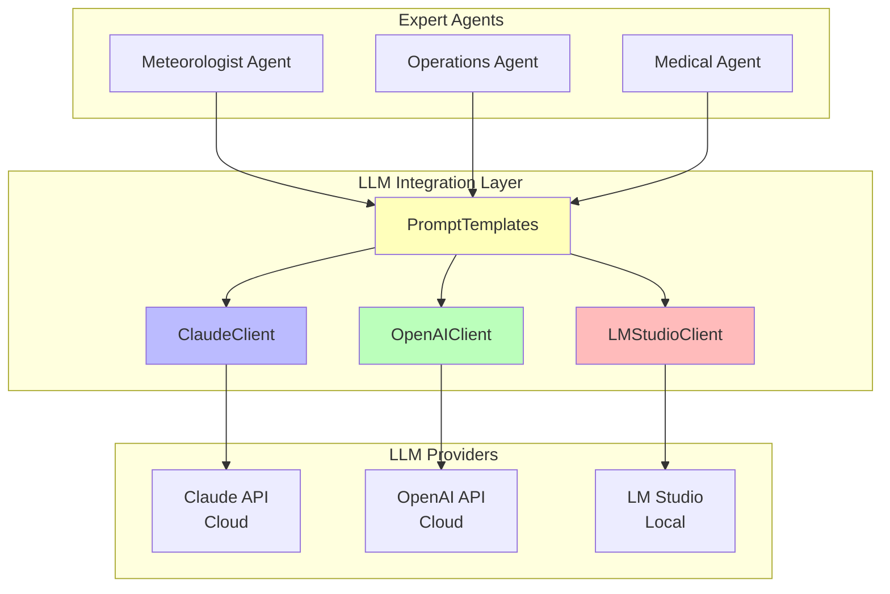

# LLM Integration Module

**Multi-Provider LLM Support for Expert Agent Reasoning**

This module provides a unified, multi-provider interface for integrating Large Language Models (LLMs) into the crisis management multi-agent system. It enables expert agents to leverage advanced reasoning capabilities from cloud-based or local LLMs while maintaining consistent interfaces, robust error handling, and structured response parsing.

## Table of Contents

- [Overview](#overview)
- [Architecture](#architecture)
- [Supported Providers](#supported-providers)
- [Quick Start](#quick-start)
- [Configuration](#configuration)
- [Usage Examples](#usage-examples)
- [Prompt Templates](#prompt-templates)
- [Provider Selection Guide](#provider-selection-guide)
- [Error Handling](#error-handling)
- [Best Practices](#best-practices)
- [Troubleshooting](#troubleshooting)
- [Integration with Agents](#integration-with-agents)
- [Performance Optimization](#performance-optimization)
- [Cost Management](#cost-management)
- [References](#references)

## Overview

**Purpose**: Transform general-purpose LLMs into specialized crisis management expert agents

**Key Features**:
- ✅ **Multi-Provider Support**: Claude, OpenAI, LM Studio
- ✅ **Unified Interface**: Same API across all providers (drop-in replacement)
- ✅ **Robust Error Handling**: Exponential backoff, retry logic, detailed error messages
- ✅ **JSON Parsing**: Multi-strategy parsing handles varied output formats
- ✅ **Response Validation**: Ensures outputs meet crisis assessment requirements
- ✅ **Usage Tracking**: Monitor requests, tokens, costs, success rates
- ✅ **Expert Prompts**: 11 role-specific templates for comprehensive emergency response

**Why This Matters**:
Crisis management requires combining diverse expert perspectives into coherent decisions. This module enables agents to:
1. Generate domain-specific assessments (weather risks, resource constraints, health impacts)
2. Return structured outputs for automated aggregation
3. Leverage state-of-the-art reasoning while abstracting provider complexity
4. Switch providers based on cost, quality, privacy, or availability requirements

## Architecture



**Flow**:
1. **Expert Agent** needs assessment → calls **PromptTemplates**
2. **PromptTemplates** generates role-specific prompt → passes to **LLM Client**
3. **LLM Client** (Claude/OpenAI/LM Studio) sends to provider
4. **Provider** returns response → **Client** parses, validates, returns structured data
5. **Agent** receives structured assessment → passes to **decision_framework** for aggregation

## Supported Providers

### 1. Claude (Anthropic) - Default Provider

**Model**: `claude-sonnet-4-20250514`

**Strengths**:
- ✅ Superior reasoning quality for complex multi-dimensional analysis
- ✅ Excellent instruction following (structured JSON output)
- ✅ Large context window (200k tokens)
- ✅ Nuanced understanding of trade-offs

**Use When**:
- Decision quality is paramount (crisis response)
- Budget allows moderate API costs
- Complex reasoning required

**Cost**: $3/M input tokens, $15/M output tokens

**Setup**:
```bash
export ANTHROPIC_API_KEY="sk-ant-..."
```

```python
from llm_integration import ClaudeClient
client = ClaudeClient()
```

**Best For**: Production crisis management systems where decision quality is critical

---

### 2. OpenAI (GPT-4) - Alternative Cloud Provider

**Model**: `gpt-4-turbo-preview` (default), `gpt-4`, `gpt-4o`, `gpt-3.5-turbo`

**Strengths**:
- ✅ Built-in JSON mode (guaranteed valid JSON)
- ✅ Fast iteration, well-documented API
- ✅ Good reasoning quality (comparable to Claude)
- ✅ Multiple models with cost/quality trade-offs

**Use When**:
- Need alternative to Claude (rate limits, availability)
- JSON reliability paramount
- Experimenting with different model sizes

**Cost**:
- GPT-4 Turbo: $10/M input, $30/M output
- GPT-3.5 Turbo: $0.50/M input, $1.50/M output

**Setup**:
```bash
export OPENAI_API_KEY="sk-..."
```

```python
from llm_integration import OpenAIClient
client = OpenAIClient()  # GPT-4 Turbo
# client = OpenAIClient(model="gpt-3.5-turbo")  # Budget option
```

**Best For**: Alternative to Claude, fast development iteration

---

### 3. LM Studio - Local/Offline Provider

**Models**: Any locally hosted model (Llama 3, Mistral, Phi-3, etc.)

**Strengths**:
- ✅ Zero API costs (unlimited free usage)
- ✅ Data privacy (all processing local)
- ✅ Offline operation (no internet required)
- ✅ No rate limits

**Use When**:
- Budget constrained (free vs. $40/1000 assessments)
- Privacy required (government, medical, sensitive data)
- Offline operation needed (disaster scenarios)
- Development/testing (unlimited experimentation)

**Cost**: **$0** (only electricity)

**Setup**:
1. Install LM Studio: https://lmstudio.ai/
2. Download a model (e.g., Llama-3-8B-Instruct)
3. Load model and start local server (port 1234)
4. Connect:

```python
from llm_integration import LMStudioClient
client = LMStudioClient()  # Connects to localhost:1234
```

**Best For**: Budget-constrained organizations, privacy-sensitive scenarios, development

**Trade-offs**: Lower reasoning quality than Claude/GPT-4, slower (5-60s vs. 2-5s)

## Quick Start

### Basic Usage

```python
from llm_integration import ClaudeClient, PromptTemplates

# 1. Initialize client and templates
client = ClaudeClient()
templates = PromptTemplates()

# 2. Define scenario and alternatives
scenario = {
    'type': 'flood',
    'location': 'Urban area',
    'severity': 0.85,
    'affected_population': 50000,
    'response_time_hours': 6
}

alternatives = [
    {'id': 'A1', 'name': 'Full Evacuation', 'safety_score': 0.9},
    {'id': 'A2', 'name': 'Deploy Barriers', 'safety_score': 0.7}
]

# 3. Generate expert prompt
prompt = templates.generate_meteorologist_prompt(scenario, alternatives)

# 4. Get LLM assessment
response = client.generate_assessment(prompt)

# 5. Use structured response
if not response.get('error'):
    print(f"Rankings: {response['alternative_rankings']}")
    print(f"Reasoning: {response['reasoning']}")
    print(f"Confidence: {response['confidence']}")
    print(f"Concerns: {response['key_concerns']}")
```

### Multi-Provider Example

```python
from llm_integration import ClaudeClient, OpenAIClient, LMStudioClient
from llm_integration import PromptTemplates

templates = PromptTemplates()
prompt = templates.generate_operations_prompt(scenario, alternatives)

# Try Claude first (best quality)
try:
    client = ClaudeClient()
    response = client.generate_assessment(prompt)
except:
    # Fallback to OpenAI
    try:
        client = OpenAIClient()
        response = client.generate_assessment(prompt)
    except:
        # Final fallback: Local model (free)
        client = LMStudioClient()
        response = client.generate_assessment(prompt)

print(response)
```

## Configuration

### Environment Variables

```bash
# Claude
export ANTHROPIC_API_KEY="sk-ant-api03-..."

# OpenAI
export OPENAI_API_KEY="sk-..."

# LM Studio (no API key needed)
# Just start local server
```

### Model Selection

```python
# Claude - choose model
client = ClaudeClient(model="claude-sonnet-4-20250514")  # Default
# client = ClaudeClient(model="claude-opus-3-20240229")  # Higher quality, higher cost

# OpenAI - choose model
client = OpenAIClient(model="gpt-4-turbo-preview")  # Default
# client = OpenAIClient(model="gpt-3.5-turbo")  # Budget option
# client = OpenAIClient(model="gpt-4o")  # Optimized variant

# LM Studio - any local model
client = LMStudioClient(base_url="http://localhost:1234/v1")
```

### Parameters

```python
response = client.generate_assessment(
    prompt=prompt,
    max_tokens=2000,         # Response length (2000 = ~500 words)
    temperature=0.7,         # Randomness: 0.3 (focused) to 1.0 (creative)
    system_prompt="..."      # Optional: Override default system prompt
)
```

## Usage Examples

### Example 1: Single Expert Assessment

```python
from llm_integration import ClaudeClient, PromptTemplates

client = ClaudeClient()
templates = PromptTemplates()

# Medical expert assessment
prompt = templates.generate_medical_prompt(scenario, alternatives)
medical_response = client.generate_assessment(prompt)

print(f"Medical Expert Ranking: {medical_response['alternative_rankings']}")
print(f"Key Concerns: {medical_response['key_concerns']}")
```

### Example 2: Multiple Experts (Full Crisis Assessment)

```python
from llm_integration import ClaudeClient, PromptTemplates

client = ClaudeClient()
templates = PromptTemplates()

# Collect assessments from all 11 experts (or a subset)
prompt_generators = {
    'meteorologist': templates.generate_meteorologist_prompt,
    'operations': templates.generate_operations_prompt,
    'medical': templates.generate_medical_prompt,
    'psap_commander': templates.generate_psap_commander_prompt,
    'police_onscene': templates.generate_police_onscene_prompt,
    'police_regional': templates.generate_police_regional_prompt,
    'fire_onscene': templates.generate_fire_onscene_prompt,
    'fire_regional': templates.generate_fire_regional_prompt,
    'medical_infrastructure': templates.generate_medical_infrastructure_prompt,
    'coastguard_onscene': templates.generate_coastguard_onscene_prompt,
    'coastguard_national': templates.generate_coastguard_national_prompt,
}

assessments = {}
for expert_role, generate_prompt in prompt_generators.items():
    prompt = generate_prompt(scenario, alternatives)
    assessments[expert_role] = client.generate_assessment(prompt)

# Aggregate using decision_framework
from decision_framework import EvidentialReasoning
er = EvidentialReasoning()
final_decision = er.aggregate_beliefs(assessments)
```

### Example 3: Usage Tracking

```python
from llm_integration import ClaudeClient, PromptTemplates

client = ClaudeClient()
templates = PromptTemplates()

# Run multiple assessments
for scenario in scenarios:
    prompt = templates.generate_meteorologist_prompt(scenario, alternatives)
    response = client.generate_assessment(prompt)

# Check usage statistics
stats = client.get_statistics()
print(f"Total Requests: {stats['total_requests']}")
print(f"Total Tokens: {stats['total_tokens']}")
print(f"Success Rate: {stats['success_rate']:.1%}")

# Estimate cost (Claude: $3/M input, $15/M output)
input_cost = (stats['total_tokens'] * 0.5) * 3 / 1_000_000
output_cost = (stats['total_tokens'] * 0.5) * 15 / 1_000_000
print(f"Estimated Cost: ${input_cost + output_cost:.2f}")
```

### Example 4: Custom Criteria

```python
from llm_integration import ClaudeClient, PromptTemplates

client = ClaudeClient()
templates = PromptTemplates()

# Custom evaluation criteria
custom_criteria = [
    "environmental impact (ecosystem damage)",
    "long-term sustainability (community resilience)",
    "political feasibility (stakeholder acceptance)",
    "ethical considerations (fairness, equity)"
]

# Generate prompt with custom criteria
prompt = templates.generate_operations_prompt(
    scenario,
    alternatives,
    criteria=custom_criteria
)

response = client.generate_assessment(prompt)
```

## Prompt Templates

The `PromptTemplates` class generates role-specific expert prompts for all 11 expert roles.

### Eleven Expert Roles (v0.8)

The system now supports **11 expert roles** organized in a comprehensive emergency response command structure:

**Core Experts (3):**

**1. Meteorologist** (`generate_meteorologist_prompt`) - Weather/Environmental Specialist
- Focus: Weather threats, safety, environmental factors, prevention
- Criteria: Safety, effectiveness, timing, preventability
- Use for: Weather-related crises (floods, storms, wildfires)

**2. Operations Director / Logistics Coordinator** (`generate_operations_prompt`) - Resource/Logistics Specialist
- Focus: Resources, logistics, cost-effectiveness, feasibility
- Criteria: Feasibility, cost-effectiveness, logistics, scalability
- Use for: Resource allocation, operational planning

**3. Medical Director** (`generate_medical_prompt`) - Health/Safety Specialist
- Focus: Public health, patient safety, medical infrastructure
- Criteria: Patient safety, medical access, health risks, capacity
- Use for: Health impact assessment, vulnerable populations

**Emergency Response Command Structure (8):**

**4. PSAP Commander-Supervisor** (`generate_psap_commander_prompt`)
- Focus: Emergency communications, dispatch coordination, call intake
- Criteria: Response time, dispatch accuracy, caller safety, system capacity
- Use for: Multi-agency coordination, first-in decision authority

**5. On-Scene Police Commander** (`generate_police_onscene_prompt`)
- Focus: Tactical law enforcement, scene security, crowd control
- Criteria: Scene safety, tactical effectiveness, public order, force appropriateness
- Use for: Field-level tactical police operations

**6. Regional Police Commander** (`generate_police_regional_prompt`)
- Focus: Strategic police deployment, inter-jurisdictional coordination
- Criteria: Resource allocation, mutual aid, strategic positioning
- Use for: Regional law enforcement strategy

**7. On-Scene Fire-Brigade Commander** (`generate_fire_onscene_prompt`)
- Focus: Fire suppression, rescue operations, hazmat response
- Criteria: Firefighter safety, rescue effectiveness, fire control, hazard mitigation
- Use for: Tactical fire/rescue operations

**8. Regional Fire-Brigade Commander** (`generate_fire_regional_prompt`)
- Focus: Strategic fire service deployment, mutual aid, long-duration incidents
- Criteria: Personnel management, resource sustainability, regional coverage
- Use for: Strategic fire service coordination

**9. Medical Infrastructure Director** (`generate_medical_infrastructure_prompt`)
- Focus: Hospital capacity, surge operations, patient distribution
- Criteria: Hospital capacity, medical supply chain, patient flow, system resilience
- Use for: Healthcare system coordination

**10. On-Scene Coast Guard Commander** (`generate_coastguard_onscene_prompt`)
- Focus: Maritime rescue, coastal evacuation, SAR operations
- Criteria: Maritime safety, rescue speed, sea state assessment, resource effectiveness
- Use for: Tactical maritime/coastal operations

**11. National Coast Guard Director** (`generate_coastguard_national_prompt`)
- Focus: Strategic maritime policy, inter-regional coordination, port security
- Criteria: Strategic asset deployment, national maritime security, inter-regional coordination
- Use for: National-level maritime strategy

### Template Generation

```python
templates = PromptTemplates()

# Generate role-specific prompts (3 core examples)
met_prompt = templates.generate_meteorologist_prompt(scenario, alternatives)
ops_prompt = templates.generate_operations_prompt(scenario, alternatives)
med_prompt = templates.generate_medical_prompt(scenario, alternatives)

# Generate emergency response command prompts (8 additional roles)
psap_prompt = templates.generate_psap_commander_prompt(scenario, alternatives)
police_onscene_prompt = templates.generate_police_onscene_prompt(scenario, alternatives)
police_regional_prompt = templates.generate_police_regional_prompt(scenario, alternatives)
fire_onscene_prompt = templates.generate_fire_onscene_prompt(scenario, alternatives)
fire_regional_prompt = templates.generate_fire_regional_prompt(scenario, alternatives)
medical_infra_prompt = templates.generate_medical_infrastructure_prompt(scenario, alternatives)
coastguard_onscene_prompt = templates.generate_coastguard_onscene_prompt(scenario, alternatives)
coastguard_national_prompt = templates.generate_coastguard_national_prompt(scenario, alternatives)

# Get system prompt for specific role
system_prompt = templates.get_system_prompt("meteorologist")
system_prompt = templates.get_system_prompt("psap_commander")
system_prompt = templates.get_system_prompt("police_onscene")
# ... and so on for all 11 roles
```

### Expected Response Format

All prompts request identical JSON structure:

```json
{
    "alternative_rankings": {
        "A1": 0.7,
        "A2": 0.2,
        "A3": 0.08,
        "A4": 0.02
    },
    "reasoning": "Expert explanation in 2-3 sentences...",
    "confidence": 0.85,
    "key_concerns": [
        "Primary concern",
        "Secondary concern",
        "Additional consideration"
    ]
}
```

## Provider Selection Guide

| Use Case                          | Recommended Provider | Reasoning                                   |
|-----------------------------------|----------------------|---------------------------------------------|
| Production Crisis Response        | **Claude**           | Best reasoning quality, critical decisions  |
| Alternative to Claude             | **OpenAI**           | Similar quality, built-in JSON mode         |
| Budget Constrained                | **LM Studio**        | Free, unlimited usage                       |
| Privacy/Sensitive Data            | **LM Studio**        | Local processing, no cloud                  |
| Offline/Disaster Scenarios        | **LM Studio**        | Works without internet                      |
| Development/Testing               | **LM Studio**        | Free experimentation                        |
| High-Volume Evaluation (1000+ scenarios) | **LM Studio** | Avoids $40+ API costs                      |
| Best JSON Reliability             | **OpenAI**           | Built-in JSON mode                          |
| Largest Context Window            | **Claude**           | 200k tokens                                 |

**Decision Tree**:

```
Need offline operation? → LM Studio
Need data privacy? → LM Studio
Budget constrained (<$100/month)? → LM Studio
Rate limited by Claude? → OpenAI
JSON reliability paramount? → OpenAI
Decision quality critical? → Claude (default)
```

## Error Handling

All clients implement robust error recovery:

### Connection Errors

```python
response = client.generate_assessment(prompt)

if response.get('error'):
    error_type = response['error_type']

    if error_type == 'APIConnectionError':
        print("Network issue - check connection")
        # For LM Studio: "Is LM Studio running?"

    elif error_type == 'RateLimitError':
        print("Rate limit hit - wait and retry")
        # Client already retries with exponential backoff

    elif error_type == 'JSONDecodeError':
        print("JSON parsing failed - check model quality")
        # Try different model or lower temperature
```

### Retry Logic

All clients automatically retry:
- **Rate Limits**: 3 attempts with exponential backoff (2s, 4s, 8s)
- **Connection Errors**: 3 attempts with exponential backoff
- **Transient API Errors**: 3 attempts with exponential backoff

### Validation Failures

```python
response = client.generate_assessment(prompt)

if not response.get('error'):
    if response['_metadata']['validated']:
        print("✓ Response validated")
    else:
        print("⚠ Response incomplete - check fields")
        # Response returned but may be missing fields
```

## Best Practices

### 1. Provider Selection

```python
# GOOD: Choose provider based on requirements
if PRODUCTION and BUDGET_ALLOWS:
    client = ClaudeClient()  # Best quality
elif DEVELOPMENT or TESTING:
    client = LMStudioClient()  # Free
else:
    client = OpenAIClient()  # Alternative
```

### 2. Error Handling

```python
# GOOD: Always check for errors
response = client.generate_assessment(prompt)
if response.get('error'):
    logger.error(f"Assessment failed: {response['error_message']}")
    # Implement fallback logic
else:
    # Use response
```

### 3. Usage Monitoring

```python
# GOOD: Track usage periodically
stats = client.get_statistics()
if stats['success_rate'] < 0.95:
    logger.warning(f"High failure rate: {stats['failed_requests']} failures")
```

### 4. Temperature Selection

```python
# GOOD: Adjust temperature based on provider
if isinstance(client, ClaudeClient):
    temp = 0.7  # Claude handles higher temp well
elif isinstance(client, LMStudioClient):
    temp = 0.3  # Local models benefit from lower temp (more consistent)
else:
    temp = 0.7  # OpenAI default

response = client.generate_assessment(prompt, temperature=temp)
```

### 5. Cost Optimization

```python
# GOOD: Use LM Studio for development, Claude for production
if os.getenv('ENVIRONMENT') == 'production':
    client = ClaudeClient()
else:
    client = LMStudioClient()  # Free for dev/test
```

## Troubleshooting

### Claude/OpenAI Issues

**Problem**: "API key not provided"
```bash
# Solution:
export ANTHROPIC_API_KEY="sk-ant-..."
export OPENAI_API_KEY="sk-..."
```

**Problem**: Rate limit errors
```python
# Solution: Clients auto-retry, but you can also:
import time
for attempt in range(3):
    response = client.generate_assessment(prompt)
    if not response.get('error'):
        break
    time.sleep(5)  # Wait between attempts
```

**Problem**: JSON parsing failures
```python
# Solution: Check temperature (too high = inconsistent)
response = client.generate_assessment(prompt, temperature=0.5)  # Lower temp
```

### LM Studio Issues

**Problem**: "Connection error"
```python
# Solution: Check if LM Studio is running
import requests
try:
    requests.get("http://localhost:1234/v1/models")
    print("✓ LM Studio running")
except:
    print("✗ LM Studio NOT running - start it!")
```

**Problem**: Low quality outputs
```python
# Solutions:
# 1. Use better model: Llama-3-8B-Instruct, Mistral-7B-Instruct
# 2. Lower temperature: temperature=0.3
# 3. More explicit prompts: Add examples
```

**Problem**: Slow inference
```python
# Solutions:
# 1. Use quantized models: Llama-3-8B-Instruct-Q4
# 2. Enable GPU acceleration in LM Studio
# 3. Use smaller models: 7B instead of 13B
```

## Integration with Agents

The llm_integration module integrates with the agents module:

```python
# In agents/expert_agent.py
from llm_integration import ClaudeClient, PromptTemplates

class ExpertAgent(BaseAgent):
    def __init__(self, agent_id: str, profile: Dict, llm_client=None):
        self.agent_id = agent_id
        self.role = profile['role']
        self.expertise = profile['expertise']
        self.llm_client = llm_client or ClaudeClient()
        self.prompt_templates = PromptTemplates()

    def _generate_prompt(self, scenario, alternatives, criteria=None):
        """Generate role-specific prompt using hierarchical role detection."""
        expertise_lower = self.expertise.lower()
        role_lower = self.role.lower()

        # Hierarchical role detection (11 roles supported)
        if 'meteorolog' in expertise_lower or 'meteorolog' in role_lower:
            prompt = self.prompt_templates.generate_meteorologist_prompt(
                scenario, alternatives, criteria
            )
        elif 'psap' in role_lower or 'emergency_communications' in expertise_lower:
            prompt = self.prompt_templates.generate_psap_commander_prompt(
                scenario, alternatives, criteria
            )
        elif 'police' in role_lower and 'on-scene' in role_lower:
            prompt = self.prompt_templates.generate_police_onscene_prompt(
                scenario, alternatives, criteria
            )
        elif 'police' in role_lower and 'regional' in role_lower:
            prompt = self.prompt_templates.generate_police_regional_prompt(
                scenario, alternatives, criteria
            )
        # ... and so on for all 11 roles (see agents/expert_agent.py)

        return prompt

    def assess_scenario(self, scenario, alternatives):
        # Generate role-specific prompt using role detection
        prompt = self._generate_prompt(scenario, alternatives)

        # Get LLM assessment
        response = self.llm_client.generate_assessment(prompt)

        return response
```

## Performance Optimization

### Latency Optimization

```python
# Use faster models for time-critical scenarios
client = OpenAIClient(model="gpt-4o")  # Faster than gpt-4-turbo

# Reduce max_tokens for quicker responses
response = client.generate_assessment(prompt, max_tokens=1000)  # vs. 2000
```

### Cost Optimization

```python
# Use LM Studio for high-volume evaluation
if running_evaluation:
    client = LMStudioClient()  # Free
else:
    client = ClaudeClient()  # Production quality
```

### Throughput Optimization

```python
# Parallel requests for all 11 expert agents
from concurrent.futures import ThreadPoolExecutor

def get_assessment(expert_type):
    client = ClaudeClient()
    templates = PromptTemplates()

    prompt_generators = {
        "meteorologist": templates.generate_meteorologist_prompt,
        "operations": templates.generate_operations_prompt,
        "medical": templates.generate_medical_prompt,
        "psap_commander": templates.generate_psap_commander_prompt,
        "police_onscene": templates.generate_police_onscene_prompt,
        # ... all 11 roles
    }

    generator = prompt_generators.get(expert_type)
    if generator:
        prompt = generator(scenario, alternatives)
        return client.generate_assessment(prompt)

# Run all 11 experts in parallel
expert_types = ['meteorologist', 'operations', 'medical', 'psap_commander',
                'police_onscene', 'police_regional', 'fire_onscene', 'fire_regional',
                'medical_infrastructure', 'coastguard_onscene', 'coastguard_national']

with ThreadPoolExecutor(max_workers=11) as executor:
    futures = [executor.submit(get_assessment, exp_type) for exp_type in expert_types]
    results = [f.result() for f in futures]

# Processing time: ~35-45s for all 11 experts (vs. ~120s sequential)
```

## Cost Management

### Estimating Costs

**Claude**:
```python
stats = client.get_statistics()
input_cost = (stats['total_tokens'] * 0.5) * 3 / 1_000_000   # $3/M
output_cost = (stats['total_tokens'] * 0.5) * 15 / 1_000_000  # $15/M
total = input_cost + output_cost
print(f"Estimated cost: ${total:.2f}")
```

**OpenAI**:
```python
# GPT-4 Turbo
input_cost = (stats['total_tokens'] * 0.5) * 10 / 1_000_000   # $10/M
output_cost = (stats['total_tokens'] * 0.5) * 30 / 1_000_000  # $30/M

# GPT-3.5 Turbo (cheaper)
input_cost = (stats['total_tokens'] * 0.5) * 0.5 / 1_000_000  # $0.50/M
output_cost = (stats['total_tokens'] * 0.5) * 1.5 / 1_000_000 # $1.50/M
```

### Cost Comparison

**1000 Expert Assessments** (avg 4000 tokens each):

| Provider          | Cost      | Quality   | Privacy |
|-------------------|-----------|-----------|---------|
| Claude            | ~$40      | Excellent | Cloud   |
| GPT-4 Turbo       | ~$80      | Excellent | Cloud   |
| GPT-3.5 Turbo     | ~$4       | Good      | Cloud   |
| LM Studio         | **$0**    | Variable  | Local   |

## References

### Documentation

- [Claude API Documentation](https://docs.anthropic.com/claude/reference)
- [OpenAI API Documentation](https://platform.openai.com/docs/api-reference/chat)
- [LM Studio Documentation](https://lmstudio.ai/docs)

### Pricing

- [Claude Pricing](https://www.anthropic.com/pricing)
- [OpenAI Pricing](https://openai.com/pricing)
- LM Studio: Free

### Best Practices

- Prompt Engineering Guide (Anthropic)
- OpenAI JSON Mode Guide
- Multi-Agent System LLM Integration Patterns
- Crisis Management Expert Assessment Frameworks

### Related Modules

- **agents/**: Expert agents that use these LLM clients
- **decision_framework/**: Aggregates LLM-generated assessments
- **scenarios/**: Crisis scenarios passed to LLM prompts
- **evaluation/**: Measures quality of LLM assessments

---

**Version**: 2.0 (Comprehensive Documentation - January 2025)

**Maintainers**: Crisis Management MAS Development Team

**License**: See project root LICENSE file
